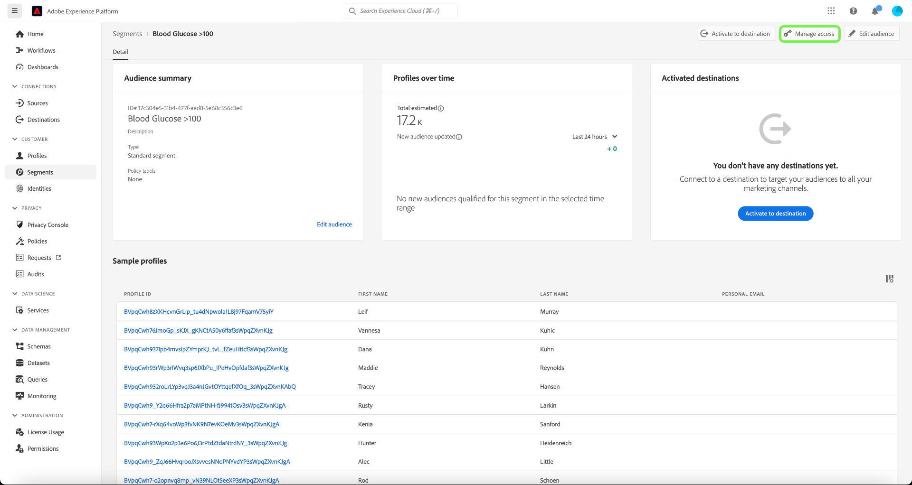
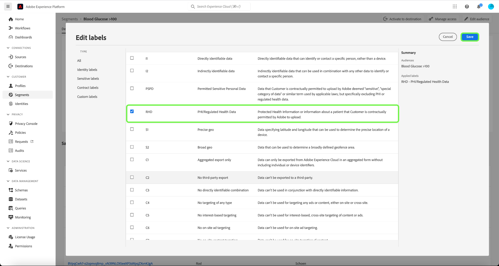

# 基于属性的访问控制端到端指南

基于属性的访问控制是Adobe Experience Platform的一项功能，它为注重隐私的多品牌客户提供了更大的灵活性来管理用户访问权限。 可以使用基于对象属性和角色的策略授予/拒绝对单个对象（如架构字段和区段）的访问权限。 此功能允许您为组织中的特定Platform用户授予或撤消对单个对象的访问权限。

利用此功能，可使用定义组织或数据使用范围的标签对架构字段、区段等进行分类。 您可以将这些相同的标签应用于Adobe Journey Optimizer中的历程、选件和其他对象。 同时，管理员可以定义围绕XDM架构字段的访问策略，并更好地管理哪些用户或组（内部、外部或第三方用户）可以访问这些字段。

## 快速入门

本教程需要对以下平台组件有一定的了解：

* [[!DNL Experience Data Model (XDM)] 系统](../../xdm/home.md):Experience Platform组织客户体验数据的标准化框架。
   * [架构组合的基础知识](../../xdm/schema/composition.md):了解XDM模式的基本构建块，包括模式组合中的关键原则和最佳实践。
   * [模式编辑器教程](../../xdm/tutorials/create-schema-ui.md):了解如何使用模式编辑器UI创建自定义模式。
* [Adobe Experience Platform Segmentation Service](../../segmentation/home.md):中的分段引擎 [!DNL Platform] 用于根据客户行为和属性从客户配置文件创建受众区段。

### 用例概述

您将完成一个基于属性的访问控制工作流示例，在该工作流中，您将创建并分配角色、标签和策略，以配置用户是否可以访问组织中的特定资源。 本指南使用限制对敏感数据的访问的示例来演示工作流。 下面概述了此用例：

您是医疗保健提供商，希望配置对组织中资源的访问权限。

* 您的内部营销团队应能够 **[!UICONTROL PHI/受管健康数据]** 数据。
* 外部机构应该无法访问 **[!UICONTROL PHI/受管健康数据]** 数据。

为此，您必须配置角色、资源和策略。

您将：

* [为用户设置角色标签](#label-roles):使用其营销组与外部代理合作的医疗保健提供商(ACME Business Group)的示例。
* [为资源设置标签（架构字段和区段）](#label-resources):分配 **[!UICONTROL PHI/受管健康数据]** 为架构资源和区段设置标签。
* [创建策略以将它们链接在一起](#policy):创建策略以将资源上的标签链接到您角色中的标签，从而拒绝访问架构字段和区段。 这将拒绝对没有匹配标签的用户访问架构字段并在所有沙箱中划分区段。

## 权限

[!UICONTROL 权限] 是Experience Cloud区域，管理员可以在其中定义用户角色和策略，以管理产品应用程序中功能和对象的权限。

到达 [!UICONTROL 权限]，则可以创建和管理角色，并为这些角色分配所需的资源权限。 [!UICONTROL 权限] 还允许您管理与特定角色关联的标签、沙箱和用户。

如果您没有管理员权限，请联系您的系统管理员以获取访问权限。

拥有管理员权限后，请转到 [Adobe Experience Cloud](https://experience.adobe.com/) 并使用您的Adobe凭据登录。 登录后， **[!UICONTROL 概述]** 会为您的组织显示页面。 此页面显示贵组织订阅的产品，以及向组织添加用户和管理员的其他控件。 选择 **[!UICONTROL 权限]** 以打开用于Platform集成的工作区。

此时会显示平台UI的“权限”工作区，该工作区在 **[!UICONTROL 角色]** 页面。

## 将标签应用于角色 {#label-roles}

>[!CONTEXTUALHELP]
>id="platform_permissions_labels_about"
>title="什么是标签？"
>abstract="标签允许您根据应用于该数据的使用策略对数据集和字段进行分类。 Platform提供了多个Adobe定义的“核心”数据使用标签，这些标签涵盖适用于数据管理的各种常见限制。 例如，敏感的“S”标签(如RHD（受管制的健康数据）)允许您对引用受保护的健康信息(PHI)的数据进行分类。 您还可以定义自己的自定义标签，以符合贵组织的需求。"
>additional-url="https://experienceleague.adobe.com/docs/experience-platform/data-governance/labels/overview.html?lang=en#understanding-data-usage-labels" text="数据使用标签概述"

>[!CONTEXTUALHELP]
>id="platform_permissions_labels_about_create"
>title="创建新标签"
>abstract="您可以创建自己的自定义标签，以满足您组织的需求。 自定义标签可用于将数据管理和访问控制配置应用于您的数据。"
>additional-url="https://experienceleague.adobe.com/docs/experience-platform/data-governance/labels/overview.html?lang=en#manage-labels" text="管理自定义标签"

>[!CONTEXTUALHELP]
>id="platform_permissions_roles_about"
>title="什么是角色？"
>abstract="角色是对与您的Platform实例进行交互的用户类型进行分类的方法，这些用户是访问控制策略的构建基块。 角色具有一组给定的权限，并且可以根据角色需要的查看或写入权限，将组织的成员分配给一个或多个角色。"
>additional-url="https://experienceleague.adobe.com/docs/experience-platform/access-control/abac/permissions-ui/roles.html?lang=en" text="管理角色"

>[!CONTEXTUALHELP]
>id="platform_permissions_roles_about_create"
>title="创建新角色"
>abstract="您可以创建新角色，以更好地对访问您的Platform实例的用户进行分类。 例如，您可以为内部营销团队创建角色，并将RHD标签应用到该角色，从而允许您的内部营销团队访问受保护的健康信息(PHI)。 或者，您也可以为外部代理创建角色，并拒绝该角色对PHI数据的访问，方法是不将RHD标签应用到该角色。"
>additional-url="https://experienceleague.adobe.com/docs/experience-platform/access-control/abac/permissions-ui/roles.html?lang=en#create-a-new-role" text="创建新角色"

>[!CONTEXTUALHELP]
>id="platform_permissions_roles_details"
>title="角色概述"
>abstract="角色概述对话框显示允许给定角色访问的资源和沙箱。"

角色是对与您的平台实例交互的用户类型进行分类的方法，是访问控制策略的构建基块。 角色具有一组给定的权限，并且可以根据组织成员需要的访问权限范围，将其分配给一个或多个角色。

要开始配置，请选择 **[!UICONTROL ACME Business Group]** 从 **[!UICONTROL 角色]** 页面。

接下来，选择 **[!UICONTROL 标签]** 然后选择 **[!UICONTROL 添加标签]**.

此时会显示组织中所有标签的列表。 选择 **[!UICONTROL RHD]** 为添加标签 **[!UICONTROL PHI/受管制的健康数据]**. 允许在标签旁边显示一些蓝色复选标记，然后选择 **[!UICONTROL 保存]**.

>[!NOTE]
>
>将组织组添加到角色时，该组中的所有用户都将添加到该角色。 对组织组所做的任何更改（删除或添加的用户）将在角色中自动更新。

## 将标签应用于架构字段 {#label-resources}

现在，您已使用 [!UICONTROL RHD] 标签，下一步是将相同的标签添加到您要控制的该角色的资源中。

选择 **[!UICONTROL 模式]** 从左侧导航中，然后选择 **[!UICONTROL ACME Healthcare]** 从显示的架构列表中。

接下来，选择 **[!UICONTROL 标签]** 以查看显示与您的架构关联的字段的列表。 从此处，您可以一次为一个或多个字段分配标签。 选择 **[!UICONTROL 血糖]** 和 **[!UICONTROL 胰岛素水平]** 字段，然后选择 **[!UICONTROL 应用访问和数据管理标签]**.

的 **[!UICONTROL 编辑标签]** 对话框，允许您选择要应用于架构字段的标签。 对于此用例，请选择 **[!UICONTROL PHI/受管健康数据]** 标签，然后选择 **[!UICONTROL 保存]**.

>[!NOTE]
>
>将标签添加到字段后，该标签将应用于该字段的父资源（类或字段组）。 如果父类或字段组由其他架构使用，则这些架构将继承相同的标签。

## 将标签应用于区段

完成架构字段的标签设置后，您现在可以开始为区段添加标签。

选择 **[!UICONTROL 区段]** 的上界。 此时会显示组织中可用的区段列表。 在本例中，以下两个区段将进行标记，因为它们包含敏感的运行状况数据：

* 血糖>100
* 胰岛素&lt;50

选择 **[!UICONTROL 血糖>100]** 以开始标记区段。

区段 **[!UICONTROL 详细信息]** 屏幕。 选择 **[!UICONTROL 管理访问权限]**.

的 **[!UICONTROL 编辑标签]** 对话框，允许您选择要应用于区段的标签。 对于此用例，请选择 **[!UICONTROL PHI/受管健康数据]** 标签，然后选择 **[!UICONTROL 保存]**.

使用 **[!UICONTROL 胰岛素&lt;50]**.

## 创建访问控制策略 {#policy}

>[!CONTEXTUALHELP]
>id="platform_permissions_policies_about"
>title="什么是政策？"
>abstract="政策是将属性集合在一起以确立允许和不允许的行动的声明。 每个组织都附带一个默认策略，您必须激活该策略以定义区段和架构字段等资源的规则。 默认策略不能编辑或删除。 但是，可以激活或停用默认策略。"
>additional-url="https://experienceleague.adobe.com/docs/experience-platform/access-control/abac/permissions-ui/policies.html?lang=en" text="管理策略"

>[!CONTEXTUALHELP]
>id="platform_permissions_policies_about_create"
>title="创建策略"
>abstract="创建策略以定义用户可以和不能对区段和架构字段执行的操作。"
>additional-url="https://experienceleague.adobe.com/docs/experience-platform/access-control/abac/permissions-ui/policies.html?lang=en#create-a-new-policy" text="创建策略"

>[!CONTEXTUALHELP]
>id="platform_permissions_policies_edit_permitdeny"
>title="为策略配置允许和不允许的操作"
>abstract="A <b>拒绝访问</b> 策略将在满足条件时拒绝用户访问。 与 <b>以下内容为false</b>  — 除非所有用户符合设置的匹配条件，否则他们将被拒绝访问。 此类型的策略允许您保护敏感资源，并仅允许具有匹配标签的用户访问。  A <b>允许访问</b> 策略将允许用户在满足标准时访问。 与 <b>以下是true</b>  — 如果用户满足匹配条件集，则他们将获得访问权限。 这不会明确拒绝用户访问，但会添加允许访问。 此类型的策略允许您为那些已经通过角色权限拥有访问权限的用户提供对资源的额外访问权限。” 
>additional-url="https://experienceleague.adobe.com/docs/experience-platform/access-control/abac/permissions-ui/policies.html?lang=en#edit-a-policy" text="编辑策略"

>[!CONTEXTUALHELP]
>id="platform_permissions_policies_edit_resource"
>title="配置资源的权限"
>abstract="资源是指用户可以或不能访问的资产或对象。 资源可以是区段或架构字段。 您可以为区段和架构字段配置写入、读取或删除权限。"

>[!CONTEXTUALHELP]
>id="platform_permissions_policies_edit_condition"
>title="编辑条件"
>abstract="将条件语句应用于策略以配置用户对特定资源的访问权限。 选择“全部匹配”以要求用户具有与资源具有相同标签的角色才能获得访问权限。 选择“匹配任意”，以要求用户具有仅具有一个与资源上标签匹配的标签的角色。 标签可以定义为核心标签或自定义标签，核心标签表示由Adobe创建和提供的标签，自定义标签表示您为组织创建的标签。"

访问控制策略利用标签来定义哪些用户角色有权访问特定的平台资源。 策略可以是本地策略，也可以是全局策略，并且可以覆盖其他策略。 在此示例中，对于在架构字段中没有相应标签的用户，将拒绝在所有沙箱中访问架构字段和区段。

>[!NOTE]
>
>创建“拒绝策略”以授予对敏感资源的访问权限，因为角色授予对主体的权限。 此示例中的书面策略 **否认** 如果缺少必需的标签，则可以访问。

要创建访问控制策略，请选择 **[!UICONTROL 权限]** 从左侧导航中，然后选择 **[!UICONTROL 策略]**. 接下来，选择 **[!UICONTROL 创建策略]**.

的 **[!UICONTROL 创建新策略]** 对话框，提示您输入名称和可选描述。 选择 **[!UICONTROL 确认]** 完成。

要拒绝访问架构字段，请使用下拉箭头并选择 **[!UICONTROL 拒绝访问]** 然后选择 **[!UICONTROL 未选择任何资源]**. 接下来，选择 **[!UICONTROL 架构字段]** 然后选择 **[!UICONTROL 全部]**.

下表显示了创建策略时可用的条件：

| 条件 | 描述 |
| --- | --- |
| 以下内容为false | 设置“拒绝访问”后，如果用户不满足所选条件，则访问权限将受到限制。 |
| 以下是true | 设置“允许访问”后，如果用户符合所选标准，则允许访问。 |
| 匹配任意 | 用户的标签与应用到资源的任何标签相匹配。 |
| 全部匹配 | 用户具有所有与应用于资源的所有标签相匹配的标签。 |
| 核心标签 | 核心标签是Adobe定义的标签，可在所有Platform实例中使用。 |
| 自定义标签 | 自定义标签是您的组织创建的标签。 |

选择 **[!UICONTROL 以下内容为false]** 然后选择 **[!UICONTROL 未选择属性]**. 接下来，选择用户 **[!UICONTROL 核心标签]**，然后选择 **[!UICONTROL 全部匹配]**. 选择资源 **[!UICONTROL 核心标签]** 最后选择 **[!UICONTROL 添加资源]**.

>[!TIP]
>
>资源是主题可以或不能访问的资产或对象。 资源可以是区段或架构。

要拒绝访问区段，请使用下拉箭头并选择 **[!UICONTROL 拒绝访问]** 然后选择 **[!UICONTROL 未选择任何资源]**. 接下来，选择 **[!UICONTROL 区段]** 然后选择 **[!UICONTROL 全部]**.

选择 **[!UICONTROL 以下内容为false]** 然后选择 **[!UICONTROL 未选择属性]**. 接下来，选择用户 **[!UICONTROL 核心标签]**，然后选择 **[!UICONTROL 全部匹配]**. 选择资源 **[!UICONTROL 核心标签]** 最后选择 **[!UICONTROL 保存]**.

选择 **[!UICONTROL 激活]** 激活策略时，将显示一个对话框，提示您确认激活。 选择 **[!UICONTROL 确认]** 然后选择 **[!UICONTROL 关闭]**.

## 后续步骤

您已完成将标签应用到角色、架构字段和区段。 分配给这些角色的外部代理在架构、数据集和配置文件视图中无法查看这些标签及其值。 在使用区段生成器时，这些字段也会受到限制，无法在区段定义中使用。

有关基于属性的访问控制的详细信息，请参阅 [基于属性的访问控制概述](./overview.md).
