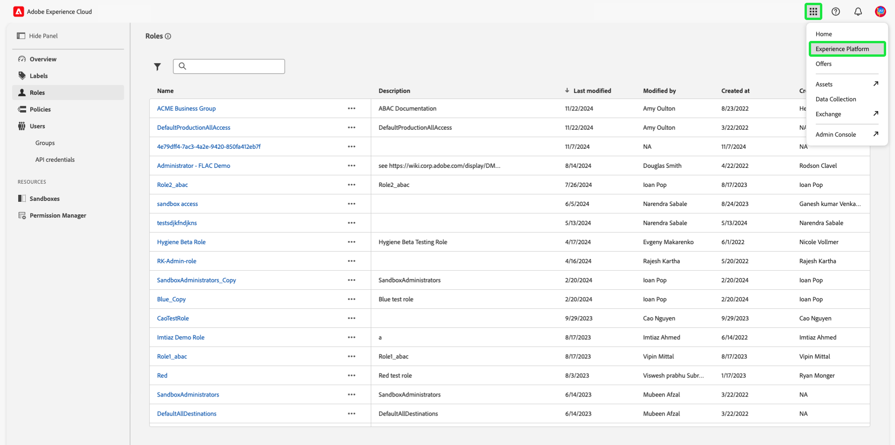
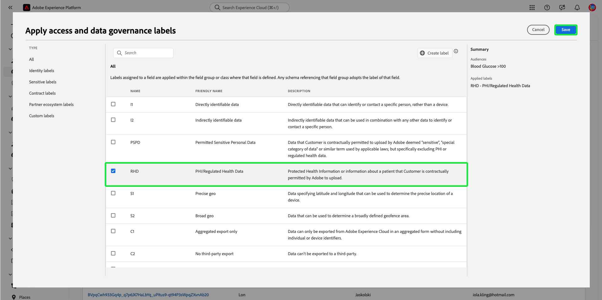

# 基于属性的访问控制端到端指南

在Adobe Experience Platform上使用基于属性的访问控制，以便为您自己和其他关注隐私的多品牌客户提供更大的灵活性来管理用户访问权限。 可以通过基于对象的属性和角色的策略来授予对单个对象（如方案字段和受众）的访问权限。 此功能允许您授予或撤销组织中特定 Experience Platform 用户对各个对象的访问权限。

此功能允许您使用定义组织或数据使用范围的标签对架构字段、受众等进行分类。 您可以将这些相同的标签应用于Adobe Journey Optimizer中的历程、选件和其他对象。 同时，管理员可以定义有关Experience Data Model (XDM)架构字段的访问策略，并更好地管理哪些用户或组（内部、外部或第三方用户）可以访问这些字段。

>[!NOTE]
>
>本文档重点介绍访问控制策略的用例。 如果您正在尝试设置策略以管理&#x200B;**使用**&#x200B;的数据，而不是Experience Platform用户有权访问的数据，请另外参阅关于[数据管理](../../data-governance/e2e.md)的端到端指南。

## 快速入门

本教程需要您实际了解以下Experience Platform组件：

* [[!DNL Experience Data Model (XDM)] 系统](../../xdm/home.md)： Experience Platform用于组织客户体验数据的标准化框架。
   * [架构组合的基础知识](../../xdm/schema/composition.md)：了解XDM架构的基本构建块，包括架构组合中的关键原则和最佳实践。
   * [架构编辑器教程](../../xdm/tutorials/create-schema-ui.md)：了解如何使用架构编辑器UI创建自定义架构。
* [Adobe Experience Platform分段服务](../../segmentation/home.md)： [!DNL Experience Platform]中的分段引擎用于根据客户行为和属性从客户配置文件创建受众区段。

### 用例概述

您将执行一个基于属性的访问控制工作流示例，其中您将创建和分配角色、标签和策略，以配置用户是否可以访问组织中的特定资源。 本指南以限制访问敏感数据为例演示了工作流程。 此用例概述如下：

您是医疗保健提供商，希望配置对组织中资源的访问权限。

* 您的内部营销团队应该能够访问&#x200B;**[!UICONTROL PHI/监管健康数据]**&#x200B;数据。
* 您的外部机构应该不能访问&#x200B;**[!UICONTROL PHI/监管健康数据]**&#x200B;数据。

为此，您必须配置角色、资源和策略。

您将会：

* [为用户的角色添加标签](#label-roles)：以营销组与外部代理合作的医疗保健提供商（ACME业务组）为例。
* [为资源（架构字段和受众）添加标签](#label-resources)：将&#x200B;**[!UICONTROL PHI/监管的运行状况数据]**&#x200B;标签分配给架构资源和受众。
* [激活将它们链接在一起的策略](#policy)：启用默认策略，通过将资源上的标签连接到角色中的标签来阻止对架构字段和受众的访问。 随后，具有匹配标签的用户将获得对架构字段的访问权限，并可在所有沙盒中进行分段。

## 权限

[!UICONTROL 权限]是Experience Cloud的区域，管理员可以在其中定义用户角色和策略，以管理产品应用程序内功能和对象的权限。

通过[!UICONTROL 权限]，您可以创建和管理角色，并为这些角色分配所需的资源权限。 [!UICONTROL 权限]还允许您管理与特定角色关联的标签、沙盒和用户。

如果您没有管理员权限，请与系统管理员联系以获得访问权限。

一旦您拥有管理员权限，请转到[Adobe Experience Cloud](https://experience.adobe.com/)并使用您的Adobe凭据登录。 登录后，会为您拥有管理员权限的组织显示&#x200B;**[!UICONTROL 概述]**&#x200B;页面。 此页面显示贵组织订阅的产品，以及用于将用户和管理员添加到该组织的其他控件。 选择&#x200B;**[!UICONTROL 权限]**&#x200B;以打开Experience Platform集成的工作区。

此时将显示Experience Platform UI的权限工作区，并在&#x200B;**[!UICONTROL 概述]**&#x200B;页面上打开。

## 将标签应用于角色 {#label-roles}

>[!CONTEXTUALHELP]
>id="platform_permissions_labels_about"
>title="标签是什么？"
>abstract="使用标签，可根据适用于数据的使用及访问策略将数据集和字段分类。Adobe Experience Platform 提供若干由 Adobe 定义的<strong>核心</strong>数据使用标签，这些标签涵盖适用于数据治理的多种常见限制。例如，通过 RHD（受监管的健康数据）等敏感的 <strong>S</strong> 标签，可将涉及受保护的健康信息 (PHI) 的数据分类。还可自行定义适合组织需求的自定义标签。"
>additional-url="https://experienceleague.adobe.com/docs/experience-platform/data-governance/labels/overview.html?lang=zh-Hans#understanding-data-usage-labels" text="数据使用标签概述"

角色是对与Experience Platform实例交互的用户类型进行分类的方法，是访问控制策略的构建块。 角色具有给定的权限集，组织的成员可以根据所需的访问范围分配给一个或多个角色。

若要开始，请从左侧导航中选择&#x200B;**[!UICONTROL 角色]**，然后选择&#x200B;**[!UICONTROL ACME业务组]**。

接下来，选择&#x200B;**[!UICONTROL 标签]**，然后选择&#x200B;**[!UICONTROL 添加标签]**。

此时将显示组织中所有标签的列表。 选择&#x200B;**[!UICONTROL RHD]**&#x200B;以添加&#x200B;**[!UICONTROL PHI/Regulated Health Data]**&#x200B;的标签，然后选择&#x200B;**[!UICONTROL 保存]**。

>[!NOTE]
>
>将组织组添加到角色时，该组中的所有用户都将添加到该角色。 对组织组所做的任何更改（删除或添加的用户）都将在角色中自动更新。

## 将标签应用于架构字段 {#label-resources}

现在您已配置具有[!UICONTROL RHD]标签的用户角色，下一步是将同一标签添加到要为该角色控制的资源。

从顶部导航中，选择由图标表示的&#x200B;**应用程序切换器**，然后选择&#x200B;**[!UICONTROL Experience Platform]**。

从左侧导航中选择&#x200B;**[!UICONTROL 架构]**，然后从显示的架构列表中选择&#x200B;**[!UICONTROL ACME Healthcare]**。

接下来，选择&#x200B;**[!UICONTROL 标签]**&#x200B;以查看显示与架构关联字段的列表。 在此处，您可以一次性将标签分配给一个或多个字段。 选择&#x200B;**[!UICONTROL 血糖]**&#x200B;和&#x200B;**[!UICONTROL 胰岛素水平]**&#x200B;字段，然后选择&#x200B;**[!UICONTROL 应用访问和数据治理标签]**。

将显示&#x200B;**[!UICONTROL 编辑标签]**&#x200B;对话框，允许您选择要应用于架构字段的标签。 对于此用例，请选择&#x200B;**[!UICONTROL PHI/监管的运行状况数据]**&#x200B;标签，然后选择&#x200B;**[!UICONTROL 保存]**。

>[!NOTE]
>
>将标签添加到字段时，该标签将应用于该字段的父资源（类或字段组）。 如果父类或字段组被其他架构使用，则这些架构将继承相同的标签。

## 将标签应用于受众

>[!NOTE]
>
>同样，如果您希望对使用已标记属性的受众应用相同的访问限制，则必须对使用该受众的所有受众进行标记。

完成为架构字段设置标签之后，您现在可以开始为受众设置标签。

从&#x200B;**[!UICONTROL 客户]**&#x200B;部分下的左侧导航中选择&#x200B;**[!UICONTROL 受众]**。 此时将显示组织中可用的受众列表。 在此示例中，将标记以下两个受众，因为它们包含敏感的健康数据：

* 血糖>100
* 胰岛素&lt;50

选择&#x200B;**[!UICONTROL 血糖>100]**（按受众名称，而不是复选框）以开始为受众设置标签。

将显示区段&#x200B;**[!UICONTROL 详细信息]**&#x200B;屏幕。 选择&#x200B;**[!UICONTROL 管理访问权限]**。

将显示&#x200B;**[!UICONTROL 应用访问和数据治理标签]**&#x200B;对话框，允许您选择要应用于受众的标签。 对于此用例，请选择&#x200B;**[!UICONTROL PHI/监管的运行状况数据]**&#x200B;标签，然后选择&#x200B;**[!UICONTROL 保存]**。

对&#x200B;**[!UICONTROL 胰岛素&lt;50]**&#x200B;重复上述步骤。

>[!NOTE]
>
> 使用[对象级访问控制](https://experienceleague.adobe.com/zh-hans/docs/journey-optimizer/using/access-control/object-based-access)，将在[!UICONTROL 权限]工作区中创建的标签（如上面的区段标签）分配给Adobe Journey Optimizer中的各种对象。

## 激活访问控制策略 {#policy}

默认访问控制策略将利用标签来定义哪些用户角色有权访问特定Experience Platform资源。 在此示例中，对于未在架构字段具有相应标签的角色中的用户，将拒绝其在所有沙盒中访问架构字段和受众。

要激活访问控制策略，请从左侧导航中选择[!UICONTROL 权限]，然后选择&#x200B;**[!UICONTROL 策略]**。

接下来，选择&#x200B;**[!UICONTROL Default-Field-Level-Access-Control-Policy]**&#x200B;旁边的省略号(`...`)，此时下拉菜单会显示用于编辑、激活、删除或复制角色的控件。 从下拉列表中选择&#x200B;**[!UICONTROL 激活]**。

此时会出现激活策略对话框，提示您确认激活。 选择&#x200B;**[!UICONTROL 确认]**。

收到策略激活确认消息，并返回[!UICONTROL 策略]页面。

<!-- ## Create an access control policy {#policy}

>[!CONTEXTUALHELP]
>id="platform_permissions_policies_about"
>title="What are policies?"
>abstract="Policies are statements that bring attributes together to establish permissible and impermissible actions. Every organization comes with a default policy that you must activate to define rules for resources like segments and schema fields. Default policies can neither be edited nor deleted. However, default policies can be activated or deactivated."
>additional-url="https://experienceleague.adobe.com/docs/experience-platform/access-control/abac/permissions-ui/policies.html?lang=zh-Hans" text="Manage policies"

>[!CONTEXTUALHELP]
>id="platform_permissions_policies_about_create"
>title="Create a policy"
>abstract="Create a policy to define the actions that your users can and cannot take against your segments and schema fields."
>additional-url="https://experienceleague.adobe.com/docs/experience-platform/access-control/abac/permissions-ui/policies.html?lang=zh-Hans#create-a-new-policy" text="Create a policy"

>[!CONTEXTUALHELP]
>id="platform_permissions_policies_edit_permitdeny"
>title="Configure permissible and impermissible actions for a policy"
>abstract="A <b>deny access to</b> policy will deny users access when the criteria is met. Combined with <b>The following being false</b> - all users will be denied access unless they meet the matching criteria set. This type of policy allows you to protect a sensitive resource and only allow access to users with matching labels.  A <b>permit access to</b> policy will permit users access when the criteria are met. When combined with <b>The following being true</b> - users will be given access if they meet the matching criteria set. This does not explicitly deny access to users, but adds a permit access. This type of policy allows you to give additional access to resource and in addition to those users who might already have access through role permissions."
>additional-url="https://experienceleague.adobe.com/docs/experience-platform/access-control/abac/permissions-ui/policies.html?lang=zh-Hans#edit-a-policy" text="Edit a policy"

>[!CONTEXTUALHELP]
>id="platform_permissions_policies_edit_resource"
>title="Configure permissions for a resource"
>abstract="A resource is the asset or object that a user can or cannot access. Resources can be segments or schemas fields. You can configure write, read, or delete permissions for segments and schema fields."

>[!CONTEXTUALHELP]
>id="platform_permissions_policies_edit_condition"
>title="Edit conditions"
>abstract="Apply conditional statements to your policy to configure user access to certain resources. Select match all to require users to have roles with the same labels as a resource to be permitted access. Select match any to require users to have a role with just one label matching a label on a resource. Labels can either be defined as core or custom labels, with core labels representing labels created and provided by Adobe and custom labels representing labels that you created for your organization."

Access control policies leverage labels to define which user roles have access to specific Experience Platform resources. Policies can either be local or global and can override other policies. In this example, access to schema fields and segments will be denied in all sandboxes for users who don't have the corresponding labels in the schema field.

>[!NOTE]
>
>A "deny policy" is created to grant access to sensitive resources because the role grants permission to the subjects. The written policy in this example **denies** you access if you are missing the required labels.
a
To create an access control policy, select **[!UICONTROL Permissions]** from the left navigation and then select **[!UICONTROL Policies]**. Next, select **[!UICONTROL Create policy]**.

The **[!UICONTROL Create new policy]** dialog appears, prompting you to enter a name and an optional description. Select **[!UICONTROL Confirm]** when finished.

To deny access to the schema fields, use the dropdown arrow and select **[!UICONTROL Deny access to]** and then select **[!UICONTROL No resource selected]**. Next, select **[!UICONTROL Schema Field]** and then select **[!UICONTROL All]**.

The table below shows the conditions available when creating a policy:

| Conditions | Description |
| --- | --- |
| The following being false| When 'Deny access to' is set, access will be restricted if the user does not meet the criteria selected. |
| The following being true| When 'Permit access to' is set, access will be permitted if the user meets the selected criteria. |
| Matches any| The user has a label that matches any label applied to a resource. |
| Matches all| The user has all labels that matches all labels applied to a resource. |
| Core label| A core label is an Adobe-defined label that is available in all Experience Platform instances.|
| Custom label| A custom label is a label that has been created by your organization.|

Select **[!UICONTROL The following being false]** and then select **[!UICONTROL No attribute selected]**. Next, select the user **[!UICONTROL Core label]**, then select **[!UICONTROL Matches all]**. Select the resource **[!UICONTROL Core label]** and finally select **[!UICONTROL Add resource]**.

>[!TIP]
>
>A resource is the asset or object that a subject can or cannot access. Resources can be segments or schemas.

To deny access to the segments, use the dropdown arrow and select **[!UICONTROL Deny access to]** and then select **[!UICONTROL No resource selected]**. Next, select **[!UICONTROL Segment]** and then select **[!UICONTROL All]**.

Select **[!UICONTROL The following being false]** and then select **[!UICONTROL No attribute selected]**. Next, select the user **[!UICONTROL Core label]**, then select **[!UICONTROL Matches all]**. Select the resource **[!UICONTROL Core label]** and finally select **[!UICONTROL Save]**.

Select **[!UICONTROL Activate]** to activate the policy, and a dialog appears which prompts you to confirm activation. Select **[!UICONTROL Confirm]** and then select **[!UICONTROL Close]**.

 -->

## 后续步骤

您已完成将标签应用于角色、架构字段和受众。 分配给这些角色的外部机构无法查看这些标签及其在架构、数据集和配置文件视图中的值。 在使用区段生成器时，也不允许在区段定义中使用这些字段。

有关基于属性的访问控制的详细信息，请参阅[基于属性的访问控制概述](./overview.md)。

以下视频旨在支持您了解基于属性的访问控制，并概述如何配置角色、资源和策略。

>[!VIDEO](https://video.tv.adobe.com/v/3451849?learn=on&captions=chi_hans)
