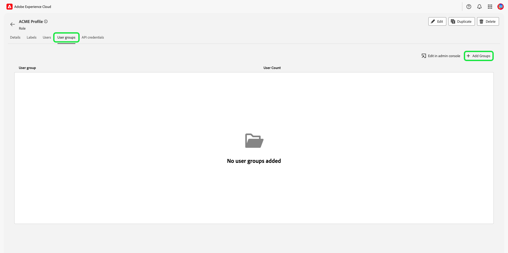
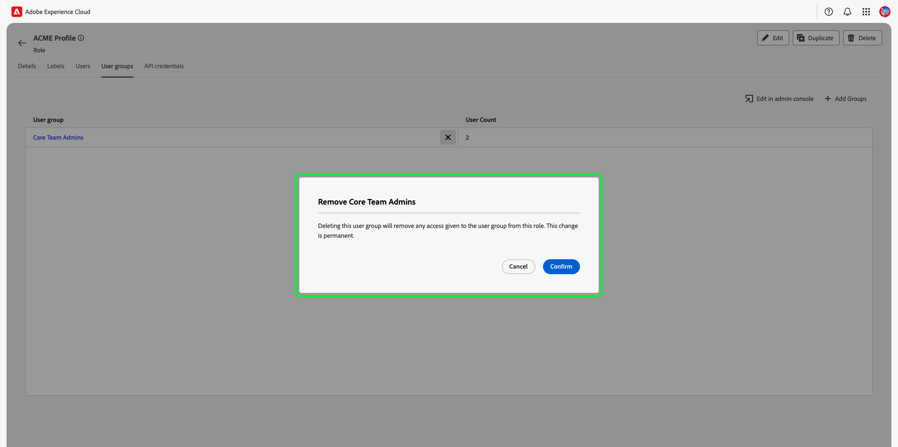

# 管理角色的权限

>[!IMPORTANT]
>
>访问控制使用用户ID（分配给用户的内部唯一ID）来授予权限。 当组织从Adobe ID迁移到Business ID时，为其用户设置的所有权限将丢失，因为用户ID发生更改，访问控制将使用新生成的用户ID。 如果贵组织迁移到Business ID，请联系您的Adobe代表以将用户ID从Adobe ID迁移到Business ID。

权限是Experience Cloud的区域，管理员可以在其中定义用户角色和访问策略，以管理产品应用程序中功能和对象的访问权限。

通过权限，您可以创建和管理角色，并为这些角色分配所需的资源权限。 权限还允许您管理与特定角色关联的标签、沙盒和用户。

紧跟在 [创建新角色](#create-a-new-role)，您将返回 **[!UICONTROL 角色]** 选项卡。 如果您正在编辑现有角色的权限，请从中选择该角色 **[!UICONTROL 角色]** 选项卡。 或者，使用筛选器选项筛选结果以查找角色。

## 筛选器角色

选择漏斗图标()，显示筛选器控件列表以帮助缩小结果范围。

以下过滤器可用于UI中的角色：

| 过滤器 | 描述 |
| --- | --- |
| [!UICONTROL 创建时间介于] | 选择开始日期和/或结束日期，以定义筛选结果的日期范围。 |
| [!UICONTROL 创建者] | 通过从下拉菜单中选择用户，按角色创建者过滤。 |
| [!UICONTROL 修改时间介于] | 选择开始日期和/或结束日期，以定义筛选结果的日期范围。 |
| [!UICONTROL 修改者] | 通过从下拉列表中选择用户，按角色修饰符筛选。 |

要移除过滤器，请选择相关过滤器的药丸图标上的“X”，或选择 **[!UICONTROL 全部清除]** 以删除所有筛选器。

## 角色详细信息

从中选择角色 **[!UICONTROL 角色]** 选项卡，这将打开角色的详细信息页面。

详细信息选项卡提供了角色的概述。 该概述显示了角色名称、角色说明、创建和修改角色的用户的名称、创建和修改角色的时间以及附加到角色的权限。 如果需要，可以修改角色名称和角色描述。

## 管理角色的标签

选择 **[!UICONTROL 标签]** 选项卡以打开“角色标签”页，然后选择 **[!UICONTROL 添加标签]** 将标签分配给角色。

此页面上列出了标签。 该列表显示标签名称、友好名称、类别及其说明。

从列表中选择要添加到角色的标签，然后选择 **[!UICONTROL 保存]**

已添加标签显示在下 **[!UICONTROL 标签]** 选项卡。

要从角色中删除标签，请选择 **X** 标签名称旁边的图标。

## 管理角色的沙盒

选择 **[!UICONTROL 沙盒]** 选项卡以打开“角色：沙盒”页面。 在这里，您可以看到添加到角色的沙盒列表。

要向角色添加更多沙箱，请选择 **[!UICONTROL 编辑]**.

下一个屏幕提示您使用下拉菜单选择要包含在角色中的沙盒中存在的资源权限。 完成后，选择 **[!UICONTROL 保存并退出]**.

## 管理角色的用户

选择 **[!UICONTROL 用户]** 选项卡以打开“角色用户”页面，然后选择 **[!UICONTROL 添加用户]** 将用户分配给角色。

从列表中选择要添加到角色的用户。 或者，使用搜索栏通过输入用户的姓名或电子邮件地址来搜索用户，然后选择 **[!UICONTROL 保存]**

添加的用户显示在下 **[!UICONTROL 用户]** 选项卡。

要从角色中删除用户，请选择 **X** 图标（位于用户名旁）。

以下视频旨在支持您了解如何创建新角色以及如何管理该角色的用户。

>[!VIDEO](https://video.tv.adobe.com/v/336081/?learn=on)

## 管理角色的API凭据 {#manage-api-credentials-for-role}

选择 **[!UICONTROL API凭据]** 选项卡以打开角色API凭据页面，然后选择 **[!UICONTROL 添加API凭据]** 以向角色分配API凭据。

从列表中选择要添加到角色的API凭据，然后选择 **[!UICONTROL 保存]**

添加的API凭据显示在下 **[!UICONTROL API凭据]** 选项卡。

要从角色中删除API凭据，请选择 **X** API凭据名称旁边的图标。

此 **[!UICONTROL 删除API凭据]** 对话框出现，提示您确认删除。

您将被返回到 **[!UICONTROL API凭据]** 选项卡。

## 管理角色的用户组

用户组是多个已分组在一起的用户，并且有权执行相同的功能。

选择 **[!UICONTROL 用户组]** 选项卡以打开角色用户组页面，然后选择 **[!UICONTROL 添加组]** 以将用户组分配给角色。

从列表中选择要添加到角色的用户组。 或者，使用搜索栏通过输入用户组的名称来搜索该用户组，然后选择 **[!UICONTROL 保存]**

添加的用户组显示在下 **[!UICONTROL 用户组]** 选项卡。

要从角色中删除用户组，请选择 **X** 图标（在用户组名称旁边）。

此 **[!UICONTROL 删除用户组]** 对话框出现，提示您确认删除。

您将被返回到 **[!UICONTROL 用户组]** 选项卡。

## 通过角色将用户添加到Experience Platform

要将用户添加到角色，请登录到该Admin Console并选择 **[!UICONTROL 添加用户]**

此 **[!UICONTROL 将用户添加到团队]** 出现对话框。 输入用户的电子邮件地址、名字（可选）和姓氏（可选）。

选择铅笔图标以选择产品和用户组，然后选择 **[!UICONTROL Adobe Experience Platform]**，然后选择 **[!UICONTROL AEP-Default-All-Users]**，然后选择  **[!UICONTROL 保存]**.

## 后续步骤

建立权限后，您可以继续下一步以 [管理用户](users.md).
