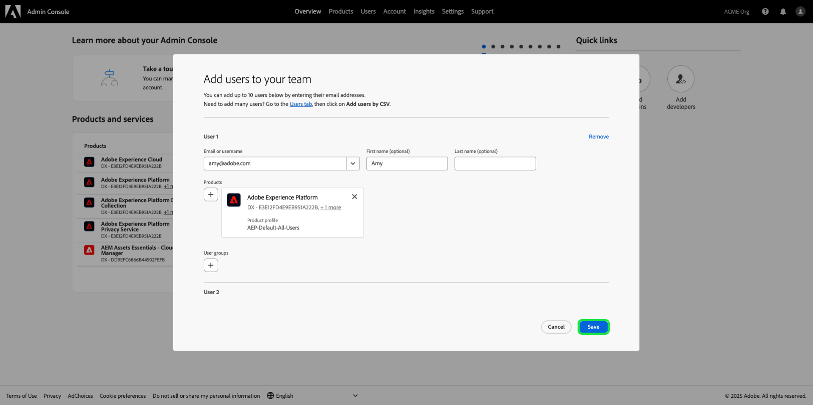

# 管理角色权限 {#manage-role-permissions}

>[!CONTEXTUALHELP]
>id="platform_permissions_roles_about"
>title="角色是什么？"
>abstract="角色定义了管理员、专家或最终用户对组织中的资源的访问权限。它们将与您的 Platform 实例交互的用户分类，是访问控制策略的构建基块。一个角色具有一组给定的权限，可将您组织的成员分配给一个或多个角色，具体取决于他们需要的查看或写入访问权限的范围。"
>additional-url="https://experienceleague.adobe.com/docs/experience-platform/access-control/abac/permissions-ui/roles.html" text="管理角色"

>[!IMPORTANT]
>
>访问控制使用用户ID（分配给用户的内部唯一ID）来授予权限。 当组织从Adobe ID迁移到Business ID时，为其用户设置的所有权限将丢失，因为用户ID发生更改，访问控制将使用新生成的用户ID。 如果贵组织迁移到Business ID，请联系Adobe代表以将用户ID从Adobe ID迁移到Business ID。

权限是Experience Cloud中的一个区域，管理员可以在该区域中定义用户角色和访问策略，以管理产品应用程序中功能和对象的访问权限。

通过权限，您可以创建和管理角色，并为这些角色分配所需的资源权限。 权限还允许您管理与特定角色关联的标签、沙盒和用户。

在[创建新角色](#create-a-new-role)之后，您立即返回到&#x200B;**[!UICONTROL 角色]**&#x200B;选项卡。 如果您正在编辑现有角色的权限，请从&#x200B;**[!UICONTROL 角色]**&#x200B;选项卡中选择该角色。 或者，使用筛选器选项筛选结果以查找角色。

## 筛选器角色

选择漏斗图标（）以显示筛选器控件列表，帮助缩小结果范围。

以下过滤器可用于UI中的角色：

| 筛选条件 | 描述 |
| --- | --- |
| [!UICONTROL 创建时间介于]之间 | 选择开始日期和/或结束日期，以定义筛选结果的日期范围。 |
| [!UICONTROL 创建者] | 通过从下拉菜单中选择用户，按角色创建者过滤。 |
| [!UICONTROL 修改时间介于]之间 | 选择开始日期和/或结束日期，以定义筛选结果的日期范围。 |
| [!UICONTROL 修改者] | 通过从下拉列表中选择用户，按角色修饰符筛选。 |

要移除过滤器，请选择相关过滤器的药丸图标上的“X”，或选择&#x200B;**[!UICONTROL 全部清除]**&#x200B;以移除所有过滤器。

## 角色详细信息 {#role-details}

>[!CONTEXTUALHELP]
>id="platform_permissions_roles_details"
>title="角色概述"
>abstract="角色概述对话框显示角色的详细信息，包括允许给定角色访问的资源和沙盒。您可以通过导航到角色工作区内的相应选项卡来管理角色的标签、用户、用户组和 API 凭据。"
>additional-url="https://experienceleague.adobe.com/zh-hans/docs/experience-platform/access-control/abac/permissions-ui/permissions#manage-labels-for-a-role" text="管理角色的标签"
>additional-url="https://experienceleague.adobe.com/zh-hans/docs/experience-platform/access-control/abac/permissions-ui/permissions#manage-users-for-a-role" text="管理角色的用户"

从&#x200B;**[!UICONTROL 角色]**&#x200B;选项卡中选择角色，这将打开角色的[!UICONTROL 详细信息]仪表板。

[!UICONTROL 详细信息]仪表板提供角色的概述。 概述中显示了角色名称、说明、创建者和上次修改者，以及创建和修改日期。 它还显示附加到角色的权限和已分配沙盒的列表。 如果需要，可以修改角色名称和描述。

## 管理角色的标签

选择&#x200B;**[!UICONTROL 标签]**&#x200B;选项卡以打开角色标签工作区，然后选择&#x200B;**[!UICONTROL 添加标签]**&#x200B;以将标签分配给角色。

显示&#x200B;**[!UICONTROL 应用访问和数据管理标签]**&#x200B;对话框，其中显示标签列表。 该列表显示标签名称、友好名称、类别及其说明。

从列表中选择要添加到角色的标签，然后选择&#x200B;**[!UICONTROL 保存]**

添加的标签显示在&#x200B;**[!UICONTROL 标签]**&#x200B;选项卡下。

要从角色中删除标签，请选择该标签，然后选择&#x200B;**[!UICONTROL 删除标签]**。

## 管理角色的沙盒

选择&#x200B;**[!UICONTROL 详细信息]**&#x200B;选项卡并导航到&#x200B;**[!UICONTROL 沙盒]**&#x200B;部分。 选择&#x200B;**[!UICONTROL 查看全部]**&#x200B;以查看添加到角色的沙盒的完整列表。

要向角色添加更多沙盒，请从UI的右上角选择&#x200B;**[!UICONTROL 编辑]**。

下一个屏幕提示您使用下拉菜单选择要包含在角色中的沙盒资源。 完成后，选择&#x200B;**[!UICONTROL 保存]**，然后选择&#x200B;**[!UICONTROL 关闭]**。

## 管理角色的用户

选择&#x200B;**[!UICONTROL 用户]**&#x200B;选项卡以打开角色[!UICONTROL 用户]工作区，然后选择&#x200B;**[!UICONTROL 添加用户]**&#x200B;以将用户分配给该角色。

出现&#x200B;**[!UICONTROL 添加用户]**&#x200B;对话框。 从列表中选择要添加到角色的用户。 或者，使用搜索栏输入用户的姓名或电子邮件地址来搜索用户，然后选择&#x200B;**[!UICONTROL 保存]**

添加的用户显示在&#x200B;**[!UICONTROL 用户]**&#x200B;选项卡下。

要从角色中删除用户，请选择用户名旁边的&#x200B;**X**&#x200B;图标。

以下视频旨在支持您了解如何创建新角色以及如何管理该角色的用户。

>[!VIDEO](https://video.tv.adobe.com/v/336081/?learn=on)

## 管理角色的API凭据 {#manage-api-credentials-for-role}

>[!IMPORTANT]
>
> 要在[!UICONTROL 权限]中使用和管理API凭据，用户必须具有系统管理员权限。

要以用户或开发人员身份使用Experience Platform API，系统管理员需要在角色的给定权限集之外添加API凭据。 有关创建和分配API凭据以及所需权限的完整指南，请参阅[身份验证和访问Experience Platform API](../../../landing/api-authentication.md#generate-credentials)中的分步教程。

选择&#x200B;**[!UICONTROL API凭据]**&#x200B;选项卡以打开角色API凭据工作区，然后选择&#x200B;**[!UICONTROL 添加API凭据]**&#x200B;以将API凭据分配给角色。

出现&#x200B;**[!UICONTROL 添加API凭据]**&#x200B;对话框。 从列表中选择要添加到角色的API凭据，然后选择&#x200B;**[!UICONTROL 保存]**

添加的API凭据显示在&#x200B;**[!UICONTROL API凭据]**&#x200B;选项卡下。

要从角色中删除API凭据，请选择API凭据名称旁边的&#x200B;**X**&#x200B;图标。

出现&#x200B;**[!UICONTROL 删除API凭据]**&#x200B;对话框，提示您确认删除。 选择&#x200B;**[!UICONTROL 确认]**&#x200B;以完成删除所选凭据。

您将返回&#x200B;**[!UICONTROL API凭据]**&#x200B;选项卡。

## 管理角色的用户组

用户组是多个已分组在一起的用户，并且有权执行相同的功能。

选择&#x200B;**[!UICONTROL 用户组]**&#x200B;选项卡以打开角色的用户组工作区，然后选择&#x200B;**[!UICONTROL 添加组]**&#x200B;以将用户组分配给角色。

出现&#x200B;**[!UICONTROL 添加组]**&#x200B;对话框。 从列表中选择要添加到角色的用户组。 或者，使用搜索栏通过输入用户组的名称来搜索该用户组，然后选择&#x200B;**[!UICONTROL 保存]**

添加的用户组显示在&#x200B;**[!UICONTROL 用户组]**&#x200B;选项卡下。

要从角色中删除用户组，请选择用户组名称旁边的&#x200B;**X**&#x200B;图标。

出现&#x200B;**[!UICONTROL 删除用户组]**&#x200B;对话框，提示您确认删除。 选择&#x200B;**[!UICONTROL 确认]**&#x200B;以删除所选的用户组。

您将返回&#x200B;**[!UICONTROL 用户组]**&#x200B;选项卡。

## 将用户添加到Experience Platform

作为系统管理员，您可以授予用户开发人员访问权限，以便他们能够在Adobe Developer Console中[创建集成](../../../landing/api-authentication.md#generate-credentials)。

要添加用户Experience Platform，请登录到[Admin Console](https://adminconsole.adobe.com)并选择&#x200B;**[!UICONTROL 添加用户]**。

**[!UICONTROL 将用户添加到您的团队]**&#x200B;对话框出现。输入用户的电子邮件地址、名字（可选）和姓氏（可选）。 然后选择&#x200B;**[!UICONTROL 产品]**。

出现&#x200B;**[!UICONTROL 选择产品]**&#x200B;对话框。 选择&#x200B;**[!UICONTROL Adobe Experience Platform]**。

将显示&#x200B;**[!UICONTROL 选择产品配置文件]**&#x200B;对话框。 选择&#x200B;**[!UICONTROL AEP-Default-All-Users]**，然后选择&#x200B;**[!UICONTROL 保存]**。

查看信息，然后选择&#x200B;**[!UICONTROL 保存]**&#x200B;以添加用户。

## 后续步骤

建立权限后，您可以继续下一步以[管理用户](users.md)。
