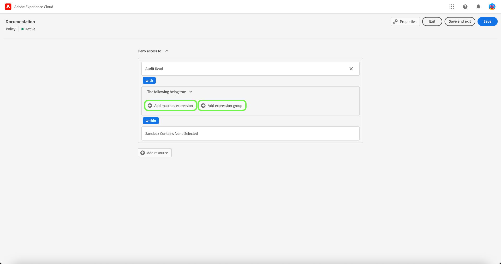

# 管理访问控制策略

访问控制策略是汇集属性以建立允许和不允许操作的声明。 访问策略可以是本地策略或全局策略，并且可以覆盖其他策略。 Adobe提供了一个默认策略，可立即激活，或者在您的组织准备好开始根据标签控制对特定对象的访问时激活。 默认策略利用应用于资源的标签来拒绝访问，除非用户处于具有匹配标签的角色中。

>[!IMPORTANT]
>
>访问策略不应与数据使用策略混淆，数据使用策略控制数据在Adobe Experience Platform中的使用方式，而不是控制组织中哪些用户可以访问数据。 请参阅有关创建的指南 [数据使用策略](../../../data-governance/policies/create.md) 了解更多信息。

<!-- ## Create a new policy

To create a new policy, select the **[!UICONTROL Policies]** tab in the sidebar and select **[!UICONTROL Create Policy]**.

The **[!UICONTROL Create a new policy]** dialog appears, prompting you to enter a name, and an optional description. When finished, select **[!UICONTROL Confirm]**.

Using the dropdown arrow select if you would like to **Permit access to** () a resource or **Deny access to** () a resource.

Next, select the resource that you would like to include in the policy using the dropdown menu and search access type, read or write.

Next, using the dropdown arrow select the condition you would like to apply to this policy, **The following being true** () or **The following being false** ().

Select the plus icon to **Add matches expression** or **Add expression group** for the resource. 

Using the dropdown, select the **Resource**.

Next, using the dropdown select the **Matches**.

Next, using the dropdown, select the type of label (**[!UICONTROL Core label]** or **[!UICONTROL Custom label]**) to match the label assigned to the User in roles.

Finally, select the **Sandbox** that you would like the policy conditions to apply to, using the dropdown menu.

Select **Add resource** to add more resources. Once finished, select **[!UICONTROL Save and exit]**.

The new policy is successfully created, and you are redirected to the **[!UICONTROL Policies]** tab, where you will see the newly created policy appear in the list. 

## Edit a policy

To edit an existing policy, select the policy from the **[!UICONTROL Policies]** tab. Alternatively, use the filter option to filter the results to find the policy you want to edit.

Next, select the ellipsis (`…`) next to the policies name, and a dropdown displays controls to edit, deactivate, delete, or duplicate the role. Select edit from the dropdown.

The policy permissions screen appears. Make the updates then select **[!UICONTROL Save and exit]**.

The policy is successfully updated, and you are redirected to the **[!UICONTROL Policies]** tab.

## Duplicate a policy

To duplicate an existing policy, select the policy from the **[!UICONTROL Policies]** tab. Alternatively, use the filter option to filter the results to find the policy you want to edit.

Next, select the ellipsis (`…`) next to a policies name, and a dropdown displays controls to edit, deactivate, delete, or duplicate the role. Select duplicate from the dropdown.

The **[!UICONTROL Duplicate policy]** dialog appears, prompting you to confirm the duplication. 

The new policy appears in the list as a copy of the original on the **[!UICONTROL Policies]** tab.

## Delete a policy

To delete an existing policy, select the policy from the **[!UICONTROL Policies]** tab. Alternatively, use the filter option to filter the results to find the policy you want to delete.

Next, select the ellipsis (`…`) next to a policies name, and a dropdown displays controls to edit, deactivate, delete, or duplicate the role. Select delete from the dropdown.

The **[!UICONTROL Delete user policy]** dialog appears, prompting you to confirm the deletion. 

You are returned to the **[!UICONTROL policies]** tab and a confirmation of deletion pop over appears.

 -->

## 激活策略

要激活现有策略，请从 **[!UICONTROL 策略]** 选项卡。

接下来，选择省略号(`…`)，此时下拉菜单会显示用于编辑、激活、删除或复制角色的控件。 从下拉菜单中选择激活。

此 **[!UICONTROL 激活策略]** 对话框，提示您确认激活。

您将返回到 **[!UICONTROL 策略]** 选项卡和确认激活弹出窗口。 策略状态显示为活动。

## 后续步骤

激活策略后，您可以继续下一步以 [管理角色的权限](permissions.md).
