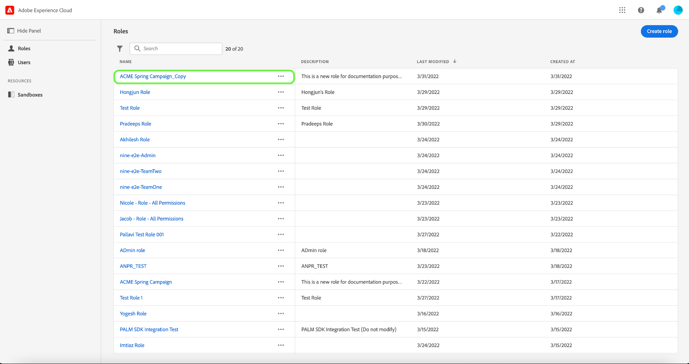

# 管理访问控制策略

访问控制策略是将属性集合在一起以建立允许和不允许的操作的语句。 访问策略可以是本地策略或全局策略，也可以覆盖其他策略。 Adobe提供了一个默认策略，可立即激活该策略，或者在您的组织准备好开始根据标签控制对特定对象的访问时，激活该策略。 默认策略利用应用于资源的标签来拒绝访问，除非用户处于具有匹配标签的角色中。

>[!IMPORTANT]
>
>不要将访问策略与数据使用策略混淆，数据使用策略控制数据在Adobe Experience Platform中的使用方式，而不是贵组织中的哪些用户有权访问数据。 有关详细信息，请参阅有关创建[数据使用策略](../../../data-governance/policies/create.md)的指南。

<!-- ## Create a new policy

To create a new policy, select the **[!UICONTROL Policies]** tab in the sidebar and select **[!UICONTROL Create Policy]**.

The **[!UICONTROL Create a new policy]** dialog appears, prompting you to enter a name, and an optional description. When finished, select **[!UICONTROL Confirm]**.

Using the dropdown arrow select if you would like to **Permit access to** () a resource or **Deny access to** () a resource.

Next, select the resource that you would like to include in the policy using the dropdown menu and search access type, read or write.

Next, using the dropdown arrow select the condition you would like to apply to this policy, **The following being true** () or **The following being false** ().

Select the plus icon to **Add matches expression** or **Add expression group** for the resource. 

Using the dropdown, select the **Resource**.

Next, using the dropdown select the **Matches**.

Next, using the dropdown, select the type of label (**[!UICONTROL Core label]** or **[!UICONTROL Custom label]**) to match the label assigned to the User in roles.

Finally, select the **Sandbox** that you would like the policy conditions to apply to, using the dropdown menu.

Select **Add resource** to add more resources. Once finished, select **[!UICONTROL Save and exit]**.

The new policy is successfully created, and you are redirected to the **[!UICONTROL Policies]** tab, where you will see the newly created policy appear in the list. 

## Edit a policy

To edit an existing policy, select the policy from the **[!UICONTROL Policies]** tab. Alternatively, use the filter option to filter the results to find the policy you want to edit.

Next, select the ellipsis (`…`) next to the policies name, and a dropdown displays controls to edit, deactivate, delete, or duplicate the role. Select edit from the dropdown.

The policy permissions screen appears. Make the updates then select **[!UICONTROL Save and exit]**.

The policy is successfully updated, and you are redirected to the **[!UICONTROL Policies]** tab.

## Duplicate a policy

To duplicate an existing policy, select the policy from the **[!UICONTROL Policies]** tab. Alternatively, use the filter option to filter the results to find the policy you want to edit.

Next, select the ellipsis (`…`) next to a policies name, and a dropdown displays controls to edit, deactivate, delete, or duplicate the role. Select duplicate from the dropdown.

The **[!UICONTROL Duplicate policy]** dialog appears, prompting you to confirm the duplication. 

The new policy appears in the list as a copy of the original on the **[!UICONTROL Policies]** tab.

## Delete a policy

To delete an existing policy, select the policy from the **[!UICONTROL Policies]** tab. Alternatively, use the filter option to filter the results to find the policy you want to delete.

Next, select the ellipsis (`…`) next to a policies name, and a dropdown displays controls to edit, deactivate, delete, or duplicate the role. Select delete from the dropdown.

The **[!UICONTROL Delete user policy]** dialog appears, prompting you to confirm the deletion. 

You are returned to the **[!UICONTROL policies]** tab and a confirmation of deletion pop over appears.

 -->

## 为沙盒配置策略

>[!IMPORTANT]
>
>默认情况下，为所有客户启用了[!UICONTROL 自动包含]功能，这意味着所有沙盒都将添加到策略中。

>[!NOTE]
>
>**[!UICONTROL Default-Label-Based-Access-Control-Policy]**&#x200B;策略当前是唯一可供配置的策略。

要查看与策略关联的沙盒，请从&#x200B;**[!UICONTROL 策略]**&#x200B;选项卡中选择该策略。

接下来，选择策略，然后选择&#x200B;**[!UICONTROL 沙盒]**&#x200B;选项卡。 将显示与策略关联的沙盒列表。

### 将策略添加到所有沙盒

使用&#x200B;**[!UICONTROL 沙盒]**&#x200B;选项卡上的&#x200B;**[!UICONTROL 自动包含]**&#x200B;切换开关为所有沙盒激活策略。

![显示[!UICONTROL 自动包含]切换的[!UICONTROL 沙盒]选项卡。](../../images/flac-ui/abac-policies-auto-include.png)

出现&#x200B;**[!UICONTROL 启用自动包含]**&#x200B;对话框，提示您确认选择。 选择&#x200B;**[!UICONTROL 启用]**&#x200B;以完成配置设置。

![启用[!UICONTROL 自动包含]对话框突出显示[!UICONTROL 启用]。](../../images/flac-ui/abac-policies-auto-include-enable.png)

>[!SUCCESS]
>
>将为所有现有沙盒激活策略，并在任何新沙盒可用时自动将其添加到新沙盒。

### 添加策略以选择沙盒

>[!IMPORTANT]
>
>如果关闭[!UICONTROL 自动包含]切换开关，则默认情况下未来沙盒将不会包含在策略中。 您需要手动管理沙盒并将其添加到策略中。

使用&#x200B;**[!UICONTROL 沙盒]**&#x200B;选项卡上的&#x200B;**[!UICONTROL 自动包含]**&#x200B;切换开关可禁用所有沙盒的策略。

![显示[!UICONTROL 自动包含]切换的[!UICONTROL 沙盒]选项卡。](../../images/flac-ui/abac-policies-auto-include.png)

从&#x200B;**[!UICONTROL 沙盒]**&#x200B;选项卡中，选择&#x200B;**[!UICONTROL 添加沙盒]**&#x200B;以选择将应用此策略的沙盒。

![显示添加到策略中的沙盒列表的[!UICONTROL 沙盒]选项卡。](../../images/flac-ui/abac-policies-sandboxes-tab-add.png)

此时将显示沙盒列表。 从列表中选择要添加的沙盒。 或者，使用搜索栏搜索沙盒。 选择&#x200B;**[!UICONTROL 保存]**。

![[!UICONTROL 添加沙盒]页面显示可添加到策略的现有沙盒列表。](../../images/flac-ui/abac-policies-sandboxes-list.png)

>[!SUCCESS]
>
>选定的沙盒已成功添加到策略中。

### 从策略中删除沙盒

要删除沙盒，请选择沙盒名称旁边的&#x200B;**X**&#x200B;图标。

![显示沙盒列表的[!UICONTROL 沙盒]选项卡，突出显示要删除的[!UICONTROL X]。](../../images/flac-ui/abac-policies-remove-sandbox-x.png)

出现&#x200B;**[!UICONTROL 删除]**&#x200B;对话框，提示您确认选择。 选择&#x200B;**[!UICONTROL 确认]**&#x200B;以完成删除。

![突出显示[!UICONTROL 确认]的[!UICONTROL 移除]对话框。](../../images/flac-ui/abac-policies-remove-sandbox.png)

>[!SUCCESS]
>
>已成功从策略中删除选定的沙盒。

## 激活策略 {#activate-policy}

>[!CONTEXTUALHELP]
>id="platform_permissions_policies_about"
>title="策略是什么？"
>abstract="策略是一些语句，它将若干属性组合在一起以确定允许执行和不允许执行的操作。每个组织都附带一个默认策略，您必须激活该策略才能开始根据标签控制对特定对象的访问。 应用于资源的标签会拒绝访问，除非将用户分配给具有匹配标签的角色。 默认策略无法编辑或删除，但可以激活或停用。"
>additional-url="https://experienceleague.adobe.com/en/docs/experience-platform/access-control/abac/permissions-ui/labels" text="管理标签"

要激活现有策略，请从&#x200B;**[!UICONTROL 策略]**&#x200B;选项卡中选择策略。

接下来，选择策略名称旁边的省略号(`…`)，下拉菜单会显示用于编辑、激活、删除或复制角色的控件。 从下拉菜单中选择激活。

出现&#x200B;**[!UICONTROL 激活策略]**&#x200B;对话框，提示您确认激活。

您返回到&#x200B;**[!UICONTROL 策略]**&#x200B;选项卡，此时会出现确认激活弹出窗口。 策略状态显示为活动。

## 后续步骤

激活策略后，您可以继续下一步以[管理角色](permissions.md)的权限。
