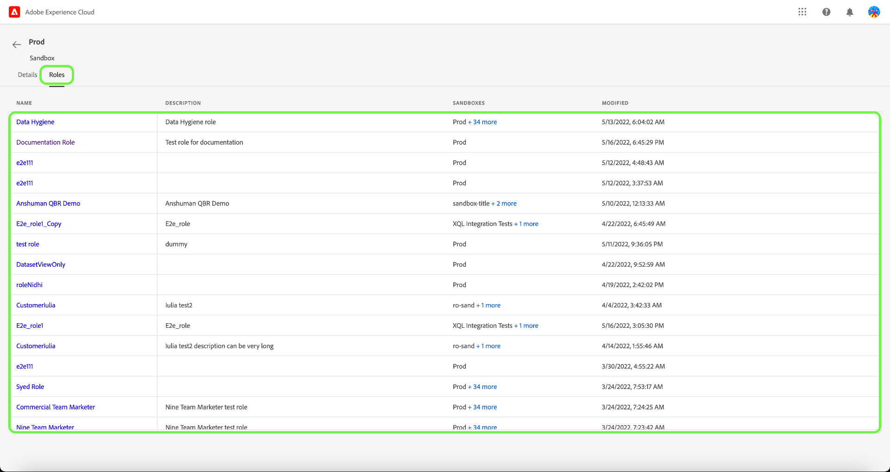

# 管理沙盒

沙盒是单个Experience Platform实例中的虚拟分区，允许与数字体验应用程序的开发过程无缝集成。 在沙盒内执行的所有内容和操作仅受该沙盒限制，不会影响任何其他沙盒。 有关沙箱的详细信息，请参阅[沙箱概述](../../../sandboxes/home.md)。

## 配置沙盒

要查看沙盒分配到的详细信息/角色，请选择&#x200B;**[!UICONTROL 沙盒]**&#x200B;选项卡。

此时将显示沙盒列表。 从列表中选择要查看的沙盒。 或者，使用搜索栏，通过输入沙盒名称来搜索沙盒。

详细信息选项卡提供沙盒的概述。 概述显示沙盒名称、类型、区域、修改日期、沙盒修改者以及沙盒的状态。

选择&#x200B;**[!UICONTROL 角色]**&#x200B;选项卡以查看沙盒所分配到的角色。

## 后续步骤

您现在已了解如何查看沙盒详细信息及其当前分配到的角色。 有关Experience Platform中沙盒的高级概述，请参阅[沙盒概述文档](../../sanboxes/../ui/overview.md)。
