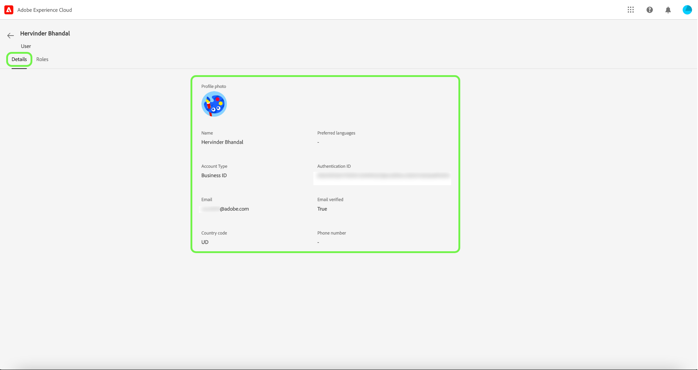

# 管理用户

如果要查看用户详细信息以及分配给用户的角色，请选择 **[!UICONTROL 用户]** 选项卡。

此时将显示用户列表。 从列表中选择要查看的用户。 或者，使用搜索栏通过输入用户的姓名或电子邮件地址来搜索用户。

“详细信息”选项卡提供了用户的概述。 该概述显示用户名、帐户类型、电子邮件、身份验证ID、联系信息和位置详细信息。

选择 **[!UICONTROL 角色]** 选项卡，查看用户被分配到的角色。

## 具有Experience Platform权限的开发人员和API访问控制

>[!NOTE]
>
>只有系统管理员才能在“权限”中查看和管理API凭据。

过渡到Adobe Experience Platform权限还有其他步骤需要完成，以便开发人员API工作流程以前依赖于产品配置文件。 请参阅 [API身份验证](../../../landing/api-authentication.md) 以了解更多信息。

## 后续步骤

您现在已了解如何查看用户详细信息以及当前添加到的用户角色。 要了解有关基于属性的访问控制的更多信息，请参阅 [基于属性的访问控制概述](../overview.md).
