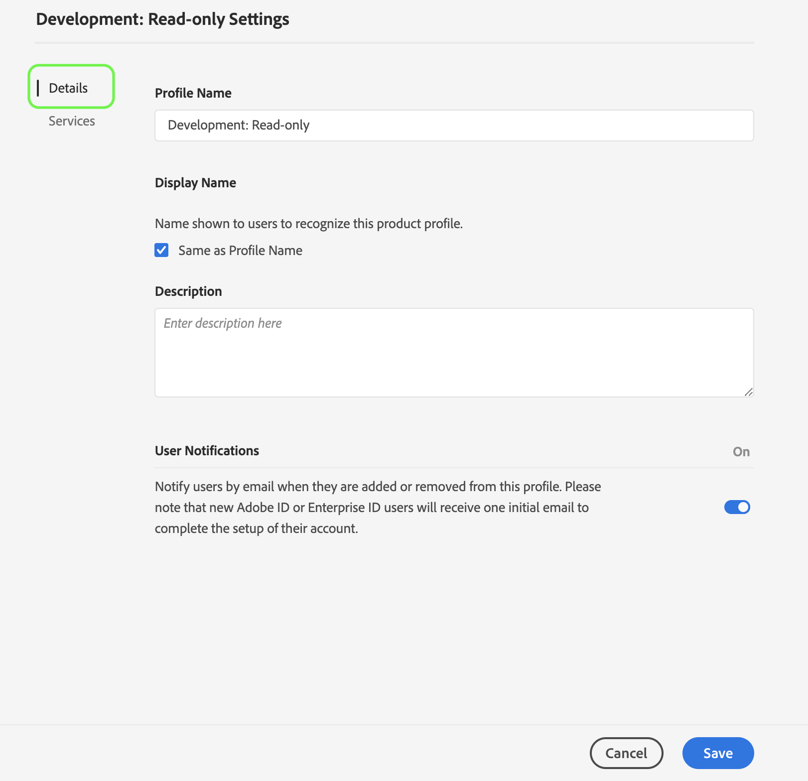

# 管理产品用户档案的详细信息和其他服务

您可以从用户档案设置菜单中配置用户档案的详细信息和访问 *其他服务* 。 要访问菜单，请单击“ **产品用户档案** ”页 *面中的设置* 。

将显 *示“用户档案设置* ”菜单 *，从“详细信息”选* 项卡开始。 此选项卡允许您输入和编辑 **用户档案名** 和 **说明**。 您还可以修改您的 **显示名称** ，以及帐户的电子邮件通知设置。

单击 **“服务** ”以访问“ *服务* ”页。

“服 *务* ”菜单允许您修改用户档案对其他平台服务的访问权，这些服务最初在创建用户档案时进行了配置。 根据您的平台订阅，这些服务可以包括：

- 数据科学工作区
- 查询服务
- 实时客户数据平台UI（仅限实时CDP）

单击特定服务右侧的切换按钮以启用或禁用它。 您还可以单击“全部 **打开** ”复选框以启用或禁用所有列出的服务。

完成后，单击&#x200B;**保存**。

