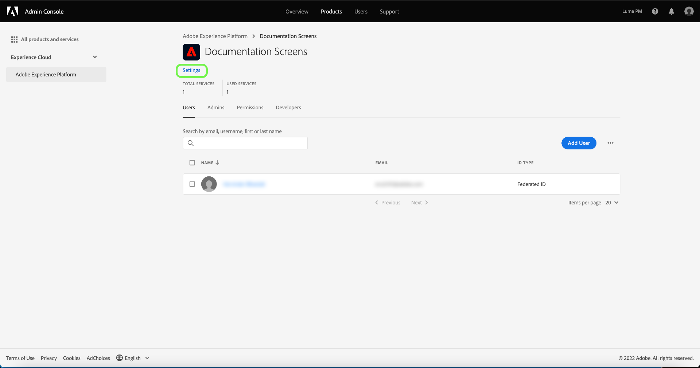

# 管理产品配置文件的详细信息和其他服务

您可以配置配置文件的详细信息，并从&#x200B;**[!UICONTROL 配置文件设置]**&#x200B;菜单访问其他服务。 要访问该菜单，请从&#x200B;**[!UICONTROL 产品配置文件]**&#x200B;页面中选择&#x200B;**[!UICONTROL 设置]**。

将显示&#x200B;**[!UICONTROL 编辑产品配置文件]**&#x200B;菜单，从&#x200B;**[!UICONTROL 编辑配置文件详细信息]**&#x200B;选项卡开始。 利用此选项卡，可输入和编辑用户档案名称和描述。 您还可以修改帐户的显示名称和电子邮件通知设置。

选择&#x200B;**[!UICONTROL 下一步]**&#x200B;以访问&#x200B;**[!UICONTROL 启用服务]**&#x200B;页面。

通过&#x200B;**[!UICONTROL 启用服务]**&#x200B;菜单，您可以修改配置文件对创建配置文件时最初配置的其他[!DNL Experience Platform]服务的访问权限。 根据您的[!DNL Experience Platform]订阅，这些服务可能包括：

- [!DNL Data Science Workspace]
- [!DNL Query Service]
- [!DNL Adobe Real-Time Customer Data Platform] UI(仅适用于Real-Time CDP)
- B2B UI

单击特定服务右侧的切换可启用或禁用该服务。 您还可以选中&#x200B;**[!UICONTROL 全部在]**&#x200B;上”复选框来启用或禁用所有列出的服务。

完成后，选择&#x200B;**[!UICONTROL 保存]**。

有权使用B2B或B2P版本的客户有权访问B2B UI。 可以通过[!UICONTROL 启用服务菜单]为用户设置B2B UI。 选择[!UICONTROL B2B UI]旁边的切换为特定产品配置文件启用该服务，然后选择&#x200B;**[!UICONTROL 保存]**。

通过B2B UI切换，用户可以查看与管理帐户和机会相关的B2B工作流，以及创建B2B相关区段。 有关详细信息，请参阅[[!DNL Adobe Real-Time Customer Data Platform B2B Edition]](../../rtcdp/b2b-overview.md)上的文档。

