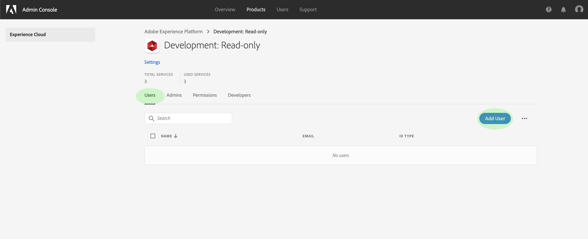

# 管理产品用户档案的用户

要从产品用户档案中分配或删除用户，请打开用户档案的详细信息页面，然后导航到&#x200B;**[!UICONTROL 用户]**&#x200B;选项卡。 从此处，单击&#x200B;**[!UICONTROL 添加用户]**。

出现&#x200B;**[!UICONTROL 添加用户]**&#x200B;对话框。 使用搜索字段，您可以查找要添加的用户（按姓名或通过电子邮件）。 键入时，匹配的用户将显示在文本框下方的自动完成窗口中。

>[!NOTE]
>
>如果用户未出现在自动完成窗口中，请在搜索栏中输入其完整的电子邮件地址。 将向电子邮件发送邀请函，其中附有设置Adobe ID帐户的说明。

选择用户后，单击&#x200B;**[!UICONTROL 保存]**&#x200B;将其添加到产品用户档案。

产品用户档案的&#x200B;**[!UICONTROL Users]**&#x200B;选项卡将重新显示，此时已添加的用户将列在其中。

## 后续步骤

现在您已学习如何通过[!DNL Admin Console]控制对[!DNL Platform]功能的访问，请参阅[访问控制概述](../home.md)中的附录部分，进一步了解他们授予的每个权限和[!DNL Platform]功能。