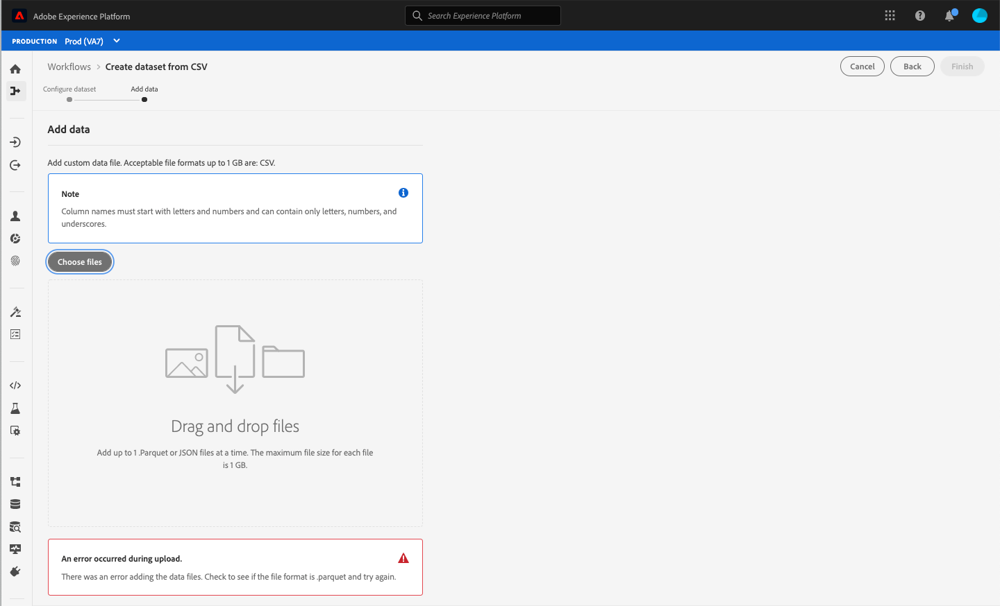
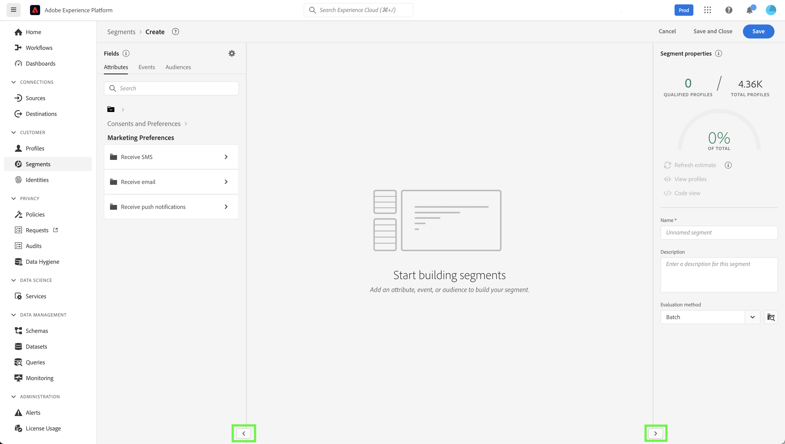

# Experience Platform的自定义辅助功能解决方案

Adobe Experience Platform不断得到增强，可满足所有类型的用户的需求，并遵守包括视觉、听觉、移动或其他残疾人士在内的全球标准。 本文档概述了Experience Platform用户界面中的自定义辅助功能解决方案。

## 主页和用户界面概述

Experience Platform用户界面满足普通文本、图形和UI组件所需的对比度。 此外，还选择用户界面的颜色以支持所有用户（包括视觉障碍用户）的无障碍功能。

在中，可以使用键盘接合可通过指针单击或操作的UI元素。 这包括左侧导航、视频播放器、表格等。

Experience Platform致力于满足国际无障碍标准，包括Web内容无障碍准则2.1 A级和AA级以及Web无障碍倡议 — 无障碍富互联网应用程序(WAI-ARIA) Web标准。

## 左侧导航栏

Experience Platform UI中的左侧导航可通过键盘访问，并提供符合辅助功能标准的正常、悬停和选择状态的颜色对比度。

在主屏幕中，用户可以进入左侧导航。 选择&#x200B;**Shift + Tab**&#x200B;将用户返回到主屏幕。

在左侧导航成为焦点时，**选项卡**&#x200B;将用户引导至展开和折叠交互。 使用&#x200B;**Enter (Return)**&#x200B;激活展开或折叠左侧导航的功能。

当左侧导航处于焦点状态时，向上和向下箭头键将导航到导航中的每个项目并连续循环（换言之，在用户选项卡离开左侧导航之前，焦点不会移开）。 选中后，将针对导航项目显示焦点。 当前选定内容以高亮和加粗文本显示。 当选择左侧导航项时，**Enter（返回）**&#x200B;会在右侧面板中打开选定的UI项，但是，焦点会保留在左侧导航中，直到用户离开导航栏。

Experience Platform中的某些功能未对所有用户启用。 这些项目会显示在导航中，但无法选择。 使用键盘导航时，这些项目在箭头导航期间被跳过，无法使用&#x200B;**Enter (Return)**&#x200B;进行选择。

## 嵌入式视频对话框

在Experience Platform中，可以使用键盘导航突出显示并选择可用的视频链接来查看视频。 这会在Experience Platform UI中打开一个嵌入的视频对话框。

## 视频对话框键盘辅助功能

也可以使用键盘导航嵌入式视频对话框。 下表概述了可用于嵌入式视频对话框的完整键盘导航。

| 对话框元素 | 键盘辅助功能 | 描述 |
|---|---|---|
| 播放和暂停 | 制表符 空格键 | 使用&#x200B;**Tab**&#x200B;设置播放按钮的焦点。 **空格键**&#x200B;开始播放视频并暂停播放视频。 |
| 清理器 | 制表符 向左箭头 向右箭头 | 当视频正在播放时，使用&#x200B;**Tab**&#x200B;来聚焦清理器。 当清理器处于焦点时，**左右方向键**&#x200B;将分别跳过前面和后面5秒的视频播放。 |
| 静音 | 制表符 空格键 | 使用&#x200B;**Tab**&#x200B;将静音卷元素作为焦点。 使用&#x200B;**空格键**&#x200B;将视频播放设为静音或取消静音。 |
| 数量 | 制表符 向左箭头 向右箭头 | 使用&#x200B;**选项卡**&#x200B;重点关注卷元素。 **向左和向右箭头键**&#x200B;分别向上和向下移动卷。 |
| [!UICONTROL 隐藏式字幕] (“cc”) | 选项卡 进入 向上箭头 向下箭头 | **Tab**&#x200B;到[!UICONTROL 隐藏式字幕] (“cc”)元素。 使用&#x200B;**Enter**&#x200B;打开菜单，使用&#x200B;**上下方向键**&#x200B;选择字幕语言。 **进入**&#x200B;确认您的选择。 |
| [!UICONTROL 品质] | 选项卡 进入 向上箭头 向下箭头 | 使用&#x200B;**Tab**&#x200B;聚焦[!UICONTROL Quality]元素。 使用&#x200B;**Enter**&#x200B;打开菜单，使用&#x200B;**上下方向键**&#x200B;选择视频品质。 **进入**&#x200B;确认您的选择。 |
| 全屏 | Tab 空格键或Enter Escape | 使用&#x200B;**Tab**&#x200B;将焦点置于全屏元素。 使用&#x200B;**空格键或Enter**&#x200B;激活全屏视图。 **Esc** (“esc”)退出全屏模式。 |
| 关闭 | Tab 空格键或Enter | 使用&#x200B;**Tab**&#x200B;将焦点置于关闭按钮。 使用&#x200B;**空格键或Enter**&#x200B;键退出视频对话框。 |

>[!NOTE]
>
>在播放期间，可随时使用esc键关闭嵌入的视频对话框。

## 文件拖放

在Experience Platform中，所有文件选择拖放区域都可通过键盘访问。 使用&#x200B;**Tab**&#x200B;突出显示&#x200B;**[!UICONTROL 选择文件]**，并使用&#x200B;**Enter或空格键**&#x200B;选择它，将调用操作系统的文件选择UI。

上传文件后，可通过键盘导航删除图标，以删除选定的文件并上传新文件。 用户可以使用&#x200B;**Tab**&#x200B;来关注删除图标，并使用&#x200B;**Enter或空格键**&#x200B;来选择它。 删除文件后，**[!UICONTROL 选择文件]**&#x200B;将自动成为焦点并能够被选择。

或者，如果上传的文件格式不正确，则会显示错误图标和错误消息，并且&#x200B;**[!UICONTROL 选择文件]**&#x200B;按钮处于焦点并可选择。

使用鼠标选择拖放区域也会调用文件选择UI，或者鼠标用户可以选择文件并拖动到区域上以开始上传。

## 表格浏览

Experience Platform用户界面中的所有表都可通过键盘访问。 可通过一系列键盘快捷键浏览表格行和列，并与之交互：

* 在表标题中，使用&#x200B;**向下箭头**&#x200B;浏览表。 通过&#x200B;**Tab**&#x200B;导航时，表标题是可选的，您可以使用&#x200B;**空格键**&#x200B;更改排序顺序。
* **上下方向键**&#x200B;在表中的行中上下移动。
* 当选择某行或某一行成为焦点时，在行上使用&#x200B;**Enter**&#x200B;可在右边栏中提供详细信息。
* 选择行或聚焦时，使用&#x200B;**方向键**&#x200B;在行中的每个项之间移动。
* 使用&#x200B;**Enter**&#x200B;选择行中的项。 如果必须打开新窗口，会向具有屏幕阅读器的用户发出警报。
* 当缩放到200%或更高时，可以在右边栏折叠时看到&#x200B;**边栏检查器**&#x200B;图标，以便为表格提供更多的查看空间。

### 浏览表格键盘辅助功能

| 键盘辅助功能 | 描述 |
|---|---|
| HOME（函数+向左箭头） | 聚焦行时，将用户引导至行中的第一个项目 |
| END（函数+向右箭头） | 当行成为焦点时，会将用户转至行中的最后一个项目 |
| 向上翻页 | 在表中向上遍历10行（每页） |
| 向下翻页 | 在表中向下遍历10行（每页） |
| 控制+主页 | 转到表中的第一行 |
| 控制+结束 | 每页转至表中的第一个工作 |

## 架构编辑器UI

可通过以下功能访问架构编辑器UI：

* 架构编辑器支持键盘导航，包括使用&#x200B;**Tab**&#x200B;来导航UI元素。
* **Tab**&#x200B;进入搜索字段，然后进入架构树。
* 架构树支持使用箭头键在架构树UI中导航
   * **向上和向下箭头**&#x200B;可用于遍历树。
   * **左右箭头**&#x200B;可用于展开和折叠节点，或在架构树上的内联操作之间移动。
* **Enter (Return)**&#x200B;激活右侧详细信息面板中的单个节点详细信息。
* **Home**&#x200B;键返回到树的顶部。
* **End**&#x200B;键导航到树的底部。
* 架构树还包括用于屏幕阅读器的ARIA标签。

## 区段生成器用户界面

使用区段生成器UI在Experience Platform中创建、编辑区段并与之交互时，以下功能可提高辅助功能：

* 区段生成器UI可通过键盘导航访问。
* 屏幕阅读器应该能够识别标题的标记标签，并且可以宣布标题及其级别。
* 其他辅助型技术可以使用正确编码的标题来显示大纲或替代视图，从而更改页面的视觉显示。

您现在可以折叠或展开区段生成器画布的左边栏和右边栏以获取更多屏幕空间。 此功能特别有用，因为它在200%缩放下提供了完整的功能功能。

## 查询服务编辑器

查询服务编辑器中提供了以下辅助功能：

* 查询服务编辑器UI中的颜色对比度符合辅助功能要求。
* 编辑器UI之外支持键盘导航。 编辑器UI是一个嵌入的代码镜像。

>[!NOTE]
>
>默认情况下，查询编辑器不处理&#x200B;**Tab**&#x200B;键。 要在编辑器中调用&#x200B;**Tab**&#x200B;功能，必须按&#x200B;**Escape**&#x200B;键，然后在其后直接按&#x200B;**Tab**。 再次按&#x200B;**Tab**，将焦点移到编辑器之外。

## 源和目标中的“系统视图”选项卡

在源和目标中浏览&#x200B;**[!UICONTROL 系统视图]**&#x200B;时，以下功能改进了辅助功能：

* **选项卡**&#x200B;将焦点设置为第一个源连接卡
   * 再次按&#x200B;**Tab**&#x200B;以关注卡片内部的按钮
   * 选择&#x200B;**Enter**&#x200B;以激活信息卡中的行动号召按钮
* 在连接卡上选择&#x200B;**Enter**&#x200B;也会激活右边栏中的更多详细信息
   * 激活右边栏后，焦点将设置到该区域。 **选项卡**&#x200B;侧重于右边栏窗格的&#x200B;**关闭**。 再次选择&#x200B;**制表符**&#x200B;会将焦点通过右边栏面板移动
   * 如果有多个源连接卡，**选项卡**&#x200B;将穿过这些连接
   * 使用&#x200B;**方向键（向上、向下、向左和向右）**&#x200B;在源列表中移动
   * 选择&#x200B;**制表符**&#x200B;以将焦点置于右边栏面板
