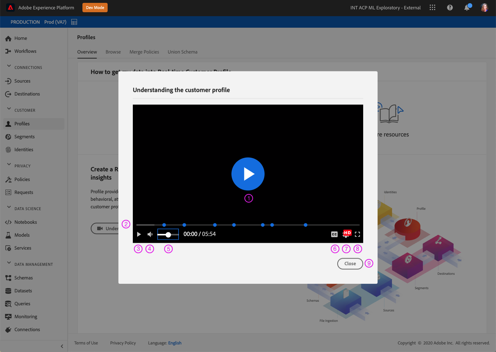

# 适用于Experience Platform的自定义辅助功能解决方案

Adobe Experience Platform不断得到增强，以满足所有类型用户的需求，并遵守包括视觉、听觉、行动不便或有其他障碍的个人在内的全球标准。 本文档概述了Experience Platform用户界面中的自定义辅助功能解决方案。

## 主页和用户界面概述

Experience Platform用户界面满足普通文本、图形和UI组件所需的对比度。 此外，还选择用户界面的颜色以支持所有用户（包括视觉障碍用户）的无障碍功能。

在Platform中，可以使用指针点击或操作的UI元素也可以使用键盘进行接合。 这包括左侧导航、视频播放器、表格等。

Experience Platform努力达到国际无障碍标准，包括Web内容无障碍准则2.1 A级和AA级，以及Web无障碍倡议 — 无障碍富互联网应用程序(WAI-ARIA) Web标准。

## 左侧导航栏

Experience PlatformUI中的左侧导航可通过键盘访问，并且可在符合辅助功能标准的正常、悬停和选择状态下提供颜色对比度。

在主屏幕中，用户可以进入左侧导航。 选择 **Shift + Tab** 将用户返回到主屏幕。

左导航成为焦点， **选项卡** 带用户展开和折叠交互。 展开或折叠左侧导航的功能已通过激活 **输入（返回）**.

当左侧导航处于焦点状态时，向上和向下箭头键会导航到导航中的每个项目并连续循环（换句话说，在用户通过选项卡离开左侧导航之前，焦点不会移开）。 选中后，将显示导航项目的焦点。 当前选定内容以高亮和粗体文本显示。 选择左侧导航项时， **输入（返回）** 在右侧面板中打开选定的UI项目，但是，焦点仍然在左侧导航中，直到用户脱离选项卡。

Platform中的某些功能未对所有用户启用。 这些项目显示在导航中，但无法选择。 使用键盘导航时，这些项目会在箭头导航期间跳过，并且不能使用进行选择 **输入（返回）**.

## 嵌入式视频对话框

在Experience Platform中，可以使用键盘导航高亮显示并选择可用的视频链接来查看视频。 这会在Platform UI中打开一个嵌入的视频对话框。

## 视频对话框键盘辅助功能

也可以使用键盘导航嵌入式视频对话框。 下表概述了可用于嵌入式视频对话框的完整键盘导航。

| 对话框元素 | 键盘辅助功能 | 描述 |
|---|---|---|
| 播放和暂停 | 选项卡 空格键 | 使用 **选项卡** 设置播放按钮的焦点。 **空格键** 开始视频播放和暂停视频播放。 |
| 清理器 | 选项卡 向左箭头 向右箭头 | 在播放视频时，使用 **选项卡** 来集中精力。 当洗手器对准时， **左右方向键** 分别跳过前面和后面5秒的视频播放。 |
| 静音 | 选项卡 空格键 | 使用 **选项卡** 将焦点置于静音音量元素上。 使用 **空格键** 将视频播放设为静音或取消静音。 |
| 数量 | 选项卡 向左箭头 向右箭头 | 使用 **选项卡** 将焦点放在卷元素上。 **左右方向键** 分别向上和向下移动音量。 |
| [!UICONTROL 隐藏字幕] （“抄送”） | 选项卡 输入 向上箭头键 向下箭头 | **选项卡** 到 [!UICONTROL 隐藏字幕] （“抄送”）元素。 使用 **输入** 以打开菜单，并且 **向上键和向下键** 选择字幕语言。 **输入** 确认您的选择。 |
| [!UICONTROL 质量] | 选项卡 输入 向上箭头键 向下箭头 | 使用 **选项卡** 聚焦 [!UICONTROL 质量] 元素。 使用 **输入** 打开菜单和 **向上键和向下键** 以选择视频品质。 **输入** 确认您的选择。 |
| 全屏 | 选项卡 空格键或Enter 转义 | 使用 **选项卡** 以集中全屏元素。 使用 **空格键或Enter** 以激活全屏视图。 **转义** (“esc”)退出全屏模式。 |
| 关闭 | 选项卡 空格键或Enter | 使用 **选项卡** 以聚焦“关闭”按钮。 使用 **空格键或Enter** 键退出视频对话框。 |

>[!NOTE]
>
>在播放期间，可随时使用esc键（下称“esc”）关闭嵌入的视频对话框。

## 文件拖放

在Experience Platform中，所有文件选择拖放区域都可通过键盘访问。 使用 **选项卡** 突出显示 **[!UICONTROL 选择文件]** 和使用 **Enter或空格键** 要选择它，将调用操作系统的文件选择UI。

上传文件后，可通过键盘导航删除图标，以删除选定的文件并上传新文件。 用户可以使用 **选项卡** 将焦点置于删除图标和 **Enter或空格键** 以选择它。 删除文件后， **[!UICONTROL 选择文件]** 自动聚焦并能够选择。

或者，如果上传的文件格式不正确，则会显示错误图标以及错误消息和 **[!UICONTROL 选择文件]** 按钮处于焦点并可选择。

使用鼠标选择拖放区域也会调用文件选择UI，或者鼠标用户可以选择文件并拖动到区域上以开始上传。

## 表格浏览

Experience Platform用户界面中的所有表都可使用键盘访问。 可通过一系列键盘快捷键浏览表格行和表格列并与之交互：

* 在表标题中，使用 **向下箭头** 以浏览表。 通过导航时，表标题是可选的 **选项卡**，并且可以使用更改排序顺序 **空格键**.
* **向上键和向下键** 在表格中的行中上下移动。
* 选择行或聚焦行时，使用 **输入** 中的右边栏提供了详细信息。
* 选择行或聚焦行时，使用 **箭头键** 在行中的每个项目之间移动。
* 使用 **输入** 以选择行中的项目。 如果必须打开新窗口，则会提醒具有屏幕阅读器的用户。
* 当您缩放到200%或更多时，您可以看到 **边栏检查器** 图标，以折叠右边栏为表格提供更多的查看空间。

### 浏览表格键盘辅助功能

| 键盘辅助功能 | 描述 |
|---|---|
| HOME（函数+向左箭头） | 聚焦行时，将用户转到行中的第一个项目 |
| END（函数+向右箭头） | 当行成为焦点时，会将用户转到行中的最后一个项目 |
| 向上翻页 | 在表中向上遍历10行（每页） |
| 向下翻页 | 在表中向下遍历10行（每页） |
| Control +主页 | 转到表中的第一行 |
| 控制+结束 | 每页转至表中的第一个工作 |

## 架构编辑器UI

架构编辑器UI可通过以下功能访问：

* 架构编辑器支持键盘导航，包括使用 **选项卡** 来导航UI元素。
* **选项卡** 输入搜索字段，然后进入架构树。
* 架构树支持使用箭头键在架构树UI中导航
   * **向上和向下箭头** 可用于遍历树。
   * **左右箭头** 可用于展开和折叠节点，或在架构树上的内联操作之间移动。
* **输入（返回）** 激活右侧详细信息面板中的各个节点详细信息。
* 此 **主页** 键返回到树的顶部。
* 此 **结束** 键导航到树的底部。
* 架构树还包括用于屏幕阅读器的ARIA标签。

## 区段生成器UI

使用区段生成器UI在Experience Platform中创建、编辑区段并与之交互时，以下功能可提高可访问性：

* 区段生成器UI可通过键盘导航访问。
* 屏幕阅读器应该能够识别标题的标记标签，并且可以朗读标题及其级别。
* 其他辅助型技术可以使用正确编码的标题来显示大纲或替代视图，从而更改页面的视觉显示。

您现在可以折叠或展开区段生成器画布的左边栏和右边栏以获得更多屏幕空间。 此功能特别有用，因为它在200%缩放下提供了完整的功能。

## 查询服务编辑器

查询服务编辑器中提供了以下辅助功能：

* 查询服务编辑器UI中的颜色对比度符合辅助功能要求。
* 支持在编辑器UI外部进行键盘导航。 编辑器UI是一个嵌入的代码镜像。

## 源和目标中的“系统视图”选项卡

浏览 **[!UICONTROL 系统视图]** 在Sources（源）和Destinations（目标）中，以下功能改进了辅助功能：

* **选项卡** 将焦点设置为第一个源连接卡
   * **选项卡** 再次将焦点置于卡片内部的按钮上
   * 选择 **输入** 以激活信息卡中的行动号召按钮
* 选择 **输入** 在连接卡上，还会激活右边栏中的更多详细信息
   * 激活右边栏后，焦点将设置为该区域。 **选项卡** 聚焦 **关闭** 右侧边栏窗格的。 选择 **选项卡** 再次通过右边栏面板移动焦点
   * 如果有多个源连接卡， **选项卡** 在连接中移动
   * 使用 **箭头键（向上、向下、向左和向右）** 在源列表中移动
   * 选择 **选项卡** 将焦点放在右边栏面板上
