# Managing Tags指南

标记允许您管理元数据分类，以便对业务对象进行分类，以便更轻松地发现和分类。 标记可帮助识别您的团队将处理的受众的重要分类属性，以便他们能够更快地找到这些受众，并且还可以跨描述符将常见受众分组在一起。 您应该确定常见的标签类别，如地理区域、业务单位、产品线、项目、团队、时间范围（季度、月、年），或有助于为团队应用含义并简化受众发现的任何其他类别。 

## 创建标记 {#create-tag}

要创建新标记，请选择 **[!UICONTROL 标记]** 在左侧导航中，选择所需的标记类别。

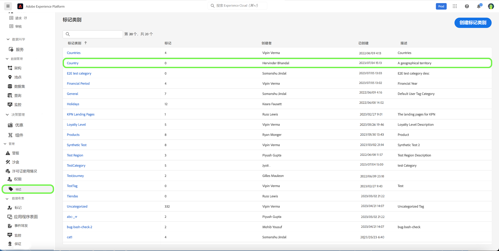

选择 **[!UICONTROL 创建标记]** 创建新标记。

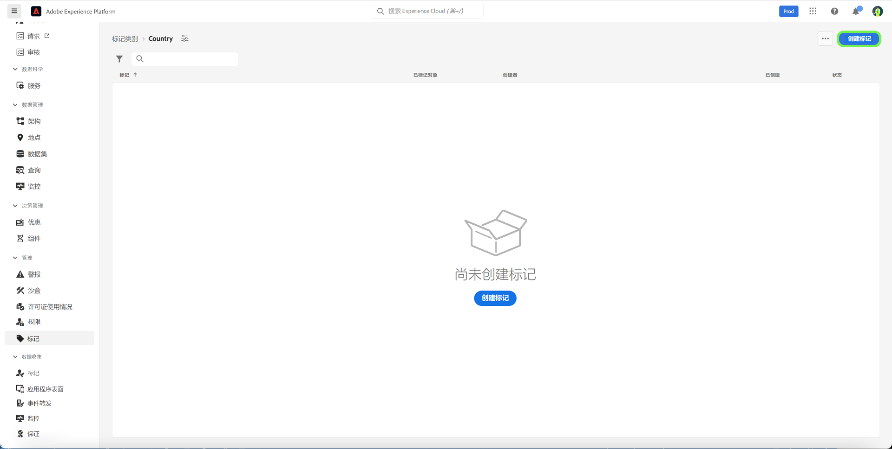

的 **[!UICONTROL 创建标记]** 对话框，提示您输入唯一的标记名称。 完成后，选择 **[!UICONTROL 保存]**.

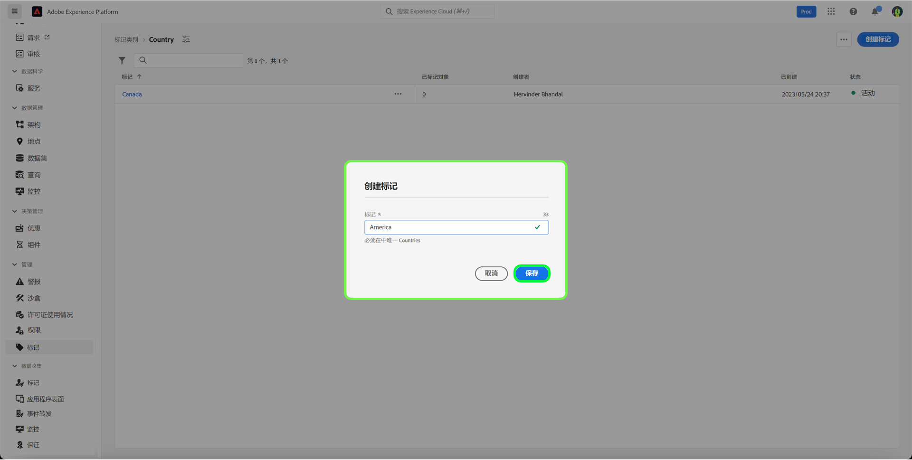

新标记已成功创建，您将被重定向到标记屏幕，您将看到新创建的标记显示在列表中。

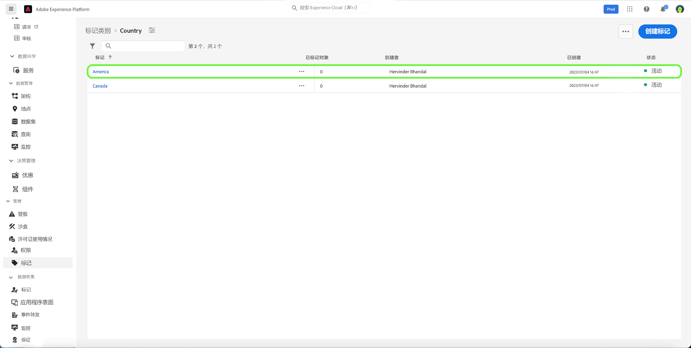

## 编辑标记 {#edit-tag}

当存在拼写错误、命名约定更新或术语更新时，编辑标记会有所帮助。 编辑标记时，将维护标记与当前所应用对象的关联。

要编辑现有标记，请在标记类别列表中，选择省略号(`...`)。 下拉列表会显示用于编辑、移动或存档标记的控件。 选择 **[!UICONTROL 编辑]** 从下拉菜单中。

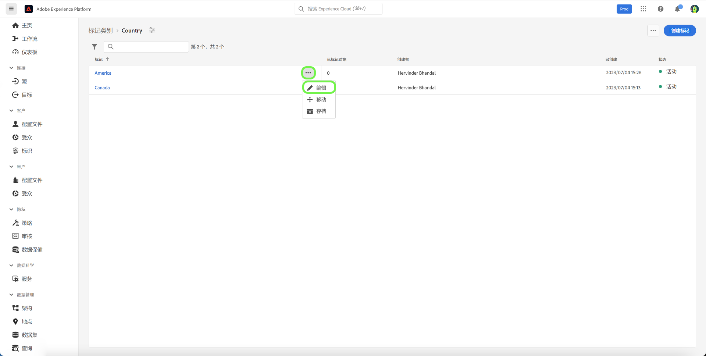

的 **[!UICONTROL 编辑标记]** 对话框，提示您编辑标记名称。 完成后，选择 **[!UICONTROL 保存]**.

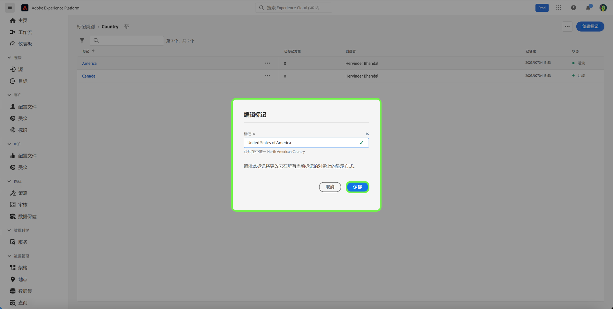

标记名称已成功更新，您将被重定向到标记屏幕，在此屏幕中，您将看到更新的标记显示在列表中。

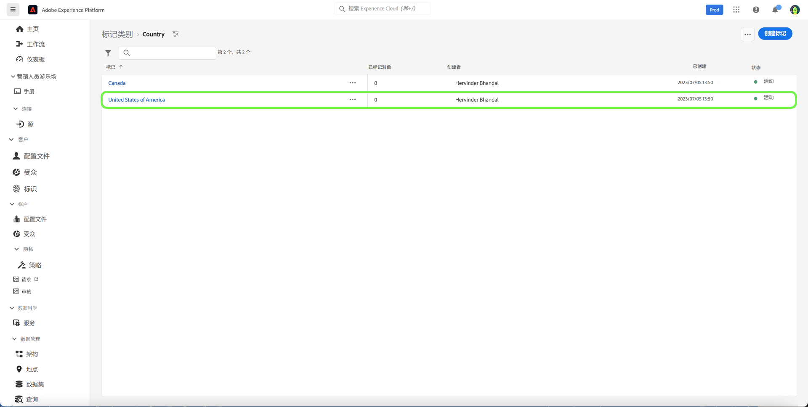

## 在类别之间移动标记 {#move-tag}

可以将标记移动到其他标记类别中。 移动标记将保持标记与当前应用标记的任何对象的关联。

要移动现有标记，请在标记类别列表中，选择省略号(`...`)。 下拉列表会显示用于编辑、移动或存档标记的控件。 选择 **[!UICONTROL 编辑]** 从下拉菜单中。

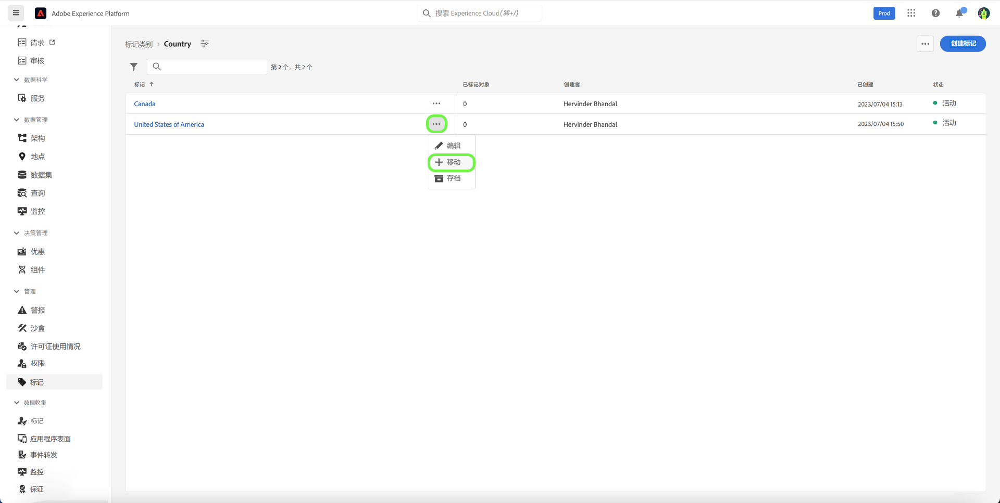

的 **[!UICONTROL 移动标记]** 对话框，提示您选择应将选定标记移动到的标记类别。

您可以滚动并从列表中进行选择，或者使用搜索功能输入类别名称。 完成后，选择 **[!UICONTROL 移动]**.

标记已成功移动，您将被重定向到“标记”屏幕，您将在该屏幕中看到更新的标记列表，该列表中不再显示标记。

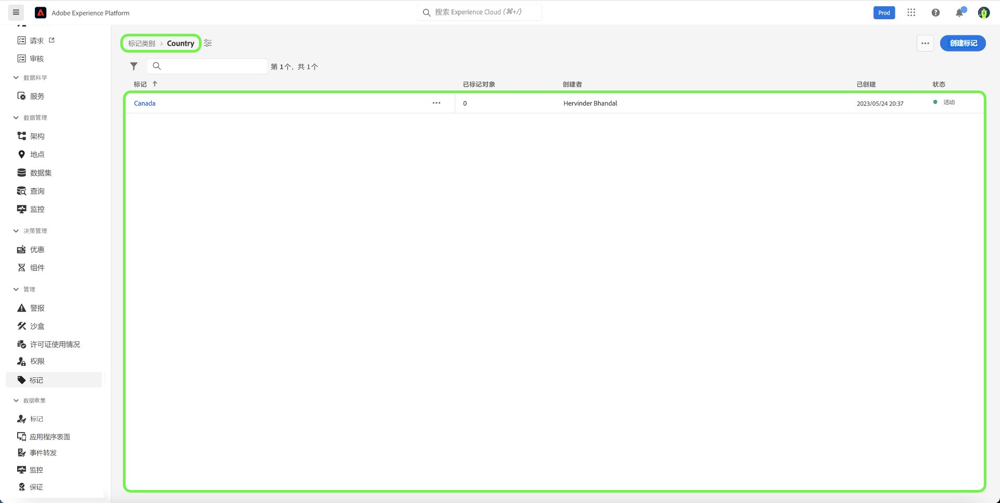

标记现在将显示在之前选择的标记类别中。

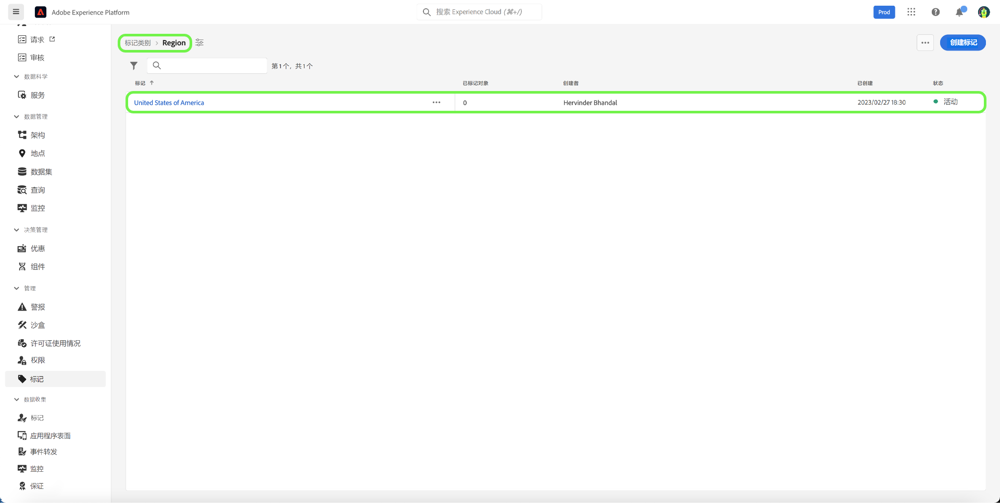

## 存档标记 {#archive-tag}

标记的状态可以在活动和存档之间切换。 存档的标记不会从已应用的对象中删除，但不能再将其应用于新对象。 对于每个标记，所有对象中都会反映相同的状态。 当您希望维护当前的标记对象关联，但不希望将来使用标记时，此功能会特别有用。

要存档现有标记，请在标记类别列表中，选择省略号(`...`)来访问Advertising Cloud帮助。 下拉列表会显示用于编辑、移动或存档标记的控件。 选择 **[!UICONTROL 存档]** 从下拉菜单中。

的 **[!UICONTROL 存档标记]** 对话框，提示您确认标记存档。 选择 **[!UICONTROL 存档]**.

标记已成功存档，并且您将被重定向到标记屏幕。 此时，您将看到更新的标记列表将标记的状态显示为 `Archived`.

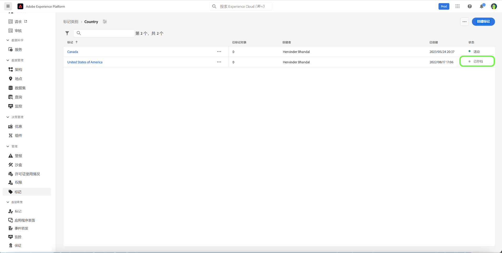

## 恢复已存档的标记 {#restore-archived-tag}

如果您希望应用 `Archived` 标记到新对象时，标记必须位于 `Active` 状态。 恢复已存档的标记将返回标记 `Active` 状态。

要恢复已存档的标记，请在标记类别列表中，选择省略号(`...`)。 下拉列表会显示用于恢复或删除标记的控件。 选择 **[!UICONTROL 还原]** 从下拉菜单中。

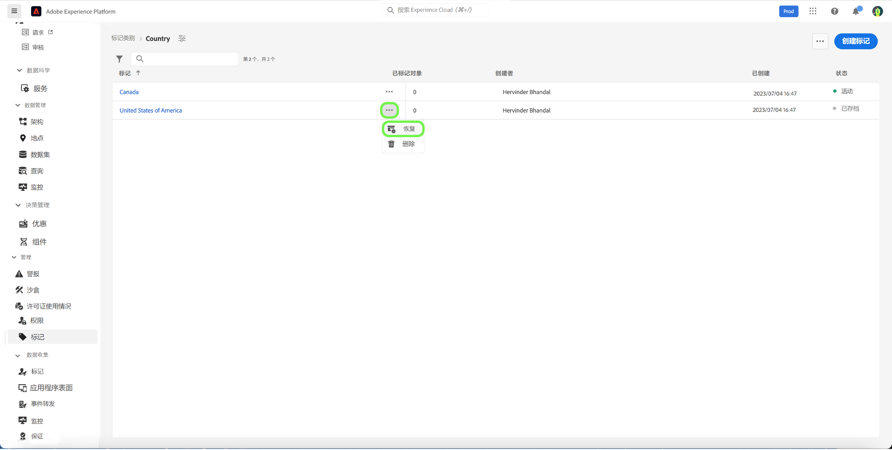

的 **[!UICONTROL 还原标记]** 对话框，提示您确认标记还原。 选择 **[!UICONTROL 还原]**.

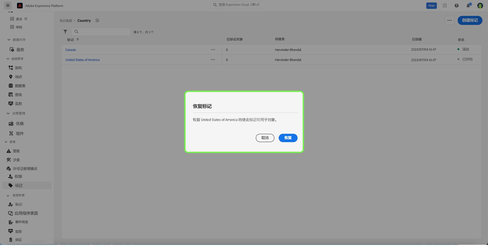

标记已成功还原，您将被重定向到标记屏幕。 此时，您将看到更新的标记列表将标记的状态显示为 `Active`.

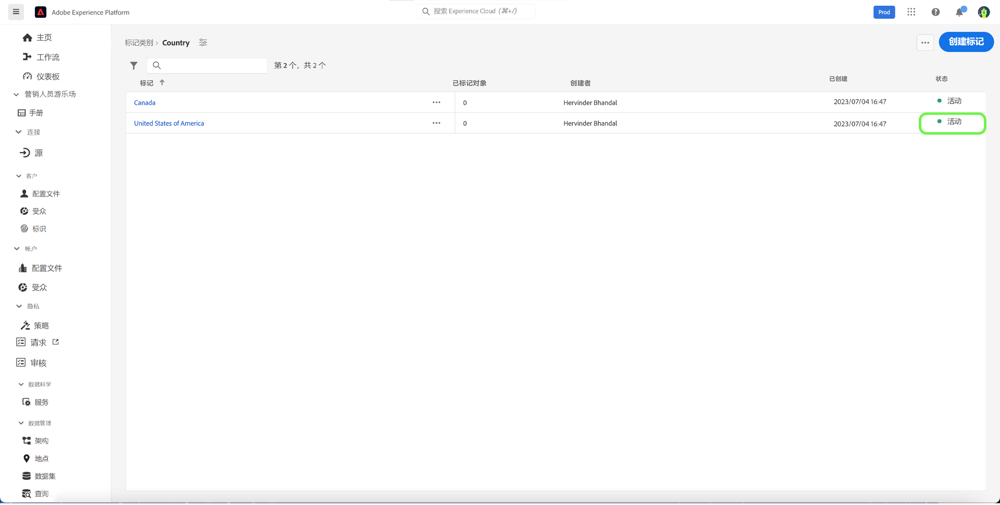

## 删除标记 {#delete-tag}

>[!NOTE]
>
>仅包含 `Archived` 状态和未与任何对象关联，则可以删除。

删除标记会将其从系统中完全删除。

要删除已存档的标记，请在标记类别列表中，选择省略号(`...`)。 下拉列表会显示用于恢复或删除标记的控件。 选择 **[!UICONTROL 删除]** 从下拉菜单中。

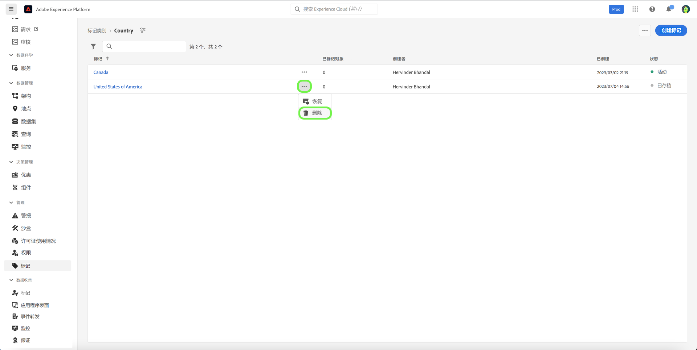

的 **[!UICONTROL 删除标记]** 对话框，提示您确认标记删除。 选择&#x200B;**[!UICONTROL 删除]**。

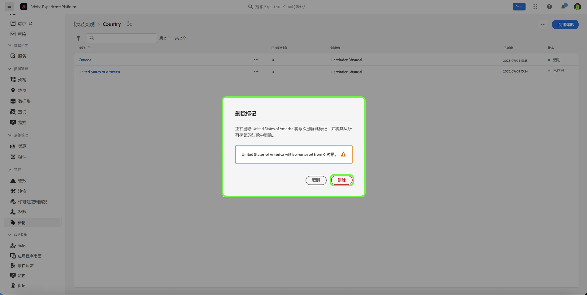

标记已成功删除，您将被重定向到标记屏幕。 标记不再显示在列表中，并且已被完全删除。

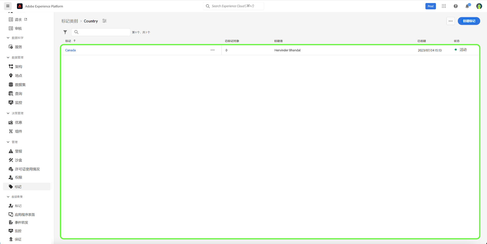

## 查看标记对象 {#view-tagged}

每个标记都有一个可从标记库存访问的详细信息页面。 本页列出了当前已应用该标记的所有对象，允许用户在单个视图中查看来自不同应用程序和功能的相关对象。

要查看标记对象列表，请在标记类别中查找标记，然后选择该标记。

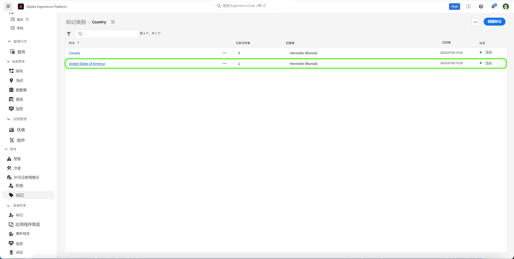

的 [!UICONTROL 标记对象] 页面，其中显示标记对象的清单。

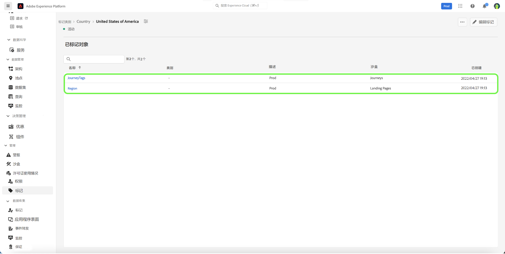

## 后续步骤

您现在已学习如何管理标记。 有关Experience Platform中标记的高级概述，请参阅 [标记概述文档](../overview.md).
