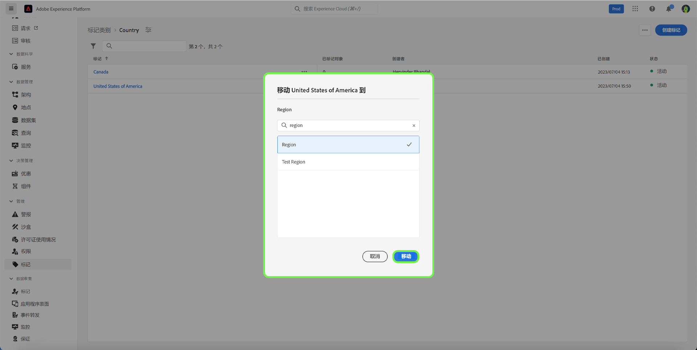

# 管理标记指南

标记允许您管理元数据分类，以便对业务对象进行分类，以便于发现和分类。 标记可帮助确定您的团队将要处理的受众的重要分类属性，以便更快地找到它们，还可以跨描述符将常见受众分组在一起。 您应该确定常见的标记类别，例如地理区域、业务单元、产品系列、项目、团队、时间范围（季度、月、年），或任何其他有助于为团队应用含义并简化受众发现过程的类别。 

## 创建标记 {#create-tag}

要创建新标记，请选择 **[!UICONTROL 标记]** 在左侧导航中，然后选择所需的标记类别。

选择 **[!UICONTROL 创建标记]** 以创建新标记。

此 **[!UICONTROL 创建标记]** 对话框，提示您输入唯一的标记名称。 完成后，选择 **[!UICONTROL 保存]**.

新标记已成功创建，并且您被重定向到“标记”屏幕，您将看到新创建的标记显示在列表中。

## 编辑标记 {#edit-tag}

当存在拼写错误、命名惯例更新或术语更新时，编辑标记会很有帮助。 编辑标记将保持标记与当前应用这些标记的任何对象的关联。

要编辑现有标记，请在标记类别列表中，选择省略号(`...`)。 下拉菜单显示用于编辑、移动或存档标记的控件。 选择 **[!UICONTROL 编辑]** 从下拉菜单中查找。

此 **[!UICONTROL 编辑标记]** 对话框，提示您编辑标记名称。 完成后，选择 **[!UICONTROL 保存]**.

标记名称更新成功，您将被重定向到标记屏幕，您将看到更新的标记显示在列表中。

## 在类别之间移动标记 {#move-tag}

标记可以移动到其他标记类别。 移动标记将保持标记与当前应用标记的任何对象的关联。

要移动现有标记，请在标记类别列表中选择省略号(`...`)。 下拉菜单显示用于编辑、移动或存档标记的控件。 选择 **[!UICONTROL 编辑]** 从下拉菜单中查找。

此 **[!UICONTROL 移动标记]** 对话框，提示您选择应将所选标记移动到其中的标记类别。

您可以滚动并从列表中进行选择，或者使用搜索功能输入类别名称。 完成后，选择 **[!UICONTROL 移动]**.

标记移动成功，您将被重定向到标记屏幕，您将在其中看到更新的标记列表，标记不再显示。

标记现在将显示在之前选定的标记类别中。

## 将标记存档 {#archive-tag}

标记的状态可在活动和存档之间切换。 存档的标记不会从已应用它们的对象中移除，但无法再应用于新对象。 对于每个标记，相同的状态会反映在所有对象中。 当您希望维护当前标记对象关联，但不希望将来使用标记时，这尤其有用。

要将现有标记存档，请在标记类别列表中，选择省略号(`...`)。 下拉菜单显示用于编辑、移动或存档标记的控件。 选择 **[!UICONTROL 存档]** 从下拉菜单中查找。

此 **[!UICONTROL 存档标记]** 对话框，提示您确认标记存档。 选择 **[!UICONTROL 存档]**.

标记已成功存档，您将被重定向到标记屏幕。 现在，您会看到更新的标记列表将标记的状态显示为 `Archived`.

## 恢复已存档的标记 {#restore-archived-tag}

如果您希望应用 `Archived` 标记到新对象，标记必须在 `Active` 省/州。 恢复已存档的标记会将标记返回到 `Active` 省/州。

要恢复已存档的标记，请在标记类别列表中选择省略号(`...`)。 下拉列表会显示要恢复或删除标记的控件。 选择 **[!UICONTROL 恢复]** 从下拉菜单中查找。

此 **[!UICONTROL 恢复标记]** 对话框出现，提示您确认标签恢复。 选择 **[!UICONTROL 恢复]**.

标记已成功恢复，您将被重定向到标记屏幕。 现在，您会看到更新的标记列表将标记的状态显示为 `Active`.

## 删除标记 {#delete-tag}

>[!NOTE]
>
>仅限位于以下位置的标记： `Archived` 状态，且未与任何对象关联，则可以删除。

删除标记会将其从系统中完全删除。

要删除已存档的标记，请在标记类别列表中，选择省略号(`...`)。 下拉列表会显示要恢复或删除标记的控件。 选择 **[!UICONTROL 删除]** 从下拉菜单中查找。

此 **[!UICONTROL 删除标记]** 对话框出现，提示您确认标记删除。 选择&#x200B;**[!UICONTROL 删除]**。

标记已成功删除，您将被重定向到标记屏幕。 标记不再出现在列表中，并且已被完全删除。

## 查看标记对象 {#view-tagged}

每个标记都有一个详细信息页面，可从标记清单访问该页面。 此页面列出了当前应用了该标记的所有对象，允许用户在单个视图中查看来自不同应用程序和功能的相关对象。

要查看标记对象列表，请在标记类别中找到该标记，然后选择该标记。

此 [!UICONTROL 已标记对象] 此时会显示页面，其中显示了已标记对象的清单。

## 后续步骤

您现在已经学会了如何管理标签。 有关Experience Platform中标记的高级概述，请参阅 [标记概述文档](../overview.md).
