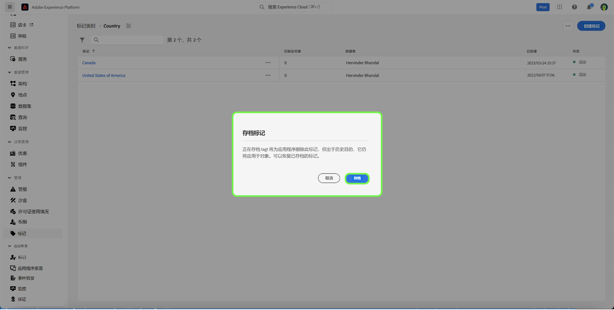

# 标记管理指南

通过标记，您可以管理元数据分类方法，以便对业务对象进行分类，从而更轻松地对其进行发现和分类。标记可以帮助您的团队识别要与之合作的受众的重要分类属性，以便更快地找到，还可以通过描述符将常见受众分组在一起。您应该确定常见的标记类别，例如地理区域、业务部门、产品线、项目、团队、时间范围（季度、月份、年）或任何其他有助于应用相关含义并能帮助团队轻松发现相关受众的类别。 

## 创建标记 {#create-tag}

要创建新的标记，请在左侧导航中选择&#x200B;**[!UICONTROL 标记]**，然后选择所需的标记类别。

选择&#x200B;**[!UICONTROL 创建标记]**，以创建一个新的标记。

**[!UICONTROL 创建标记]**&#x200B;对话框会出现，提示您输入唯一的标记名称。完成后，选择&#x200B;**[!UICONTROL 保存]**。

新的标记已成功创建，您会被重定向到标记屏幕，在那里您会看到新创建的标记显示在列表中。

## 编辑标记 {#edit-tag}

当存在拼写错误、命名惯例更新或术语更新时，编辑标记会有所帮助。编辑标记会保持标记与当前应用该标记的任何对象之间的关联。

要编辑现有标记，请在标记类别列表中，选择要编辑的标记名称旁边的省略号 (`...`)。下拉列表显示用于编辑、移动或存档标记的控件。从下拉列表中选择&#x200B;**[!UICONTROL 编辑]**。

**[!UICONTROL 编辑标记]**&#x200B;对话框会出现，提示您编辑标记名称。完成后，选择&#x200B;**[!UICONTROL 保存]**。

标记名称已成功更新，您会被重定向到标记屏幕，在那里您会看到更新的标记显示在列表中。

的标记

## 在类别之间移动标记 {#move-tag}

可以将标记移动到其他标记类别。移动标记会保持标记与当前应用该标记的任何对象之间的关联。

要移动现有标记，请在标记类别列表中，选择要移动的标记名称旁边的省略号 (`...`)。下拉列表显示用于编辑、移动或存档标记的控件。从下拉列表中选择&#x200B;**[!UICONTROL 编辑]**。

**[!UICONTROL 移动标记]**&#x200B;对话框出现，提示您选择所选标记应移动到的标记类别。

您可以滚动并从列表中进行选择，或者使用搜索功能输入类别名称。完成后，选择&#x200B;**[!UICONTROL 移动]**。

已成功移动标记，您会被重定向到标记屏幕，在那里您会看到更新的标记列表，其中该标记不再出现。

该标记现在将会显示在之前选择的标记类别中。

## 存档标记 {#archive-tag}

标记的状态可以在活动和归档之间切换。存档标记不会从已应用这些标记的对象中删除，但不能再将其应用于新对象。对于每个标记，在所有对象中都会反映相同的状态。当您希望维护当前标记和对象之间的关联，但不希望将来使用该标记时，这特别有用。

要存档现有标记，请在标记类别列表中，选择要存档的标记名称旁边的省略号 (`...`)。下拉列表显示用于编辑、移动或存档标记的控件。从下拉列表中选择&#x200B;**[!UICONTROL 存档]**。

**[!UICONTROL 存档标记]**&#x200B;对话框会出现，提示您确认将标记存档。选择&#x200B;**[!UICONTROL 存档]**。

标记已成功存档，并且您会被重定向到标记屏幕。您会看到更新后的标记列表现在将标记的状态显示为 `Archived`。

## 恢复已存档的标记 {#restore-archived-tag}

如果要将 `Archived` 标记应用于新对象，则该标记必须处于 `Active` 状态。恢复已存档的标记将会使标记返回到 `Active` 状态。

要恢复已存档的标记，请在标记类别列表中，选择要恢复的标记名称旁边的省略号 (`...`)。下拉列表显示用于恢复或删除标记的控件。从下拉列表中选择&#x200B;**[!UICONTROL 恢复]**。

**[!UICONTROL 恢复标记]**&#x200B;对话框会出现，提示您确认恢复标记。选择&#x200B;**[!UICONTROL 恢复]**。

成功恢复标记，并且您会被重定向到标记屏幕。您会看到更新后的标记列表现在将标记的状态显示为 `Active`。

## 删除标记 {#delete-tag}

>[!NOTE]
>
>只有处于 `Archived` 状态且与任何对象都没有关联的标记才能被删除。

删除标记会将其从系统中完全删除。

要删除已存档的标记，请在标记类别列表中，选择要删除的标记名称旁边的省略号 (`...`)。下拉列表显示用于恢复或删除标记的控件。从下拉列表中选择&#x200B;**[!UICONTROL 删除]**。

**[!UICONTROL 删除标记]**&#x200B;对话框会出现，提示您确认删除标记。选择&#x200B;**[!UICONTROL 删除]**。

成功删除标记，并且您会被重定向到标记屏幕。该标记不会再出现在列表中，并且已被完全删除。

## 查看标记的对象 {#view-tagged}

每个标记都有一个详细信息页面，该页面可以从标记清单中访问。此页面列出了当前应用了该标记的所有对象，以便用户在单个视图中查看来自不同应用程序和功能的相关对象。

要查看标记的对象列表，请在标记类别中找到该标记，然后选中它。

[!UICONTROL 标记对象]页面出现，显示标记对象的清单。

## 后续步骤

您现在已经学会了如何管理标记。有关 Experience Platform 中标记的大致概述，请参阅[标记概述文档](../overview.md)。
