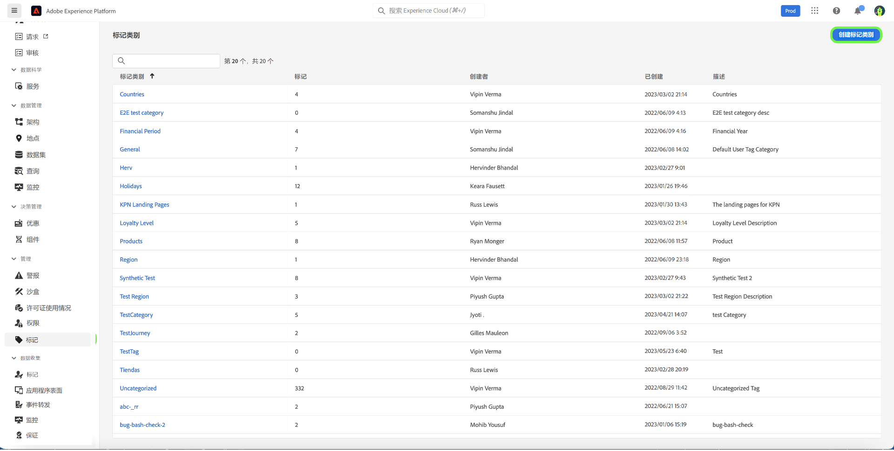
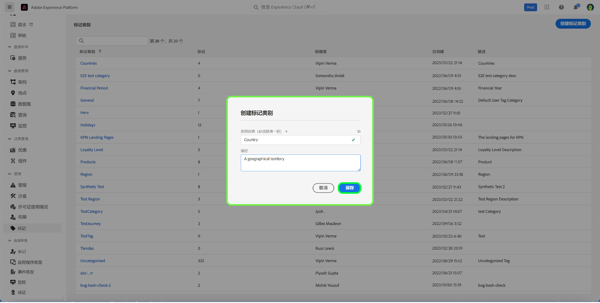
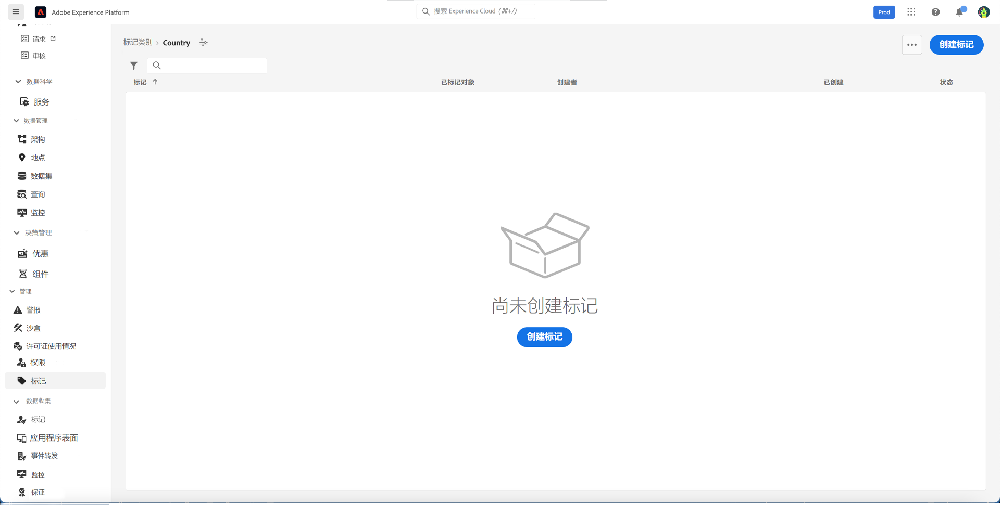
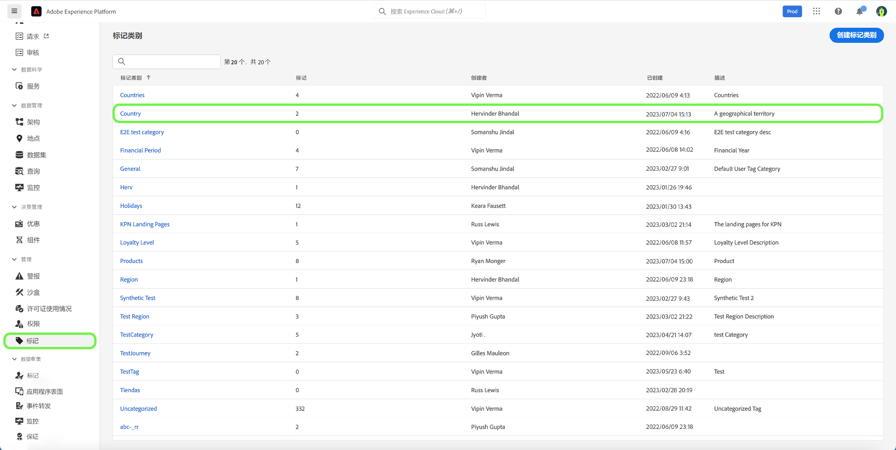
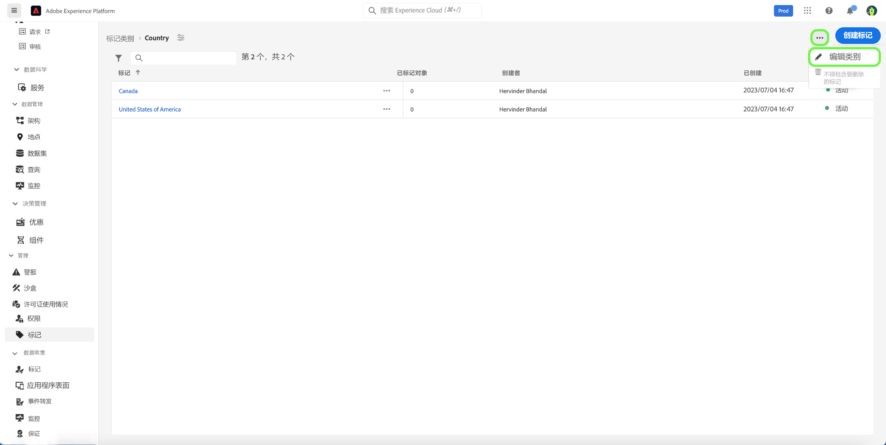
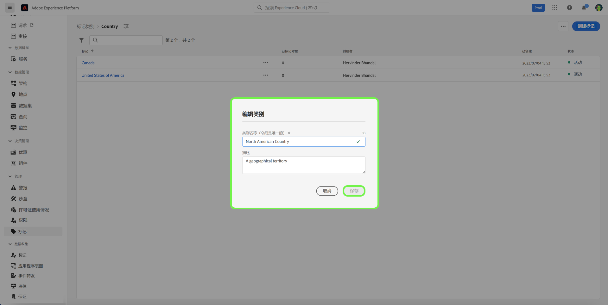
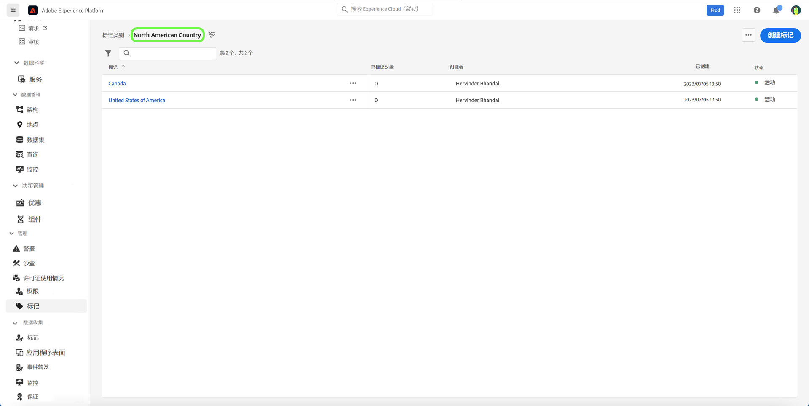
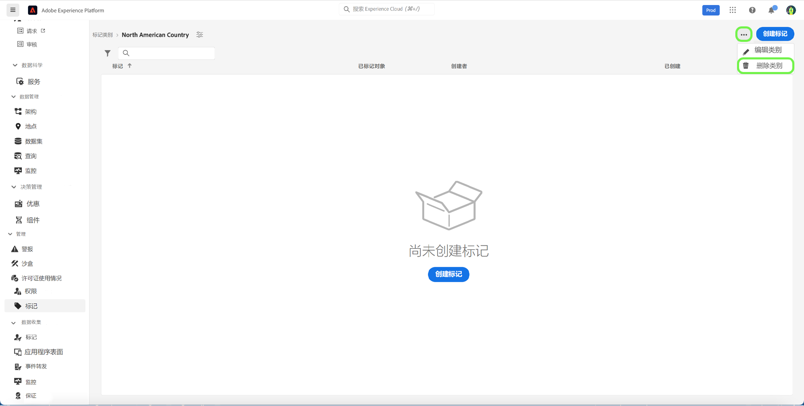

# 标记类别指南

标记类别将标记分组为有意义的集，以提供更多上下文并更好地阐明标记的用途。 任何具有类别的标记的标记名称前面都将加上类别名称，然后是冒号。

## 创建标记类别 {#create-tag-category}

要创建新类别，请选择 **[!UICONTROL 标记]** 在左侧导航中，选择 [!UICONTROL 创建标记类别].

的 **[!UICONTROL 创建标记类别]** 对话框，提示您输入唯一的类别名称和可选描述。 完成后，选择 **[!UICONTROL 保存]**.

新标记类别已成功创建，您将被重定向到标记创建页面，您可以在该页面中分配新标记。 有关创建标记的更多信息，请参阅 [管理标记](./managing-tags.md#create-a-tag-create-tag) 文档。

## 编辑标记类别 {#edit-tag-category}

>[!NOTE]
>
>编辑或重命名标记类别会维护标记与当前应用标记的任何对象的关联。

要编辑标记类别，请选择 **[!UICONTROL 标记]** 在左侧导航中，选择要编辑的标记类别。

在标记类别中，选择省略号(`...`)旁边 [!UICONTROL 创建标记]. 下拉列表显示用于编辑类别或删除的控件，请选择 **[!UICONTROL 编辑类别]**.

的 **[!UICONTROL 编辑类别]** 对话框，提示您更新类别名称和可选描述。 完成后，选择 **[!UICONTROL 保存]**.

标记类别已成功更新，您将被重定向到标记类别。

## 删除标记类别 {#delete-tag-category}

>[!NOTE]
>
>在可以删除标记类别之前，该类别必须为空且没有标记。

要删除标记类别，请选择 **[!UICONTROL 标记]** 在左侧导航中，选择要删除的标记类别。

在标记类别中，选择省略号(`...`)旁边 [!UICONTROL 创建标记]. 下拉列表显示用于编辑类别或删除的控件，请选择 **[!UICONTROL 删除类别]**.

的 **[!UICONTROL 删除类别]** ，提示您确认删除标记类别。 选择 **[!UICONTROL 删除]** 确认。

已成功删除标记类别，并且您将被重定向到标记类别库存页面。 标记类别不再显示在列表中，并且已被完全删除。

## 后续步骤

您现在已学习如何管理标记类别。 您可以继续执行下一步： [管理标记](./managing-tags.md).
