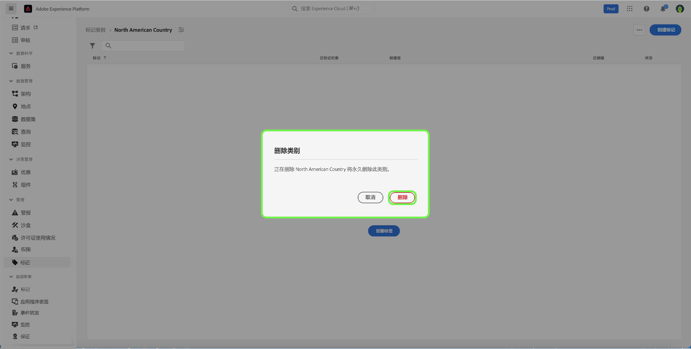

# 标记类别指南

标记类别可将标记分组为有意义的集，以提供更多上下文并更好地阐明标记的用途。 任何具有类别的标记都会在标记名称之前添加类别名称，然后添加一个冒号。

## 创建标记类别 {#create-tag-category}

要创建新类别，请选择 **[!UICONTROL 标记]** 在左侧导航中，然后选择 [!UICONTROL 创建标记类别].

此 **[!UICONTROL 创建标记类别]** 对话框，提示您输入唯一的类别名称和可选说明。 完成后，选择 **[!UICONTROL 保存]**.

新标记类别已成功创建，并且您被重定向到标记创建页面，您可以在其中分配新标记。 有关创建标记的更多信息，请参阅 [管理标记](./managing-tags.md#create-a-tag-create-tag) 文档。

## 编辑标记类别 {#edit-tag-category}

>[!NOTE]
>
>编辑或重命名标记类别可保持标记与当前应用这些标记的任何对象的关联。

要编辑标记类别，请选择 **[!UICONTROL 标记]** 在左侧导航中，选择要编辑的标记类别。

在标记类别中，选择省略号(`...`)旁边的 [!UICONTROL 创建标记]. 下拉菜单显示用于编辑类别或删除的控件，请选择 **[!UICONTROL 编辑类别]**.

此 **[!UICONTROL 编辑类别]** 对话框，提示您更新类别名称和可选说明。 完成后，选择 **[!UICONTROL 保存]**.

标记类别已成功更新，您将被重定向到标记类别。

## 删除标记类别 {#delete-tag-category}

>[!NOTE]
>
>在可以删除标记类别之前，该类别必须为空，并且不含标记。

要删除标记类别，请选择 **[!UICONTROL 标记]** 在左侧导航中，选择要删除的标记类别。

在标记类别中，选择省略号(`...`)旁边的 [!UICONTROL 创建标记]. 下拉菜单显示用于编辑类别或删除的控件，请选择 **[!UICONTROL 删除类别]**.

此 **[!UICONTROL 删除类别]** 对话框，提示您确认删除标记类别。 选择 **[!UICONTROL 删除]** 以确认。

标记类别已成功删除，您将被重定向到标记类别清单页面。 标记类别不再出现在列表中，并且已被完全删除。

## 后续步骤

您现在已了解如何管理标记类别。 您可以继续下一步以 [管理标记](./managing-tags.md).
