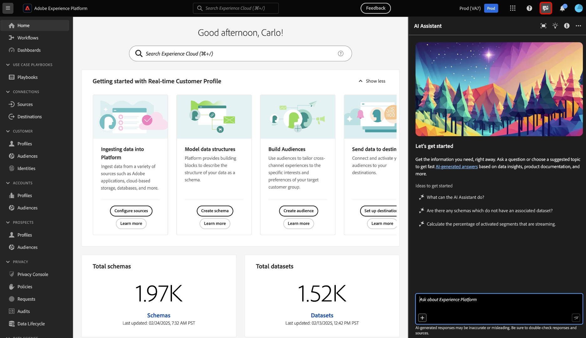

# 访问Experience Platform中的AI助手

您可以在Adobe Experience Cloud中的多个应用程序中访问AI Assistant。

>[!IMPORTANT]
>
>如果您在权限UI中收到弹出消息，通知您组织必须首先同意其他法律条款才能访问AI助手，请联系您的Adobe客户团队以获得这些条款的指导。

## 快速入门 {#get-started}

在访问AI Assistant之前，必须完成两个先决步骤。

1. 贵组织必须首先同意法律条款。 有关更多信息，请与您的Adobe客户团队联系。
2. 管理员必须向您授予访问AI助手所需的足够权限。

如果您没有完成这两个先决条件步骤中的任何一个，则当您在Experience Platform UI中选择AI助手聊天图标时，将会看到以下消息。

>[!BEGINTABS]

>[!TAB 您的组织无法使用AI助手]

如果您使用的组织在法律上无权使用AI助手，您将看到以下消息。 在这种情况下，您必须联系Adobe客户团队以解决访问权限问题。

>[!TAB 您没有正确的权限]

如果贵组织在法律上符合使用AI助手的条件，但仍无法访问该功能，则您将在Experience Platform UI上看到以下消息。 这种情况意味着您没有足够的权限访问该功能，因此必须联系管理员以解决权限问题。

>[!ENDTABS]

## 访问AI助手 {#get-access-to-ai-assistant}

对AI Assistant的访问受以下参数控制：

* **访问应用程序：**&#x200B;您可以在Adobe Experience Platform、Adobe Real-Time CDP、Adobe Journey Optimizer和[Customer Journey Analytics](https://experienceleague.adobe.com/zh-hans/docs/analytics-platform/using/ai-assistant)中访问AI助手。
<!-- * **Contractual access:** Your company must agree to certain [!DNL GenAI]-related legal terms before your organization can use AI Assistant. Contact your organization's administrator or your Adobe Account Team if you are not able to access AI Assistant.  -->
* **权限：**&#x200B;使用[权限UI](../access-control/abac/ui/permissions.md)授予或撤消对您组织中的AI助理的访问权限。 要使用AI助手，给定用户必须属于配置了&#x200B;**启用AI助手**&#x200B;和&#x200B;**查看操作分析**&#x200B;权限的角色。
   * 作为管理员，您可以将&#x200B;**启用AI助手**&#x200B;添加到给定角色，并将用户添加到该角色，以允许他们访问您组织中的AI助手。 **注意**：此权限允许所述用户访问AI助手，但不会授予他们任何管理能力，因此不会授予其他人访问AI助手的权利。
   * 作为管理员，您可以将&#x200B;**查看操作分析**&#x200B;添加到给定角色，并将用户添加到该角色，以便他们能够使用AI助手的操作分析功能。

使用[权限UI](../access-control/abac/ui/roles.md)授予在Experience Platform和Journey Optimizer中使用AI助理的权限。 有关如何在Customer Journey Analytics中访问AI助手的信息。 阅读[Customer Journey Analytics](https://experienceleague.adobe.com/zh-hans/docs/analytics-platform/using/ai-assistant)中的文档。

获得必要权限后，您可以通过选择正在使用的应用程序顶部标题上的AI助手图标来访问AI助手。

观看以下视频，了解如何为组织和用户配置对AI Assistant的访问权限。

>[!VIDEO](https://video.tv.adobe.com/v/3475929/?captions=chi_hans&learn=on)

## 后续步骤

完成AI助手访问后，您可以在工作流中继续使用该功能，阅读[AI助手UI指南](./ui-guide.md)以了解更多信息。
