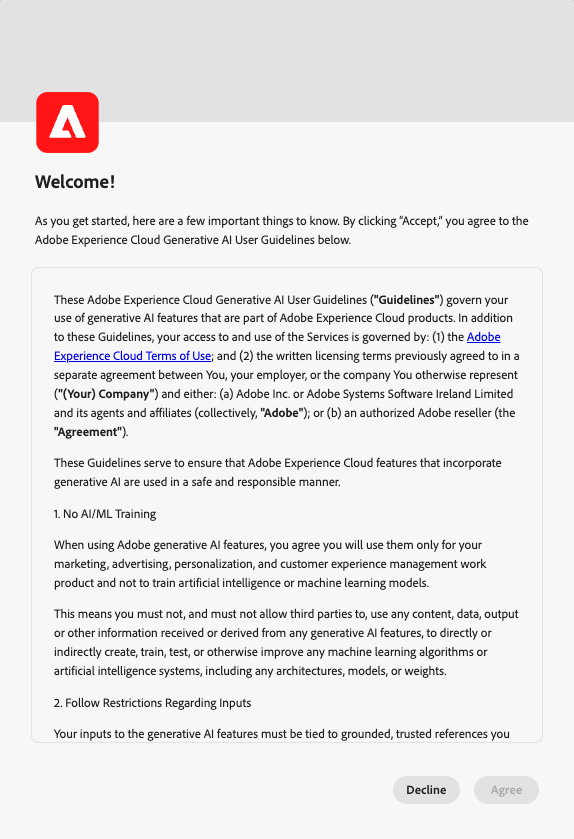

# Adobe Experience Platform的人工智能助手

请阅读本文档，了解Adobe Experience Platform中的AI助手。

Adobe Experience Platform中的AI助手是一种对话体验，可用于加快Adobe应用程序中的工作流程。 您可以使用AI Assistant更好地了解产品知识、排除问题或搜索信息并查找运营见解。 AI Assistant支持Experience Platform、Real-time Customer Data Platform、Adobe Journey Optimizer和Customer Journey Analytics。

>[!IMPORTANT]
>
>在使用AI Assistant之前，您必须同意用户协议。 用户协议还包含公共测试版协议。 这样一来，您便可以在以Beta版容量推出其他AI Assistant功能时使用。

+++选择以查看用户协议界面

+++

## 了解AI助手 {#understanding-ai-assistant}

AI Assistant通过查询数据库，然后将数据库中的数据转换为人类可读的答案来响应您提交的问题。

这种底层数据的内部表示形式也称为 **[!DNL Knowledge Graph]**  — 一个包含给定答案的概念、数据和元数据的综合网络。

此 [!DNL Knowledge Graph] 由提交查询时引用的子图组成：

* 客户运营洞察。
* 跨各种元存储区的客户运营洞察。
* 文档Experience League。

在查询AI Assistant之前，需要考虑两类问题：

### 产品知识 {#product-knowledge}

产品知识是指以Experience League文档为基础的概念和主题。 产品知识问题可进一步细分为以下子组：

| 产品知识 | 示例 |
| --- | --- |
| 点式学习 | <ul><li>标识与主键或外键之间有何区别？</li><li>如何计算配置文件丰富度？</li></ul> |
| 打开发现 | <ul><li>如何导出此数据集？</li><li>是否有适用于医疗保健客户的架构？</li></ul> |
| 故障排除 | <ul><li>为何我无法打开Adobe拥有的架构以访问配置文件？</li><li>为什么无法删除区段？</li></ul> |

{style="table-layout:auto"}

### 运营见解 {#operational-insights}

>[!IMPORTANT]
>
>操作见解答案为测试版。 任何有权访问 **查看运营分析** 权限将有权访问操作见解答案。

操作分析是指回答AI Assistant生成的有关元数据对象（属性、受众、数据流、数据集、目标、历程、架构和源）的答案，包括计数、查找和谱系影响。 它不会查看沙盒中的任何数据。

* 我有多少个数据集？
* 有多少架构属性从未使用过？
* 已激活哪些受众？

您可以在以下域中向AI Assistant询问有关您的操作见解的问题：

* 属性
* 受众
* 数据流
* 数据集
* 目标 _（有关帐户的问题和有关数据流的某些问题此时无法回答。）_
* 历程
* 架构 _（有关字段组的问题目前无法回答。）_
* 源 _（有关帐户的问题目前无法回答。）_

对于操作分析问题，答案可能不会反映UI的当前状态。 支持这些问题的数据每24小时更新一次。 例如，用户白天在Real-Time CDP中所做的更改会在晚上与数据存储同步，然后早上就可供用户提问了。 您需要登录沙盒以查询与对象相关的特定数据。

### 功能范围 {#feature-scope}

目前，人工智能助理的范围如下：

* [产品知识](./home.md#product-knowledge)：AI助手可以回答Experience Platform、Real-time Customer Data Platform和Adobe Journey Optimizer的产品知识问题。 您也可以深入探讨Customer Journey Analytics的产品知识主题，但只能通过Customer Journey AnalyticsUI进行探讨。
* [运营见解](./home.md#operational-insights)：您可以向AI助手询问有关以下数据对象的操作见解的问题：属性、受众、数据流、数据集、目标、历程、架构和源。

## 后续步骤

现在您已大致了解AI助手，接下来可以在工作流中继续使用AI助手。 有关更多信息，请参阅以下文档：

* [AI助手UI指南](./ui-guide.md)
* [功能访问](./access.md)
* [问题指南](./questions.md)
* [AI助手中的隐私、安全和管理](./privacy.md)
* [常见问题解答](./faq.md)
