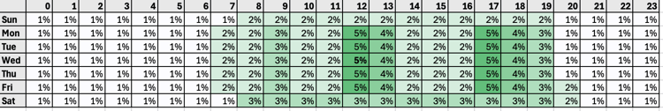

# 发送时间优化模型详细信息

## 模型概述 {#model-overview}

* **模型名称和版本**：发送时间优化
* **模型发布日期**：2024年9月
* **模型目的**：Adobe Journey Optimizer的发送时间优化模型会根据消费者的历史打开和点击行为，选择最佳的电子邮件和推送消息发送时间，以最大化消费者的参与度。
* **目标用户**：此模型的主要用户是营销专业人员、产品经理和客户参与团队，他们利用Adobe Journey Optimizer推动数据驱动型营销策略。
* **用例**：发送时间优化最适合用于不太紧急的营销通信 — 例如，每周广告、新产品的促销信息或为期一个月的销售信息。 发送时间优化仅适用于Journey Optimizer的内置电子邮件和推送操作类型，当前不适用于通过自定义操作发送的消息或其他操作类型。
* **可能误用**：发送时间优化不应用于紧急的、对时间敏感的运营消息，例如订单确认、密码重置通知或航班登机口更改通知。

## 模型详细信息 {#model-details}

* **模型类型**：发送时间优化模型摄取您组织的Adobe Journey Optimizer消费者行为数据，并查看用户级别的打开和点击事件，以预测消费者何时最有可能参与您的消息传递。 使用[!DNL Bayesian]估算器对一周中每个小时的消费者级别打开和单击行为进行加权，并将其与相似人群和整体消费者行为相结合。 然后，对一周中每个小时的[!DNL Bayesian]预测进行排名，为每个客户生成每个量度（电子邮件打开次数、电子邮件点击次数和推送打开次数）的“热图”，以预测在一周中联系每个消费者最有可能且最不可能导致所需参与结果的小时数。
* **输入**：发送时间优化使用[!UICONTROL 首选项详细信息]字段组内`timeZone`字段中的消费者时区数据（如果提供）来确定消费者的时区。 如果`timeZone`字段中未提供消费者的时区，则发送时间优化会尝试根据与使用[邮政地址数据类型](../../xdm/data-types/postal-address.md)存储在消费者个人资料中的第一个邮政地址最常见的时区匹配来推断消费者的时区。 发送时间优化根据三种类型的行为数据对每个消费者进行预测：
   * 消费者的整体打开和点击行为。
   * 相同时区中相似使用者的打开和单击行为。
   * 该单个用户的打开和单击行为。
* **输出**：使用[!DNL Bayesian]方法对这些预测进行加权和组合，从而为每个客户生成每个量度（电子邮件打开次数、电子邮件点击次数和推送打开次数）的“热图”，该热图指示联系该客户时在一周中的哪个小时最有可能获得所需的参与结果（打开/单击），如下例热图所示：

* **示例输入和输出**：为了将模型对于配置文件丰富度的影响降至最低，模型分数将存储在`_experience.intelligentServices.journeyAI.sendTimeOptimization`中的三个配置文件属性中并压缩为可读取的变量。

## 模型训练 {#model-training}

* **训练数据和预处理**：每个组织的训练数据集仅源自其在Adobe Experience Platform中的数据。
   * 为您的组织启用发送时间优化功能后，将针对过去16周内贵组织的所有历程和操作（无论这些操作是否使用发送时间优化）中的电子邮件和推送、发送、打开和单击事件对模型进行训练。 这允许发送时间优化从消费者生成的所有数据中受益。
   * 最初对模型进行培训，每周对模型进行评分。 16周后，模型将重新训练并每月重新整理。 模型评分包括自上次评分运行以来的所有客户个人资料 — 现有和新。
   * 由发送时间优化发送的消息将收到以下任一内容：
      * “探索”消息的发送时间，选择它来测试不同的发送时间并观察消费者如何响应。
      * “优化的”消息发送时间，选择该时间可最大化点击/打开率。 5%的发送事件会收到“探索”发送时间，95%的发送事件处于“优化”状态。
   * 探测发送时间是从由您配置的最大等待时间提供的发送时间中随机选择的。 例如，如果消息选择时间为星期三上午9点，且发送时间优化功能处于打开状态，且最长等待时间为3小时，则消息的探索发送时间将平均分摊为上午9点、上午10点、上午11点到下午12点。

## 模型评估 {#model-evaluation}

* **模型评估**：发送时间优化可能会将组织优化的所有邮件的电子邮件点击率和推送打开率提高约2%到10%。
   * 例如，如果某个组织发送电子邮件时未优化发送时间，其平均点击率为5.0%，则优化发送时间的同一组电子邮件平均可能会产生高达5.5%的点击率(5.0% * (1+10%) = 5.5%)。
   * 由于样本量小，发送时间优化带来的益处可能不会在单个消息发送上观察到。
   * 在以下情况下，组织更有可能从使用发送时间优化中获得更大的好处：
      * 现有历程使用的发送时间是固定的，并且未得到良好优化；
      * 消费者行为的可变性（点击数和打开数）与消费者所在位置和消费者偏好相对应；
      * 组织对大部分电子邮件和推送消息使用发送时间优化；
      * 组织选择建议的6-12小时范围内的最长等待时间。

## 模型部署 {#model-deployment}

* **模型更新**：模型最初是按周进行训练和评分的。 16周后，模型将重新训练并每月重新整理。 模型评分包括所有消费者配置文件 — 自上次评分运行以来现有的和新的。

## 公平和偏见 {#fairness-and-bias}

* **模型公平性**：不正确推断使用者的时区可能导致发送消息的时间早于给定使用者的最佳时间或晚于给定使用者的最佳时间。 但是，使用发送时间优化的通信中的所有消费者最终都将收到消息并有机会与消息交互。 此外，该模型不使用消费者人口统计数据或人口统计数据的代理 — 仅使用消费者行为和消费者时区数据。 因此，对公平的关注是有限的，并得到缓解的。
* **数据偏差**：不正确推断使用者的时区，可能会导致发送消息的时间早于给定使用者的最佳时间或晚于给定使用者的最佳时间。 但是，使用发送时间优化的通信中的所有消费者最终都将收到消息并有机会与消息交互。 此外，该模型不使用消费者人口统计数据或人口统计数据的代理 — 仅使用消费者行为和消费者时区数据。 因此，偏见问题得到限制和缓解。

## 稳健性 {#robustness}

* **模型稳健性**：没有足够交互事件数据的用户档案（通常针对新用户档案）将收到立即发送时间、选定窗口中的探索发送时间或基于所有客户的最长发送时间的发送时间。

## 道德注意事项 {#ethical-considerations}

* **与模型**&#x200B;相关的道德考量：对消费者时区的不正确推断可能导致发送消息的时间早于给定消费者的最佳时间或晚于给定消费者的最佳时间。 但是，使用发送时间优化的通信中的所有消费者最终都将收到消息并有机会与消息交互。 此外，该模型不使用消费者人口统计数据或人口统计数据的代理 — 仅使用消费者行为和消费者时区数据。 因此，道德关切是有限的，并得到缓解。