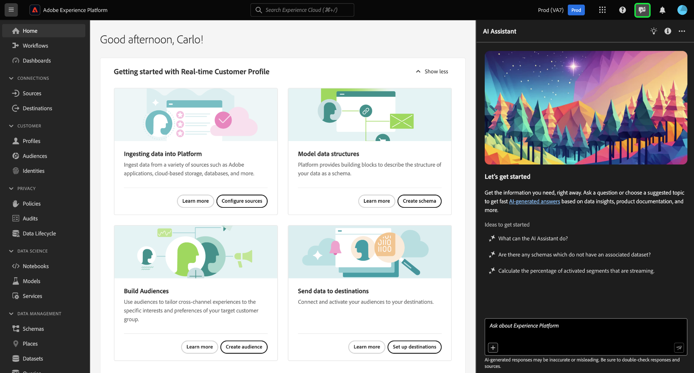
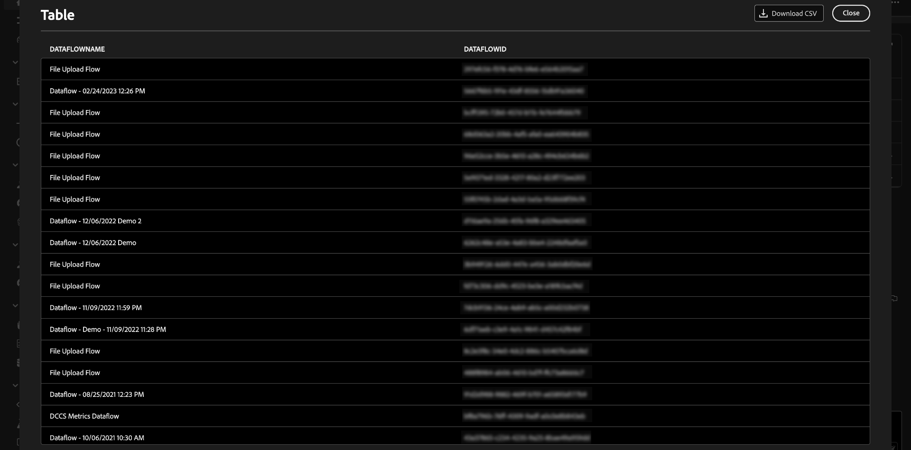
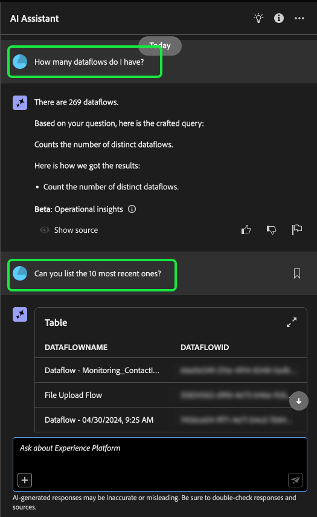
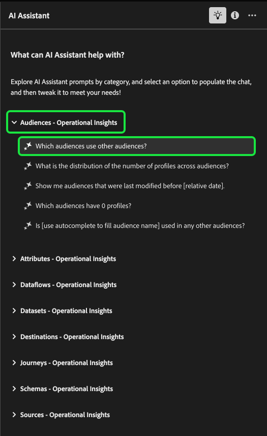

# AI助手UI指南

阅读本指南，了解如何在Adobe Experience Platform UI中使用AI助手。

## 在Experience Platform UI中访问AI助手

要启动AI助手，请从Experience Platform UI的顶部标题中选择&#x200B;**[!UICONTROL AI助手图标]**。

此时将显示AI Assistant界面，它立即为您提供开始使用的信息。 您可以使用[!UICONTROL 想法下提供的选项来开始]，回答以下问题和命令：

* [!UICONTROL 我激活了哪些受众？]
* [!UICONTROL 什么是架构？]
* [!UICONTROL 告诉我一些Real-Time CDP的常见用例]

## AI助手UI指南

>[!NOTE]
>
>以下工作流是一个示例，它使用Experience Event架构创建过程来说明如何在使用Experience Platform UI时使用AI Assistant。

考虑您在事件架构&#x200B;**中创建**&#x200B;设备交易的用例。 在体验事件架构创建过程中，您遇到了`eventType`字段。 “此时，您可以选择退出工作流并参阅[架构组合基础知识](../xdm/schema/composition.md)文档，也可以使用AI助手检索问题的答案并通过AI助手推荐的文档链接查找其他资源。”

首先，在提供的文本框中输入您的问题。 在下面的示例中，AI助手遇到以下问题：“**ExperienceEvent架构中的eventType字段是什么？**”

然后，AI Assistant查询其知识库并计算答案。 片刻后，AI助手会返回一个答案和相关建议，您可以将其用作跟进提示。

从AI助手收到响应后，您可以从多个选项中进行选择，以确定如何继续。

### AI Assistant功能 {#features}

此部分概述可在Experience Platform上的工作流中使用的AI助手的各种功能。

### 查看操作数据对象 {#view-operational-data-objects}

根据您的查询，AI Assistant会提供有关沙盒中数据的其他信息。 要查看查询的响应如何应用于您的特定沙盒，请选择&#x200B;**[!UICONTROL 在沙盒中]。**

在查看与沙盒相关的数据时，AI Assistant可能会提供显示查询数据的特定UI页面的直接链接。

+++选择以查看示例

在此示例中，AI Assistant返回有关沙盒中现有XDM架构的其他信息，包括它们的总计数和五个最常用的字段。

+++

### 查看引文 {#view-citations}

您可以通过查看每个产品知识答案中可用的引文来验证AI助手返回给您的响应。

+++选择以查看如何显示源的示例

要查看引文并验证AI助理的响应，请选择&#x200B;**[!UICONTROL 显示源]**。

AI Assistant会更新界面，并为您提供可证实初始响应的文档的链接。 此外，启用引用后，AI Assistant将更新响应以包含脚注，以指示引用所提供文档的答案的特定部分。

+++

### 运营洞察 {#operational-insights}

您必须在活动的沙盒中，以便AI Assistant能够充分响应有关您的操作见解的问题。

+++选择以查看操作分析问题的示例

在以下示例中，AI助手被询问以下查询： **“显示使用Amazon S3源创建的数据流”**。

然后，AI Assistant会使用一个表进行响应，该表列出了您的数据流及其对应的ID。 选择下载图标（）以将表下载为CSV文件。 要查看整个表，请选择展开图标（）。

此时将显示表的展开视图，其中会根据查询参数为您提供更加全面的数据流列表。

当出现操作见解问题提示时，AI Assistant会提供有关如何计算答案的解释。 在以下示例中，AI Assistant概述了为识别使用[!DNL Amazon S3]源创建的数据流而采取的步骤。

您还可以提供筛选器和修改问题，并可以指示AI助手根据您包括的筛选器呈现其结果。 例如，您可以要求AI Assistant按区段定义的创建日期顺序显示区段定义计数的趋势，删除总配置文件为零的区段定义，并在显示数据时使用月名称而不是整数。

+++

### 验证运行分析响应 {#verify-responses}

您可以使用AI Assistant提供的SQL查询验证与操作分析问题相关的每个响应。

+++选择以查看验证运营分析响应的示例

收到操作分析问题的答案后，选择&#x200B;**[!UICONTROL 显示源]**，然后选择&#x200B;**[!UICONTROL 查看源查询]**。

当询问操作分析问题时，AI Assistant会提供一个SQL查询，您可以使用它来验证计算其答案所花费的过程。 此源查询仅用于验证目的，在查询服务上不受支持。

+++

### 使用实体自动完成 {#use-entity-auto-complete}

您可以使用自动完成函数接收沙盒中存在的数据对象列表。 自动完成推荐适用于以下域：受众、架构、数据集、历程、源和目标。

+++选择以查看自动完成的示例

您可以在查询中包含加号(**`+`**)以使用自动完成。 或者，您也可以选择位于文本输入框底部的加号(**`+`**)。 此时将显示一个窗口，其中包含来自沙盒的推荐数据对象列表。

+++

### 使用多圈 {#use-multi-turn}

您可以使用AI助手的多轮功能在体验期间进行更自然的对话。 给定情况下，AI助手能够回答后续问题。 该上下文可从较早的交互推断。

+++选择以查看多圈示例

在下面的示例中，首先要求AI助手提供数据流的总数，然后要求列出最近的10个数据流。

+++

### 开始新对话

您可以通过重置和启动新对话来更改AI助手的主题。

+++选择以查看重置对话的示例

要重置，请选择AI助手界面上的省略号(**`...`**)，然后选择&#x200B;**[!UICONTROL 开始新对话]**。 这会告知AI助手，您打算更改主题，在对失败或引用不正确信息的查询进行故障诊断时尤其有用。

+++

### 使用可发现性 {#use-discoverability}

您可以使用AI Assistant的可发现性功能查看AI Assistant支持的常规主体（分组为实体）列表。

+++选择以查看可发现性的示例

要查看可发现性，请选择AI Assistant界面顶部标题上的灯泡图标。

接下来，选择一个类别，然后从提供的列表中选择一个提示。 您可以使用此功能更好地了解AI助手可以回答的问题类型。 您还可以使用自由文本或[自动完成](#use-auto-complete)，用与沙盒相关的特定详细信息更新预先存在的提示。

+++

### 使用问题自动完成 {#use-question-autocomplete}

您可以使用AI Assistant的问题自动完成功能从AI Assistant的推荐列表中选择问题。

+++选择以查看问题自动完成的示例

要查看建议问题面板，请在输入框中至少键入七(7)个字符。 接下来，从出现的菜单中选择与您相关的问题。

在某些建议的问题涉及操作见解的情况下，您可能需要更新占位符。 例如，如果AI助手提供的建议包含占位符，则您可能需要添加数据集或受众的特定名称。

占位符以蓝色突出显示。 选择占位符以开始更新其值。 要获得数字占位符的最佳效果，请确保使用数字而不是文本。 也可以使用图元自动完成功能来更新占位符值。 您无法发送具有未填充占位符的问题。

**注意**：默认情况下启用建议。 选择&#x200B;**[!UICONTROL 建议想法]**&#x200B;切换开关以禁用该功能。

+++

### 使用相关建议 {#use-related-suggestions}

您可以使用每个AI助手响应的相关建议部分来继续您的对话。

+++选择以查看相关建议的示例

AI助手每次响应时都会返回相关建议。 若要继续对话，请在相关建议部分中选择任意建议。

与相关占位符自动完成类似，在提交查询之前，您需要更新相关建议中包含的占位符。

+++

## 提供反馈 {#feedback}

您可以使用应答中提供的选项针对AI助手体验提供反馈。

要提供反馈，请在从AI助手收到响应后选择向上拇指、向下拇指或标记，然后在提供的文本框中输入反馈。

+++选择以查看更多示例

>[!BEGINTABS]

>[!TAB 竖起缩略图]

选择竖起大拇指图标可就您在AI助手方面的体验提出反馈。

>[!TAB 拇指朝下]

选择向下拇指图标，根据您使用AI助手时的经验提供可改进内容的反馈。 在此步骤中，您还可以提供关于您的体验的特定注释。 评论中提供的反馈每天进行审核。

>[!TAB 标志]

选择标志图标以提供关于您使用AI助手体验的进一步报告。

>[!ENDTABS]

+++
