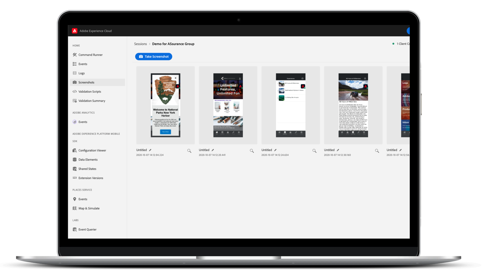

# Adobe Experience Platform Assurance

Adobe Experience Platform Assurance 是 [Adobe Experience Cloud](https://www.adobe.com/experience-cloud.html) 的产品，可帮助您检查、校对、模拟和验证如何在移动应用程序中收集数据或提供体验。

>[!IMPORTANT]
>
> Project Griffon 现在被称为&#x200B;**Assurance！**
>
> Project Griffon 现在作为 Assurance 可供&#x200B;**所有** Adobe Experience Cloud 客户使用。要详细了解此过渡，请阅读[用户访问指南](./user-access.md)。

>[!INFO]
>
>Assurance Public API 可供使用！
>
>[Assurance API](https://developer.adobe.com/adobe-assurance-public-apis/) 是 API 的收藏集，当用户配备 Adobe Assurance Mobile SDK 时，它们使用户能够测试和调试 Web 和移动应用程序。

## 正式发布

从 2022 年 10 月 15 日开始，Assurance 可供所有 Adobe Experience Cloud 使用。

### 有什么变化？

10 月 15 日 - 将通过 Admin Console 管理对 Assurance 的访问。请阅读[用户访问指南](./user-access.md)，确保您能够继续不间断地访问。

预计现有的 Assurance 集成、会话和事件不会发生其他变化或中断。Assurance 可以通过 [https://griffon.adobe.com](https://griffon.adobe.com) **或继续访问，或者**&#x200B;您可以使用（和书签）[https://experience.adobe.com/assurance](https://experience.adobe.com/assurance)。

## Assurance 能为您做什么？

### 快速设置

只需几行代码即可快速开始。对于移动应用程序，Assurance 可与 Adobe Experience Platform Mobile SDK 配合使用，帮助您检查、模拟和验证应用程序事件、位置信号、配置参数、SDK 日志、设备信息等。

### 无障碍连接

使用Assurance，可以将您的应用程序与Experience Platform轻松可靠地连接。 您不需要使用网络代理 ([MiTM](https://en.wikipedia.org/wiki/Man-in-the-middle_attack)) 和其他网络 - 将您的应用程序连接到 Assurance 就像扫描二维码或点击按钮一样简单。

### 实时检查、模拟和验证

连接到 Assurance 后，您可以检查实时流式传输的应用程序事件和活动，并进行过滤和搜索以消除噪音。事件包含有关验证、调试和排除移动应用程序实施故障的详细信息。Assurance 还可以让您实时截屏、模拟位置信号等。

### 与 Adobe Experience Cloud 的集成

用户如何在我们以营销人员为中心的用户界面上设置报告规则、活动和营销活动，从而为客户端数据和体验提供了背景。为了帮助您理解这两者之间的联系，我们正在与 Adobe Experience Cloud 解决方案集成，例如 Adobe Experience Platform、Adobe Analytics、Adobe Target、Places Service 等。

## 功能

### Adobe Experience Platform Mobile SDK 事件、日志等

Assurance 可帮助您检查 Adobe Experience Platform Mobile SDK 生成的原始 SDK 事件。SDK 收集的所有事件都可供检查。SDK 事件加载在列表视图中，按时间排序。每个事件都有一个详细视图，可提供更多详细信息。还提供了用于浏览 SDK 配置、数据元素、共享状态和 SDK 扩展版本的其他视图。

### Adobe Analytics

Adobe Analytics > Analytics 事件视图是一个聚焦视图，其中显示与 Adobe Analytics 移动实施相关的事件。列表视图以特殊格式化的视图显示生命周期或操作/状态事件、后处理的“状态”以及所需的事件详细信息。 后处理状态显示在对事件应用处理规则后 Adobe Analytics 如何处理该事件。

### 适用于流媒体的 Adobe Analytics

Adobe Analytics > Media Analytics 事件视图显示音频和视频分析实施的事件。事件详细信息视图显示为每个播放会话跟踪的标准和自定义元数据。此外，您还可以查看后处理状态和后处理媒体分析数据，例如花费的媒体时间或总缓冲持续时间。

### 地点（位置服务）

位置服务视图是设备上的视图，其中显示用户位置进入和退出事件，以便于验证。这个实用的视图提供了一个可查看特定于位置的数据点的方便界面，以便在客户端上进行检查，从而进行上下文调试。

## Assurance 安全吗？

Assurance 采取了以下安全措施：

* Assurance 和 Assurance Web UI 都具有用于连接的基于 PIN 的安全握手功能。用户必须明确地创建握手功能，以防止最终用户创建“意外”的 Assurance 连接。
* 仅支持 Assurance 与属于同一 Adobe Experience Cloud 组织 ID 的 Assurance Web UI 之间的连接。
* Adobe Experience Platform Mobile SDK 事件通过 HTTPS 传输。
* Assurance 和 Adobe Experience Platform Mobile SDK 使用 TLS 1.2
* Assurance 会话将在 30 天后删除。
* Assurance 会话数据按照存储最佳实践进行静态加密。

## 快速入门

要设置 Assurance，您需要首先在应用程序中安装 Assurance 扩展。若要了解如何执行此操作，请阅读[实施 Assurance 扩展](https://developer.adobe.com/client-sdks/documentation/platform-assurance-sdk/#add-the-aep-assurance-extension-to-your-app)中的教程。

将 Assurance 添加到您的应用程序后，您可以创建可连接到您的设备的 Assurance 会话。要了解如何使用 Assurance，请阅读[关于使用 Assurance 的指南](./tutorials/using-assurance.md)。
