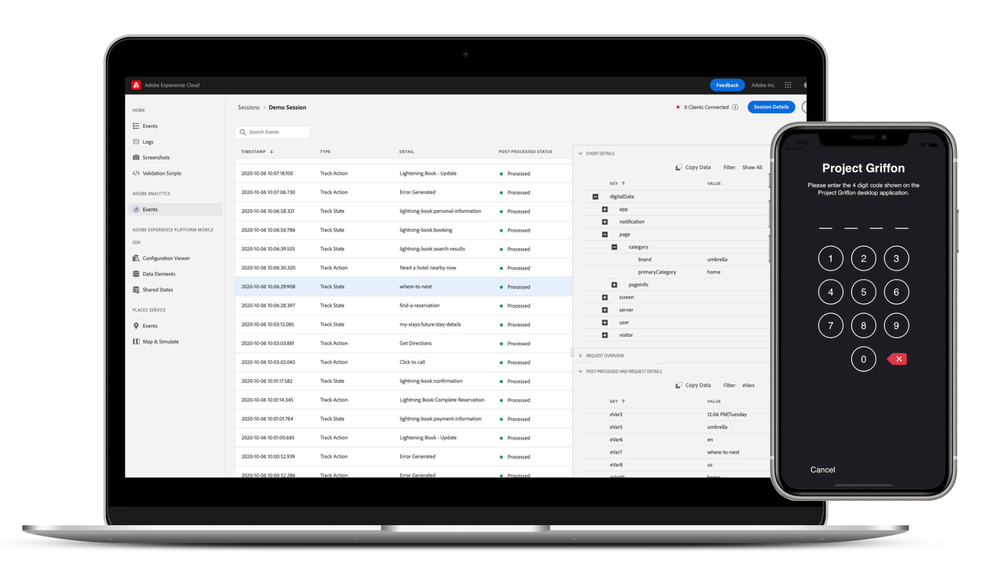

# Adobe Experience Platform保障

Adobe Experience Platform保障是 [Adobe Experience Cloud](https://www.adobe.com/cn/experience-cloud.html) 可帮助您检查、校样、模拟和验证如何在移动设备应用程序中收集数据或提供体验。

>[!IMPORTANT]
>
> Griffon项目现在称为 **保证**!
>
> Project Griffon现在可在 **全部** Adobe Experience Cloud客户作为保证。 要了解有关此过渡的更多信息，请阅读 [用户访问指南](./user-access.md).

>[!INFO]
>
>提供了保证公共API!
>
>[保证API](https://developer.adobe.com/adobe-assurance-public-apis/) 是一组API，在与Adobe保障移动SDK配合后，这些API允许用户测试和调试其Web和移动应用程序。

## 正式发布

从2022年10月15日开始，保证服务一般可供所有Adobe Experience Cloud使用。

### 有什么变化？

10月15日 — 将通过Admin Console管理对保障的访问。 请阅读 [用户访问指南](./user-access.md) 以确保您能够继续不受干扰地访问。

预计现有的保障集成、会话和事件不会发生其他更改或中断。 可继续通过访问保证 [https://griffon.adobe.com](https://griffon.adobe.com) **或** 您可以使用（和书签） [https://experience.adobe.com/assurance](https://experience.adobe.com/assurance).

## Assurance可为您做什么？

### 快速设置

快速入门，只需几行代码。 对于移动设备应用程序，Assurance可与Adobe Experience Platform Mobile SDK配合使用，以帮助您检查、模拟和验证应用程序事件、位置信号、配置参数、SDK日志、设备信息等。

### 无忧连接

借助“保证”功能，将您的应用程序与平台连接非常简单可靠。 您无需使用网络代理， [MiTM](https://en.wikipedia.org/wiki/Man-in-the-middle_attack))，以及其他网络练习 — 将您的应用程序连接到“保障”一样简单，扫描二维码或点按按钮。

### 实时检查、模拟和验证

连接到“保证”后，您可以检查实时流式应用程序事件和活动，并过滤和搜索以消除噪音。 事件包含有关验证、调试和排查移动设备应用程序实施问题的详细信息。 保证功能还允许您实时屏幕截图、模拟位置信号等。

### 与Adobe Experience Cloud集成

客户端数据和体验通过用户在以营销人员为中心的用户界面上设置报表规则、活动和营销活动的方式提供上下文。 为了帮助您连接二者之间的点，我们将与Adobe Experience Cloud解决方案集成，例如Adobe Experience Platform、Adobe Analytics、Adobe Target、Places Service等。

## 功能

### Adobe Experience Platform Mobile SDK事件、日志等

保证功能可帮助您检查由Adobe Experience Platform Mobile SDK生成的原始SDK事件。 SDK收集的所有事件都可供检查。 SDK事件在列表视图中加载，按时间排序。 每个事件都有一个详细视图，其中提供了更多详细信息。 还提供了用于浏览SDK配置、数据元素、共享状态和SDK扩展版本的其他视图。

### Adobe Analytics

Adobe Analytics > Analytics事件视图是一个集中视图，用于显示与Adobe Analytics移动设备实施相关的事件。 列表视图在特殊格式化的视图中显示生命周期或操作/状态事件、后处理的“状态”，以及必需事件详细信息。 “后处理”状态显示在对事件应用处理规则后，Adobe Analytics如何处理该事件。

### 适用于流媒体的 Adobe Analytics

Adobe Analytics > Media Analytics事件视图可显示用于音频和视频分析实施的事件。 事件详细信息视图显示每个播放会话所跟踪的标准和自定义元数据。 此外，您还可以查看后处理状态和后处理的媒体分析数据，如媒体逗留时间或缓冲总持续时间。

### 位置（位置服务）

“位置服务”视图是一个设备内视图，可显示用户位置登入和退出事件，以便轻松进行验证。 此方便的视图提供了一个方便的界面，用于查看特定位置的数据点，以便在客户端上进行检查以进行上下文调试。

## 保证安全吗？

保障已采取以下安全措施：

* 保证和保证Web UI都具有连接的安全、基于PIN的握手。 用户必须明确创建握手，以防止最终用户创建“意外”的保证连接。
* 仅支持同一Adobe Experience Cloud组织ID所属的保证和保证Web UI之间的连接。
* Adobe Experience Platform Mobile SDK事件通过HTTPS传输。
* 保证和Adobe Experience Platform Mobile SDK使用TLS 1.2
* 30天后将删除保证会话。
* 按照存储最佳实践，保证会话数据在静态时被加密。

## 快速入门

要设置保证，您需要先在应用程序中安装保证扩展。 要了解如何执行此操作，请阅读 [实施保证扩展](https://developer.adobe.com/client-sdks/documentation/platform-assurance-sdk/#add-the-aep-assurance-extension-to-your-app).

在将保证添加到您的应用程序后，您可以创建可连接到您的设备的保证会话。 要了解如何使用“保证”，请阅读 [使用保证指南](./tutorials/using-assurance.md).
