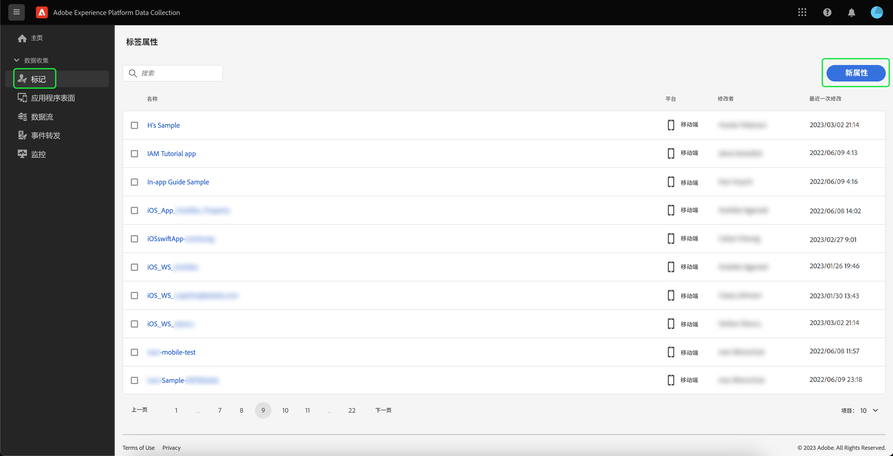
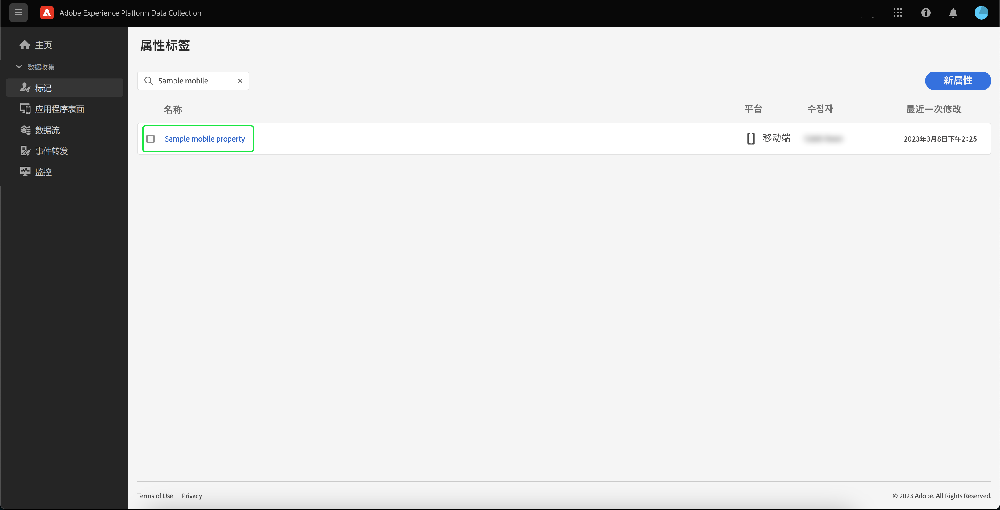

# 实施 Adobe Experience Platform Assurance 扩展

本教程介绍如何在Mobile SDK中安装和实施Experience Platform Assurance扩展。 有关将 Assurance 扩展添加到您的应用程序的说明，请阅读 [Adobe Experience Platform Assurance 扩展概述](https://developer.adobe.com/client-sdks/documentation/platform-assurance-sdk/#add-the-aep-assurance-extension-to-your-app)。

## 快速入门

若要安装和实施 Assurance 扩展，您需要访问以下服务的权限：

- [Adobe Experience Platform 数据收藏集 UI](https://experience.adobe.com/#/data-collection/)
- [Adobe Experience Platform Assurance](https://experience.adobe.com/assurance)

## 创建移动设备

>[!NOTE]
>
>如果您已经拥有移动设备，则可以继续下一步。

在数据收集 UI 中，选择&#x200B;**[!UICONTROL 标记]**。显示移动和 Web 属性列表，其中包含有关属于您组织的属性的信息。选择&#x200B;**[!UICONTROL 新属性]**&#x200B;来创建一个新的属性。

**[!UICONTROL 创建财产]**&#x200B;页面出现。输入新属性的名称并选择&#x200B;**[!UICONTROL 移动]**&#x200B;作为您的平台。插入您的详细信息后，选择&#x200B;**[!UICONTROL 保存]**&#x200B;来创建移动设备。

>[!NOTE]
>
>移动设备的&#x200B;**[!UICONTROL 隐私]**&#x200B;设置&#x200B;**不会**&#x200B;影响 Assurance 的数据收集。

## 安装 Assurance 扩展

选择要在其中安装 Assurance 扩展的移动设备。

**移动设备详细信息**&#x200B;页面出现。选择&#x200B;**[!UICONTROL 扩展]**，以显示当前与您的移动设备关联的扩展程序列表。

选择&#x200B;**[!UICONTROL 目录]**，查看可添加到移动设备的扩展程序列表。使用筛选条件找到 **[!UICONTROL AEP Assurance]** 扩展，然后选择&#x200B;**[!UICONTROL 安装]**。

## 后续步骤

现在您已在移动设备中安装了 Assurance 扩展，您可以开始在应用程序中使用 Assurance。要了解如何将 Assurance 扩展添加到您的应用程序，请阅读 [Adobe Experience Platform Assurance 扩展概述](https://developer.adobe.com/client-sdks/documentation/platform-assurance-sdk/#add-the-aep-assurance-extension-to-your-app)。要了解如何使用 Assurance，请阅读[使用 Assurance 指南](./using-assurance.md)。
