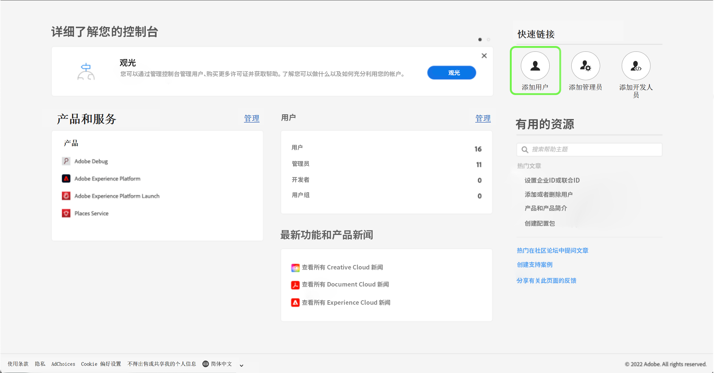
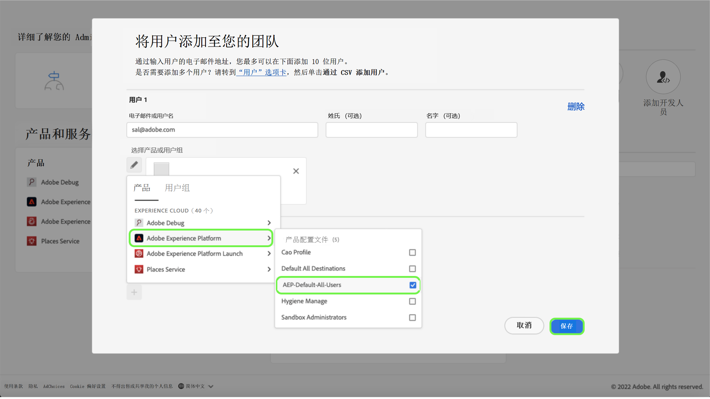

# 用户访问

>[!WARNING]
>
>请注意，用户对 Assurance 的访问权限正在发生变化。随着 Assurance 退出 Beta 版 (Project Griffon) 并向所有 Adobe Experience Cloud 客户全面开放（Assurance），对 Assurance 的访问权限将会通过[ Admin Console ](https://helpx.adobe.com/enterprise/using/admin-console.html)进行管理。
>
>如果您需要帮助，请联系您公司的 Adobe Experience Cloud 管理员。

若要接收或保持对 Assurance 的不间断访问，请确保在 Admin Console 中完成以下步骤：

## 通过产品配置文件将用户添加到 Experience Platform

若要将用户添加到产品配置文件，请登录 Admin Console 并选择&#x200B;**添加用户**。

**将用户添加到您的团队**&#x200B;对话框出现。在此对话框中，您可以输入要添加的用户的详细信息。输入用户的电子邮件地址、名字（可选）和姓氏（可选）。

选中铅笔图标，以选择产品和用户组。从这里，选择 **Adobe Experience Platform**，然后点击&#x200B;**AEP-Default-All-Users**，之后点击&#x200B;**保存**。

