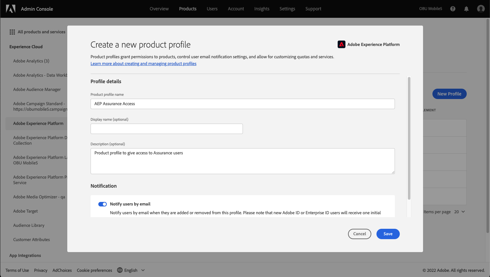

# 用户访问

>[!WARNING]
>
>請注意，使用者對Assurance的存取權正在變更。 由於Assurance讓Beta版(Project Griffon)可供所有Adobe Experience Cloud客戶普遍使用（作為保證） — 將透過以下方式管理對Assurance的存取 [Admin Console](https://helpx.adobe.com/cn/enterprise/using/admin-console.html).
>
>如果您需要協助，請聯絡貴公司的Adobe Experience Cloud管理員。

若要接收或維持對Assurance的不間斷存取，請確定已在Admin Console中完成下列步驟：

## 建立產品設定檔

>[!NOTE]
>
>如果您使用現有的設定檔，可以跳至下一節。

登入 [Admin Console](https://adminconsole.adobe.com/) 和建立新的Adobe Experience Platform產品設定檔。

選取 **產品** 索引標籤後按一下「 」，接著按「 Adobe Experience Platform產品卡」。

## 將使用者新增至產品設定檔

存取產品卡後，提供名稱並選取 **儲存**.

>[!NOTE]
>
>您打算用於保證存取的產品設定檔會 **not** 需要任何其他許可權。

現在您已建立產品卡，您可以將使用者指派至Adobe Experience Platform產品設定檔。 選取 **產品** 索引標籤，後面接著 **指派使用者** 在Adobe Experience Platform卡上。

將一個或多個使用者新增到產品設定檔並儲存。

