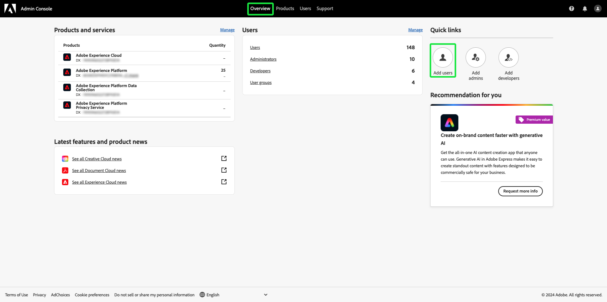

# 用户访问

通过在[Assurance](https://adminconsole.adobe.com/)中完成以下步骤，将用户添加到Adobe Experience Platform中的任何产品配置文件中，从而授予用户访问[!UICONTROL Adobe Admin Console]的权限：

## 通过产品配置文件将用户添加到Adobe Experience Platform {#adding-product-profile}

若要将用户添加到产品配置文件，请登录[Adobe Admin Console](https://adminconsole.adobe.com/)。 从Admin ConsoleUI的&#x200B;**[!UICONTROL 概述]**&#x200B;选项卡中，选择&#x200B;**[!UICONTROL 添加用户]**。

**[!UICONTROL 将用户添加到您的团队]**&#x200B;对话框出现。输入要添加的人员的电子邮件或用户名，然后选择&#x200B;**[!UICONTROL 添加为新用户]**。

显示两个文本框以输入可选的&#x200B;**[!UICONTROL 名字]**&#x200B;和可选的&#x200B;**[!UICONTROL 姓氏]**。 **[!UICONTROL SSO用户名]**&#x200B;是自动填写的，下拉列表中的&#x200B;**[!UICONTROL 国家/地区]**&#x200B;也是自动填写的。 请确保这两个选项均正确无误，并做出任何所需的调整。 一切正确后，选择&#x200B;**[!UICONTROL 产品]**。

出现&#x200B;**[!UICONTROL 选择产品]**&#x200B;对话框。 选择Adobe Experience Platform。

此时将显示&#x200B;**[!UICONTROL 选择产品配置文件]**&#x200B;对话框，其中包含产品配置文件列表。 选择任意产品配置文件，然后选择&#x200B;**[!UICONTROL 应用]**。 您可以通过重复这些步骤来添加其他产品和产品配置文件。

仔细检查用户的所有信息是否正确。 在此处，您可以添加其他用户，或通过选择&#x200B;**[!UICONTROL 保存]**&#x200B;来保存更改。

