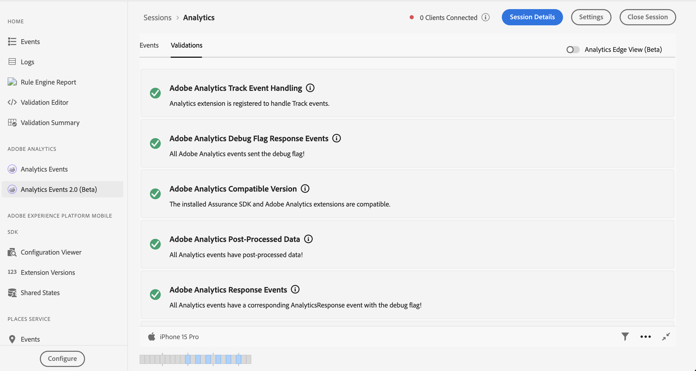

# Analytics Events 2.0 in Assurance

Analytics Events 2.0为用户调试和验证其Adobe Analytics实施提供了更丰富的SDK事件视图。 该视图显示了从发送到Adobe Analytics的事件 [Adobe Experience Platform移动SDK](https://developer.adobe.com/client-sdks/solution/adobe-analytics/) 以及 [Adobe Experience Platform Edge Network SDK](https://developer.adobe.com/client-sdks/edge/edge-network/). 该视图还具有一个详细信息面板，该面板提供了客户端SDK处理事件的方式，以及在事件离开设备后上游服务处理该事件的方式。

## 快速入门

要使用此视图，请完成以下步骤：

1. [设置Adobe Experience Platform Assurance](../tutorials/implement-assurance.md).
2. [创建并连接到保证会话](../tutorials/using-assurance.md).
3. 在左侧导航栏的Assurance UI中 **主页** “视图”菜单，选择 **Analytics Events 2.0（测试版）**. 如果未看到此选项，请选择 **配置** 在窗口的左下角，添加 **Analytics Events 2.0（测试版）**，并选择 **保存**.

## Analytics事件视图

如果您使用的是 **Adobe Analytics** 移动扩展。 此视图允许您轻松查看从连接的客户端发送的Analytics事件，包括跟踪操作、跟踪状态和生命周期事件。 通过选择表中的Analytics事件之一，可以在右侧面板上查看有关如何处理该事件的详细信息。

### 后处理状态

在SDK通过Adobe Analytics发出网络请求后，状态将告知您保障是否能够检索Adobe Analytics请求的后处理信息。 在触发请求后，当后处理状态为操作状态时，Analytics事件视图必须保持活动状态。

请注意，若要检索后处理信息，已登录的用户必须有权访问相应的报表包。

| 状态 | 描述 |
| :----- | :---------- |
| `Queued` | 网络请求正在获取后处理信息。 |
| `Processed` | 该网络请求取得成功，并收到后处理信息。 |
| `Delayed` | 已超出获取后处理信息的最大请求重试次数。 |
| `Error` | 某个错误导致该网络请求失败。在事件详细信息视图中显示关于该错误的更多详细信息。 |
| `Unauthorized` | 用户无权访问该 Adobe Analytics 报表包。 |
| `Unavailable` | Adobe Analytics 请求没有相应的 `AnalyticsResponse` 事件。 |
| `No Debug Flag` | 当前的 Adobe Analytics 或 Assurance SDK 版本可能不支持 Analytics 调试功能。有关详细信息，请阅读[故障排除指南](../troubleshooting.md)。 |
| `Expired` | `AnalyticsTrack` 或 `LifecycleStart` 事件发生时间超过 24 小时。 |

### 事件详细信息视图

对于Analytics跟踪事件，详细视图包含以下部分：

- 原始 SDK Analytics 请求事件。
- 请求中的元和上下文数据，例如报表包ID、SDK扩展版本和上下文数据。
- 有关Analytics事件的后处理信息，包含revar、evar和prop的映射。

### Analytics视图验证

验证视图可让您轻松查看与Analytics相关的验证脚本的结果。 验证器显示的错误可能包含指向应修复错误的链接或显示处于错误状态的事件。

## Analytics Edge视图

如果您要使用，请使用Analytics Edge视图 **边缘网络** 或 **Edge Bridge** 移动扩展。 要启用此视图，请选择右上角的“Analytics Edge（测试版）”切换开关，以查看在当前会话中通过Edge网络发送的Analytics事件。 这包括生命周期扩展、边缘请求和/或基于跟踪操作和跟踪状态的Edge Bridge事件触发的所有事件。

Analytics Edge视图包含有关客户端调度的与Analytics相关的边缘请求和生命周期方法的信息。 通过在列表中选择一个事件，右侧面板会显示客户端SDK以及上游服务在离开设备后处理的事件，以便您轻松查看由调用产生的事件链。

### Analytics Edge验证

通过Analytics Edge验证视图，可轻松查看与Analytics Edge相关的验证脚本的结果。 验证器显示的错误可能包含指向应修复错误的链接或显示处于错误状态的事件。

