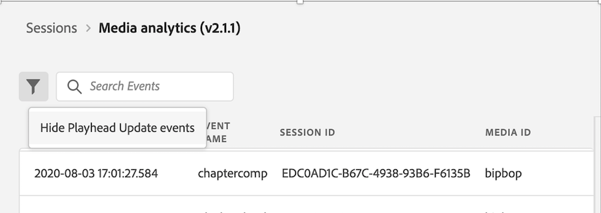
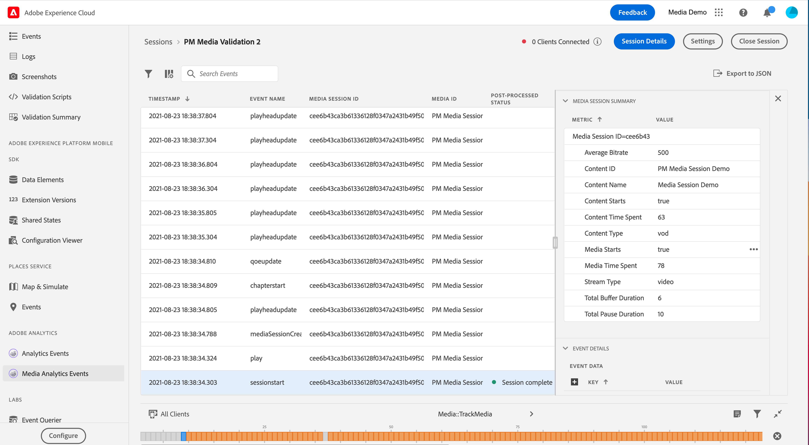

# Assurance 中的适用于流媒体的 Adobe Analytics 视图

通过将适用于流媒体的 Adobe Analytics 与 Adobe Experience Platform Assurance 集成，现在可在移动应用程序中验证媒体分析的实施情况。媒体分析视图显示在媒体会话中跟踪什么，如：

- 包含所有内容核心、标准元数据和自定义元数据属性的会话开始事件，以及会话结束和会话完成事件。
- 附加了所有广告属性的广告中断开始和广告开始事件，以及两者的跳过和完成事件。
- 附加了所有属性的章节开始，以及章节跳过和章节完成事件。
- 所有播放更改事件（播放、暂停、缓冲、错误、比特率更改）。
- 所有的播放器状态更改跟踪事件（开始、结束）。

在 Analytics 中处理数据后，还可在事件详细信息视图中找到处理后的状态和数据，如媒体逗留时间和暂停总持续时间。

## 快速入门

在继续之前，请确保您拥有以下服务：

- [Adobe Experience Platform 数据收藏集 UI](https://experience.adobe.com/#/data-collection/)
- [Adobe Experience Platform Assurance](https://experience.adobe.com/assurance)

要了解如何在您的应用程序中安装 Assurance，请阅读[实施 Assurance 指南](../tutorials/implement-assurance.md)。

## 将 Assurance与适用于流媒体的 Adobe Analytics 配合使用

为 Adobe Analytics 连接并设置您的应用程序后，即可为它配置流媒体分析。在左侧面板底部，选择&#x200B;**[!UICONTROL 配置]**&#x200B;以添加媒体分析事件视图并&#x200B;**保存**&#x200B;它。

添加后，在 **[!UICONTROL Adobe Analytics]** 部分中选择&#x200B;**[!UICONTROL 媒体分析事件]**&#x200B;视图以验证您的会话跟踪。

在&#x200B;**[!UICONTROL 媒体分析事件]**&#x200B;视图中，可按会话 ID (VSID) 搜索和筛选以查看某个特定的媒体会话。要查看其他事件详细信息，请选择特定的事件。

要更简明地查看 API 调用，还可通过选择&#x200B;**[!UICONTROL 隐藏播放头更新事件]**&#x200B;筛选条件而隐藏播放头更新事件。

>[!INFO]
>
>查看后处理的媒体分析数据需要使用 SDK 版本：Android Media 2.1.2 和 iOS AEPMedia 3.0.1（或更高版本）

要查看后处理的数据，请查找会话开始事件，并在状态列中验证完成了该会话。如果完成，请单击该事件以在事件详细信息视图中查看媒体会话摘要。有关更多详细信息，请向下滚动以查找后处理的详细信息。

