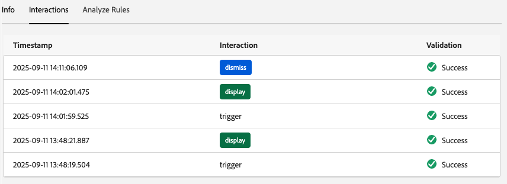
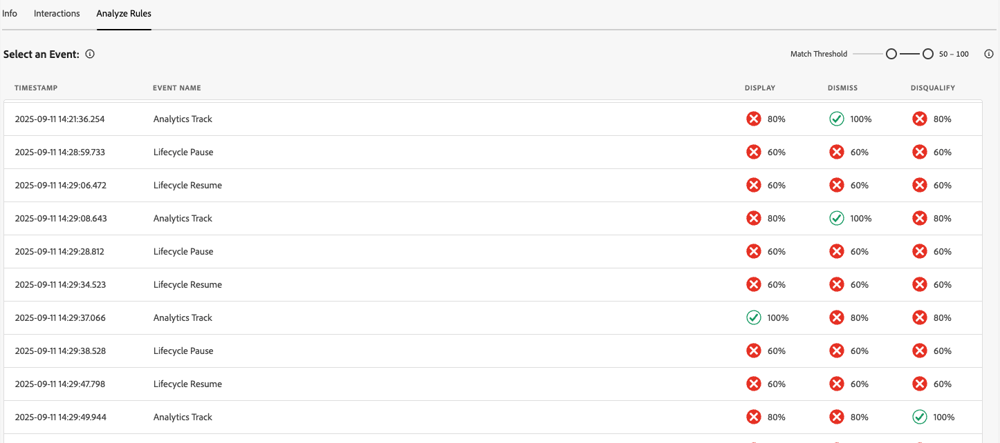

# Assurance中的“内容卡片”视图

Adobe Experience Platform Assurance中的“应用程序内消息传送”视图允许您验证应用程序、监视交付到设备的内容信息卡以及预览信息卡。

## 内容卡

在&#x200B;**[!UICONTROL 内容卡]**&#x200B;选项卡的顶部是&#x200B;**[!UICONTROL 内容卡]**&#x200B;下拉列表。 这会列出在Assurance会话中收到的所有内容卡片。 如果一张信息卡不在此列表中，则意味着应用程序从未收到该信息。

选择内容卡片将显示有关该卡片的许多信息，如下节所述。

### 信息卡预览

在右侧面板中，**[!UICONTROL 信息卡预览]**&#x200B;窗格显示信息卡如何在常用模板（小图像、大图像和仅图像）间呈现。

使用&#x200B;**[!UICONTROL 主题]**&#x200B;切换开关在浅色或深色模式下查看卡片。

### 可用选项卡

在左侧部分，可用的选项卡取决于所选的卡。 如果卡片包含规则，您将看到三个选项卡：**[!UICONTROL 信息]**、**[!UICONTROL 交互]**&#x200B;和&#x200B;**[!UICONTROL 分析规则]**。

存在规则时

如果该卡片不包含规则，您将看到两个选项卡：**[!UICONTROL 信息]**&#x200B;和&#x200B;**[!UICONTROL 交互]**。

### “信息”选项卡

**[!UICONTROL 信息]**&#x200B;选项卡在顶部显示&#x200B;**[!UICONTROL 卡片属性]**&#x200B;部分，包括&#x200B;**[!UICONTROL 当前状态]** （触发器、显示、关闭、取消资格）的徽章以及元详细信息，如&#x200B;**[!UICONTROL 模板]** （小图像、大图像或仅图像）、**[!UICONTROL 表面]**&#x200B;和任何自定义键值对。

在其下方，**[!UICONTROL Campaign属性]**&#x200B;部分显示从Adobe Journey Optimizer (AJO)加载的信息。

您还可以选择&#x200B;**[!UICONTROL 查看营销活动]**&#x200B;以在AJO中打开卡片进行检查或编辑。

### “交互”选项卡

**[!UICONTROL 交互]**&#x200B;选项卡将每个信息卡的生命周期汇总为一系列徽章：它始终以&#x200B;**[!UICONTROL 触发器]**&#x200B;开头，后面接规则生成的任意结果 — **[!UICONTROL 显示]**、**[!UICONTROL 取消]**&#x200B;或&#x200B;**[!UICONTROL 取消资格]**。

### “分析规则”选项卡

“**[!UICONTROL 分析]**”选项卡显示了一个事件表，根据该卡的规则，该表最多具有三个规则列 — **[!UICONTROL 显示]**、**[!UICONTROL 取消]**&#x200B;和&#x200B;**[!UICONTROL 取消资格]**。 如果卡片只定义一个规则，则仅显示该列。

每一行表示一个会话事件，每一列指示信息卡的规则是否与该事件的条件匹配。 0%分数表示没有匹配的条件；100%表示完全匹配（将触发规则）。

如果事件与条件匹配，它将显示绿色复选标记。 如果事件不匹配，将显示一个红色图标。

使用&#x200B;**[!UICONTROL 匹配阈值]**&#x200B;滑块按最小匹配百分比筛选事件。

选择事件后，右侧将打开一个详细信息面板，其中带有可折叠项，其中列出了三个规则：**[!UICONTROL 显示]**、**[!UICONTROL 退出]**&#x200B;和&#x200B;**[!UICONTROL 取消资格]**。

展开任意部分可查看规则的条件、匹配的条件以及该结果的计算匹配百分比。

## “请求”选项卡

**[!UICONTROL 请求]**&#x200B;选项卡显示已请求的内容卡以及在哪个表面。

显示“内容卡请求”的

使用&#x200B;**[!UICONTROL 查看信息卡]**&#x200B;按钮返回特定内容信息卡的信息选项卡。

## “事件列表”选项卡

**[!UICONTROL 事件列表]**&#x200B;选项卡显示与内容信息卡相关的会话事件，包括AJO建议请求/响应、信息卡生命周期事件和交互跟踪。 您可以搜索、筛选、排序和自定义列以及导出结果。

选择事件将打开右侧详细信息面板，其中包含原始有效负载和关键属性；您还可以标记事件以供跟进。 此视图可用于关联会话中的请求、规则结果和交互。

## “验证”选项卡

**[!UICONTROL 验证]**&#x200B;选项卡针对当前会话运行验证，检查是否已正确配置应用程序以进行消息传送：

