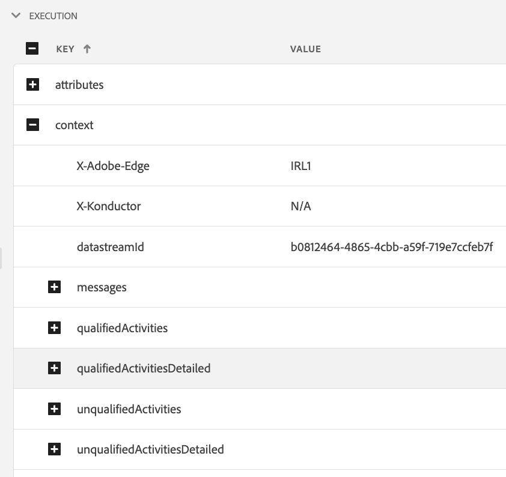

# Edge Delivery View in Assurance

此 **[!UICONTROL Edge交付]** 在内部查看 **[!UICONTROL Adobe Experience Platform Assurance]** 提供检查和验证的功能 [!UICONTROL AJO入站] 将消息边缘传送到您的Web和移动应用程序。 此视图在排除投放故障时特别有用 [!UICONTROL AJO入站] Web和移动营销活动和历程。

## 快速入门

在继续之前，请确保您有权访问以下服务：

- [Adobe Experience Platform 数据收藏集 UI](https://experience.adobe.com/#/data-collection/)
- [Adobe Experience Platform Assurance](https://experience.adobe.com/assurance)

了解如何安装 **[!UICONTROL Assurance]** 在您的应用程序中，请阅读 [实施Assurance指南](../tutorials/implement-assurance.md).

## 在Edge Delivery中使用Assurance

打开 **[!UICONTROL Assurance]** 会话，您可以添加 **[!UICONTROL Edge交付]** 查看至 **[!UICONTROL Assurance]**. 在左侧面板底部，选择 **[!UICONTROL 配置]** 添加 **[!UICONTROL Edge交付]** 查看和 **保存** 它。

添加后，选择 **[!UICONTROL Edge交付]** 在中查看 **[!UICONTROL Adobe Journey Optimizer]** 部分，用于验证入站边缘投放。

## 请求列表

在视图的主窗格中，将显示边缘投放请求的列表。 此列表显示所有 [!UICONTROL 入站AJO] 向Experience Edge发出并由处理的请求 **[!UICONTROL 入站投放服务]**，包括检索个性化决策以及跟踪个性化建议交互的请求（例如显示、单击、触发或解除）。

请求按时间戳排序，最近的请求位于顶部。 除了时间戳之外，该列表还包含请求ID列以及请求类型，请求类型可以是以下任一类型：

- **[!UICONTROL 体验交付]**：检索个性化决策的请求
- **[!UICONTROL 体验交互]**：跟踪个性化建议交互的请求
- **[!UICONTROL 体验交付和交互]**：检索个性化决策（还包括个性化建议交互）的请求
- **[!UICONTROL 预览投放]**：检索预览个性化决策的请求

也可以在列表顶部的搜索栏中输入搜索词，以筛选请求。 当按特定值（如ID）进行筛选时，这将很有用。

## 详细的请求视图

在主视图中选择请求后，所选请求的详细信息，将显示在右侧。 此视图包括以下部分：

### 请求概述

此部分提供选定请求的高级概述，包括 [!UICONTROL 组织ID]， [!UICONTROL 边缘群集]， [!UICONTROL 请求编号] 和 [!UICONTROL 请求类型]， [!UICONTROL 沙盒ID]， [!UICONTROL 沙盒名称]， [!UICONTROL 数据流ID]，以及请求平面列表(如果 [!UICONTROL 体验交付] 请求。

### 配置文件

本节提供有关处理请求时使用的配置文件数据的信息，包括身份映射、区段成员资格和同意设置。\
此 [!UICONTROL 个人资料] 在排除由于缺少或延迟区段成员资格或选择退出同意设置而导致投放无法按预期工作等问题时，本节非常有用。

### 符合条件的活动

此部分提供符合选定请求条件的活动列表，包括活动类型、ID、身份命名空间、界面、计划和受众。 有关活动的更多详细信息请参见 [原始执行跟踪部分](#execution).

### 不合格活动

此部分提供不合格活动的列表。 除了活动类型、ID、身份命名空间、表面、计划和受众之外，此部分还包含活动不符合条件的原因列表。

### 消息详细信息

此部分提供有关为所选请求投放的消息的详细信息。 它包括消息ID、片段、决策策略、 [!UICONTROL offer decisioning] 参数以及消息选择上下文。

### 交互

此部分提供有关在选定请求中跟踪的交互的详细信息。 它包括交互类型(在 `propositionEventType`)，以及相关的建议元数据，例如活动元数据(在 `scopeDetails.activity`)和建议事件令牌(在 `scopeDetails.characteristics.eventToken`)。

### 原始跟踪

此部分提供所选请求的原始跟踪。 它包括请求的完整跟踪，包括收到的实际请求 **[!UICONTROL 入站投放服务]**、执行跟踪和响应跟踪。 这对于高级故障排除（例如由于投放服务不可用、数据丢失或不正确而导致投放无法按预期工作）或了解请求处理的完整流程非常有用。

#### 请求

请求跟踪包含完整的请求，因为该请求由 **[!UICONTROL 入站投放服务]** **[!UICONTROL Konductor]** 上游。 它包括请求标头、正文和其他元数据。 例如，可以在中检查请求的XDM有效负载 `event.body.xdm` 字段。

#### 执行

执行跟踪包括请求的完整跟踪，请求由 **[!UICONTROL 入站投放服务]**. 它显示了执行上下文、活动资格、报文选择和其他处理步骤。 处理请求期间发生的任何错误或警告都可以在 `context.messages` 和 `context.exceptions` 字段。 详细的活动资格信息请参见 `context.qualifiedActivitiesDetailed` 和 `context.unqualifiedActivitiesDetailed` 字段。

#### 响应

响应跟踪包含返回的完整响应 **[!UICONTROL 入站投放服务]** 下游到 **[!UICONTROL Konductor]**. 它包括响应标头、正文和其他元数据。 可通过复制带有ID的消息来检查完整的响应正文 `1` 到剪贴板，使用 **[!UICONTROL 复制值]** 按钮并将其粘贴到JSON查看器中。

