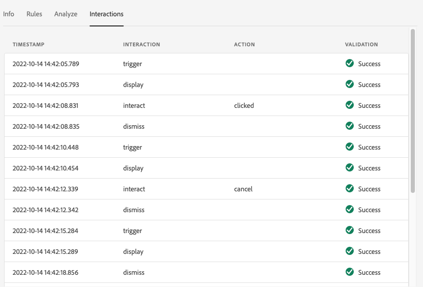
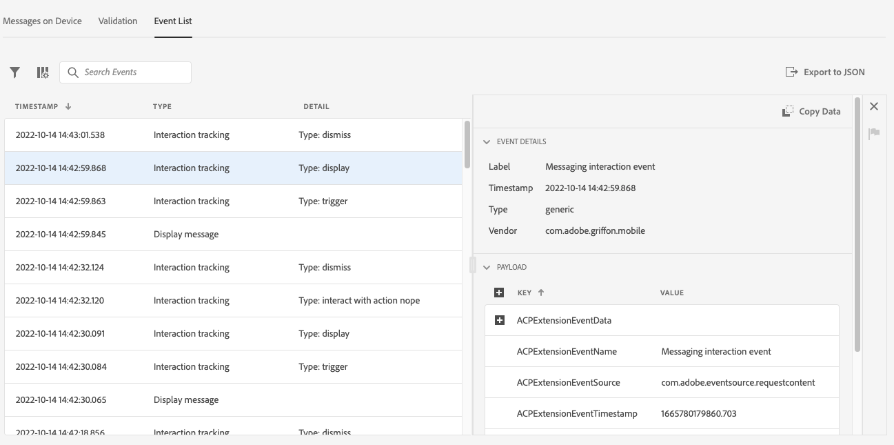

# Assurance 中的应用程序内消息视图

Adobe Experience Platform Assurance 中的应用程序内消息视图提供了验证应用程序、检测传送到您的设备的应用程序内消息以及模拟发送到您的设备的消息的功能。

## 设备上的消息

在&#x200B;**[!UICONTROL 设备上的消息]**&#x200B;选项卡顶部有一个&#x200B;**[!UICONTROL 消息]**&#x200B;下拉列表。这包括在 Assurance 会话中收到的所有消息。如果消息不在此列表中，则意味着应用程序从未收到它。


选择一条消息将会显示有关该消息的大量信息，如以下部分所述。

### 消息预览

右侧面板中有一个&#x200B;**[!UICONTROL 消息预览]**&#x200B;窗格，其中显示消息的预览。选择&#x200B;**[!UICONTROL 在设备上模拟]**&#x200B;后会将该消息发送到当前连接到会话的任何设备。


### 消息行为

**[!UICONTROL 消息预览]**&#x200B;窗格下是&#x200B;**[!UICONTROL 消息行为]**&#x200B;选项卡。其中包含有关如何显示消息的所有详细信息。这些信息包括定位信息、动画、滑动手势和外观设置。


### 信息选项卡

在左侧部分，有四个选项卡会显示有关消息的详细信息。**[!UICONTROL 信息]**&#x200B;选项卡会显示从 Adobe Journey Optimizer (AJO) 加载的有关消息活动的信息。

您还可以选择&#x200B;**[!UICONTROL 查看活动]**，在 AJO 中打开消息，以进行检查或编辑。


### 规则选项卡

**[!UICONTROL 规则]**&#x200B;选项卡显示了要显示此消息需要发生什么。这样可以深入了解什么会触发显示消息。查看这个例子：


该示例显示了该规则的三个不同条件。如果您选择一个事件（从事件列表、“分析”选项卡或在时间线中），则会根据这些规则评估该事件。如果该事件符合某个条件，它将会显示绿色复选标记：


如果事件不匹配，则会显示红色图标：


如果所有三个条件都与当前事件匹配，则会显示该消息。

### 分析选项卡

**[!UICONTROL 分析]**&#x200B;选项卡提供了对规则的更多见解。在这里，我们根据消息规则与事件的匹配程度来过滤会话中的每个事件。


在&#x200B;**[!UICONTROL 规则选项卡]**&#x200B;部分的示例中，该规则中有三个条件。此选项卡显示每个事件与规则的匹配率。大多数事件的匹配率为 33%（三个条件之一），其余事件的匹配率为 100%。

因此，您可以找到接近匹配但不完全匹配规则的事件。


**[!UICONTROL 匹配阈值]**&#x200B;滑块可让您过滤应显示的事件。例如，可以将其设置为 50% - 90%，以获取与三个条件中的两个完全匹配的事件列表。

### 交互选项卡

**[!UICONTROL 交互]**&#x200B;选项卡显示为跟踪目的发送到 Edge 的交互事件列表。



每当显示一条消息时，通常会发生四个交互事件：

```
trigger > display > interact > dismiss
```

“互动”交互有一个与之关联的附加“操作”值。可能的值包括“单击”或“取消”。

验证列显示 Edge 是否正确接收并处理了交互事件。

## 验证

**[!UICONTROL 验证]**&#x200B;选项卡针对当前会话运行验证，检查应用程序是否已正确配置了应用程序内消息传递功能：


如果发现任何错误，系统会提供有关如何修复这些错误的详细信息。

## 事件列表



**[!UICONTROL 事件列表]**&#x200B;选项卡可快速查看 Assurance 会话中与应用程序内消息传递相关的所有事件。您可能会在这里看到的一些事件是：

* 检索消息的请求和响应
* 显示消息事件
* 交互跟踪事件

在此视图中，您可以使用许多标准事件列表功能，包括应用搜索、应用过滤器、添加或删除列以及导出数据。

选择一个事件以在右侧面板中查看该事件的原始详细信息。

从右侧的详细信息面板中，可以标记所选事件，这有助于标记应由其他人查看的内容。
