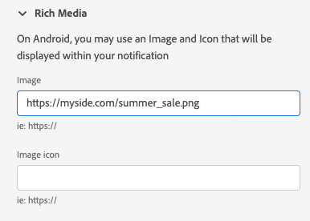
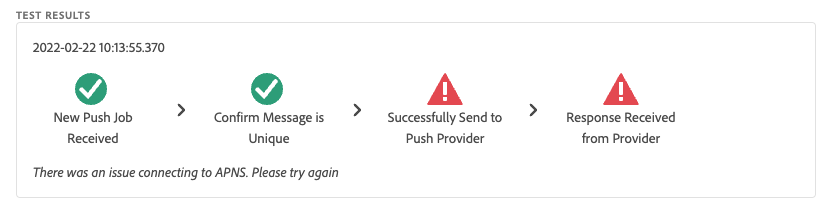

# 推送调试视图

Adobe Experience Platform Assurance 内的推送调试视图能够验证应用程序的推送设置，并向您的设备发送测试消息。

## 客户端

客户端下拉列表包含已连接到此 Assurance 会话的每个唯一客户端的列表。客户端可以是独特设备，也可以是为设备安装的独特应用程序。例如，如果 Android 设备和 iOS 设备已连接到会话，这些客户端将显示在客户端下拉列表中。

在设备上重新安装并重新连接应用程序后，将出现另一个客户端。如果具有该名称的设备已存在，那么在新的下拉列表中，该名称后面会附加 #2。

此视图仅针对单个客户端启用，因此选择不同的客户端将更改屏幕上的详细信息。

## 验证设置

**[!UICONTROL 验证设置]**&#x200B;选项卡验证并提供有关应用程序推送设置的其他详细信息。共有三个面板会执行验证。如果验证全部成功，它们会显示绿色对钩。如果有三个绿色对钩，则表示该应用程序已正确配置消息推送功能，正在将推送令牌写入用户配置文件，并且已配置关联的应用程序界面。

如果某些功能未按预期工作，则会出现一条警报，其中包含有关如何解决该问题的详细信息：

### 客户端详细信息

该面板会检查设备是否配置正确。这包括在数据收集 UI 中配置扩展程序、在您的应用程序中初始化扩展程序及其先决条件，以及从设备中捕获推送令牌等。

如果有效，则该面板会显示设备的 ECID、推送令牌以及边缘沙盒名称和类型。

### 配置文件详情

正确设置客户端后，此面板将会检查该设备是否正在写入配置文件。它还会验证配置文件中的推送令牌是否与设备上的推送令牌相匹配。

如果有效，则该面板将会显示设备的 ECID、推送令牌、应用程序的应用程序 ID、消息平台以及推送令牌是否已被列入阻止列表。令牌可能会因各种原因而被列入阻止列表，例如用户已卸载应用程序或用户已禁用应用程序的推送消息功能。

最后，面板底部有一个链接，该链接可在新选项卡中打开该特定的配置文件。

### AppStore 凭据和配置

此面板会验证保存在配置文件中的应用程序 ID 和消息传递平台是否已创建匹配的应用程序界面。应用程序界面是上传应用程序的推送凭据的地方。

如果有效，则配置文件会显示应用程序界面的名称、应用程序 ID 和消息传递服务的名称。

最后，面板底部有一个链接，该链接可在新选项卡中打开该特定的应用程序界面。

## 发送测试推送

**[!UICONTROL 发送测试推送]**&#x200B;选项卡可用于向您的设备发送测试消息。

可以配置多个窗格，以测试不同的 iOS 和 Android 推送功能。配置完成后，选择&#x200B;**[!UICONTROL 发送测试推送通知]**，以发送消息。

### 消息

在&#x200B;**[!UICONTROL 消息]**&#x200B;窗格中，您可以提供消息的标题和正文。通知静音功能也可以在此处启用。

### 推送目标

**[!UICONTROL 推送目标]**&#x200B;窗格允许您自定义发送推送消息时要使用的推送令牌和应用程序界面。

如果&#x200B;**[!UICONTROL 验证设置]**&#x200B;选项卡显示三个绿色对钩，则默认情况下会提供此信息。但是，即使您的应用程序未完全配置，您也可以提供自己的推送令牌和应用程序界面。

### 点击行为

在&#x200B;**[!UICONTROL 点击行为]**&#x200B;窗格中，您可以选择在设备上单击推送通知时应采取的操作。默认情况下，这会打开应用程序，但也会打开一个深层链接或网页。

如果您选择使用深层链接，则应用程序开发人员必须为您创建一个这样的链接。

### 富媒体

**[!UICONTROL 富媒体]**&#x200B;窗格允许您向消息中添加额外的媒体，例如图像、视频或 GIF。应用程序开发人员必须向应用程序添加代码才能启用此功能。

### 按钮

**[!UICONTROL 纽扣]**&#x200B;窗格允许您向推送通知添加额外的按钮。每个按钮都可以打开应用程序、打开应用程序的深层链接或打开网页。

应用程序开发人员必须向应用程序添加代码才能启用此功能。

### 自定义数据

**[!UICONTROL 自定义数据]**&#x200B;窗格允许您将自定义数据添加到推送通知。每个键/值对都会作为元数据与消息一起发送，开发人员可以使用它来创建强大的体验并添加额外的跟踪功能。

## 测试结果

发送消息后，**[!UICONTROL 测试结果]**&#x200B;部分会从消息的推送服务接收数据。您可以在此处查看消息是否已发送至 Google/iOS 消息服务：

如果出现任何问题，它们会在此处显示：

## 高级

### 查看消息负载

在&#x200B;**[!UICONTROL 发送测试推送通知]**&#x200B;按钮旁边，是一组带有弹出菜单的省略号。您可以在这里查看消息负载。您可以在其中看到将会发送到远程消息服务的确切消息。您可以查看此有效负载，甚至可以将其复制并粘贴到桌面推送测试工具中。

