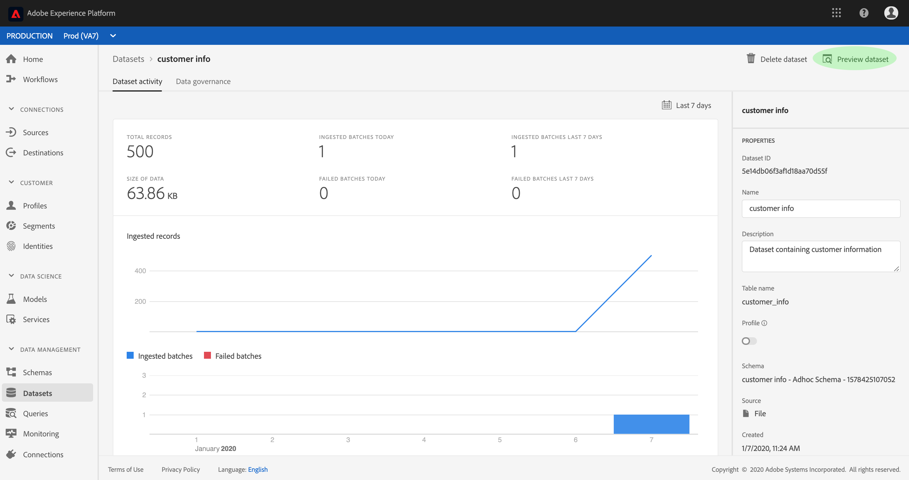
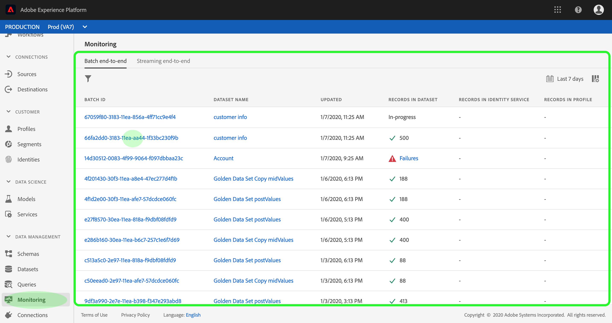
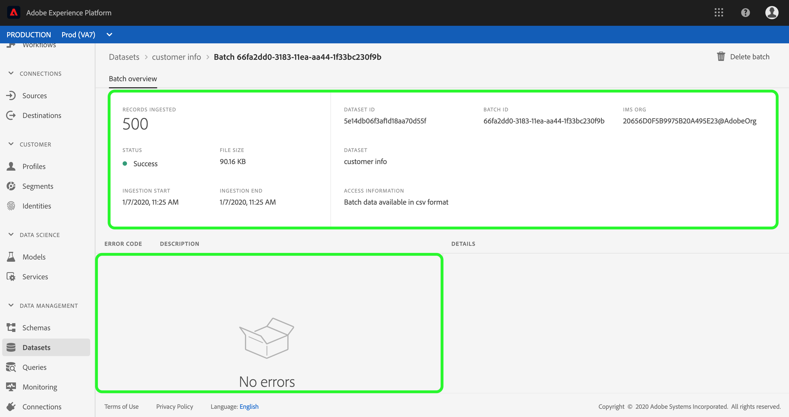

# 数据集用户指南

本用户指南提供了有关在Adobe Experience Platform用户界面中处理数据集时执行常见操作的说明。

## 入门指南

本用户指南需要您对Adobe Experience Platform的以下组件有充分的了解：

* [数据集](overview.md):Experience Platform中数据持久性的存储和管理构建。
* [体验数据模型(XDM)系统](../../xdm/home.md):Experience Platform组织客户体验数据的标准化框架。
   * [模式合成的基础知识](../../xdm/schema/composition.md):了解XDM模式的基本构件，包括模式构成的主要原则和最佳做法。
   * [模式编辑器](../../xdm/tutorials/create-schema-ui.md):了解如何使用平台用户界面中的模式编辑器构建您自己的自定义XDM模式。
* [实时客户用户档案](../../profile/home.md):根据来自多个来源的汇总数据提供统一、实时的消费者用户档案。
* [数据管理](../../data-governance/home.md):确保符合关于客户数据使用的法规、限制和政策。

## 视图数据集

在Experience Platform UI中，单击左侧导 **航中的Dataset** ，以打开Datasets *仪表板* 。 仪表板列表组织的所有可用数据集。 将显示每个列出的数据集的详细信息，包括其名称、数据集所附带的模式以及最近摄取运行的状态。

单击数据集的名称以访问其“数 *据集活动* ”屏幕，并查看所选数据集的详细信息。 活动选项卡包括一个图，该图可视化消费消息的速率，以及成功和失败批的列表。

## 预览数据集

在“数 *据集活动* ”屏幕中，单击屏幕右上角附近的“ **预览数据集** ”以预览最多100行数据。 如果数据集为空，则预览链接将被取消激活，而是表示预览不 **可用**。

在预览窗口中，右侧显示数据集模式的分层视图。

要获得更可靠的数据访问方法，Experience Platform提供下游服务，如查询服务和JupyterLab来探索和分析数据。 有关详细信息，请参阅以下文档:

* [查询服务概述](../../query-service/home.md)
* [JupyterLab用户指南](../../data-science-workspace/jupyterlab/overview.md)

## 创建数据集 {#create}

要创建新数据集，请单击“数据集 **开始”中的** “创建数 *据集* ”仪表板。

在下一个屏幕中，您将看到以下两个用于创建新数据集的选项：

* [从模式创建数据集](#create-a-dataset-with-an-existing-schema)
* [通过CSV文件创建数据集](#create-a-dataset-with-a-csv-file)

### 使用现有模式创建数据集

在“创 *建数据集* ”屏幕中，单 **击“从模式创建数据集** ”以创建新的空数据集。

将出 *现“选择模式* ”步骤。 浏览模式列表，选择数据集将遵循的模式，然后单击“下一 **步”**。

将显 *示配置数据集* 步骤。 为数据集提供名称和可选描述，然后单击 **完成** ，以创建数据集。

### 使用CSV文件创建数据集

当使用CSV文件创建数据集时，将创建一个专门模式，以为数据集提供与提供的CSV文件匹配的结构。 在“创 *建数据集* ”屏幕中，单击表示“从CSV **文件创建数据集”的框**。

将显 *示配置* 步骤。 为数据集提供名称和可选说明，然后单击“下 **一步”**。

将出 *现添加数据* 步骤。 通过将CSV文件拖放到屏幕的中心来上传该文件，或单击“浏 **览** ”浏览文件目录。 该文件最大可能有十GB大小。 上传CSV文件后，单击“保 **存** ”以创建数据集。

>[!NOTE] CSV列名必须与字母数字字符开始，并且只能包含字母、数字和下划线。

## 为实时客户用户档案启用数据集

每个数据集都能用摄取的数据丰富客户用户档案。 为此，数据集所遵循的模式必须兼容，才能在实时客户用户档案中使用。 兼容模式满足以下要求：

* 该模式至少具有一个指定为标识属性的属性。
* 模式的标识属性定义为主标识。

有关启用模式进行用户档案的详细信息，请参阅 [模式编辑器用户指南](../../xdm/tutorials/create-schema-ui.md)。

要为用户档案启用数据集，请访问其“数 *据集活动* ”屏幕，然后单击“属性”列中的“ **用户档案***”切换* 选项。 启用后，摄取到数据集中的数据也将用于填充客户用户档案。

如果数据集已包含数据，然后启用用户档案，则现有数据不会被用户档案占用。 在启用数据集进行用户档案后，建议您重新摄取任何现有数据，以使其填充客户用户档案。

## 对数据集管理和实施数据管理

数据使用标签和强制执行(DULE)是Experience Platform的核心数据管理机制。 DULE标签允许您根据应用于该数据的使用策略对数据集和字段进行分类。 请参阅 [数据管理概述](../../data-governance/home.md) ，了解有关标签的更多信息，或参阅数据使用标签用户指南  ，了解如何将标签应用到数据集。

## 删除数据集

您可以通过首先访问数据集活动屏幕来 *删除数据集* 。 然后，单击 **删除数据集** ，以将其删除。

>[!NOTE] 无法删除由Adobe应用程序和服务(如Adobe Analytics、Adobe受众管理器或决策服务)创建和利用的数据集。

将显示确认框。 单击 **删除** ，以确认删除数据集。

## 删除支持用户档案的数据集

如果数据集已启用用户档案，则通过UI删除它将禁用数据集以进行摄取，但不会自动删除后端的数据集。 要完全删除数据集(包括它提供的用户档案和标识数据)，必须再发出一个删除请求。 有关如何从用户档案商店正确删除数据的步骤，请参阅有关用户档案系统作业的实时客户用户档案API子指南，也称为“删除请求” 。

## 监控数据摄取

在Experience Platform UI中，单击左 **侧导航** 中的监视。 通过 *监视仪表板* ，您可以视图来自批处理或流摄取的入站数据的状态。 要视图各批的状态，请单 *击“批次端到端* ” *或“流式端到端”*。 仪表板列表所有批量或流摄取运行，包括成功、失败或仍在进行的运行。 每个列表都提供了批的详细信息，包括批ID、目标数据集的名称和摄取的记录数。 如果为目标启用了用户档案数据集，则还会显示摄取的标识和用户档案记录数。

您可以单击单个批 **ID** ，以访问“批”概 *述仪表板并查看批的详细信息* ，包括当批未能摄取时的错误日志。

如果要删除批，可以单击仪表板右上角附近的“ **删除批** ”来删除批。 这样做还会将其记录从最初摄取批次的数据集中删除。

## 后续步骤

本用户指南提供了有关在Experience Platform用户界面中处理数据集时执行常见操作的说明。 有关执行涉及数据集的常见平台工作流的步骤，请参阅以下教程：

* [使用API创建数据集](create.md)
* [使用Data Access API查询数据集数据](../../data-access/home.md)
* [使用API为实时客户用户档案和标识服务配置数据集](../../profile/tutorials/dataset-configuration.md)