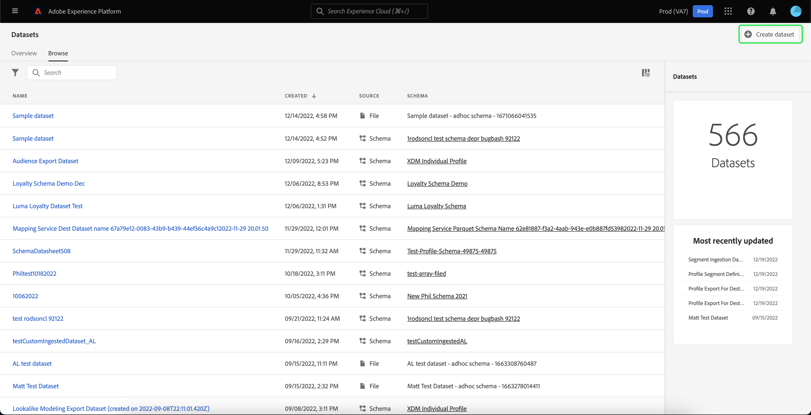

# 数据集UI指南

本用户指南提供了在Adobe Experience Platform用户界面中使用数据集时执行常用操作的说明。

## 快速入门

本用户指南要求您对Adobe Experience Platform的以下组件有一定的了解：

* [数据集](overview.md)：中用于数据持久化的存储和管理结构 [!DNL Experience Platform].
* [[!DNL Experience Data Model (XDM) System]](../../xdm/home.md)：用于实现此目标的标准化框架 [!DNL Experience Platform] 组织客户体验数据。
   * [模式组合基础](../../xdm/schema/composition.md)：了解XDM架构的基本构建基块，包括架构构成中的关键原则和最佳实践。
   * [架构编辑器](../../xdm/tutorials/create-schema-ui.md)：了解如何使用构建您自己的自定义XDM架构 [!DNL Schema Editor] 内部 [!DNL Platform] 用户界面。
* [[!DNL Real-Time Customer Profile]](../../profile/home.md)：根据来自多个来源的汇总数据提供统一的实时使用者个人资料。
* [[!DNL Adobe Experience Platform Data Governance]](../../data-governance/home.md)：确保遵守有关客户数据使用的法规、限制和政策。

## 查看数据集 {#view-datasets}

>[!CONTEXTUALHELP]
>id="platform_datasets_negative_numbers"
>title="数据集活动中的负数"
>abstract="摄取的记录中的负数表示用户已删除选定时间范围内的某些批次。"
>text="Learn more in documentation"

>[!CONTEXTUALHELP]
>id="platform_datasets_browse_daysRemaining"
>title="数据集到期"
>abstract="此列指示目标数据集在自动到期之前剩余的天数。"

在 [!DNL Experience Platform] UI，选择 **[!UICONTROL 数据集]** 在左侧导航栏中打开 **[!UICONTROL 数据集]** 仪表板。 仪表板列出您组织的所有可用数据集。 会显示每个列出数据集的详细信息，包括其名称、数据集所遵循的架构以及最近摄取运行的状态。

从中选择数据集的名称 [!UICONTROL 浏览] 选项卡以访问其 **[!UICONTROL 数据集活动]** 屏幕并查看选定数据集的详细信息。 活动选项卡包含一个图表，其中可查看消息使用率，以及成功批次和失败批次的列表。

## 更多操作 {#more-actions}

您可以 [!UICONTROL 删除] 或 [!UICONTROL 为配置文件启用数据集] 从 [!UICONTROL 数据集] 详细信息视图。 要查看可用的操作，请选择 **[!UICONTROL ...更多]** （在UI右上方）。 出现下拉菜单。

![具有的数据集工作区 [!UICONTROL ...更多] 下拉菜单突出显示。](../images/datasets/user-guide/more-actions.png)

如果您选择 **[!UICONTROL 为配置文件启用数据集]**，将出现一个确认对话框。 选择 **[!UICONTROL 启用]** 确认您的选择。

>[!NOTE]
>
>要为配置文件启用数据集，数据集所遵循的架构必须兼容，才能在实时客户配置文件中使用。 请参阅 [为用户档案启用数据集](#enable-profile) 部分以了解更多信息。

如果您选择 **[!UICONTROL 删除]**， [!UICONTROL 删除数据集] 确认对话框出现。 选择 **[!UICONTROL 删除]** 确认您的选择。

>[!NOTE]
>
>您无法删除系统数据集。

您还可以从上的内联操作删除数据集或添加数据集以与实时客户资料一起使用 [!UICONTROL 浏览] 选项卡。 请参阅 [内联操作部分](#inline-actions) 以了解更多信息。

## 内联数据集操作 {#inline-actions}

数据集UI现在为每个可用数据集提供一组内联操作。 选择要管理的数据集的省略号(...)可在弹出菜单中查看可用选项。 可用的操作包括： [[!UICONTROL 预览数据集]](#preview)， [[!UICONTROL 管理数据和访问标签]](#manage-and-enforce-data-governance)， [[!UICONTROL 启用统一配置文件]](#enable-profile)， [[!UICONTROL 管理标记]](#add-tags)， [[!UICONTROL 移至文件夹]](#move-to-folders)、和 [[!UICONTROL 删除]](#delete). 有关这些可用操作的更多信息，请参阅其各自部分。

### 添加数据集标记 {#add-tags}

添加自定义创建的标记以组织数据集并改进搜索、筛选和排序功能。 从 [!UICONTROL 浏览] 选项卡 [!UICONTROL 数据集] 在工作区中，选择要管理的数据集的省略号，然后选择 **[!UICONTROL 管理标记]** 下拉菜单中。

此 [!UICONTROL 管理标记] 出现对话框。 输入简短描述以创建自定义标记，或从预先存在的标记中选择以标记您的数据集。 选择 **[!UICONTROL 保存]** 以确认您的设置。

此 [!UICONTROL 管理标记] 对话框也可以从数据集中删除现有标记。 只需选择要删除的标记旁边的“x”并选择 **[!UICONTROL 保存]**.

将标记添加到数据集后，可以根据相应的标记过滤数据集。 请参阅有关如何执行操作的部分 [按标记过滤数据集](#enable-profile) 以了解更多信息。

有关如何对业务对象进行分类以便于发现和分类的更多信息，请参阅 [管理元数据分类](../../administrative-tags/ui/managing-tags.md). 本指南详细介绍具有适当权限的用户如何在Platform UI中创建预定义标记、为标记分配类别以及执行标记和标记类别的所有相关CRUD操作。

## 搜索和筛选数据集 {#search-and-filter}

要搜索或筛选可用数据集的列表，请选择过滤器图标()。 左边栏中显示一组过滤器选项。 有多种方法可用于筛选可用数据集。 这些功能包括： [[!UICONTROL 显示系统数据集]](#show-system-datasets)， [[!UICONTROL 包含在配置文件中]](#filter-profile-enabled-datasets)， [[!UICONTROL 标记]](#filter-by-tag)， [[!UICONTROL 创建日期]](#filter-by-creation-date)， [[!UICONTROL 修改日期]， [!UICONTROL 创建者]](#filter-by-creation-date)、和 [[!UICONTROL 架构]](#filter-by-schema).

应用的过滤器列表显示在过滤结果上方。

### 显示系统数据集 {#show-system-datasets}

默认情况下，仅显示已摄取数据的数据集。 如果要查看系统生成的数据集，请选择 **[!UICONTROL 是]** 中的复选框 [!UICONTROL 显示系统数据集] 部分。 系统生成的数据集仅用于处理其他组件。 例如，系统生成的配置文件导出数据集用于处理配置文件仪表板。

![使用的数据集工作区的过滤器选项 [!UICONTROL 显示系统数据集] 部分突出显示。](../images/datasets/user-guide/show-system-datasets.png)

### 启用筛选配置文件的数据集 {#filter-profile-enabled-datasets}

为配置文件数据启用的数据集用于在引入数据后填充客户配置文件。 请参阅以下部分 [为配置文件启用数据集](#enable-profile) 了解更多信息。

要根据是否已为配置文件启用数据集来筛选数据集，请选择 [!UICONTROL 是] 复选框。

![使用的数据集工作区的过滤器选项 [!UICONTROL 包含在配置文件中] 部分突出显示。](../images/datasets/user-guide/included-in-profile.png)

### 按标记筛选数据集 {#filter-by-tag}

在中输入自定义标记名称 [!UICONTROL 标记] 输入，然后从可用选项列表中选择您的标记，以搜索和筛选与该标记对应的数据集。

![使用的数据集工作区的过滤器选项 [!UICONTROL 标记] 输入和过滤器图标突出显示。](../images/datasets/user-guide/filter-tags.png)

### 按创建日期筛选数据集 {#filter-by-creation-date}

可以在自定义时段内按创建日期筛选数据集。 这可用于排除历史数据或生成特定的按时间顺序排列的数据洞察和报表。 选择 [!UICONTROL 开始日期] 和 [!UICONTROL 结束日期] 选择每个字段的日历图标。 之后，只有符合该条件的数据集才会显示在浏览选项卡中。

### 按修改日期筛选数据集 {#filter-by-modified-date}

与创建日期过滤器类似，您可以根据上次修改数据集的日期来筛选数据集。 在 [!UICONTROL 修改日期] 部分，选择 [!UICONTROL 开始日期] 和 [!UICONTROL 结束日期] 选择每个字段的日历图标。 之后，只有在该时段修改的数据集才会显示在浏览选项卡中。

### 按架构筛选 {#filter-by-schema}

您可以根据定义数据集结构的架构筛选数据集。 选择下拉图标或将架构名称输入文本字段。 此时将显示一个潜在匹配项列表。 从列表中选择相应的架构。

## 按创建日期排序数据集 {#sort}

中的数据集 [!UICONTROL 浏览] 选项卡可以按升序或降序日期排序。 选择 [!UICONTROL 已创建] 或 [!UICONTROL 上次更新时间] 列标题在升序和降序之间切换。 选中后，列将通过列标题侧的向上或向下箭头指示此信息。

## 预览数据集 {#preview}

您可以通过的两个内联选项预览数据集示例数据 [!UICONTROL 浏览] 选项卡以及 [!UICONTROL 数据集活动] 视图。 从 [!UICONTROL 浏览] 选项卡，选择要预览的数据集名称旁边的省略号(...)。 出现一个选项菜单列表。 接下来，选择 **[!UICONTROL 预览数据集]** 从可用选项列表中。 如果数据集为空，则预览链接将被停用，并改为表示预览不可用。

这将打开预览窗口，其中数据集的架构的分层视图显示在右侧。

或者，从 **[!UICONTROL 数据集活动]** 屏幕，选择 **[!UICONTROL 预览数据集]** 在屏幕的右上角附近，可预览最多100行数据。

要获得更可靠的数据访问方法， [!DNL Experience Platform] 提供下游服务，例如 [!DNL Query Service] 和 [!DNL JupyterLab] 以探索和分析数据。 有关详细信息，请参阅以下文档：

* [查询服务概述](../../query-service/home.md)
* [JupyterLab用户指南](../../data-science-workspace/jupyterlab/overview.md)

## 创建数据集 {#create}

要创建新数据集，请先选择 **[!UICONTROL 创建数据集]** 在 **[!UICONTROL 数据集]** 仪表板。

在下一个屏幕中，您将看到用于创建新数据集的以下两个选项：

* [从架构创建数据集](#schema)
* [从CSV文件创建数据集](#csv)

### 使用现有架构创建数据集 {#schema}

在 **[!UICONTROL 创建数据集]** 屏幕，选择 **[!UICONTROL 从架构创建数据集]** 以创建新的空数据集。

此 **[!UICONTROL 选择架构]** 此时将显示步骤。 浏览架构列表并选择数据集将遵循的架构，然后再选择 **[!UICONTROL 下一个]**.

此 **[!UICONTROL 配置数据集]** 此时将显示步骤。 为数据集提供名称和可选描述，然后选择 **[!UICONTROL 完成]** 以创建数据集。

可以使用架构筛选器从UI中的可用数据集列表中筛选数据集。 请参阅有关如何执行操作的部分 [按架构筛选数据集](#filter-by-schema) 以了解更多信息。

### 使用CSV文件创建数据集 {#csv}

使用CSV文件创建数据集时，将创建一个临时架构，以便为数据集提供匹配提供的CSV文件的结构。 在 **[!UICONTROL 创建数据集]** 屏幕，选择 **[!UICONTROL 从CSV文件创建数据集]**.

此 **[!UICONTROL 配置]** 此时将显示步骤。 为数据集提供名称和可选描述，然后选择 **[!UICONTROL 下一个]**.

此 **[!UICONTROL 添加数据]** 此时将显示步骤。 通过将CSV文件拖放到屏幕中心来上传该文件，或者选择 **[!UICONTROL 浏览]** 浏览您的文件目录。 文件大小最多可达10 GB。 上传CSV文件后，选择 **[!UICONTROL 保存]** 以创建数据集。

>[!NOTE]
>
>CSV列名称必须以字母数字字符开头，并且只能包含字母、数字和下划线。

## 为实时客户个人资料启用数据集 {#enable-profile}

每个数据集都能够使用其摄取的数据扩充客户用户档案。 为此，数据集所遵循的架构必须兼容才能在中使用 [!DNL Real-Time Customer Profile]. 兼容的架构满足以下要求：

* 架构至少有一个指定为标识属性的属性。
* 架构具有定义为主标识的标识属性。

有关启用架构的详细信息 [!DNL Profile]，请参见 [架构编辑器用户指南](../../xdm/tutorials/create-schema-ui.md).

您可以通过的两个内联选项为配置文件启用数据集 [!UICONTROL 浏览] 选项卡以及 [!UICONTROL 数据集活动] 视图。 从 [!UICONTROL 浏览] 选项卡 [!UICONTROL 数据集] 在工作区中，选择要为配置文件启用的数据集的省略号。 出现一个选项菜单列表。 接下来，选择 **[!UICONTROL 启用统一配置文件]** 从可用选项列表中。

或者，从数据集的 **[!UICONTROL 数据集活动]** 屏幕上，选择 **[!UICONTROL 个人资料]** 在中切换 **[!UICONTROL 属性]** 列。 启用后，还将使用摄取到数据集的数据来填充客户配置文件。

>[!NOTE]
>
>如果数据集已包含数据，并且随后启用了 [!DNL Profile]，则现有数据不会自动由使用 [!DNL Profile]. 为启用数据集后 [!DNL Profile]，建议您重新摄取任何现有数据，以使其贡献客户个人资料。

也可通过此条件筛选为配置文件启用的数据集。 请参阅有关如何执行操作的部分 [启用筛选配置文件的数据集](#filter-profile-enabled-datasets) 以了解更多信息。

## 在数据集上管理和强制执行数据治理 {#manage-and-enforce-data-governance}

您可以通过选择的数据集的内联选项，来管理数据集的数据治理标签 [!UICONTROL 浏览] 选项卡。 选择要管理的数据集名称旁边的省略号(...)，然后选择 **[!UICONTROL 管理数据和访问标签]** 下拉菜单中。

通过在架构级别应用数据使用标签，您可以根据应用于该数据的使用策略对数据集和字段进行分类。 请参阅 [数据管理概述](../../data-governance/home.md) 要了解有关标签的更多信息，或参阅 [数据使用标签用户指南](../../data-governance/labels/overview.md) 有关如何将标签应用于架构以便传播到数据集的说明。

## 移至文件夹 {#move-to-folders}

您可以将数据集放在文件夹中，以便更好地管理数据集。 要将数据集移动到文件夹中，请选择要管理的数据集名称旁边的省略号(...)，然后选 **[!UICONTROL 移至文件夹]** 下拉菜单中。

![此 [!UICONTROL 数据集] 仪表板，带有椭圆和 [!UICONTROL 移至文件夹] 突出显示。](../images/datasets/user-guide/move-to-folder.png)

此 [!UICONTROL 移动] 此时将显示数据集到文件夹对话框。 选择要将受众移动到的文件夹，然后选择 **[!UICONTROL 移动]**. 弹出通知会告知您已成功移动数据集。

![此 [!UICONTROL 移动] 数据集对话框 [!UICONTROL 移动] 突出显示。](../images/datasets/user-guide/move-dialog.png)

>[!TIP]
>
>您还可以直接从“移动数据集”对话框创建文件夹。 要创建文件夹，请选择创建文件夹图标()。
>
>![此 [!UICONTROL 移动] 突出显示创建文件夹图标的数据集对话框。](/help/catalog/images/datasets/user-guide/create-folder.png)

数据集位于文件夹中后，您可以选择仅显示属于特定文件夹的数据集。 要打开文件夹结构，请选择显示文件夹图标()。 接下来，选择您选择的文件夹以查看所有关联的数据集。

![此 [!UICONTROL 数据集] 功能板中显示了数据集文件夹结构，突出显示了“显示文件夹”图标和选定的文件夹。](../images/datasets/user-guide/folder-structure.png)

## 删除数据集 {#delete}

您可以从中任一数据集内联操作删除数据集 [!UICONTROL 浏览] 选项卡或的右上角 [!UICONTROL 数据集活动] 视图。 从 [!UICONTROL 浏览] 视图，选择要删除的数据集名称旁边的省略号(...)。 出现一个选项菜单列表。 接下来，选择 **[!UICONTROL 删除]** 下拉菜单中。

将显示确认对话框。 选择&#x200B;**[!UICONTROL 删除]**&#x200B;以确认。

或者，选择 **[!UICONTROL 删除数据集]** 从 **[!UICONTROL 数据集活动]** 屏幕。

>[!NOTE]
>
>Adobe应用程序和服务(如Adobe Analytics、Adobe Audience Manager或 [!DNL Offer Decisioning])无法删除。

将出现一个确认框。 选择 **[!UICONTROL 删除]** 以确认删除数据集。

## 删除启用配置文件的数据集

如果为配置文件启用了某个数据集，则通过UI删除该数据集会将其从数据湖、身份服务以及配置文件存储中与该数据集关联的任何配置文件数据中删除。

您可以从以下位置删除与数据集关联的配置文件数据 [!DNL Profile] 使用实时客户个人资料API存储（将数据保留在数据湖中）。 欲了解更多信息，请参见 [配置文件系统作业API端点指南](../../profile/api/profile-system-jobs.md).

## 监测数据摄取

在 [!DNL Experience Platform] UI，选择 **[!UICONTROL 监控]** 在左侧导航栏中。 此 **[!UICONTROL 监控]** 通过仪表板，可查看来自批量摄取或流式摄取的集客数据状态。 要查看各个批的状态，请选择 **[!UICONTROL 批次端到端]** 或 **[!UICONTROL 端到端的流式传输]**. 仪表板将列出所有批次或流式摄取运行，包括成功、失败或仍在进行的批次或流式摄取运行。 每个列表都提供了批次的详细信息，包括批次ID、目标数据集的名称和摄取的记录数。 如果为目标数据集启用了 [!DNL Profile]，也会显示摄取的身份和配置文件记录数。

您可以选择个人 **[!UICONTROL 批次ID]** 以访问 **[!UICONTROL 批次概述]** 仪表板，并查看批次的详细信息，包括批次摄取失败时的错误日志。

如果要删除批次，请选择 **[!UICONTROL 删除批次]** 在仪表板的右上角附近。 删除批次也会从最初将批次摄取到的数据集中删除其记录。

>[!NOTE]
>
>如果已为配置文件启用并处理了摄取的数据，则删除批次不会从配置文件存储区中删除该数据。

## 后续步骤

本用户指南提供了在中处理数据集时执行常用操作的说明。 [!DNL Experience Platform] 用户界面。 有关执行常见操作的步骤 [!DNL Platform] 涉及数据集的工作流，请参阅以下教程：

* [使用API创建数据集](create.md)
* [使用数据访问API查询数据集数据](../../data-access/home.md)
* [使用API为Real-time Customer Profile和Identity Service配置数据集](../../profile/tutorials/dataset-configuration.md)
