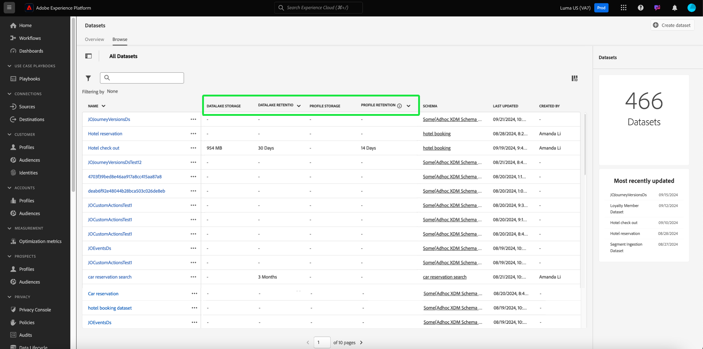

# 数据集UI指南

本用户指南提供了在Adobe Experience Platform用户界面中使用数据集时执行常用操作的说明。

## 快速入门

本用户指南要求您对Adobe Experience Platform的以下组件有一定的了解：

* [数据集](overview.md)： [!DNL Experience Platform]中用于数据持久性的存储和管理结构。
* [[!DNL Experience Data Model (XDM) System]](../../xdm/home.md)： [!DNL Experience Platform]用于组织客户体验数据的标准化框架。
   * [架构组合的基础知识](../../xdm/schema/composition.md)：了解XDM架构的基本构建块，包括架构组合中的关键原则和最佳实践。
   * [架构编辑器](../../xdm/tutorials/create-schema-ui.md)：了解如何在[!DNL Schema Editor]用户界面中使用[!DNL Experience Platform]构建您自己的自定义XDM架构。
* [[!DNL Real-Time Customer Profile]](../../profile/home.md)：根据来自多个源的汇总数据，提供统一的实时使用者个人资料。
* [[!DNL Adobe Experience Platform Data Governance]](../../data-governance/home.md)：确保遵守有关客户数据使用的法规、限制和策略。

## 查看数据集 {#view-datasets}

>[!CONTEXTUALHELP]
>id="platform_datasets_negative_numbers"
>title="数据集活动中的负数"
>abstract="摄取的记录中的负数表示用户已删除选定时间范围内的某些批次。"
>text="Learn more in documentation"

>[!CONTEXTUALHELP]
>id="platform_datasets_browse_daysRemaining"
>title="数据集有效期限"
>abstract="此列指示目标数据集在自动到期之前剩余的天数。"

>[!CONTEXTUALHELP]
>id="platform_datasets_browse_datalakeretention"
>title="数据湖保留情况"
>abstract="显示每个数据集的当前保留策略。可以在每个数据集的保留设置中修改此值。您只能为 ExperienceEvent 数据集设置保留时间。"

>[!CONTEXTUALHELP]
>id="platform_datasets_browse_profileretention"
>title="轮廓保留情况"
>abstract="显示每个数据集的当前保留策略。可以在每个数据集的保留设置中修改此值。您只能为 ExperienceEvent 数据集设置保留时间。"

>[!CONTEXTUALHELP]
>id="platform_datasets_datalakesettings_datasetretention"
>title="数据集保留情况"
>abstract="数据湖保留为数据存储时间以及何时在不同服务中删除数据设置了规则。这可确保遵守法规、管理存储成本并保持数据质量。"

>[!CONTEXTUALHELP]
>id="platform_datasets_orchestratedCampaigns_toggle"
>title="精心策划的营销活动"
>abstract="启用此切换可允许在Adobe Journey Optimizer Orchestrated营销活动中使用选定的数据集。 数据集必须使用关系架构，且每个架构只能创建一个数据集。"
>additional-url="https://experienceleague.adobe.com/en/docs/journey-optimizer/using/campaigns/orchestrated-campaigns/data-configuration/schemas-datasets/manual-schema#enable" text="为编排的活动启用数据集"

>[!CONTEXTUALHELP]
>id="platform_datasets_enableforlookup_toggle"
>title="启用查找"
>abstract="启用此数据集进行查找，以将其在Journey Optimizer中的数据用于个性化、决策和Journey Orchestration。"
>additional-url="https://experienceleague.adobe.com/en/docs/journey-optimizer/using/data-management/lookup-aep-data" text="在Journey Optimizer中使用Adobe Experience Platform数据"

在[!DNL Experience Platform] UI中，从左侧导航中选择&#x200B;**[!UICONTROL Datasets]**&#x200B;以打开&#x200B;**[!UICONTROL Datasets]**&#x200B;仪表板。 仪表板列出您组织的所有可用数据集。 将显示每个列出数据集的详细信息，包括其名称、数据集所遵循的架构以及最近一次摄取运行的状态。

从[!UICONTROL Browse]选项卡中选择数据集的名称以访问其&#x200B;**[!UICONTROL Dataset activity]**&#x200B;屏幕，并查看所选数据集的详细信息。 活动选项卡包含一个图表，其中可查看消息使用率，以及成功批次和失败批次的列表。

## 更多操作 {#more-actions}

您可以从[!UICONTROL Delete]详细信息视图[!UICONTROL Enable a dataset for Profile]或[!UICONTROL Dataset]。 要查看可用的操作，请选择UI右上角的&#x200B;**[!UICONTROL ... More]**。 出现下拉菜单。

![突出显示[!UICONTROL ... More]下拉菜单的数据集工作区。](../images/datasets/user-guide/more-actions.png)

如果选择&#x200B;**[!UICONTROL Enable a dataset for Profile]**，将显示确认对话框。 选择&#x200B;**[!UICONTROL Enable]**&#x200B;以确认您的选择。

>[!NOTE]
>
>要为配置文件启用数据集，数据集所遵循的架构必须兼容，才能在实时客户配置文件中使用。 有关详细信息，请参阅[为配置文件](#enable-profile)启用数据集。

如果选择&#x200B;**[!UICONTROL Delete]**，将显示[!UICONTROL Delete dataset]确认对话框。 选择&#x200B;**[!UICONTROL Delete]**&#x200B;以确认您的选择。

>[!NOTE]
>
>您无法删除系统数据集。

您还可以从[!UICONTROL Browse]选项卡上的内联操作中删除数据集或添加数据集以用于实时客户个人资料。 有关详细信息，请参阅[内联操作部分](#inline-actions)。

## 内联数据集操作 {#inline-actions}

数据集UI现在为每个可用数据集提供一组内联操作。 选择要管理的数据集的省略号(...)可在弹出菜单中查看可用选项。 可用的操作包括：

* [[!UICONTROL Preview dataset]](#preview)
* [[!UICONTROL Manage data and access labels]](#manage-and-enforce-data-governance)
* [[!UICONTROL Enable unified profile]](#enable-profile)
* [[!UICONTROL Manage tags]](#manage-tags)
* [[!UICONTROL Set data retention policy]](#data-retention-policy)
* [[!UICONTROL Move to folders]](#move-to-folders)
* [[!UICONTROL Delete]](#delete)。

有关这些可用操作的更多信息，请参阅其各自部分。 要了解如何同时管理大量数据集，请参阅[批量操作](#bulk-actions)部分。

### 预览数据集 {#preview}

您可以从[!UICONTROL Browse]选项卡中的内联选项或[!UICONTROL Dataset activity]视图中预览任何数据集的最多100行示例数据。

从[!UICONTROL Browse]选项卡中，选择数据集名称旁边的省略号(...)，然后选择[!UICONTROL Preview dataset]。 如果数据集为空，则取消激活预览选项。 或者，从&#x200B;**[!UICONTROL Dataset activity]**&#x200B;屏幕，选择屏幕右上角附近的&#x200B;**[!UICONTROL Preview dataset]**。

这将打开预览窗口，其中数据集的层级架构视图显示在左侧。

>[!NOTE]
>
>左侧的架构图仅显示包含数据的字段。 无数据的字段会自动隐藏，以简化UI并专注于相关信息。

或者，从&#x200B;**[!UICONTROL Dataset activity]**&#x200B;屏幕中选择&#x200B;**[!UICONTROL Preview dataset]**&#x200B;以打开预览窗口并查看数据集的结构和值的示例。

数据集预览窗口提供了一种快速浏览和验证数据集结构和数据的方法。

#### 数据集预览窗口 {#dataset-preview-window}

以下动画显示了数据集预览窗口及其导航和数据探索功能：

数据集预览窗口包括：

* 左侧用于导航和筛选数据集字段的对象浏览器侧栏。
* 数据集结构中insight每个列名称旁边的数据类型指示器。
* SQL查询显示在窗口顶部，显示用于生成数据集的查询。
* 具有格式化的表格视图，最多可包含100行，以便有效审查数据。

这些功能可帮助您高效地导航、了解架构详细信息并验证示例数据。

#### 高级查询编辑器快捷键 {#query-editor-shortcut}

如果您的组织具有Data Distiller许可证，则可以直接从数据集预览窗口访问[!UICONTROL Advanced Query Editor]。 使用此快捷方式可在查询服务中无缝地从预览示例数据移动到运行和优化查询。

>[!AVAILABILITY]
>
>[!UICONTROL Advanced Query Editor]的访问仅限于具有Data Distiller SKU许可证的组织。 如果贵组织没有所需的许可证，则此选项不会出现在数据集预览窗口中。

选择预览窗口右上角的[!UICONTROL Advanced Query Editor]以打开查询服务，并预加载和执行当前SQL查询。 您可以继续分析或修改SQL，而无需重新输入查询。

若要进行其他分析，请使用下游服务，如[!DNL Query Service]和[!DNL JupyterLab]。 有关详细信息，请参阅以下文档：

* [查询服务概述](../../query-service/home.md)
* [JupyterLab 用户指南](../../data-science-workspace/jupyterlab/overview.md)

### 在数据集上管理和强制执行数据治理 {#manage-and-enforce-data-governance}

您可以通过选择[!UICONTROL Browse]选项卡的内联选项来管理数据集的数据治理标签。 选择要管理的数据集名称旁边的省略号(...)，然后从下拉菜单中选择&#x200B;**[!UICONTROL Manage data and access labels]**。

通过在架构级别应用数据使用标签，您可以根据应用于该数据的使用策略对数据集和字段进行分类。 请参阅[数据管理概述](../../data-governance/home.md)以了解有关标签的更多信息，或参阅[数据使用标签用户指南](../../data-governance/labels/overview.md)以了解有关如何将标签应用于架构以传播到数据集的说明。

## 为实时客户个人资料启用数据集 {#enable-profile}

每个数据集都能够使用其摄取的数据扩充客户用户档案。 为此，数据集所遵循的架构必须兼容才能在[!DNL Real-Time Customer Profile]中使用。 兼容的架构满足以下要求：

* 架构至少有一个指定为标识属性的属性。
* 架构具有定义为主标识的标识属性。

有关为[!DNL Profile]启用架构的更多信息，请参阅[架构编辑器用户指南](../../xdm/tutorials/create-schema-ui.md)。

您可以从[!UICONTROL Browse]选项卡的内联选项以及[!UICONTROL Dataset activity]视图为配置文件启用数据集。 从[!UICONTROL Browse]工作区的[!UICONTROL Datasets]选项卡中，选择要为配置文件启用的数据集的省略号。 出现一个选项菜单列表。 接下来，从可用选项列表中选择&#x200B;**[!UICONTROL Enable unified profile]**。

或者，从数据集的&#x200B;**[!UICONTROL Dataset activity]**&#x200B;屏幕中，选择&#x200B;**[!UICONTROL Profile]**&#x200B;列中的&#x200B;**[!UICONTROL Properties]**&#x200B;切换开关。 启用后，还将使用摄取到数据集的数据来填充客户配置文件。

>[!NOTE]
>
>如果某个数据集已包含数据，然后为[!DNL Profile]启用，则[!DNL Profile]不会自动使用现有数据。 为[!DNL Profile]启用数据集后，建议您重新摄取任何现有数据，以使其贡献到客户个人资料。

也可通过此条件筛选为配置文件启用的数据集。 请参阅有关如何[筛选启用配置文件的数据集](#filter-profile-enabled-datasets)的部分，以获取更多信息。

### 管理数据集标记 {#manage-tags}

添加自定义创建的标记以组织数据集并改进搜索、筛选和排序功能。 在[!UICONTROL Browse]工作区的[!UICONTROL Datasets]选项卡中，选择要管理的数据集的省略号，然后从下拉菜单中选择&#x200B;**[!UICONTROL Manage tags]**。

出现[!UICONTROL Manage tags]对话框。 输入简短描述以创建自定义标记，或从预先存在的标记中选择以标记您的数据集。 选择&#x200B;**[!UICONTROL Save]**&#x200B;以确认您的设置。

[!UICONTROL Manage tags]对话框还可以从数据集中删除现有标记。 只需选择要删除的标记旁边的“x”并选择&#x200B;**[!UICONTROL Save]**&#x200B;即可。

将标记添加到数据集后，可以根据相应的标记筛选数据集。 有关详细信息，请参阅有关如何[按标记](#enable-profile)筛选数据集的部分。

有关如何对业务对象进行分类以便于发现和分类的详细信息，请参阅[管理元数据分类](../../administrative-tags/ui/managing-tags.md)指南。 本指南介绍具有正确权限的用户如何在Experience Platform UI中创建预定义标记、将标记分配给类别以及管理所有相关的CRUD操作。

### 设置数据保留策略 {#data-retention-policy}

使用[!UICONTROL Browse]工作区的[!UICONTROL Datasets]选项卡中的内联操作菜单管理数据集到期和保留设置。 您可以使用此功能配置数据在数据湖和配置文件存储中保留的时长。 到期日期基于数据被摄取到Experience Platform中的时间和您配置的保留期。

>[!IMPORTANT]
>
>要为ExperienceEvent数据集应用或更新保留规则，您的用户角色必须包含&#x200B;**[!UICONTROL Manage datasets]**&#x200B;权限。 这种基于角色的访问控制可确保只有授权用户可以修改数据集保留设置。
>
>有关在Adobe Experience Platform中分配权限的更多信息，请参阅[访问控制概述](../../access-control/home.md#platform-permissions)。

>[!TIP]
>
>数据湖存储原始的未处理数据（如事件日志、点击流数据和批量摄取的记录），以供分析和处理。 配置文件存储区包含客户可识别的数据（包括身份拼接事件和属性信息），以支持实时个性化和激活。

要配置保留期，请从下拉菜单中选择数据集旁边的省略号，后跟&#x200B;**[!UICONTROL Set data retention policy]**。

出现[!UICONTROL Set dataset retention]对话框。 该对话框显示沙盒级别的许可证使用量度、数据集级别的详细信息以及当前数据保留设置。 这些量度显示与您的权利对比的使用情况，并帮助您评估特定于数据集的存储和保留期配置。 这些量度包括数据集名称、类型、配置文件启用状态以及数据湖和配置文件存储使用情况。

>[!NOTE]
>
>沙盒级别许可的数据湖存储量度仍在开发中，可能无法显示。 您可以在“许可证使用情况”功能板上找到许可证使用情况量度的完整明细。 有关这些量度的描述，请参阅文档。
<!-- replace this screenshot with a dataset that enabled unified profile so user can see the Profile TTL settings -->

在数据保留设置对话框中配置首选保留期。 输入一个数字并从下拉菜单中选择一个时间单位（天、月或年）。 您可以为数据湖和配置文件服务配置单独的保留设置。

>[!NOTE]
> 
>数据湖的最短保留时间为30天。 配置文件服务的最短保留期为一天。
>
>此外，您只能每30天更新一次配置文件服务的保留期。

为了支持透明度和监视，为&#x200B;**最近**&#x200B;和&#x200B;**下一个**&#x200B;数据保留作业执行提供了时间戳。 时间戳可帮助您了解上次数据清理何时发生以及何时计划下次数据清理。

#### 存储影响洞察 {#storage-impact-insights}

要打开不同保留策略对存储影响的直观预测，请选择&#x200B;**[!UICONTROL View Experience Event Data distribution]**。

图表显示了当前选定数据集跨不同保留期的体验事件分布。 将鼠标悬停在每个条上，可查看在应用所选保留期时将删除的记录的精确数量。

您可以使用可视预测来评估不同保留期的影响并做出明智的业务决策。 例如，如果您选择30天的保留期，并且图表显示60%的数据将被删除，则您可以选择延长保留期，以保留更多数据进行分析。

>[!NOTE]
>
>体验事件分布图特定于选定的数据集，并仅反映其数据。 它仅适用于存储在数据湖中的数据。

如果对配置感到满意，请选择&#x200B;**[!UICONTROL Save]**&#x200B;以确认设置。

>[!IMPORTANT]
>
>应用数据保留规则后，任何超过过期值所定义天数的数据将被永久删除，并且无法恢复。

配置保留设置后，使用监控UI确认系统执行了更改。 监控UI可集中查看所有数据集的数据保留活动。 从此处，您可以跟踪作业执行，查看删除了多少数据，并确保保留策略按预期运行。

要探索保留策略如何跨不同的服务应用，请参阅有关配置文件[中的](../../profile/event-expirations.md)体验事件数据集保留和数据湖中的[体验事件数据集保留](./experience-event-dataset-retention-ttl-guide.md)的专用指南。 此可见性支持治理、法规遵从性和高效的数据生命周期管理。

要了解如何使用监视仪表板在Experience Platform UI中跟踪源数据流，请参阅UI[文档中的](../../dataflows/ui/monitor-sources.md)监视源数据流。

<!-- Improve the link above. I cannot link to a 100% appropriate document yet. -->

有关定义数据集过期日期范围的规则以及配置数据保留策略的最佳实践的更多信息，请参阅[常见问题解答页面](../catalog-faq.md)。

#### 增强了保留期和存储量度的可见性 {#retention-and-storage-metrics}

四个新列提供了对您的数据管理的更高可见性：**[!UICONTROL Data Lake Storage]**、**[!UICONTROL Data Lake Retention]**、**[!UICONTROL Profile Storage]**&#x200B;和&#x200B;**[!UICONTROL Profile Retention]**。 这些量度显示数据在Data Lake和Profile Service中消耗的存储量及其保留期。

这种更高的可见性使您能够作出明智的决策，更有效地管理存储成本。 按存储大小排序数据集，以识别当前沙盒中最大的数据集。 这些见解支持数据管理最佳实践，并有助于确保符合许可授权。

下表概述了新的保留和存储指标。 它详细说明了每列的用途以及它如何支持管理数据保留和存储。

| 列标题 | 描述 |
|---|---|
| [!UICONTROL Data Lake Retention] | 数据湖中每个数据集的当前保留期。 此值可配置，并决定在删除之前保留数据的时间。 |
| [!UICONTROL Data Lake Storage] | 数据湖中每个数据集的当前存储使用情况。 使用此量度管理存储限制并优化使用情况。 |
| [!UICONTROL Profile Storage] | 配置文件服务中每个数据集的当前存储使用情况。 帮助监控存储消耗和支持数据管理决策。 |
| [!UICONTROL Profile Retention] | 配置文件数据集的当前保留期。 您可以更新此值以控制配置文件数据保留多长时间。 |

{style="table-layout:auto"}

要根据存储和保留量度的见解执行操作，请参阅[数据管理许可证权利最佳实践指南](../../landing/license-usage-and-guardrails/data-management-best-practices.md)。 使用它可以管理您摄取和保留的数据，应用过滤器和过期规则，以及控制数据增长以保持在许可使用限制之内。

### 移至文件夹 {#move-to-folders}

您可以将数据集放在文件夹中，以便更好地管理数据集。 要将数据集移动到文件夹中，请选择要管理的数据集名称旁边的省略号(...)，然后从下拉菜单中选择&#x200B;**[!UICONTROL Move to folder]**。

![突出显示带有椭圆和[!UICONTROL Datasets]的[!UICONTROL Move to folder]仪表板。](../images/datasets/user-guide/move-to-folder.png)

此时将显示[!UICONTROL Move]数据集到文件夹对话框。 选择要将受众移动到的文件夹，然后选择&#x200B;**[!UICONTROL Move]**。 弹出通知会告知您已成功移动数据集。

![突出显示与[!UICONTROL Move]的[!UICONTROL Move]数据集对话框。](../images/datasets/user-guide/move-dialog.png)

>[!TIP]
>
>您还可以直接从“移动数据集”对话框创建文件夹。 要创建文件夹，请选择创建文件夹图标（)。
>
>![突出显示创建文件夹图标的[!UICONTROL Move]数据集对话框。](/help/catalog/images/datasets/user-guide/create-folder.png)

数据集位于文件夹中后，您可以选择仅显示属于特定文件夹的数据集。 要打开文件夹结构，请选择显示文件夹图标（）。 接下来，选择您选择的文件夹以查看所有关联的数据集。

![显示了数据集文件夹结构的[!UICONTROL Datasets]功能板、显示文件夹图标和突出显示的选定文件夹。](../images/datasets/user-guide/folder-structure.png)

### 删除数据集 {#delete}

您可以从[!UICONTROL Browse]选项卡或[!UICONTROL Dataset activity]视图右上角的数据集内联操作中删除数据集。 从[!UICONTROL Browse]视图中，选择要删除的数据集名称旁边的省略号(...)。 出现一个选项菜单列表。 接下来，从下拉菜单中选择&#x200B;**[!UICONTROL Delete]**。

将显示确认对话框。 选择&#x200B;**[!UICONTROL Delete]**&#x200B;以确认。

或者，从&#x200B;**[!UICONTROL Delete dataset]**&#x200B;屏幕中选择&#x200B;**[!UICONTROL Dataset activity]**。

>[!NOTE]
>
>无法删除由Adobe应用程序和服务(如Adobe Analytics、Adobe Audience Manager或[!DNL Offer Decisioning])创建和利用的数据集。

将出现一个确认框。 选择&#x200B;**[!UICONTROL Delete]**&#x200B;以确认删除数据集。

### 删除启用配置文件的数据集

如果为配置文件启用了某个数据集，则通过UI删除该数据集会将其从数据湖、身份服务以及配置文件存储中与该数据集关联的任何配置文件数据中删除。

您可以使用实时客户个人资料API从[!DNL Profile]存储中删除与数据集关联的个人资料数据（将数据保留在数据湖中）。 有关详细信息，请参阅[配置文件系统作业API终结点指南](../../profile/api/profile-system-jobs.md)。

## 搜索和筛选数据集 {#search-and-filter}

要搜索或筛选可用数据集的列表，请选择筛选器图标（)。 左边栏中显示一组过滤器选项。 有多种方法可用于筛选可用数据集。 其中包括： [[!UICONTROL Show System Datasets]](#show-system-datasets)、[[!UICONTROL Included in profile]](#filter-profile-enabled-datasets)、[[!UICONTROL Tags]](#filter-by-tag)、[[!UICONTROL Creation date]](#filter-by-creation-date)、[[!UICONTROL Modified date]、[!UICONTROL Created by]](#filter-by-creation-date)和[[!UICONTROL Schema]](#filter-by-schema)。

应用的过滤器列表显示在过滤结果上方。

### 显示系统数据集 {#show-system-datasets}

默认情况下，仅显示已摄取数据的数据集。 如果要查看系统生成的数据集，请选中&#x200B;**[!UICONTROL Yes]**&#x200B;部分中的[!UICONTROL Show system datasets]复选框。 系统生成的数据集仅用于处理其他组件。 例如，系统生成的配置文件导出数据集用于处理配置文件仪表板。

![突出显示了[!UICONTROL Show system datasets]部分的数据集工作区的筛选器选项。](../images/datasets/user-guide/show-system-datasets.png)

### 启用筛选配置文件的数据集 {#filter-profile-enabled-datasets}

为配置文件数据启用的数据集用于在引入数据后填充客户配置文件。 请参阅有关[为配置文件](#enable-profile)启用数据集的部分以了解详情。

要根据是否已为配置文件启用数据集来筛选数据集，请从筛选选项中选择[!UICONTROL Yes]复选框。

![突出显示了[!UICONTROL Included in Profile]部分的数据集工作区的筛选器选项。](../images/datasets/user-guide/included-in-profile.png)

### 按标记筛选数据集 {#filter-by-tag}

在[!UICONTROL Tags]输入中输入您的自定义标记名称，然后从可用选项列表中选择您的标记，以搜索和筛选与该标记对应的数据集。

![数据集工作区的筛选器选项，其中突出显示[!UICONTROL Tags]输入和筛选器图标。](../images/datasets/user-guide/filter-tags.png)

### 按创建日期筛选数据集 {#filter-by-creation-date}

可以在自定义时段内按创建日期筛选数据集。 这可用于排除历史数据或生成特定的按时间顺序排列的数据洞察和报表。 通过选择每个字段的日历图标来选择[!UICONTROL Start date]和[!UICONTROL End date]。 之后，只有符合该条件的数据集才会显示在浏览选项卡中。

### 按修改日期筛选数据集 {#filter-by-modified-date}

与创建日期过滤器类似，您可以根据上次修改数据集的日期来筛选数据集。 在[!UICONTROL Modified date]部分中，通过选择每个字段的日历图标来选择[!UICONTROL Start date]和[!UICONTROL End date]。 之后，只有在该时段修改的数据集才会显示在浏览选项卡中。

### 按架构筛选 {#filter-by-schema}

您可以根据定义数据集结构的架构筛选数据集。 选择下拉图标或将架构名称输入文本字段。 此时将显示一个潜在匹配项列表。 从列表中选择相应的架构。

## 批量操作 {#bulk-actions}

使用批量操作提高操作效率，并对大量数据集同时执行多项操作。 您可以通过批量操作（如[移动到文件夹](#move-to-folders)、[编辑标记](#manage-tags)和[删除](#delete)数据集）来节省时间并保持有条理的数据结构。

要一次处理多个数据集，请选中每行带有复选框的单个数据集，或选中带有列标题的整个页面。 选中后，将出现批量操作栏。

对数据集应用批量操作时，将应用以下条件：

* 您可以从UI的不同页面选择数据集。
* 如果选择筛选器，则选定的数据集将重置。

## 按创建日期排序数据集 {#sort}

[!UICONTROL Browse]选项卡中的数据集可以按升序或降序日期排序。 选择[!UICONTROL Created]或[!UICONTROL Last updated]列标题，在升序和降序之间切换。 选中后，列将通过列标题侧的向上或向下箭头指示此信息。

## 创建数据集 {#create}

要创建新数据集，请在&#x200B;**[!UICONTROL Create dataset]**&#x200B;功能板中选择&#x200B;**[!UICONTROL Datasets]**。

在下一个屏幕中，您将看到用于创建新数据集的以下两个选项：

* [从架构创建数据集](#schema)
* [从 CSV 文件创建数据集](#csv)

### 使用现有架构创建数据集 {#schema}

在&#x200B;**[!UICONTROL Create dataset]**&#x200B;屏幕中，选择&#x200B;**[!UICONTROL Create dataset from schema]**&#x200B;以创建新的空数据集。

此时会显示&#x200B;**[!UICONTROL Select schema]**&#x200B;步骤。 浏览架构列表并选择数据集将遵循的架构，然后再选择&#x200B;**[!UICONTROL Next]**。

此时会显示&#x200B;**[!UICONTROL Configure dataset]**&#x200B;步骤。 为数据集提供名称和可选描述，然后选择&#x200B;**[!UICONTROL Finish]**&#x200B;以创建数据集。

可以使用架构筛选器从UI中的可用数据集列表中筛选数据集。 有关详细信息，请参阅有关如何[按架构](#filter-by-schema)筛选数据集的部分。

### 使用CSV文件创建数据集 {#csv}

使用CSV文件创建数据集时，将创建一个临时架构，以便为数据集提供匹配提供的CSV文件的结构。 在&#x200B;**[!UICONTROL Create dataset]**&#x200B;屏幕中，选择&#x200B;**[!UICONTROL Create dataset from CSV file]**。

此时会显示&#x200B;**[!UICONTROL Configure]**&#x200B;步骤。 为数据集提供名称和可选描述，然后选择&#x200B;**[!UICONTROL Next]**。

此时会显示&#x200B;**[!UICONTROL Add data]**&#x200B;步骤。 通过将CSV文件拖放到屏幕中心来上载该文件，或选择&#x200B;**[!UICONTROL Browse]**&#x200B;浏览文件目录。 文件大小最多可达10 GB。 上传CSV文件后，选择&#x200B;**[!UICONTROL Save]**&#x200B;以创建数据集。

>[!NOTE]
>
>CSV列名称必须以字母数字字符开头，并且只能包含字母、数字和下划线。

## 监测数据摄取

在[!DNL Experience Platform] UI的左侧导航中选择&#x200B;**[!UICONTROL Monitoring]**。 **[!UICONTROL Monitoring]**&#x200B;仪表板允许您查看来自批次或流式摄取的入站数据的状态。 要查看各个批次的状态，请选择&#x200B;**[!UICONTROL Batch end-to-end]**&#x200B;或&#x200B;**[!UICONTROL Streaming end-to-end]**。 仪表板将列出所有批次或流式摄取运行，包括成功、失败或仍在进行的批次或流式摄取运行。 每个列表都提供了批次的详细信息，包括批次ID、目标数据集的名称和摄取的记录数。 如果为[!DNL Profile]启用了目标数据集，则还会显示已摄取的身份和配置文件记录数。

您可以选择单个&#x200B;**[!UICONTROL Batch ID]**&#x200B;访问&#x200B;**[!UICONTROL Batch overview]**&#x200B;仪表板，并查看批次的详细信息，包括批次摄取失败时的错误日志。

如果要删除批次，请选择仪表板右上角附近的&#x200B;**[!UICONTROL Delete batch]**。 删除批次也会从最初将批次摄取到的数据集中删除其记录。

>[!NOTE]
>
>如果已为配置文件启用并处理了摄取的数据，则删除批次不会从配置文件存储中删除该数据。

## 后续步骤

本用户指南提供了在[!DNL Experience Platform]用户界面中使用数据集时执行常用操作的说明。 有关执行涉及数据集的常见[!DNL Experience Platform]工作流的步骤，请参阅以下教程：

* [使用API创建数据集](create.md)
* [使用数据访问API查询数据集数据](../../data-access/home.md)
* [使用API为Real-time Customer Profile和Identity Service配置数据集](../../profile/tutorials/dataset-configuration.md)

