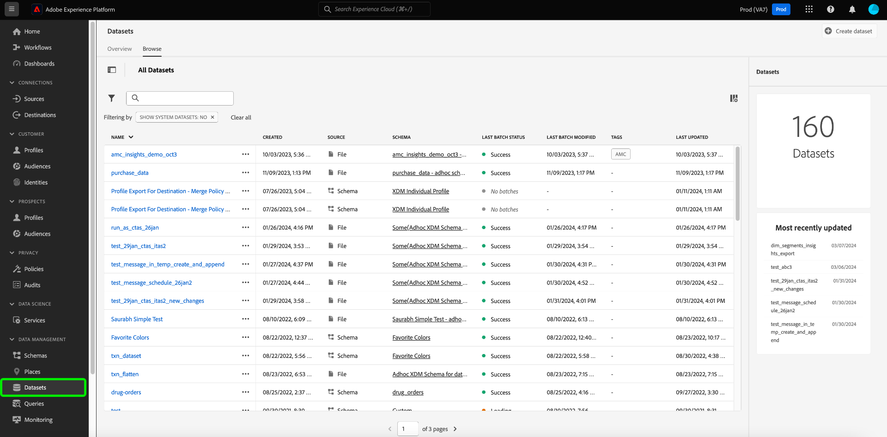

# 数据集UI指南

本用户指南提供了有关在Adobe Experience Platform用户界面中处理数据集时执行常见操作的说明。

## 快速入门

本用户指南需要对Adobe Experience Platform的以下组件有一定的了解：

* [数据集](overview.md):中数据持久性的存储和管理结构 [!DNL Experience Platform].
* [[!DNL Experience Data Model (XDM) System]](../../xdm/home.md):标准化框架， [!DNL Experience Platform] 组织客户体验数据。
   * [架构组合的基础知识](../../xdm/schema/composition.md):了解XDM模式的基本构建块，包括模式组合中的关键原则和最佳实践。
   * [架构编辑器](../../xdm/tutorials/create-schema-ui.md):了解如何使用 [!DNL Schema Editor] 在 [!DNL Platform] 用户界面。
* [[!DNL Real-Time Customer Profile]](../../profile/home.md):根据来自多个来源的汇总数据提供统一的实时客户资料。
* [[!DNL Adobe Experience Platform Data Governance]](../../data-governance/home.md):确保遵守有关使用客户数据的法规、限制和政策。

## 查看数据集 {#view-datasets}

>[!CONTEXTUALHELP]
>id="platform_datasets_negative_numbers"
>title="数据集活动中的负数"
>abstract="摄取的记录中的负数表示用户已在选定的时间范围内删除了某些批次。"
>text="Learn more in documentation"

在 [!DNL Experience Platform] UI，选择 **[!UICONTROL 数据集]** 在左侧导航中打开 **[!UICONTROL 数据集]** 功能板。 功能板列出了贵组织的所有可用数据集。 系统会为每个列出的数据集显示详细信息，包括其名称、数据集所遵循的架构以及最近摄取运行的状态。

默认情况下，只会显示已摄取到的数据集。 如果要查看系统生成的数据集，请启用 **[!UICONTROL 显示系统数据集]** 切换。 系统生成的数据集仅用于处理其他组件。 例如，系统生成的配置文件导出数据集用于处理配置文件功能板。

选择数据集的名称以访问其 **[!UICONTROL 数据集活动]** 屏幕，并查看您选择的数据集的详细信息。 活动选项卡包含一个图表，其中可视化了消息使用率，以及成功批次和失败批次的列表。

## 预览数据集

从 **[!UICONTROL 数据集活动]** 屏幕，选择 **[!UICONTROL 预览数据集]** 位于屏幕右上角附近，可预览多达100行数据。 如果数据集为空，则将停用预览链接，并改为表示预览不可用。

在预览窗口中，数据集架构的层次视图将显示在右侧。

要获取更可靠的数据访问方法，请 [!DNL Experience Platform] 提供下游服务，例如 [!DNL Query Service] 和 [!DNL JupyterLab] 来探索和分析数据。 有关更多信息，请参阅以下文档：

* [查询服务概述](../../query-service/home.md)
* [JupyterLab用户指南](../../data-science-workspace/jupyterlab/overview.md)

## 创建数据集 {#create}

要创建新数据集，请首先选择 **[!UICONTROL 创建数据集]** 在 **[!UICONTROL 数据集]** 功能板。

在下一个屏幕中，您将看到以下两个用于创建新数据集的选项：

* [从架构创建数据集](#schema)
* [从CSV文件创建数据集](#csv)

### 使用现有架构创建数据集 {#schema}

在 **[!UICONTROL 创建数据集]** 屏幕，选择 **[!UICONTROL 从架构创建数据集]** 创建新的空数据集。

的 **[!UICONTROL 选择架构]** 中。 浏览架构列表，选择数据集将遵循的架构，然后再选择 **[!UICONTROL 下一个]**.

的 **[!UICONTROL 配置数据集]** 中。 为数据集提供名称和可选描述，然后选择 **[!UICONTROL 完成]** 创建数据集。

### 使用CSV文件创建数据集 {#csv}

使用CSV文件创建数据集时，会创建一个临时架构，以为数据集提供与提供的CSV文件匹配的结构。 在 **[!UICONTROL 创建数据集]** 屏幕，选择 **[!UICONTROL 从CSV文件创建数据集]**.

的 **[!UICONTROL 配置]** 中。 为数据集提供名称和可选描述，然后选择 **[!UICONTROL 下一个]**.

的 **[!UICONTROL 添加数据]** 中。 通过将CSV文件拖放到屏幕的中心上传，或选择 **[!UICONTROL 浏览]** 浏览文件目录。 文件最多可以有十GB的大小。 上传CSV文件后，选择 **[!UICONTROL 保存]** 创建数据集。

>[!NOTE]
>
>CSV列名称必须以字母数字字符开头，并且只能包含字母、数字和下划线。

## 为实时客户用户档案启用数据集 {#enable-profile}

每个数据集都能够使用其摄取的数据扩充客户用户档案。 要实现此目的，数据集所遵循的架构必须兼容才能在中使用 [!DNL Real-Time Customer Profile]. 兼容的架构满足以下要求：

* 架构至少具有一个指定为标识属性的属性。
* 架构具有定义为主标识的标识属性。

有关为 [!DNL Profile]，请参阅 [架构编辑器用户指南](../../xdm/tutorials/create-schema-ui.md).

要为配置文件启用数据集，请访问其 **[!UICONTROL 数据集活动]** 屏幕并选择 **[!UICONTROL 用户档案]** 在 **[!UICONTROL 属性]** 列。 启用后，摄取到数据集的数据还将用于填充客户用户档案。

>[!NOTE]
>
>如果数据集已包含数据，且随后为 [!DNL Profile]，则现有数据不会被自动使用 [!DNL Profile]. 在为 [!DNL Profile]，则建议您重新摄取任何现有数据，以使其对客户配置文件做出贡献。

## 管理和强制管理数据集的数据

数据使用情况标签允许您根据应用于该数据的使用策略对数据集和字段进行分类。 请参阅 [数据管理概述](../../data-governance/home.md) 要了解有关标签的更多信息，或参阅 [数据使用标签用户指南](../../data-governance/labels/overview.md) ，以了解有关如何将标签应用于数据集的说明。

## 删除数据集

您可以通过先访问数据集来删除其 **[!UICONTROL 数据集活动]** 屏幕。 然后，选择 **[!UICONTROL 删除数据集]** 删除它。

>[!NOTE]
>
>由Adobe应用程序和服务(如Adobe Analytics、Adobe Audience Manager或 [!DNL Offer Decisioning])。

随即会出现确认框。 选择 **[!UICONTROL 删除]** 以确认删除数据集。

## 删除启用了配置文件的数据集

如果某个数据集已启用“配置文件”，则通过UI删除该数据集将从Platform中的数据湖、Identity Service和配置文件存储中将其删除。

您可以从 [!DNL Profile] 使用实时客户资料API仅存储（将数据保留在数据湖中）。 有关更多信息，请参阅 [配置文件系统作业API端点指南](../../profile/api/profile-system-jobs.md).

## 监测数据提取

在 [!DNL Experience Platform] UI，选择 **[!UICONTROL 监控]** 中。 的 **[!UICONTROL 监控]** 功能板允许您查看来自批量摄取或流式摄取的入站数据状态。 要查看单个批的状态，请选择 **[!UICONTROL 批量端到端]** 或 **[!UICONTROL 流式处理端到端]**. 功能板会列出所有批处理或流摄取运行，包括成功、失败或仍在进行的摄取。 每个列表都提供了批次的详细信息，包括批次ID、目标数据集的名称以及摄取的记录数。 如果为 [!DNL Profile]，则也会显示摄取的身份和用户档案记录数。

您可以在个人 **[!UICONTROL 批处理ID]** 访问 **[!UICONTROL 批量概述]** 功能板，并查看该批处理的详细信息，包括在该批次未能摄取时出现的错误日志。

如果要删除批，可以通过选择 **[!UICONTROL 删除批次]** 在功能板的右上方找到。 这样做还会从最初摄取批处理的数据集中删除其记录。

## 后续步骤

本用户指南提供了有关在中使用数据集时执行常见操作的说明 [!DNL Experience Platform] 用户界面。 有关执行常用操作的步骤 [!DNL Platform] 涉及数据集的工作流，请参阅以下教程：

* [使用API创建数据集](create.md)
* [使用数据访问API查询数据集数据](../../data-access/home.md)
* [使用API为实时客户配置文件和Identity服务配置数据集](../../profile/tutorials/dataset-configuration.md)
