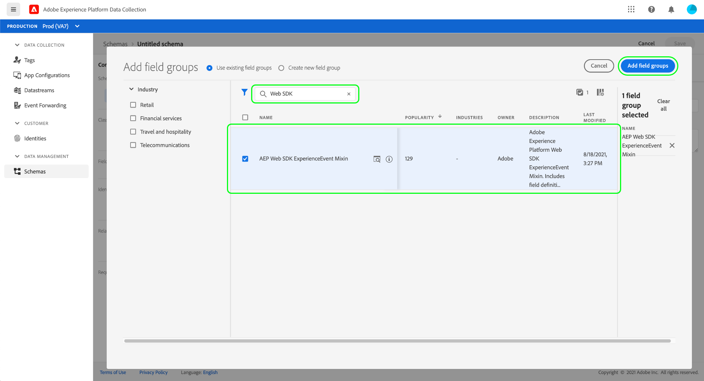
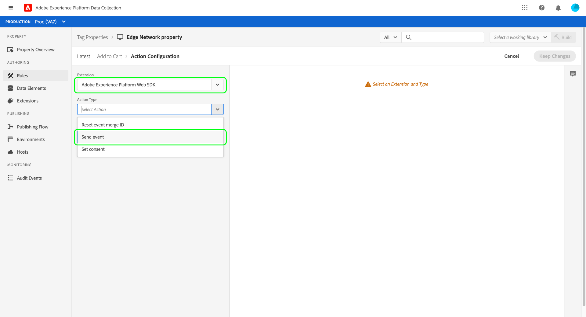

# Adobe Experience Platform数据收集端到端概述

Adobe Experience Platform数据收集提供了多种技术，可通力协作来收集将数据传输到其他Adobe产品或第三方目标。 要将事件数据从您的应用程序发送到Adobe Experience Platform边缘网络，请务必了解这些核心技术以及如何配置它们以在需要时将数据交付到所需的目标。

本指南提供了有关如何使用数据收集技术通过边缘网络发送事件的高级教程。 具体而言，本教程将演示在数据收集UI中安装和配置Adobe Experience Platform Web SDK标记扩展的步骤。

>[!NOTE]
>
>如果您不想使用标记，也可以选择手动安装和配置SDK，但周边步骤仍必须完成，如下所述。

## 先决条件

本教程使用数据收集UI创建模式、配置数据流并安装Web SDK。 要在UI中执行这些操作，必须授予您至少一个Web属性的访问权限以及以下[属性权限](../tags/ui/administration/user-permissions.md#property-rights):

* 开发
* 管理扩展

有关如何授予对属性和属性权限的访问权限的信息，请参阅[管理标记的权限指南](../tags/ui/administration/manage-permissions.md)。

要使用本指南中提到的各种数据收集产品，您还必须拥有数据流的访问权限以及创建和管理架构的功能。 如果您需要访问其中任一功能，请联系您的客户成功经理以帮助您获取必要的访问权限。 请注意，如果您尚未购买Adobe Experience Platform,Adobe将为您配置使用SDK的必要访问权限，而无需支付额外费用。

如果您已经拥有平台的访问权限，则必须确保在以下类别下启用所有[权限](../access-control/home.md#permissions):

* 数据建模
* 标识

请参阅[访问控制UI概述](../access-control/ui/overview.md) ，了解如何向用户授予Platform功能的权限。

## 流程摘要

为您的网站配置边缘网络的过程可概括如下：

1. [创建一](#schema) 个架构，以确定在将数据发送到边缘网络时数据的结构方式。
1. [创建数](#datastream) 据流以配置您希望将数据发送到的目标。
1. [安装并配置Web SDK，以](#sdk) 在网站上发生某些事件时将数据发送到数据流。

在能够将数据发送到边缘网络后，如果贵组织拥有该网络的许可证，您还可以选择[配置事件转发](#event-forwarding)。

## 创建架构 {#schema}

[体验数据模型(XDM)](../xdm/home.md) 是一种开源规范，它以架构的形式为数据提供通用结构和定义。换句话说，XDM是一种数据结构和格式化数据的方式，其方式可由Edge Network和其他Adobe Experience Cloud应用程序使用。

设置数据收集操作的第一步是创建一个XDM架构来表示您的数据。 在本教程的后续步骤中，您会将要发送的数据映射到此架构的结构。

>[!NOTE]
>
>XDM模式是可以非常自定义的。 下面概述的步骤不是过于明确，而是专门针对Web SDK的架构要求。 在这些参数之外，您可以根据需要定义数据的其余结构。

在数据收集UI的左侧导航中，选择&#x200B;**[!UICONTROL 架构]**。 从此处，您可以看到属于贵组织的先前创建的架构列表。 要继续，请选择&#x200B;**[!UICONTROL 创建架构]**，然后从下拉菜单中选择&#x200B;**[!UICONTROL XDM ExperienceEvent]**。

出现一个对话框，提示您开始向架构添加字段组。 要使用Web SDK发送事件，您必须添加字段组&#x200B;**[!UICONTROL AEP Web SDK ExperienceEvent Mixin]**。 此字段组包含由Web SDK库自动收集的数据属性的定义。

使用搜索栏缩小列表以帮助更轻松地查找此字段组。 找到该字段后，请在选择&#x200B;**[!UICONTROL 添加字段组]**&#x200B;之前，从列表中选择该字段。

此时会显示架构画布，其中显示了XDM架构的树结构，包括Web SDK字段组提供的字段。

选择树中的根字段以打开右边栏中的&#x200B;**[!UICONTROL 架构属性]**，您可以在此处提供架构的名称和可选描述。

如果要向架构添加更多字段，可以通过选择左边栏中&#x200B;**[!UICONTROL 字段组]**&#x200B;部分下的&#x200B;**[!UICONTROL 添加]**&#x200B;来执行此操作。

>[!NOTE]
>
>有关如何根据用例搜索不同字段组的详细步骤，请参阅XDM文档中关于[添加字段组](../xdm/ui/resources/schemas.md#add-field-groups)的指南。
>
>最佳做法是仅为您计划通过边缘网络发送的数据添加字段。 将字段添加到架构并保存该架构后，以后只能对架构进行附加更改。 有关更多信息，请参阅[架构演变规则](../xdm/schema/composition.md#evolution)一节。

添加所需字段后，选择&#x200B;**[!UICONTROL 保存]**&#x200B;以保存架构。

## 创建数据流 {#datastream}

数据流是一种配置，用于告知边缘网络您希望将数据发送到的位置。 具体而言，数据流指定要将数据发送到的Experience Cloud产品，以及希望如何处理数据并将其存储在每个产品中。

>[!NOTE]
>
>如果要使用[事件转发](../tags/ui/event-forwarding/overview.md)（假定贵组织已获得该功能的许可），则必须为数据流启用该功能，其方式与启用Adobe产品的方式相同。 [后面部分](#event-forwarding)中介绍了有关此过程的详细信息。

在数据收集UI中，选择&#x200B;**[!UICONTROL 数据流]**。 在此，您可以从列表中选择要编辑的现有数据流，也可以通过选择&#x200B;**[!UICONTROL 新建数据流]**&#x200B;来创建新配置。

数据流的配置要求取决于您将数据发送到的产品和功能。 有关每个产品配置选项的详细信息，请参阅[数据流概述](../edge/fundamentals/datastreams.md)。

## 安装和配置Web SDK

创建架构和数据流后，下一步是安装和配置Platform Web SDK以开始向边缘网络发送数据。

>[!NOTE]
>
>此部分使用数据收集UI配置Web SDK标记扩展，但您也可以改用原始代码安装和配置它。 有关更多信息，请参阅以下指南：
>
>* [安装SDK](../edge/fundamentals/installing-the-sdk.md)
>* [配置SDK](../edge/fundamentals/configuring-the-sdk.md)

>
>另请注意，即使您只想使用事件转发，您仍必须按照所述安装和配置SDK，然后才能在[稍后的步骤](#event-forwarding)中配置事件转发。

该过程可概括如下：

1. [在标记属性上安装Adobe Experience Platform Web SDK](#install-sdk) ，以获取其功能的访问权限。
1. [创建XDM对象数据元](#data-element) 素，以将网站上的变量映射到您之前创建的XDM架构的结构。
1. [创建一](#rule) 个规则以告知SDK何时应将数据发送到边缘网络。
1. [构建并安装库](#library) 以在您的网站上实施规则。

### 在标记资产上安装SDK {#install-sdk}

在左侧导航中选择&#x200B;**[!UICONTROL Tags]**&#x200B;以显示标记属性列表。 您可以根据需要选择要编辑的现有属性，也可以选择&#x200B;**[!UICONTROL New Property]**。

如果创建新属性，请提供描述性名称，并将[!UICONTROL Platform]设置为&#x200B;**[!UICONTROL Web]**。 为Web属性提供完整域，然后选择&#x200B;**[!UICONTROL Save]**。

此时会显示资产的概述页面。 从此处，在左侧导航中选择&#x200B;**[!UICONTROL Extensions]**，然后选择&#x200B;**[!UICONTROL Catalog]**。 查找Platform Web SDK的列表（或者使用搜索栏缩小结果范围），然后选择&#x200B;**[!UICONTROL Install]**。

此时会显示SDK的配置页面。 大多数必需值会自动填充默认值，您可以根据需要选择更改这些默认值。

但是，在安装SDK之前，您必须选择一个数据流，以便它知道要将数据发送到的位置。 在&#x200B;**[!UICONTROL Datastreams]**&#x200B;下，使用下拉菜单选择您在[前面的步骤](#datastream)中配置的数据流。 设置数据流后，选择&#x200B;**[!UICONTROL Save]**&#x200B;以完成将SDK安装到资产。

### 创建XDM数据元素 {#data-element}

为了使SDK将数据发送到边缘网络，该数据必须映射到您在[上一步](#schema)中创建的XDM架构。 此映射是通过使用数据元素来完成的。

在UI中，选择&#x200B;**[!UICONTROL 数据元素]**，然后选择&#x200B;**[!UICONTROL 新建数据元素]**。

在下一个屏幕中，选择[!UICONTROL Extension]下拉菜单下的&#x200B;**[!UICONTROL Adobe Experience Platform Web SDK]**，然后为数据元素类型选择&#x200B;**[!UICONTROL XDM对象]**。

将出现XDM对象类型的配置对话框。 该对话框会自动选择您的平台沙箱，从此处，您可以看到在该沙箱中创建的所有架构。 从列表中选择之前创建的XDM架构。

此时会显示架构的结构。 带有星号(**\***)的所有字段都表示在事件触发时自动填充的字段。 对于所有其他字段，您可以浏览架构的结构并填写其余数据。

>[!NOTE]
>
>上面的屏幕截图演示了如何通过在[!UICONTROL Value]字段中引用其名称(由百分比符号(`%`)包围)，将可从网站客户端全局访问的变量映射到XDM字段。`cartAbandonsTotal`
>
>您还可以使用之前创建的其他数据元素来填充这些字段。 有关更多信息，请参阅标记文档中关于[数据元素](../tags/ui/managing-resources/data-elements.md)的引用。

完成数据到架构的映射后，请在选择&#x200B;**[!UICONTROL Save]**&#x200B;之前为数据元素提供一个名称。

### 创建规则

保存数据元素后，下一步是创建一个规则，当您的网站上发生特定事件时（例如，客户将产品添加到购物车时），该规则会将其发送到边缘网络。

例如，此部分演示如何创建客户将项目添加到购物车时将触发的规则。 但是，您几乎可以为网站上可能发生的任何事件设置规则。

在左侧导航中选择&#x200B;**[!UICONTROL Rules]**，然后选择&#x200B;**[!UICONTROL 创建新规则]**。

在下一个屏幕中，提供规则的名称。 从此处，下一步是确定规则的事件（即规则何时触发）。 在[!UICONTROL Events]下选择&#x200B;**[!UICONTROL Add]**。

将显示事件配置页面。 要配置事件，必须先选择事件类型。 事件类型由扩展提供。 例如，要设置“表单提交”事件，请选择&#x200B;**[!UICONTROL Core]**&#x200B;扩展，然后选择&#x200B;**[!UICONTROL Form]**&#x200B;类别下的&#x200B;**[!UICONTROL Submit]**&#x200B;事件类型。 在显示的配置对话框中，您可以为希望此规则触发的特定表单提供CSS选择器。

>[!NOTE]
>
>有关AdobeWeb扩展提供的不同事件类型（包括如何配置事件类型）的更多信息，请参阅标记文档中的[Adobe扩展引用](../tags/extensions/web/overview.md)。

选择&#x200B;**[!UICONTROL Keep Changes]**&#x200B;以将事件添加到规则中。

此时将重新显示规则配置页面，其中显示已添加事件。 您可以通过向规则添加其他条件来缩小“[!UICONTROL If]”。

否则，下一步是为规则添加一个在触发时要执行的操作。 选择&#x200B;****&#x200B;下的&#x200B;**[!UICONTROL Actions]** Add以继续。

此时将显示操作配置页面。 要获取将数据发送到边缘网络的规则，请为该扩展选择&#x200B;**[!UICONTROL Adobe Experience Platform Web SDK]**，为操作类型选择&#x200B;**[!UICONTROL 发送事件]**。

屏幕会更新，以显示用于配置发送事件操作的其他选项。 在&#x200B;**[!UICONTROL Type]**&#x200B;下，可以提供自定义类型值来填充`eventType` XDM字段。 在&#x200B;**[!UICONTROL XDM数据]**&#x200B;下，提供您之前创建的XDM数据类型的名称（由百分比符号括起来），或选择数据库图标（）以从列表中选择该类型。 这是最终将发送到边缘网络的数据。

完成后，选择&#x200B;**[!UICONTROL Keep Changes]**。

配置完规则后，选择&#x200B;**[!UICONTROL Save]**&#x200B;以完成该过程。

### 构建和安装库 {#library}

配置规则后，您便可以将其添加到标记库，将该库构建到环境，然后在您的网站上安装该内部版本。

>[!NOTE]
>
>如果您尚未在数据收集UI中设置环境，则必须先设置环境，然后才能创建内部版本。 有关更多信息，请参阅标记文档中关于[为Web属性](../tags/ui/publishing/environments.md#web-configuration)配置环境的部分。

要了解如何创建库、将扩展和规则添加到库以及将该库构建到环境，请参阅标记文档中[管理库](../tags/ui/publishing/libraries.md)中的指南。 创建库时，请确保包含Platform Web SDK扩展以及之前创建的数据收集规则。

创建库并将其内部版本分配到环境后，即可在网站的客户端上安装该环境。 有关更多信息，请参阅[安装环境](../tags/ui/publishing/environments.md#installation)中的部分。

在网站上安装环境后，您可以使用Adobe Experience Platform Debugger[测试实施](../tags/ui/publishing/embed-code-testing.md)。

## 配置事件转发（可选） {#event-forwarding}

>[!NOTE]
>
>事件转发仅适用于已获得其许可的组织。

将SDK配置为将数据发送到边缘网络后，您可以设置事件转发以告知边缘网络您希望将数据发送到的位置。

要使用事件转发，您必须先创建事件转发属性。 在左侧导航中选择&#x200B;**[!UICONTROL 事件转发]**，然后选择&#x200B;**[!UICONTROL 新建属性]**。 在选择&#x200B;**[!UICONTROL Save]**&#x200B;之前，请提供属性的名称。

创建事件转发属性后，下一步是创建一个规则以确定应将数据发送到的位置。 事件转发属性的规则的构建方式与标记属性大致相同，但是无法指定任何事件（因为事件转发仅处理它直接从数据流接收的事件）。 对于规则的操作，您可以使用其中一个可用的事件转发扩展，也可以改用自定义代码来交付事件。

与之前类似，配置规则后，必须将其添加到库并将该库构建到环境。

生成完成后，最后一步是更新您[之前配置的](#datastream)数据流并启用事件转发。 要开始，请导航到&#x200B;**[!UICONTROL 数据流]**&#x200B;并从列表中选择相关的数据流。 从此处，启用事件转发的切换开关，并提供您刚刚配置的属性和环境的名称。

## 后续步骤

本指南提供了有关如何使用Platform Web SDK将数据发送到边缘网络的高级端到端概述。 有关所涉及各个组件和服务的更多信息，请参阅本指南中链接的文档。
