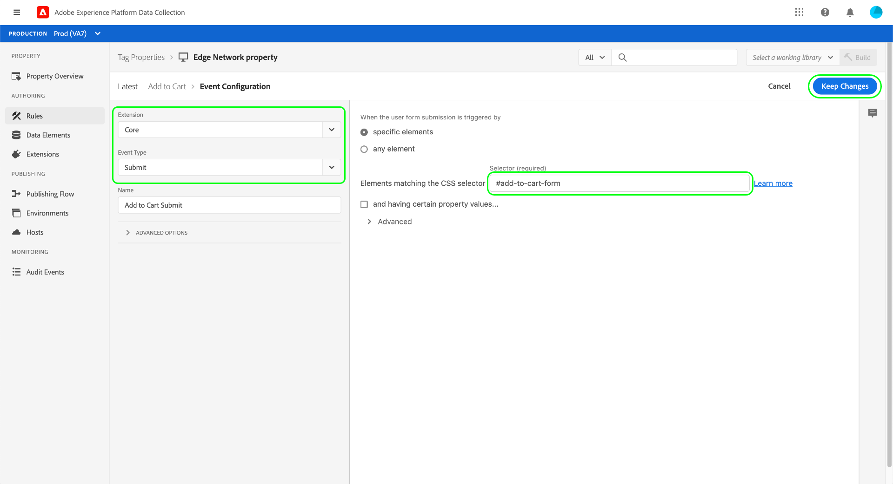

# 数据收集端到端概述

Adobe Experience Platform收集您的数据并将这些数据传输到其他Adobe产品和第三方目标。 要将应用程序中的事件数据发送到Experience Platform Edge Network，请务必了解这些核心技术以及如何配置这些技术，以在需要时将数据交付到所需的目标。

本指南提供了有关如何使用Experience Platform的数据收集功能通过Edge Network发送事件的高级教程。 具体而言，本教程将介绍在数据收集UI(以前称为Adobe Experience Platform Launch)中安装和配置Adobe Experience Platform Web SDK标记扩展的步骤。

>[!NOTE]
>
>如果您不想使用标记，也可以选择手动安装和配置SDK，但周围的步骤仍必须按照以下所述完成。
>
>所有涉及数据收集UI的步骤也可以在Experience Platform UI中执行。

## 先决条件

本教程使用数据收集UI创建架构、配置数据流和安装Web SDK。 要在UI中执行这些操作，必须至少向您授予一个Web属性的访问权限以及以下[属性权限](../tags/ui/administration/user-permissions.md#property-rights)：

* 开发
* 管理扩展

请参阅有关[管理数据收集的权限](./permissions.md)的指南，了解如何授予对属性和属性权限的访问权限。

要使用本指南中提到的各种数据收集产品，您还必须有权访问数据流，并能够创建和管理架构。 如果您需要访问其中任何一项功能，请联系您的Adobe帐户团队帮助您获得所需的访问权限。 请注意，如果您尚未购买Adobe Experience Platform，Adobe将为您提供使用SDK所需的访问权限，而不需支付额外费用。

如果您已经有权访问Experience Platform，则必须确保已启用以下类别下的所有[权限](../access-control/home.md#permissions)：

* 数据建模
* 身份标识

请参阅[访问控制UI概述](../access-control/ui/overview.md)，了解如何向用户授予Experience Platform功能的权限。

## 流程摘要

为您的网站配置数据收集的过程可概括如下：

1. [创建架构](#schema)，以确定将数据发送到Edge Network时的结构方式。
1. [创建数据流](#datastream)以配置要将数据发送到哪些目标。
1. [安装并配置Web SDK](#sdk)，以便在网站上发生某些事件时将数据发送到数据流。

将数据发送到Edge Network后，如果贵组织拥有事件转发的许可证，您还可以选择[配置事件转发](#event-forwarding)。

## 创建架构 {#schema}

[体验数据模型(XDM)](../xdm/home.md)是一个开源规范，为架构形式的数据提供通用结构和定义。 换言之，XDM是一种以可由Edge Network和其他Adobe Experience Cloud应用程序操作的方式构造和格式化您的数据的方式。

设置数据收集操作的第一步是创建XDM架构来表示您的数据。 在本教程的后一步中，您将将要发送的数据映射到此架构的结构。

>[!NOTE]
>
>XDM架构非常可自定义。 下面列出的步骤不是过于规范化，而是专门针对Web SDK的架构要求。 在这些参数之外，您可以随意定义数据的其余结构。

在UI的左侧导航中选择&#x200B;**[!UICONTROL 架构]**。 从这里，您可以看到以前创建的属于贵组织的架构列表。 若要继续，请选择&#x200B;**[!UICONTROL 创建架构]**，然后从下拉菜单中选择&#x200B;**[!UICONTROL XDM ExperienceEvent]**。


将出现一个对话框，提示您开始向架构添加字段组。 要使用Web SDK发送事件，您必须添加字段组&#x200B;**[!UICONTROL AEP Web SDK ExperienceEvent Mixin]**。 此字段组包含由Web SDK库自动收集的数据属性的定义。

使用搜索栏缩小列表范围有助于更轻松地查找此字段组。 找到后，请先从列表中选择它，然后选择&#x200B;**[!UICONTROL 添加字段组]**。


此时会出现架构画布，显示XDM架构的树结构，包括Web SDK字段组提供的字段。


选择树中的根字段以打开右边栏中的&#x200B;**[!UICONTROL 架构属性]**，您可以在其中提供架构的名称和可选描述。


如果要向架构添加更多字段，可以通过选择左边栏中&#x200B;**[!UICONTROL 字段组]**&#x200B;部分下的&#x200B;**[!UICONTROL 添加]**&#x200B;来执行该操作。


>[!NOTE]
>
>有关如何搜索不同的字段组以符合您的用例的详细步骤，请参阅XDM文档中有关[添加字段组](../xdm/ui/resources/schemas.md#add-field-groups)的指南。
>
>最佳实践为计划通过Edge Network发送的数据仅添加字段。 将字段添加到架构并保存它后，只能对架构进行额外的更改。 有关详细信息，请参阅架构演化[规则](../xdm/schema/composition.md#evolution)部分。

添加所需的字段后，选择&#x200B;**[!UICONTROL 保存]**&#x200B;以保存架构。


## 创建数据流 {#datastream}

数据流是一种配置，用于告知Edge Network您希望将数据发送到的位置。 具体而言，数据流会指定要将数据发送到哪些Experience Cloud产品，以及您希望如何在每个产品中处理和存储数据。

>[!NOTE]
>
>如果要使用[事件转发](../tags/ui/event-forwarding/overview.md)（假设您的组织已获得使用相关功能的许可），则必须使用启用Adobe产品的相同方式为数据流启用该功能。 有关此进程的详细信息，请参阅[后面的部分](#event-forwarding)。

在左侧导航中选择&#x200B;**[!UICONTROL 数据流]**。 在此处，您可以从列表中选择要编辑的现有数据流，也可以通过选择&#x200B;**[!UICONTROL 新建数据流]**&#x200B;来创建新的配置。


数据流的配置要求取决于要将数据发送到的产品和功能。 有关每个产品的配置选项的详细信息，请参阅[数据流概述](../datastreams/overview.md)。

## 安装和配置Web SDK {#install}

创建架构和数据流后，下一步是安装和配置Experience Platform Web SDK，以开始将数据发送到Edge Network。

>[!NOTE]
>
>此部分使用数据收集UI来配置Web SDK标记扩展，但您也可以使用原始代码来安装和配置该扩展。 有关更多信息，请参阅以下指南：
>
>* [安装SDK](/help/web-sdk/install/overview.md)
>* [配置SDK](/help/web-sdk/commands/configure/overview.md)
>
>另请注意，即使您只想使用事件转发，您仍必须按照相关说明安装和配置SDK，然后才能在[后续步骤](#event-forwarding)中配置事件转发。

该过程可概括如下：

1. [在标记属性](#install-sdk)上安装Adobe Experience Platform Web SDK以获取其功能的访问权限。
1. [创建XDM对象数据元素](#data-element)以将网站上的变量映射到您之前创建的XDM架构的结构。
1. [创建规则](#rule)以告知SDK应何时将数据发送到Edge Network。
1. [生成并安装库](#library)以在您的网站上实施该规则。

### 在标记属性上安装SDK {#install-sdk}

在左侧导航中选择&#x200B;**[!UICONTROL 标记]**&#x200B;以显示标记属性列表。 您可以根据需要选择要编辑的现有属性，也可以选择&#x200B;**[!UICONTROL 新建属性]**。


如果创建新属性，请提供描述性名称并将[!UICONTROL Platform]设置为&#x200B;**[!UICONTROL Web]**。 提供Web属性的完整域，然后选择&#x200B;**[!UICONTROL 保存]**。


此时会显示该资产的概述页面。 在此处，在左侧导航中选择&#x200B;**[!UICONTROL 扩展]**，然后选择&#x200B;**[!UICONTROL 目录]**。 查找Experience Platform Web SDK的列表（可以选择使用搜索栏缩小结果范围）并选择&#x200B;**[!UICONTROL 安装]**。


此时将显示SDK的配置页面。 大多数必需值都会自动填充默认值，您可以根据需要选择更改这些默认值。


但是，在安装SDK之前，您必须选择一个数据流，以便它知道要将您的数据发送到何处。 在&#x200B;**[!UICONTROL 数据流]**&#x200B;下，使用下拉菜单选择您在[之前的步骤](#datastream)中配置的数据流。 设置数据流后，选择&#x200B;**[!UICONTROL 保存]**&#x200B;以完成将SDK安装到资产。


### 创建XDM数据元素 {#data-element}

为了使SDK将数据发送到Edge Network，该数据必须映射到您在[上一步](#schema)中创建的XDM架构。 此映射通过使用数据元素来完成。

在UI中，选择&#x200B;**[!UICONTROL 数据元素]**，然后选择&#x200B;**[!UICONTROL 新建数据元素]**。


在下一个屏幕上，选择[!UICONTROL 扩展]下拉菜单下的&#x200B;**[!UICONTROL Adobe Experience Platform Web SDK]**，然后为数据元素类型选择&#x200B;**[!UICONTROL XDM对象]**。


此时会出现XDM对象类型的配置对话框。 该对话框会自动选择您的Experience Platform沙盒，在这里，您可以看到在该沙盒中创建的所有架构。 从列表中选择您之前创建的XDM架构。


此时将显示架构的结构。 所有带有星号(**\***)的字段都表示事件触发时将自动填充的字段。 对于所有其他字段，您可以浏览架构的结构并填写其余数据。


>[!NOTE]
>
>上面的屏幕截图演示了如何通过在[!UICONTROL 值]字段中引用全局可访问变量名称(由百分比符号(`%`)括起来)，将其从网站(`cartAbandonsTotal`)的客户端映射到XDM字段。
>
>您还可以使用其他以前创建的数据元素来填充这些字段。 有关详细信息，请参阅标记文档中有关[数据元素](../tags/ui/managing-resources/data-elements.md)的引用。

完成将数据映射到架构后，请先提供数据元素的名称，然后再选择&#x200B;**[!UICONTROL 保存]**。


### 创建规则

保存数据元素后，下一步是创建一个规则，每当网站上发生特定事件（例如，当客户将产品添加到购物车时）时，该规则会将其发送到Edge Network。

您可以为网站上发生的几乎任何事件设置规则。 例如，本节将演示如何创建客户提交表单时将触发的规则。 以下HTML表示一个具有“添加到购物车”表单的简单网页，该表单将是规则的主题：

```html
<!DOCTYPE html>
<html>
<body>

  <form id="add-to-cart-form">
    <label for="item">Product:</label><br>
    <input type="text" id="item" name="item"><br>
    <label for="amount">Amount:</label><br>
    <input type="number" id="amount" name="amount" value="1"><br><br>
    <input type="submit" value="Add to Cart">
  </form> 

</body>
</html>
```

在数据收集UI中，在左侧导航中选择&#x200B;**[!UICONTROL 规则]**，然后选择&#x200B;**[!UICONTROL 创建新规则]**。


在下一个屏幕上，提供规则的名称。 在此，下一步是确定规则的事件（换句话说，规则将触发的时间）。 选择[!UICONTROL 事件]下的&#x200B;**[!UICONTROL 添加]**。


此时将显示事件配置页面。 要配置事件，必须首先选择事件类型。 事件类型由扩展提供。 要设置“表单提交”事件，例如，选择&#x200B;**[!UICONTROL Core]**&#x200B;扩展，然后在&#x200B;**[!UICONTROL 表单]**&#x200B;类别下选择&#x200B;**[!UICONTROL 提交]**&#x200B;事件类型。

>[!NOTE]
>
>有关Adobe Web扩展提供的各种事件类型（包括如何配置它们）的更多信息，请参阅标记文档中的[Adobe扩展参考](../tags/extensions/client/overview.md)。

表单提交事件允许您使用[CSS选择器](https://www.w3schools.com/css/css_selectors.asp)引用要触发的规则的特定元素。 在下面的示例中，使用了ID `add-to-cart-form`，因此此规则仅在“添加到购物车”表单中触发。 选择&#x200B;**[!UICONTROL Keep Changes]**&#x200B;以将事件添加到规则。



此时将重新显示规则配置页面，其中显示该事件已添加。 您可以通过向规则添加更多条件来缩小&quot;[!UICONTROL If]&quot;的范围。

否则，下一步是添加一个操作，以便规则在触发时执行。 选择&#x200B;**[!UICONTROL 操作]**&#x200B;下的&#x200B;**[!UICONTROL 添加]**&#x200B;以继续。


此时将显示操作配置页面。 要获取将数据发送到Edge Network的规则，请为扩展选择&#x200B;**[!UICONTROL Adobe Experience Platform Web SDK]**，为操作类型选择&#x200B;**[!UICONTROL 发送事件]**。


屏幕将更新，以显示用于配置发送事件操作的其他选项。 在&#x200B;**[!UICONTROL 类型]**&#x200B;下，您可以提供自定义类型值以填充`eventType` XDM字段。 在&#x200B;**[!UICONTROL XDM数据]**&#x200B;下，提供您之前创建的XDM数据类型的名称（由百分比符号括起来），或者选择数据库图标（）以从列表中选择它。 最终发送到Edge Network的数据。

完成时选择&#x200B;**[!UICONTROL 保留更改]**。


配置完规则后，选择&#x200B;**[!UICONTROL 保存]**&#x200B;以完成该过程。


### 生成并安装库 {#library}

配置规则后，您可以将其添加到标记库，将该库构建到环境，并在您的网站上安装该版本。

>[!NOTE]
>
>如果尚未在数据收集UI中设置环境，则必须先设置环境，然后才能创建内部版本。 有关详细信息，请参阅标记文档中有关[为Web属性配置环境](../tags/ui/publishing/environments.md#web-configuration)的部分。

要了解如何创建库、将扩展和规则添加到库以及将该库生成到环境，请参阅标记文档中的[管理库](../tags/ui/publishing/libraries.md)指南。 创建库时，请确保包含Experience Platform Web SDK扩展以及您之前创建的数据收集规则。

创建库并将其内部版本分配给环境后，便可以在网站的客户端上安装该环境。 有关详细信息，请参阅有关[安装环境](../tags/ui/publishing/environments.md#installation)的部分。

在网站上安装环境后，您可使用Adobe Experience Platform Debugger [测试实施](../tags/ui/publishing/embed-code-testing.md)。

## 配置事件转发（可选） {#event-forwarding}

>[!NOTE]
>
>事件转发仅适用于已获得相应许可的组织。

在配置SDK以将数据发送到Edge Network后，您可以设置事件转发以告知Edge Network您希望将数据发送到何处。

要使用事件转发，必须先创建事件转发属性。 在左侧导航中选择&#x200B;**[!UICONTROL 事件转发]**，然后选择&#x200B;**[!UICONTROL 新建属性]**。 在选择&#x200B;**[!UICONTROL 保存]**&#x200B;之前提供属性的名称。

创建事件转发属性后，下一步就是创建一个规则以确定发送数据的位置。 事件转发属性的规则的构建方式与标记属性非常相似，只是不能指定任何事件（因为事件转发仅处理它直接从数据流接收的事件）。 对于规则的操作，您可以使用某个可用的事件转发扩展，也可以使用自定义代码来交付事件。


与之前类似，配置规则后，必须将其添加到库并将该库生成到环境。

生成完成后，最后一步是更新您[之前配置的数据流](#datastream)并启用事件转发。 要开始，请导航到&#x200B;**[!UICONTROL 数据流]**&#x200B;并从列表中选择相关的数据流。 从此处，启用事件转发的切换开关，并提供刚刚配置的属性和环境的名称。


## 后续步骤

本指南提供了有关如何使用Experience Platform Web SDK将数据发送到Edge Network的高级端到端概述。 请参阅本指南中链接的文档，了解有关所涉及各种组件和服务的更多信息。
