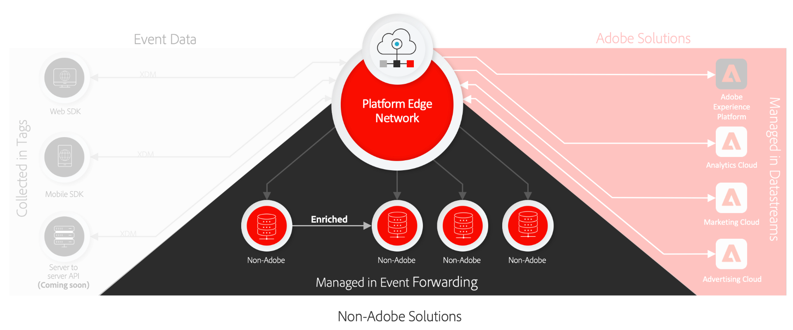

# 数据收集概述

Adobe Experience Platform提供了一套技术，允许您从客户端源收集客户体验数据，并将其发送到Adobe Experience Platform边缘网络，在该网络中，可以在几秒内对数据进行扩充、转换并分发到Adobe或非Adobe目标。

以下客户端源支持数据收集：

* 基于Web的应用程序
* 本机移动设备应用程序
* 过顶(OTT)应用程序

数据收集重点关注已摄取数据集的可发现性和可访问性，其中包括以下内容：

* [Adobe Experience Platform边缘网络](https://experienceleague.adobe.com/docs/web-sdk-learn/tutorials/introduction-to-web-sdk-and-edge-network.html)
* [标记](../tags/home.md)
* [数据流](../edge/datastreams/overview.md)
* [事件转发](../tags/ui/event-forwarding/overview.md)
* [Adobe Experience Platform Web SDK](../edge/home.md)
* [Adobe Experience Platform Mobile SDK](https://aep-sdks.gitbook.io/docs/)
* [Adobe Experience Platform Debugger](https://chrome.google.com/webstore/detail/adobe-experience-platform/bfnnokhpnncpkdmbokanobigaccjkpob?hl=en)
* [体验数据模型(XDM)](../xdm/home.md)
* [Adobe Experience Platform Identity Service](../identity-service/home.md)

本指南简要介绍数据收集以及如何通过Platform Edge Network将数据发送到Adobe Experience Cloud产品和非Adobe应用程序。

## 标记、Web SDK和Mobile SDK

Platform Web SDK和Platform Mobile SDK分别折叠所有Adobe产品库并将其压缩为适用于Web平台和移动平台的单个开发工具包。 这些功能可以使用原始代码或使用 [标记](../tags/home.md) 通过数据收集UI。

压缩这些库可加快数据收集速度，并将操作整合到从客户端设备到平台边缘网络的单个流中。

## 平台边缘网络和数据流 {#edge}

Platform Edge Network是一个全球分布式、快速、可靠的服务器网络，能够大规模接收和处理数据。 使用标记，您可以设置 [数据流](../edge/datastreams/overview.md) 适用于Adobe Target、Adobe Audience Manager和Adobe Analytics等产品，它们允许您在服务器端激活这些产品，而无需更改客户端代码。

>[!NOTE]
>
>有关平台边缘网络的高级介绍，请参阅以下内容 [交互式产品导览](https://adobe-ideacloud.forgedx.com/adobe-adobe-edge-collection/adobe-experience-edge/public/mx?SUID=hgb1a48ICSCpbM6MzBYHbxnsh9DgjUy1).

## 事件转发

[事件转发](../tags/ui/event-forwarding/overview.md) 可以点按任何Experience Platform数据流，从而允许您以极低的延迟转换、扩充数据并将数据发送到任何非Adobe目标，而无需向客户端设备添加任何第三方代码。

>[!NOTE]
>
>事件转发是一项付费功能，仅作为Real-time Customer Data Platform连接产品的一部分提供。

## 后续步骤

本文档简要概述了数据收集的工作方式，以自动将收集的客户体验数据发送到Adobe产品和第三方目标的过程。

有关通过边缘网络发送事件数据涉及的常规工作流的更多信息，请参阅 [端到端概述](./e2e.md).
