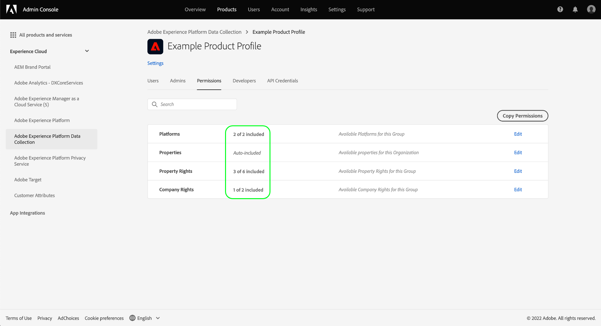

# Experience Platform中数据收集的权限管理

[Adobe Experience Platform中的数据收集](./home.md) 由多种不同的技术组成，可共同收集和传输您的数据。 在Adobe Admin Console中，可通过基于角色的细粒度权限来控制对这些技术的访问。

本指南向您说明如何管理数据收集功能的权限。

## 快速入门

要为数据收集配置访问控制，您必须对与Adobe Experience Platform数据收集集成产品的组织具有管理员权限。 可以授予或撤销权限的最小角色为 **产品配置文件管理员**. 可以管理权限的其他管理员角色包括 **产品管理员** （可以管理产品中的所有配置文件）和 **系统管理员** （无限制）。 请参阅以下文章： [管理角色](https://helpx.adobe.com/enterprise/using/admin-roles.html) 有关更多信息，请参阅Adobe企业管理指南。

本指南假定您熟悉产品配置文件等基本Admin Console概念，并熟悉它们如何将产品权限授予各个用户和组。 欲了解更多信息，请参见 [Admin Console用户指南](https://helpx.adobe.com/cn/enterprise/using/admin-console.html).

## 可用权限

数据收集的相关权限通过Admin Console中的两个产品名称提供： **Adobe Experience Platform** 和 **Adobe Experience Platform数据收集**. 以下各节概述了每个产品下提供的权限，以及这些产品授予访问权限的特定功能的描述。

### Adobe Experience Platform权限

Adobe Experience Platform下的权限包括访问数据流、身份、架构和沙盒。 有关如何配置Adobe Experience Platform权限的步骤，请参阅 [访问控制用户指南](../access-control/ui/overview.md).

| 类别 | 权限 | 描述 |
| --- | --- | --- |
| 沙盒 | (不适用) | 根据 [沙盒](../sandboxes/home.md) 创建的任何其他组，您可以通过Admin Console中的此权限类别来控制对每组的访问权限。 |
| 数据建模 | 管理架构 | 授予查看、创建和编辑的能力 [Experience Data Model (XDM)架构](../xdm/home.md). |
| 数据建模 | 查看架构 | 授予对架构的只读访问权限。 |
| Identity Management | 管理身份命名空间 | 授予查看、创建和编辑的能力 [身份命名空间](../identity-service/namespaces.md). |
| Identity Management | 查看标识命名空间 | 授予对身份命名空间的只读访问权限。 |
| 数据收集 | 管理数据流 | 授予查看、创建和编辑的能力 [数据流](../edge/datastreams/overview.md). |
| 数据收集 | 查看数据流 | 授予对数据流的只读访问权限。 |

{style="table-layout:auto"}

### Adobe Experience Platform数据收集权限

Adobe Experience Platform数据收集下的权限控制对标记和事件转发功能（包括属性、扩展和环境）的访问。 有关如何配置Adobe Experience Platform数据收集权限的步骤，请参阅 [以下部分](#manage).

| 类别 | 权限 | 描述 |
| --- | --- | --- |
| 平台 | Web | 授予对的访问权限 [Web属性](../tags/ui/administration/companies-and-properties.md) 与其他资产权利结合使用时。 |
| 平台 | 移动设备 | 授予对的访问权限 [移动资产](../tags/ui/administration/companies-and-properties.md) 与其他资产权利结合使用时。 |
| 平台 | Edge | 授予对的访问权限 [事件转发边缘属性](../tags/ui/event-forwarding/getting-started.md) 与其他资产权利结合使用时。 |
| 属性 | (不适用) | 根据已在您的组织下创建的资产，您可以通过Admin Console中的此权限类别控制对其中每个资产的访问。  用户分配的资产权限仅适用于他们通过此权限类别被授予访问权限的资产。 |
| 资产权限 | 批准 | 允许将库内部版本审批为 [发布流](../tags/ui/publishing/publishing-flow.md). |
| 资产权限 | 开发 | 允许将库内部版本开发为 [发布流](../tags/ui/publishing/publishing-flow.md). |
| 资产权限 | 编辑属性 | 允许编辑用户有权访问的属性的基本配置。 |
| 资产权限 | 管理环境 | 授予管理 [环境](../tags/ui/publishing/environments.md) 对于用户有权访问的属性。 |
| 资产权限 | 管理扩展 | 授予管理 [扩展](../tags/ui/managing-resources/extensions/overview.md) 对于用户有权访问的属性。 |
| 资产权限 | 发布 | 允许将库内部版本发布为 [发布流](../tags/ui/publishing/publishing-flow.md). |
| 公司权限 | 开发扩展 | 允许创建和修改组织拥有的扩展包，包括私有版本和公共发布请求。 |
| 公司权限 | 管理扩展 | 此权限仅适用于您拥有Adobe Journey Optimizer或其他解决方案的许可证，且该许可证授予对移动应用程序内消息和推送消息的访问权限。 这允许您管理Adobe Experience Cloud知道的应用程序，以及与Firebase Cloud Messaging服务和Apple推送通知服务通信所需的推送凭据。 |

{style="table-layout:auto"}

>[!NOTE]
>
>有关这些权限如何影响标记中功能的更多信息，包括常见场景的管理策略，请参阅关于以下主题的标记文档： [用户权限](../tags/ui/administration/user-permissions.md).

## 管理权限 {#manage}

数据收集的权限通过两种产品名称进行管理： **Adobe Experience Platform** 和 **Adobe Experience Platform数据收集**.

有关如何管理Admin Console中每个产品下的相关权限的步骤，请参阅以下子部分：

* [Adobe Experience Platform权限](#manage-platform)
* [Adobe Experience Platform数据收集权限](#manage-collection)

### 在Adobe Experience Platform下管理权限 {#manage-platform}

从 **[!UICONTROL 权限]** Adobe Experience Platform区域，选择要编辑的角色。

要访问数据收集功能，您必须启用 **[!UICONTROL 沙盒]**， **[!UICONTROL 数据建模]**， **[!UICONTROL Identity Management]**、和 **[!UICONTROL 数据收集]** 类别。

请参阅 [访问控制UI指南](../access-control/ui/overview.md) 有关管理Platform权限的详细说明。

>[!NOTE]
>
>根据您的组织有权访问的产品SKU，您可能没有每个平台权限都可用。

### 在Adobe Experience Platform数据收集下管理权限 {#manage-collection}

要管理这些权限，请登录Admin Console并选择 **[!UICONTROL 产品]** 从顶部导航中，然后选择 **[!UICONTROL Adobe Experience Platform数据收集]**.

#### 选择或创建产品配置文件

下一个屏幕显示贵组织下数据收集的可用产品配置文件列表，默认配置文件为 **[!DNL Default Data Collection All Access]**. 您可以根据需要选择编辑默认的产品配置文件，也可以选择 **[!UICONTROL 新建配置文件]** 创建一个。 如果您的组织中有多个需要不同级别访问权限的角色或用户组，则应为每个角色或用户组创建单独的产品配置文件。

选择或创建产品配置文件后，您可以使用 **[!UICONTROL 编辑]** 开始图标 [编辑权限](#edit-permissions) ，或选择 **[!UICONTROL 用户]** 制表符开始 [分配用户](#assign-users) 到个人资料。

#### 编辑产品配置文件的权限 {#edit-permissions}

编辑配置文件的权限时，可用权限将列在左列，而配置文件中包含的权限将列在右列。 选择列出的权限可在任一列之间移动它们。

权限可划分为不同的类别。 要在类别之间切换，请从左侧导航中选择所需的类别。

选择 **[!UICONTROL 保存]** 配置完权限后。

产品配置文件视图会重新显示，并反映添加的权限。

#### 将用户分配给产品配置文件 {#assign-users}

要将用户分配给产品配置文件（并授予他们配置文件配置的权限），请选择 **[!UICONTROL 用户]** 选项卡，然后 **[!UICONTROL 添加用户]**.

有关管理产品配置文件的用户的更多信息，请参阅 [Admin Console文档](https://helpx.adobe.com/enterprise/using/manage-product-profiles.html).

## 后续步骤

本指南介绍了数据收集的可用权限以及如何通过Admin Console管理这些权限。 有关管理其他Adobe Experience Platform功能的权限的更多信息，请参阅 [访问控制文档](../access-control/home.md).
