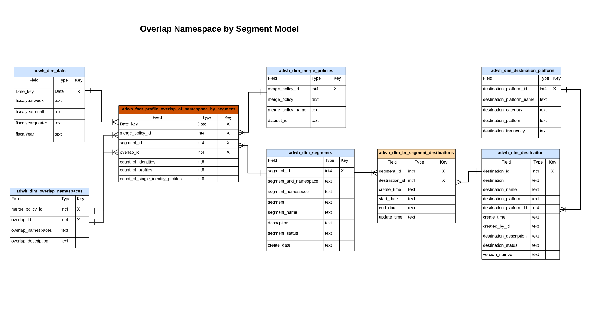

# Real-time Customer Data Platform Insights数据模型

Real-time Customer Data Platform分析数据模型功能公开了数据模型和SQL，它们为各种配置文件、目标和分段小组件提供了分析支持。 您可以自定义这些SQL查询模板，以为您的营销和关键绩效指标(KPI)用例创建Real-Time CDP报表。 然后，这些分析可用作用户定义的功能板的自定义小组件。 请参阅查询加速存储报告分析文档以了解 [如何通过查询服务构建报表分析数据模型，以与加速存储数据和用户定义的功能板一起使用](../query-service/query-accelerated-store/reporting-insights-data-model.md).

## 先决条件

本指南需要对 [用户定义的功能板功能](./user-defined-dashboards.md). 在继续阅读本指南之前，请阅读相关文档。

## Real-Time CDP insight报表和用例

Real-Time CDP报表可深入分析您的用户档案数据及其与区段和目标的关系。 开发了各种星型模式模型来回答各种常见的营销用例，每个数据模型都可以支持多个用例。

>[!IMPORTANT]
>
>用于Real-Time CDP报告的数据对于选定的合并策略和最近的每日快照而言是准确的。

### 轮廓模型 {#profile-model}

配置文件模型由三个数据集组成：

- `adwh_dim_date`
- `adwh_fact_profile`
- `adwh_dim_merge_policies`

下图包含每个数据集中的相关数据字段。


#### 用户档案计数用例

配置文件计数小组件使用的逻辑可返回拍摄快照时“配置文件存储”中合并的配置文件的总数。 请参阅 [[!UICONTROL 用户档案计数] 小组件文档](./guides/profiles.md#profile-count) 以了解更多信息。

生成 [!UICONTROL 用户档案计数] 小组件显示在下面的可折叠部分中。

+++SQL查询

```sql
SELECT adwh_dim_merge_policies.merge_policy_name,
  sum(adwh_fact_profile.count_of_profiles) CNT
FROM qsaccel.profile_agg.adwh_fact_profile
LEFT OUTER JOIN qsaccel.profile_agg.adwh_dim_merge_policies ON adwh_dim_merge_policies.merge_policy_id=adwh_fact_profile.merge_policy_id
WHERE adwh_fact_profile.date_key='${lastProcessDate}'
AND adwh_fact_profile.merge_policy_id=${mergePolicyId}
GROUP BY adwh_dim_merge_policies.merge_policy_name;
```

+++

#### 单个身份配置文件用例

用于 [!UICONTROL 单个身份配置文件] 小组件会提供贵组织仅具有一种类型的ID类型来创建其身份的用户档案计数。 请参阅[[!UICONTROL 单个身份配置文件] 小组件文档](./guides/profiles.md#single-identity-profiles) 以了解更多信息。

生成 [!UICONTROL 单个身份配置文件] 小组件显示在下面的可折叠部分中。

+++SQL查询

```sql
SELECT adwh_dim_merge_policies.merge_policy_name,
  sum(adwh_fact_profile.count_of_Single_Identity_profiles) CNT
FROM QSAccel.profile_agg.adwh_fact_profile
LEFT OUTER JOIN QSAccel.profile_agg.adwh_dim_merge_policies ON adwh_dim_merge_policies.merge_policy_id=adwh_fact_profile.merge_policy_id
WHERE adwh_fact_profile.date_key='${lastProcessDate}'
  AND adwh_fact_profile.merge_policy_id =${mergePolicyId}
GROUP BY adwh_dim_merge_policies.merge_policy_name;
```

+++

### 命名空间模型 {#namespace-model}

命名空间模型由以下数据集组成：

- `adwh_fact_profile_by_namespace`
- `adwh_dim_date`
- `adwh_dim_namespaces`
- `adwh_dim_merge_policies`

下图包含每个数据集中的相关数据字段。


#### 按身份用例划分的用户档案

的 [!UICONTROL 按身份划分的用户档案] 小组件可显示“配置文件存储区”中所有合并配置文件的身份划分。 请参阅 [[!UICONTROL 按身份划分的用户档案] 小组件文档](./guides/profiles.md#profiles-by-identity) 以了解更多信息。

生成 [!UICONTROL 按身份划分的用户档案] 小组件显示在下面的可折叠部分中。

+++SQL查询

```sql
SELECT adwh_dim_namespaces.namespace_description,
    sum(adwh_fact_profile_by_namespace.count_of_profiles) count_of_profiles
FROM qsaccel.profile_agg.adwh_fact_profile_by_namespace
JOIN qsaccel.profile_agg.adwh_dim_namespaces ON adwh_fact_profile_by_namespace.namespace_id = adwh_dim_namespaces.namespace_id
AND adwh_fact_profile_by_namespace.merge_policy_id = adwh_dim_namespaces.merge_policy_id
WHERE adwh_fact_profile_by_namespace.merge_policy_id =${mergePolicyId}
AND adwh_fact_profile_by_namespace.date_key = '${lastProcessDate}'
GROUP BY adwh_fact_profile_by_namespace.date_key,
        adwh_fact_profile_by_namespace.merge_policy_id,
        adwh_dim_namespaces.namespace_description
ORDER BY count_of_profiles DESC
LIMIT 5;
```

+++

#### 按身份用例划分的单个身份配置文件

用于 [!UICONTROL 按身份划分的单个身份配置文件] 小组件显示仅使用单个唯一标识符标识的用户档案总数。 请参阅 [按身份小组件划分的单个身份配置文件文档](./guides/profiles.md#single-identity-profiles-by-identity) 以了解更多信息。

生成 [!UICONTROL 按身份划分的单个身份配置文件] 小组件显示在下面的可折叠部分中。

+++SQL查询

```sql
SELECT
  adwh_dim_namespaces.namespace_description,
  sum(adwh_fact_profile_by_namespace.count_of_Single_Identity_profiles) count_of_Single_Identity_profiles
FROM
  qsaccel.profile_agg.adwh_fact_profile_by_namespace
  LEFT OUTER JOIN
    qsaccel.profile_agg.adwh_dim_namespaces
    ON adwh_fact_profile_by_namespace.namespace_id = adwh_dim_namespaces.namespace_id
AND adwh_fact_profile_by_namespace.merge_policy_id = adwh_dim_namespaces.merge_policy_id
WHERE
  adwh_fact_profile_by_namespace.merge_policy_id=${mergePolicyId}
  AND adwh_fact_profile_by_namespace.date_key='${lastProcessDate}'
GROUP BY
  adwh_fact_profile_by_namespace.date_key,
  adwh_fact_profile_by_namespace.merge_policy_id,
  adwh_dim_namespaces.namespace_description;
```

+++

### 区段模型 {#segment-model}

区段模型由以下数据集组成：

- `adwh_dim_date`
- `adwh_dim_merge_policies`
- `adwh_dim_segments`
- `adwh_fact_profile_by_segment`
- `adwh_dim_br_segment_destinations`
- `adwh_dim_destination`
- `adwh_dim_destination_platform`

下图包含每个数据集中的相关数据字段。


#### 受众大小用例

用于 [!UICONTROL 受众大小] 小组件可返回在拍摄最新快照时选定区段内的合并配置文件总数。 请参阅 [[!UICONTROL 受众大小] 小组件文档](./guides/segments.md#audience-size) 以了解更多信息。

生成 [!UICONTROL 受众大小] 小组件显示在下面的可折叠部分中。

+++SQL查询

```sql
SELECT adwh_fact_profile_by_segment.date_key,
       adwh_dim_merge_policies.merge_policy_name,
       adwh_dim_segments.segment,
       adwh_dim_segments.segment_name,
       sum(adwh_fact_profile_by_segment.count_of_profiles)count_of_profiles
FROM qsaccel.profile_agg.adwh_fact_profile_by_segment
LEFT OUTER JOIN qsaccel.profile_agg.adwh_dim_segments ON adwh_fact_profile_by_segment.segment_id = adwh_dim_segments.segment_id
LEFT OUTER JOIN qsaccel.profile_agg.adwh_dim_merge_policies ON adwh_fact_profile_by_segment.merge_policy_id=adwh_dim_merge_policies.merge_policy_id
WHERE adwh_fact_profile_by_segment.date_key ='${lastProcessDate}'
  AND adwh_fact_profile_by_segment.merge_policy_id=${mergePolicyId}
GROUP BY adwh_fact_profile_by_segment.date_key,
         adwh_dim_merge_policies.merge_policy_name,
         adwh_dim_segments.segment,
         adwh_dim_segments.segment_name
ORDER BY count_of_profiles DESC
LIMIT 20;
```

+++

#### 受众大小更改趋势用例

用于 [!UICONTROL 受众大小更改趋势] 小组件提供了一个折线图插图，用于显示符合给定区段资格的配置文件总数与最近的每日快照之间的差异。 请参阅 [[!UICONTROL 受众大小更改趋势] 小组件文档](./guides/segments.md#audience-size-change-trend) 以了解更多信息。

生成 [!UICONTROL 受众大小更改趋势] 小组件显示在下面的可折叠部分中。

+++SQL查询

```sql
SELECT DISTINCT cast(adwh_dim_segments.create_date AS Date) Date_key, adwh_dim_merge_policies.merge_policy_name,
  count(DISTINCT adwh_dim_segments.segment_id)Segments_Added
FROM qsaccel.profile_agg.adwh_fact_profile_by_segment
JOIN qsaccel.profile_agg.adwh_dim_segments ON adwh_fact_profile_by_segment.segment_id = adwh_dim_segments.segment_id
JOIN qsaccel.profile_agg.adwh_dim_merge_policies ON adwh_fact_profile_by_segment.merge_policy_id=adwh_dim_merge_policies.merge_policy_id
WHERE Cast(adwh_dim_segments.create_date AS date) >= dateadd(DAY, - ${dayRange}, '${lastProcessDate}')
AND adwh_fact_profile_by_segment.merge_policy_id=${mergePolicyId}
GROUP BY cast(adwh_dim_segments.create_date AS date), adwh_dim_merge_policies.merge_policy_name ;
```

+++

#### 最常用的目标用例

中使用的逻辑 [!UICONTROL 最常用的目标] 小组件会根据映射到组织的区段数量，列出贵组织最常用的目标。 此排名提供了有关哪些目标正在被利用的洞察信息，同时还可能显示那些可能未充分利用的目标。 请参阅 [[!UICONTROL 最常用的目标] 小组件](./guides/destinations.md#most-used-destinations) 以了解更多信息。

生成 [!UICONTROL 最常用的目标] 小组件显示在下面的可折叠部分中。

+++SQL查询

```sql
SELECT
   adwh_dim_destination.destination_name, adwh_dim_destination.destination_id,
   count( distinct adwh_dim_br_segment_destinations.segment_id ) segment_count
FROM
   qsaccel.profile_agg.adwh_dim_destination
   join qsaccel.profile_agg.adwh_dim_br_segment_destinations
 ON
   adwh_dim_destination.destination_id = adwh_dim_br_segment_destinations.destination_id
 WHERE
   adwh_dim_destination.destination_name is not null
 group by
   adwh_dim_destination.destination_name,
   adwh_dim_destination.destination_id
   order by segment_count desc limit 5;
```

+++

#### 最近激活的区段用例

逻辑 [!UICONTROL 最近激活的区段] 小组件提供了最近映射到目标的区段列表。 此列表提供了系统中正在使用的区段和目标的快照，并有助于对任何错误映射进行故障诊断。 请参阅 [[!UICONTROL 最近激活的区段] 小组件文档](./guides/destinations.md#recently-activated-segments) 以了解更多信息。

生成 [!UICONTROL 最近激活的区段] 小组件显示在下面的可折叠部分中。

+++SQL查询

```sql
SELECT segment_name, segment, destination_name, a.create_time create_time
FROM qsaccel.profile_agg.adwh_dim_br_segment_destinations a
INNER JOIN qsaccel.profile_agg.adwh_dim_segments b ON a.segment_id = b.segment_id
INNER JOIN qsaccel.profile_agg.adwh_dim_destination c ON a.destination_id = c.destination_id
ORDER BY create_time desc, segment LIMIT 5;
```

+++

### 命名空间区段模型

命名空间区段模型由以下数据集组成：

- `adwh_dim_date`
- `adwh_dim_merge_policies`
- `adwh_dim_namespaces`
- `adwh_fact_profile_by_segment_and_namespace`
- `adwh_dim_segments`
- `adwh_dim_br_segment_destinations`
- `adwh_dim_destination`
- `adwh_dim_destination_platform`

下图包含每个数据集中的相关数据字段。


#### 按区段用例标识的用户档案

中使用的逻辑 [!UICONTROL 按身份划分的用户档案] 小组件可划分给定区段的配置文件存储区中所有合并配置文件的身份。 请参阅 [[!UICONTROL 按身份划分的用户档案] 小组件文档](./guides/segments.md#profiles-by-identity) 以了解更多信息。

生成 [!UICONTROL 按身份划分的用户档案] 小组件显示在下面的可折叠部分中。

+++SQL查询

```sql
SELECT adwh_dim_namespaces.namespace_description,
  sum( adwh_fact_profile_by_segment_and_namespace.count_of_profiles) count_of_profiles
FROM qsaccel.profile_agg.adwh_fact_profile_by_segment_and_namespace
LEFT OUTER JOIN qsaccel.profile_agg.adwh_dim_namespaces
ON adwh_fact_profile_by_segment_and_namespace.namespace_id = adwh_dim_namespaces.namespace_id
AND adwh_fact_profile_by_segment_and_namespace.merge_policy_id = adwh_dim_namespaces.merge_policy_id
WHERE adwh_fact_profile_by_segment_and_namespace.segment_id = {segment_id}
AND adwh_fact_profile_by_segment_and_namespace.merge_policy_id = {merge_policy_id}
AND adwh_fact_profile_by_segment_and_namespace.date_key = '{date}'
GROUP BY adwh_dim_namespaces.namespace_description;
```

+++

### 重叠命名空间模型

重叠命名空间模型由以下数据集组成：

- `adwh_dim_date`
- `adwh_dim_namespaces`
- `adwh_fact_profile_overlap_of_namespace`
- `adwh_dim_merge_policies`

下图包含每个数据集中的相关数据字段。


#### 身份重叠（用户档案）用例

中使用的逻辑 [!UICONTROL 身份重叠] 小组件显示 **配置文件存储** 包含两个选定身份的。 有关更多信息，请参阅 [[!UICONTROL 身份重叠] 小组件区域 [!UICONTROL 用户档案] 仪表板文档](./guides/profiles.md#identity-overlap).

生成 [!UICONTROL 身份重叠] 小组件显示在下面的可折叠部分中。

+++SQL查询

```sql
SELECT Sum(overlap_col1) overlap_col1,
       Sum(overlap_col2) overlap_col2,
       coalesce(Sum(overlap_count), 0) overlap_count
  FROM
    (SELECT 0 overlap_col1,
            0 overlap_col2,
            Sum(count_of_profiles) overlap_count
     FROM qsaccel.profile_agg.adwh_fact_profile_overlap_of_namespace
     WHERE adwh_fact_profile_overlap_of_namespace.merge_policy_id = ${mergePolicyId}
       AND adwh_fact_profile_overlap_of_namespace.date_key = '${lastProcessDate}'
       AND adwh_fact_profile_overlap_of_namespace.overlap_id IN
         (SELECT adwh_dim_overlap_namespaces.overlap_id
          FROM qsaccel.profile_agg.adwh_dim_overlap_namespaces
          WHERE adwh_dim_overlap_namespaces.merge_policy_id=${mergePolicyId}
            AND adwh_dim_overlap_namespaces.overlap_namespaces IN ('${namespace1}',
                                                                   '${namespace2}')
          GROUP BY adwh_dim_overlap_namespaces.overlap_id
          HAVING Count(*) > 1)
     UNION ALL SELECT count_of_profiles overlap_col1,
                      0 overlap_col2,
                      0 overlap_count
     FROM qsaccel.profile_agg.adwh_fact_profile_by_namespace
     JOIN qsaccel.profile_agg.adwh_dim_namespaces ON
     adwh_fact_profile_by_namespace.namespace_id = adwh_dim_namespaces.namespace_id
     AND adwh_fact_profile_by_namespace.merge_policy_id = adwh_dim_namespaces.merge_policy_id
     WHERE adwh_fact_profile_by_namespace.merge_policy_id = ${mergePolicyId}
       AND adwh_fact_profile_by_namespace.date_key = '${lastProcessDate}'
       AND adwh_dim_namespaces.namespace_description = '${namespace1}'
     UNION ALL SELECT 0 overlap_col1,
                      count_of_profiles overlap_col2,
                      0 Overlap_count
     FROM qsaccel.profile_agg.adwh_fact_profile_by_namespace
     JOIN qsaccel.profile_agg.adwh_dim_namespaces ON
     adwh_fact_profile_by_namespace.namespace_id = adwh_dim_namespaces.namespace_id
     AND adwh_fact_profile_by_namespace.merge_policy_id = adwh_dim_namespaces.merge_policy_id
     WHERE adwh_fact_profile_by_namespace.merge_policy_id = ${mergePolicyId}
       AND adwh_fact_profile_by_namespace.date_key = '${lastProcessDate}'
       AND adwh_dim_namespaces.namespace_description = '${namespace2}' ) a;
```

+++

### 按区段模型划分的重叠命名空间

按区段模型划分的重叠命名空间由以下数据集组成：

- `adwh_dim_date`
- `adwh_dim_namespaces`
- `adwh_fact_profile_overlap_of_namespace_by_segment`
- `adwh_dim_merge_policies`
- `adwh_dim_segments`
- `adwh_dim_br_segment_destinations`
- `adwh_dim_destination`
- `adwh_dim_destination_platform`

下图包含每个数据集中的相关数据字段。



#### 身份重叠（区段）用例

中使用的逻辑 [!UICONTROL 区段] 仪表板 [!UICONTROL 身份重叠] 小组件展示了包含特定区段的两个选定标识的配置文件的重叠。 有关更多信息，请参阅 [[!UICONTROL 身份重叠] 小组件区域 [!UICONTROL 分段] 仪表板文档](./guides/segments.md#identity-overlap).

生成 [!UICONTROL 身份重叠] 小组件显示在下面的可折叠部分中。

+++SQL查询

```sql
SELECT
   Sum(overlap_col1) overlap_col1,
   Sum( overlap_col2) overlap_col2,
   Sum(overlap_count) Overlap_count
FROM
   (
      SELECT
         0 overlap_col1,
         0 overlap_col2,
         Sum(count_of_profiles) Overlap_count
      FROM
         qsaccel.profile_agg.adwh_fact_profile_overlap_of_namespace_by_segment
      WHERE
         adwh_fact_profile_overlap_of_namespace_by_segment.segment_id = $ {segmentId}
         and adwh_fact_profile_overlap_of_namespace_by_segment.merge_policy_id =$ {mergePolicyId}
         and adwh_fact_profile_overlap_of_namespace_by_segment.date_key = '${lastProcessDate}'
         and adwh_fact_profile_overlap_of_namespace_by_segment.overlap_id IN
         (
            SELECT
               adwh_dim_overlap_namespaces.overlap_id
            FROM
               qsaccel.profile_agg.adwh_dim_overlap_namespaces
            WHERE
               adwh_dim_overlap_namespaces.merge_policy_id =$ {mergePolicyId}
               AND adwh_dim_overlap_namespaces.overlap_namespaces IN
               (
                  '${namespace1}',
                  '${namespace2}'
               )
            GROUP BY
               adwh_dim_overlap_namespaces.overlap_id
            HAVING
               Count(*) > 1
         )
      UNION ALL
      SELECT
         count_of_profiles overlap_col1,
         0 overlap_col2,
         0 Overlap_count
      FROM
         qsaccel.profile_agg.adwh_fact_profile_by_segment_and_namespace
         LEFT OUTER JOIN
            qsaccel.profile_agg.adwh_dim_namespaces
            ON adwh_fact_profile_by_segment_and_namespace.namespace_id = adwh_dim_namespaces.namespace_id
            and adwh_fact_profile_by_segment_and_namespace.merge_policy_id = adwh_dim_namespaces.merge_policy_id
      WHERE
         adwh_dim_namespaces.namespace_description = '${namespace1}'
         and adwh_fact_profile_by_segment_and_namespace.segment_id = $ {segmentId}
         and adwh_fact_profile_by_segment_and_namespace.merge_policy_id =$ {mergePolicyId}
         and adwh_fact_profile_by_segment_and_namespace.date_key = '${lastProcessDate}'
      UNION ALL
      SELECT
         0 overlap_col1,
         count_of_profiles overlap_col2,
         0 Overlap_count
      FROM
         qsaccel.profile_agg.adwh_fact_profile_by_segment_and_namespace
         LEFT OUTER JOIN
            qsaccel.profile_agg.adwh_dim_namespaces
            ON adwh_fact_profile_by_segment_and_namespace.namespace_id = adwh_dim_namespaces.namespace_id
            and adwh_fact_profile_by_segment_and_namespace.merge_policy_id = adwh_dim_namespaces.merge_policy_id
      WHERE
         adwh_dim_namespaces.namespace_description = '${namespace2}'
         and adwh_fact_profile_by_segment_and_namespace.segment_id = $ {segmentId}
         and adwh_fact_profile_by_segment_and_namespace.merge_policy_id =$ {mergePolicyId}
         and adwh_fact_profile_by_segment_and_namespace.date_key = '${lastProcessDate}'
   )
   a;
```

+++
