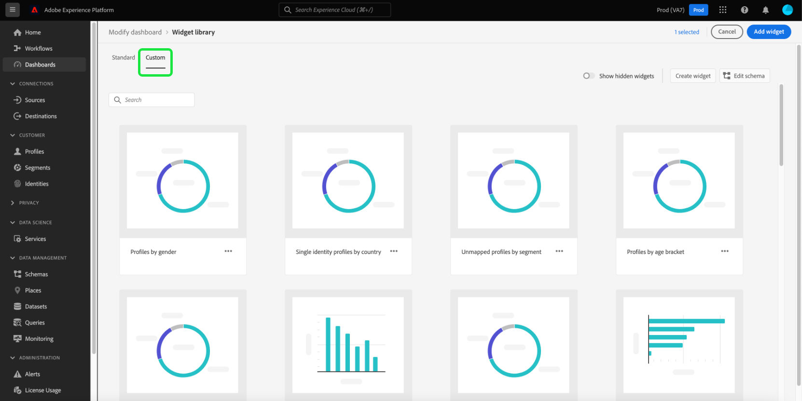
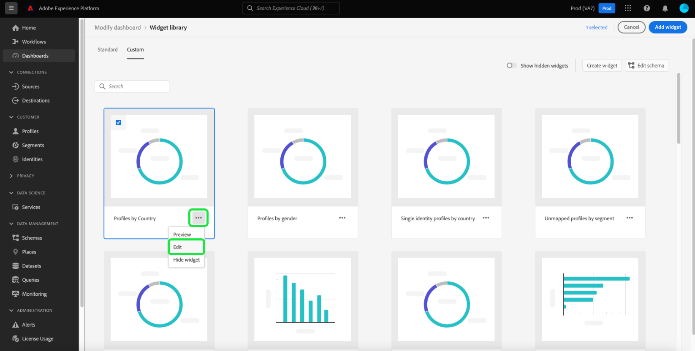

# 创建功能板的自定义构件

在Adobe Experience Platform中，您可以使用多个功能板查看组织的数据并与之交互。 您还可以通过向仪表板视图添加新构件来更新某些仪表板。 除了Adobe提供的标准构件之外，您还可以创建自定义构件并在整个组织内共享它们。

本指南提供了在Experience Platform UI中创建自定义构件并将其添加到[!UICONTROL 配置文件]、[!UICONTROL 区段]和[!UICONTROL 目标]功能板的分步说明。

>[!NOTE]
>
>对功能板所做的任何更新都是按组织和沙盒进行的。

要了解有关标准构件的更多信息，请参阅[将标准构件添加到仪表板](standard-widgets.md)的指南。

## 小组件库 {#widget-library}

本指南需要访问Experience Platform中的[!UICONTROL 构件库]。 要了解有关构件库以及如何在UI中访问它的更多信息，请从阅读[构件库概述](widget-library.md)开始。

## 自定义构件入门

在小组件库中，**[!UICONTROL 自定义]**&#x200B;选项卡允许您创建小组件并与组织中的其他用户共享这些小组件，以便自定义仪表板的外观。

>[!IMPORTANT]
>
>贵组织最多可以在构件库中创建20个自定义构件。

选择&#x200B;**[!UICONTROL 自定义]**&#x200B;选项卡以开始创建自定义构件，或查看您的组织已创建的自定义构件。

## 创建自定义构件

要创建自定义构件，请从构件库的右上角选择&#x200B;**[!UICONTROL 创建构件]**；或者，如果这是您组织的第一个自定义构件，请从构件库的中心选择&#x200B;**[!UICONTROL 创建]**。

在&#x200B;**[!UICONTROL 创建构件]**&#x200B;对话框中，为新构件提供标题和描述，并选择您希望构件显示的属性。

>[!NOTE]
>
>可用属性的列表取决于为您的组织配置的架构。 要了解有关属性选择和架构配置的更多信息，请阅读有关[编辑架构以创建自定义小组件](edit-schema.md)的指南。

要选择属性，请选择要添加属性旁边的单选按钮。

>[!NOTE]
>
>每个构件只能选择一个属性，且每个属性只能创建一个构件。 如果已为属性创建了构件，则该属性将显示为灰色。

## 选择可视化图表

选择属性后，新小部件的预览将显示在对话框中。 人工智能用于自动选择最适合属性数据的可视化图表，并提供其他可视化图表选项，您可以手动选择。

根据属性，AI会推荐不同的可视化选项。 可视化图表的完整列表包括：

* 水平条形图：水平线用于表示值。
* 垂直条形图：垂直线用于表示值。
* 圆环图：与饼图类似，值显示为整体的一部分或片段。
* 散点图：使用水平轴和垂直轴指示值。
* 折线图：使用单条线显示值以显示一段时间的变化。
* 数字卡：显示用于表示单个键值的概要数字。
* 数据表：值显示为表中的行。

>[!NOTE]
>
>当前所有属性都支持的唯一量度是配置文件计数。
>
>示例小部件中显示的数据仅供说明之用。 预览不显示贵组织的实际数据。

要保存您的新构件并返回[!UICONTROL 自定义]选项卡，请选择&#x200B;**[!UICONTROL 创建]**。

现在可通过从库中选择构件并选择&#x200B;**[!UICONTROL 添加构件]**，将您的新构件添加到仪表板。

## 隐藏自定义构件

将构件添加到库后，可以通过选择构件卡上的省略号(`...`)，然后选择&#x200B;**[!UICONTROL 隐藏构件]**&#x200B;来隐藏该构件。 您还可以从同一下拉菜单中预览和编辑构件。

要查看已隐藏的构件，请从构件库的右上角选择&#x200B;**[!UICONTROL 显示隐藏的构件]**。

>[!WARNING]
>
>在库中隐藏小组件不会从单个用户的功能板中移除该小组件。 如果贵组织不再使用某个构件，请确保将此构件直接传达给所有Experience Platform用户，因为他们将需要从其功能板中移除该构件。

## 编辑自定义构件

您可以通过选择构件卡上的省略号(`...`)，然后从下拉菜单中选择&#x200B;**[!UICONTROL 编辑]**，来编辑构件库中的自定义构件。

在&#x200B;**[!UICONTROL 编辑构件]**&#x200B;对话框中，您可以编辑构件的标题和描述，以及预览和选择不同的可视化图表。 完成编辑后，选择&#x200B;**[!UICONTROL 保存]**&#x200B;以保存更改并返回自定义构件选项卡。

>[!WARNING]
>
>编辑库中的小组件不会更新单个用户的小组件。 如果构件已更新，请确保将此信息直接传达给所有Experience Platform用户，因为他们需要从仪表板上删除过期的构件，然后从构件库中选择并添加更新的构件。

## 后续步骤

阅读本文档后，您可以访问构件库，并使用它为您的组织创建和添加自定义构件。 要修改仪表板中显示的小部件的大小和位置，请参阅[修改仪表板指南](modify.md)。
