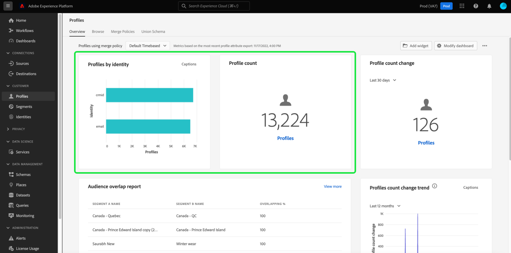

# 修改仪表板 {#modify-dashboards}

在Adobe Experience Platform用户界面(UI)中，您可以使用多个功能板查看您的组织数据并与之交互。 这些仪表板中显示的默认小部件和量度可以在单个用户级别调整以显示首选数据，并且可以在同一组织中的用户之间创建和共享小部件。

>[!NOTE]
>
>对功能板所做的任何更新都是按组织和沙盒进行的。

本指南提供了在Experience Platform UI中自定义仪表板数据在[!UICONTROL 配置文件]、[!UICONTROL 区段]和[!UICONTROL 目标]仪表板中的显示方式的分步说明。

## 快速入门

从任意仪表板（例如，[!UICONTROL 用户档案]仪表板）中，您可以选择&#x200B;**[!UICONTROL 修改仪表板]**，以调整现有小部件的大小并重新排序。

## 重新排序小组件

选择修改仪表板后，您可以通过选择构件标题并将构件拖放到所需顺序来重新排序构件。 在此示例中，**[!UICONTROL 配置文件计数趋势]**&#x200B;构件移至顶行，而&#x200B;**[!UICONTROL 配置文件计数]**&#x200B;构件现在显示在第二行。

## 调整构件大小

也可以通过选择小部件(`⌟`)右下角的角度符号并将小部件拖动到所需大小来调整小部件的大小。 在此示例中，**[!UICONTROL 按身份列出的配置文件]**&#x200B;小组件已调整为填充整个顶行，从而自动将其他小组件移动到第二行。 请注意水平轴如何调整以随着小组件变大提供更详细的增量。

>[!NOTE]
>
>在调整构件大小时，会动态地重新放置周围的构件。 这可能会导致某些构件被移动到其他行，从而需要您滚动才能查看所有构件。

## 保存仪表板更新

移动完小组件并调整其大小后，选择&#x200B;**[!UICONTROL 保存并退出]**&#x200B;以保存所做更改并返回主仪表板视图。 如果不希望保留更改，请选择&#x200B;**[!UICONTROL 取消]**&#x200B;以重置仪表板并返回主仪表板视图。

## 小组件库

除了调整小组件大小并重新排序之外，在[!UICONTROL 配置文件]、[!UICONTROL 区段]和[!UICONTROL 目标]仪表板中选择&#x200B;**[!UICONTROL 修改仪表板]**，您还能够访问&#x200B;**[!UICONTROL 小组件库]**，在那里您可以找到更多小组件来显示或创建组织的自定义小组件。

有关如何访问和使用[!UICONTROL 构件库]的分步说明，请参阅[构件库指南](widget-library.md)。

## 后续步骤

阅读本文档后，您已了解如何使用修改仪表板功能来重新排序小部件并调整其大小以自定义仪表板视图。 要了解如何创建构件并将其添加到仪表板，请阅读[构件库指南](widget-library.md)。
