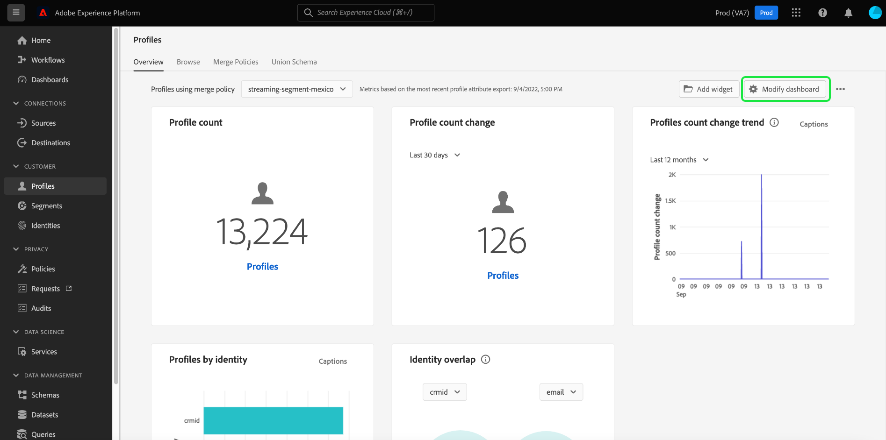

# 构件库概述

在Adobe Experience Platform用户界面中，您可以使用多个功能板查看组织的数据并与之交互。 您还可以通过向功能板视图添加小组件来更新某些功能板。

本指南提供了访问 [!UICONTROL 构件库] 在Experience Platform中，您可以选择标准小组件并创建自定义小组件，以自定义在功能板中显示的信息。

有关如何修改功能板中已显示的小组件的位置和大小的信息，请参阅 [修改功能板指南](modify.md).

>[!NOTE]
>
>显示在 [!UICONTROL 许可证使用情况] 无法自定义功能板。 要了解有关此唯一功能板的更多信息，请阅读 [许可证使用仪表板文档](../guides/license-usage.md).

## 访问小组件库 {#access}

从任何功能板（例如，“配置文件”功能板）中，选择 **[!UICONTROL 添加小组件]** 要直接导航到小组件库，您可以在该库中 [添加小组件](#add-widgets) 功能板。

选择 **[!UICONTROL 修改功能板]** 从功能板中移动、调整小组件大小或删除小组件。 在此显示中，您还可以选择 **[!UICONTROL 构件库]** 浏览和 [添加小组件](#add-widgets). 要了解如何编辑小组件大小和布局，请参阅 [修改功能板文档](./modify.md).

选择 **[!UICONTROL 构件库]** 打开小组件库并查看所有可用的标准量度，或开始创建自定义小组件。

## 添加小组件 {#add-widgets}

从 [!UICONTROL 构件库]，从可用标准小组件或自定义小组件列表中选择任意小组件。 小组件角的复选标记表示您的选择。

选择所有必需的小组件后，请选择 **[!UICONTROL 添加小组件]** 以确认您的选择并将小组件添加到功能板。

## 标准和自定义小组件 {#standard-and-custom}

的 [!UICONTROL 构件库] 包含两个选项卡：

* **[!UICONTROL 标准]:** 标准选项卡包含由Adobe提供的小组件。 您可以使用其中任何标准量度更新功能板。 要了解有关将标准小组件添加到功能板的更多信息，请参阅 [在功能板中使用标准小组件](standard-widgets.md).
* **[!UICONTROL 自定义]:** 利用自定义选项卡，可在组织内创建和共享小组件。 有关创建您自己的小组件的完整步骤，请参阅 [功能板指南的自定义小组件](custom-widgets.md).

## 后续步骤

阅读本文档后，您现在可以在Experience PlatformUI中访问小组件库。 要修改功能板中显示的小组件的大小和位置，请参阅 [修改功能板指南](modify.md).
