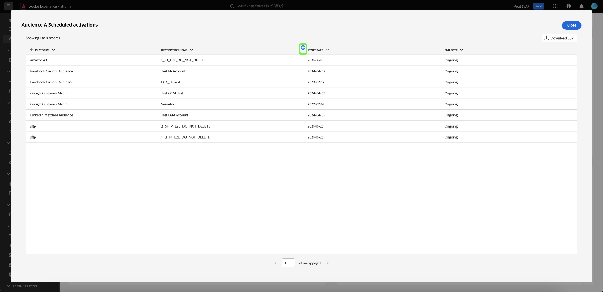

# 查看更多信息 {#view-more}

创建具有[查询专业模式](./overview.md)的[自定义分析](../sql-insights/overview.md)后，即可以不同格式查看图表数据。 您可以查看以表格形式显示的结果，也可以以CSV文件格式下载数据，以便在电子表格中查看。

## 列表化结果 {#tabulated-results}

对于通过SQL使用查询专业模式创建的每个图表，您可以在Experience PlatformUI中查看分析的列表结果。

从您的自定义仪表板中，选择任意小组件上的省略号(`...`)以访问[!UICONTROL 查看更多]和[!UICONTROL 查看SQL]选项。

## 下载 CSV {#download-csv}

[!UICONTROL 查看更多]功能以表格形式显示图表的特定数据点。 要简化数据共享和处理的过程，您可以从此对话框以CSV格式下载处理过的数据。 选择&#x200B;**[!UICONTROL 下载CSV]**&#x200B;以下载您的数据。

>[!NOTE]
>
>CSV下载限制为前500条记录。

## 按列排序 {#sort-column}

查看列表化结果时，您可以使用排序功能按列升序或降序排序。 从您的自定义仪表板中，选择任意表上的省略号(`...`)以访问[!UICONTROL 查看更多]选项。

您可以通过选择列名称旁边的下拉菜单，然后选择&#x200B;**[!UICONTROL 升序排序]**&#x200B;或&#x200B;**[!UICONTROL 降序排序]**&#x200B;来对列进行排序。

>[!NOTE]
>
>[!UICONTROL 升序排序]和[!UICONTROL 降序排序]选项将仅对配置了[排序功能](../overview.md/#advanced-attributes)的列显示。

## 调整列大小 {#resize-column}

您可以调整列表结果中的列大小以提高数据可读性。 从自定义仪表板中，选择表格的省略号(`...`)以访问[!UICONTROL 查看更多]选项。 使用列名称旁边的下拉菜单调整列大小，然后选择&#x200B;**[!UICONTROL 调整列大小]**。

选择滑块并向左或向右拖动以根据需要调整列大小。

## 表格分页 {#table-pagination}

分页功能会自动应用于[!UICONTROL 查看更多]功能中的表，无需手动修改SQL查询。 此功能可确保以更易于管理的格式显示数据，从而简化在大型数据集中导航的过程。

每页最多可查看500条记录。 要浏览记录，请使用位于页面底部的&#x200B;**[!UICONTROL >]**。

## 后续步骤

阅读本文档后，您现在知道如何查看自定义图表的SQL分析的列表化结果，以及如何以CSV文件格式下载数据。 查看查看SQL文档，了解如何[查看自定义分析背后的SQL](./view-more.md)。

您还可以学习如何使用[引导式设计模式指南](../../user-defined-dashboards.md)，从Adobe Experience Platform UI中的现有数据模型生成图表。
