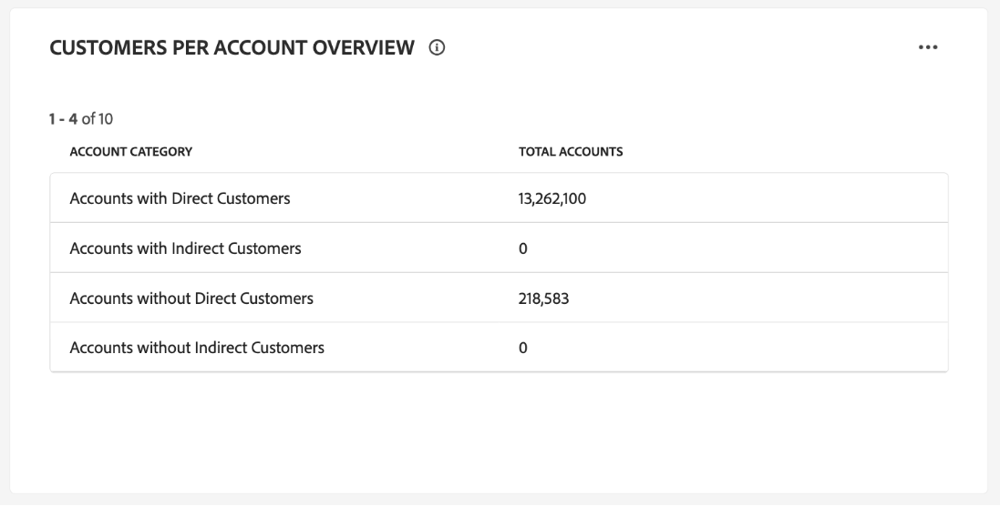
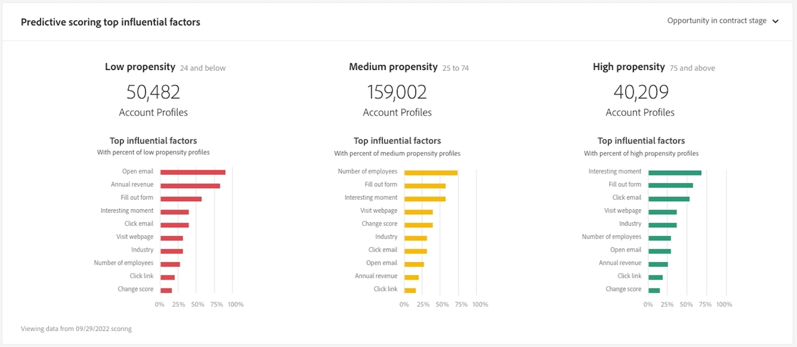

# 帐户配置文件仪表板

Adobe Experience Platform用户界面(UI)提供了一个功能板，通过该功能板，您可以查看有关帐户配置文件的重要信息，在每日快照期间捕获了这些信息。 本指南概述如何在UI中访问和使用[!UICONTROL Account Profiles]仪表板，并提供有关仪表板中显示的可视化图表的更多信息。

本文档概述了[!UICONTROL Account Profiles]仪表板中的功能，并详细介绍了可用的标准见解。 请参阅[[!UICONTROL Account Profiles] UI指南](../../rtcdp/accounts/account-profile-ui-guide.md)以了解其可用功能的完整详细信息。

## 快速入门

您必须具有[Adobe Real-Time Customer Data Platform B2B edition](../../rtcdp/b2b-overview.md)的权限才能访问B2B [!UICONTROL Account Profiles]仪表板。

## 帐户配置文件数据 {#data}

[!UICONTROL Account Profiles]仪表板显示统一帐户信息的快照。 此帐户信息来自您的营销渠道中的多个来源，以及贵组织当前用于存储客户帐户信息的各种系统。

快照中的配置文件数据显示的数据与拍摄快照的特定时间点完全相同。 换句话说，快照不是数据的近似值或示例，并且[!UICONTROL Account Profiles]仪表板不会实时更新。

>[!NOTE]
>
>自拍摄快照以来对数据所做的任何更改或更新都不会反映在功能板中，直到拍摄下一个快照为止。

## 浏览[!UICONTROL Account Profiles]仪表板 {#explore}

要导航到Experience Platform UI中的[!UICONTROL Account Profiles]仪表板，请在左侧导航面板的&#x200B;**[!UICONTROL Profiles]**&#x200B;下选择[!UICONTROL Accounts]。

从[!UICONTROL Account Profiles]仪表板中，您可以[浏览摄取到您组织的帐户配置文件](#browse-account-profiles)，或者[使用小组件查看您的帐户配置文件数据的全部内容](#standard-widgets)。

### 日期过滤器 {#date-filter}

[!UICONTROL Overview]选项卡由小组件组成，这些小组件提供只读量度，以传达有关您的帐户配置文件的重要信息。 选择日历图标或日期以更改小组件的全局日期过滤器。

>[!IMPORTANT]
>
>您在下拉日历中选择的日期范围会影响除两个预测评分小组件（[分布](#predictive-scoring-distribution)和[主要影响因素](#predictive-scoring-top-influential-factors)）之外的所有见解。

### 配置潜在客户到帐户的匹配服务 {#lead-to-account-matching-service}

从&#x200B;**[!UICONTROL Settings]**&#x200B;对话框中选择[!UICONTROL Account settings]以配置潜在客户到帐户的匹配服务。 有关如何配置潜在客户与帐户匹配的完整详细信息，请参阅[UI指南](../../rtcdp/accounts/account-profile-ui-guide.md#configure-lead-to-account-matching)。 要了解有关潜在客户与帐户匹配的更多信息，请参阅Real-Time CDP B2B文档中的[潜在客户与帐户匹配](../../rtcdp/b2b-ai-ml-services/lead-to-account-matching.md)。

## 浏览帐户配置文件 {#browse-account-profiles}

在[!UICONTROL Browse]选项卡中，您可以搜索和查看摄取到您组织中的只读帐户配置文件。 使用连接的企业源中的帐户ID或直接输入源详细信息。 从该工作区中，您可以查看属于帐户配置文件的重要信息，包括其名称、行业、收入和受众等。

从[!UICONTROL Profile ID]选项卡上显示的结果中选择[!UICONTROL Browse]以打开帐户配置文件的[!UICONTROL Details]选项卡。

[!UICONTROL Details]选项卡上显示的帐户配置文件信息已从多个配置文件片段合并在一起，以形成单个帐户的单个视图。 请参阅有关[在Adobe Real-Time Customer Data Platform中浏览帐户配置文件的文档](../../rtcdp/accounts/account-profile-ui-guide.md#browse-account-profiles)，了解更多有关Experience Platform UI中查看帐户配置文件的功能。

## 标准构件 {#standard-widgets}

>[!CONTEXTUALHELP]
>id="platform_dashboards_accountprofiles_customersperaccountoverview"
>title="客户每帐户概述"
>abstract="该钻透构件可让您洞察 B2B 数据的结构。它可以帮助您确定有多少帐户轮廓没有链接客户轮廓，或者有一个或多个客户轮廓与之相关联。<ul><li>直接客户：是指通过 `personComponents` 路线直接链接到帐户的客户轮廓。</li><li>间接客户：是指通过 `Account-Person` 路线链接到帐户的客户轮廓。</li></ul>"

Adobe提供了可用于可视化与帐户配置文件相关的各种量度的标准构件。

>[!IMPORTANT]
>
>如果不提供日期过滤器，则分析的默认行为是分析从去年到今天添加的数据。

要了解有关每个可用标准构件的更多信息，请从以下列表中选择构件的名称：

* [已添加帐户轮廓](#account-profiles-added)
* [客户每帐户概述](#customers-per-account-overview)
   * [每个客户的机会概述](#opportunities-per-account-overview)
   * [每个帐户的业务机会详细信息](#opportunities-per-account-detail)
   * [每个帐户的客户详细信息](#customers-per-account-detail)
* [按行业划分的新客户](#accounts-by-industry)
* [按类型的新帐户](#accounts-by-type)
* [按人员角色显示的新机会](#opportunities-by-person-role)
* [按收入显示的新机会](#opportunities-by-revenue)
* [按状态和阶段显示的新机会](#opportunities-by-status-&-stage)
* [赢得新机会](#opportunities-won)
* [新增机会](#opportunities-added)
* [预测评分分布](#predictive-scoring-distribution)
* [预测得分主要影响因素](#predictive-scoring-top-influential-factors)

### 已添加帐户轮廓 {#account-profiles-added}

[!UICONTROL Account profiles added]小组件使用折线图显示一段时间内每天添加的帐户配置文件数。 使用位于仪表板顶部的全局日期过滤器来确定分析时段。 如果未提供日期过滤器，则默认行为会列出为今天之前的一年添加的帐户配置文件。 结果可用于推断添加的帐户配置文件数量的趋势。

### 客户每帐户概述 {#customers-per-account-overview}

>[!NOTE]
>
>[!UICONTROL Customers per account overview] insight及其穿透钻取图表([!UICONTROL Customers per account detail]、[!UICONTROL Opportunities per account overview]、[!UICONTROL Opportunities per account detail])不受您可能已设置的任何全局日期过滤器的影响。

[!UICONTROL Customers per account overview]图表根据其客户类型提供帐户摘要。 它显示一个四行表，将帐户分类为具有直接或间接客户或不具有直接或间接客户的帐户。 它提供每个类别的帐户总数。 该图表有助于识别具有直接客户与间接客户的客户分布。

直接客户是通过`personComponents`路由直接链接到帐户的客户档案。 这种关系更为直接，涉及客户与客户之间的直接、明确的联系。

间接客户是通过`Account-Person`路由链接到帐户的客户个人资料。 这种关系不那么直接，它涉及中间实体或客户与帐户之间的更复杂的连接，通常通过其他帐户或关系实现。

要访问更详细的见解，请选择&#x200B;**图表上的椭圆(**...[!UICONTROL Customers per account overview])，然后从下拉菜单中选择&#x200B;**[!UICONTROL Drill through]**。

此时将显示穿透钻取视图。 接下来，浏览可用的穿透钻取图表，以更深入地了解B2B数据的结构。 您可以使用这些穿透钻取图表确定有多少帐户配置文件没有链接或有一个或多个客户配置文件与其关联。 您还可以使用它们来确定与您的帐户关联的直接或间接客户数量。

* [[!UICONTROL Customers per account detail]](#customers-per-account-detail)
* [[!UICONTROL Accounts per opportunity overview]](#accounts-per-opportunity-overview)
* [[!UICONTROL Opportunities per account detail]](#accounts-per-opportunity-detail)

### [!UICONTROL Navigate between dashboard views] {#dashboard-view-navigation}

要在穿透钻取和“帐户配置文件”仪表板之间切换，请选择文件夹图标（)，随后显示下拉菜单中的正确视图。

要详细了解Experience Platform UI中的穿透钻取，请参阅[穿透钻取指南](../sql-insights-query-pro-mode/drill-through.md)。

#### [!UICONTROL Customers per account detail] {#customers-per-account-detail}

[!UICONTROL Customers per account detail]图表提供了有关与不同客户类型关联的帐户数的更细粒度的详细信息。 它显示一个三列表格，按客户类型（直接或间接）详细列出帐户数以及与帐户关联的客户范围。 此图表有助于您了解客户在不同客户类别中的分布情况以及与每个类别关联的帐户总数。

#### [!UICONTROL Opportunities per account overview] {#opportunities-per-account-overview}

[!UICONTROL Opportunities per account overview]图表显示具有或没有机会的帐户的摘要。 此两行表有助于快速确定与业务机会关联的客户数量，从而提供跨客户的业务机会参与情况的快照。

#### [!UICONTROL Opportunities per account detail] {#opportunities-per-account-detail}

[!UICONTROL Opportunities per account detail]图表根据客户的机会数量提供了更详细的客户细目。 此表显示按业务机会计数范围（如1-10个业务机会或100多个业务机会）分组的帐户数。 此图表可帮助您确定如何按客户所管理的机会数量分配客户。

### 按行业划分的新客户 {#accounts-by-industry}

[!UICONTROL New accounts by industry]小组件在圆环图中显示单个量度中的帐户总数。 圆环图说明了构成这一总额的不同行业的相对构成。 颜色编码的密钥提供所有包含行业的细目。 当光标悬停在圆环图的相应部分上时，会在对话框中显示每个行业的各个计数。

### 按类型的新帐户 {#accounts-by-type}

[!UICONTROL New accounts by type]小组件在圆环图中显示单个量度中的帐户总数。 圆环图说明了构成此总额的不同帐户类型的相对构成。 颜色编码的密钥提供所有包含的帐户类型的细分。 当光标悬停在圆环图的相应部分上时，每种类型的帐户分别显示在一个对话框中。

### 按人员角色显示的新机会 {#opportunities-by-person-role}

[!UICONTROL New opportunities by person role]小组件在圆环图内的单个量度中显示您的机会总数。 圆环图说明了构成此机会总数的角色的相对构成。 颜色编码的密钥提供包含的所有角色的细分。 当光标悬停在圆环图的相应部分上时，将在对话框中显示每个角色的单个计数。

>[!NOTE]
>
>在您的架构中未使用“Opportunity-Person”桥表时，会导致[!UICONTROL No data found]或[!UICONTROL Unable to load]错误。 如果您的insight显示其中一个错误，请检查您的合并架构并确保“Opportunity-Person”字段组正在摄取数据。

### 按收入显示的新机会 {#opportunities-by-revenue}

[!UICONTROL New opportunities by revenue]小组件使用条形图来说明您的机会产生的预计收入总额。 该构件最多支持六个机会。

要查看包含opportunity的特定收入总计的对话框，请使用光标悬停在各个栏上。

### 按状态和阶段显示的新机会 {#opportunities-by-status-&-stage}

此构件使用条形图来说明在营销/销售funnel的所有阶段中处于打开状态或关闭状态的机会数量。 构件使用颜色来区分机会的阶段。 颜色编码的键表示机会的可用阶段。

### 赢得新机会 {#opportunities-won}

[!UICONTROL New opportunities won]小组件在圆环图中显示已在单个量度中成功完成的机会总数。 圆环图说明了获胜或未获胜机会的相对构成。 颜色编码密钥用于区分成功和未成功的机会。 当光标悬停在圆环图的相应部分上时，将在对话框中显示每个角色的单个计数。

### 新增机会 {#opportunities-added}

[!UICONTROL Opportunities added]小组件使用折线图显示一段时间内每天添加的机会数。 使用位于仪表板顶部的全局日期过滤器来确定分析时段。 如果未提供日期过滤器，则默认行为会列出为今天之前的一年添加的机会。 结果可用于推断所添加机会数的趋势。

<!-- Link to date filter documentation from Annamalai -->

### 预测评分分布 {#predictive-scoring-distribution}

[!UICONTROL Predictive scoring distribution]小组件显示所有帐户配置文件的得分分布，以帮助您一眼了解销售管道的运行状况。 评分数据通过圆环图和柱状图传递。

圆环图说明了您的总帐户配置文件在高、中和低购买存储桶倾向中的比例。 键提供了有关颜色编码的部分的更多详细信息，包括评分存储段范围以及该范围内的帐户配置文件数。

柱形图提供了更细粒度的评分细分。 每列显示20个五点增量分段中每个分段的帐户配置文件数。

利用小组件中的下拉菜单，可选择帐户评分模型。

>[!NOTE]
>
>全局日期范围过滤器不适用于预测评分见解。 预测评分构件根据在下拉列表中选定的帐户评分模型分析数据。

### 预测得分主要影响因素 {#predictive-scoring-top-influential-factors}

[!UICONTROL Predictive scoring top influential factors]小组件可帮助您了解驱动每个倾向区间得分的最重要因素。

此构件显示每个高、中和低倾向存储桶的主要影响因素。 每个影响因子的栏指示该倾向区间中包含特定影响因子的帐户用户档案的百分比。

利用小组件中的下拉菜单，可选择帐户评分模型。

>[!NOTE]
>
>全局日期范围过滤器不适用于预测评分见解。 预测评分构件根据在下拉列表中选定的帐户评分模型分析数据。

## 无法加载数据错误 {#errors}

如果小组件显示&#x200B;*[!UICONTROL Unable to load. Try again.]*，则这是因为没有可用于B2B实体的数据。 例如，显示在[!UICONTROL New opportunities by person role]下方的构件显示消息“[!UICONTROL Unable to load. Try again.]”，因为此沙盒没有可用的机会数据。

要解决此问题，必须将B2B实体数据（如&#x200B;*机会人员*&#x200B;数据）摄取到沙盒中。 48小时后，数据反映在小组件中。

## 后续步骤

现在，通过阅读本文档，您应该知道如何找到[!UICONTROL Account Profiles]仪表板，并了解可用构件中显示的量度。 要了解有关在Experience Platform UI中使用作为B2B数据一部分的帐户配置文件的更多信息，请参阅Adobe Real-Time CDP、B2B edition的[帐户配置文件概述](../../rtcdp/accounts/account-profile-overview.md)。
