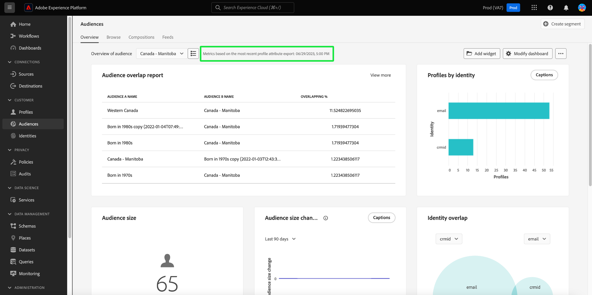

# [!UICONTROL 受众] 仪表板 {#audiences-dashboard}

Adobe Experience Platform用户界面(UI)提供了一个功能板，通过它可查看有关受众的重要信息，如在每日快照期间捕获的信息。 本指南概述如何访问和使用 [!UICONTROL 受众] 功能板，并提供有关功能板中显示的可视化的更多信息。

有关Platform用户界面中所有Adobe Experience Platform分段服务功能的概述，请访问 [分段服务UI指南](../../segmentation/ui/overview.md).

## [!UICONTROL 受众] 仪表板数据

此 [!UICONTROL 受众] 仪表板显示贵组织在Experience Platform中的配置文件存储区中拥有的属性（记录）数据的快照。 快照不包含任何事件（时间序列）数据。

快照中的属性数据显示的数据与拍摄快照的特定时间点完全相同。 换句话说，快照不是数据的近似值或样本，而 [!UICONTROL 受众] 仪表板未实时更新。

>[!NOTE]
>
>自拍摄快照以来对数据所做的任何更改或更新都不会反映在功能板中，直到拍摄下一个快照为止。

## 浏览 [!UICONTROL 受众] 仪表板 {#explore}

要导航至 [!UICONTROL 受众] 在Platform UI中，选择 **[!UICONTROL 受众]** 然后，在左边栏中选择 **[!UICONTROL 概述]** 选项卡以显示仪表板。

>[!NOTE]
>
>如果您的组织是初次使用Platform，但尚未创建活动配置文件数据集或合并策略，则 [!UICONTROL 受众] 仪表板不可见。 相反， [!UICONTROL 概述] 选项卡会显示链接和文档，以帮助您开始使用分段。

![此 [!UICONTROL 受众] 仪表板 [!UICONTROL 概述] 制表符 [!UICONTROL 受众] 和 [!UICONTROL 概述] 突出显示。](../images/audiences/dashboard-overview.png)

### 修改 [!UICONTROL 受众] 仪表板 {#modify}

您可以修改 [!UICONTROL 受众] 通过选择 **[!UICONTROL 修改仪表板]**. 这使您可以在仪表板中移动、添加和删除构件，以及访问 **[!UICONTROL 构件库]** 浏览可用的构件并为您的组织创建自定义构件。

请参阅 [修改仪表板](../customize/modify.md) 和 [构件库概述](../customize/widget-library.md) 文档，以了解更多信息。

### 添加构件 {#add-widget}

选择 **[!UICONTROL 添加构件]** 导航到构件库，然后查看要添加到仪表板的可用构件列表。

![此 [!UICONTROL 受众] 功能板概述 [!UICONTROL 添加构件] 突出显示。](../images/audiences/audiences-overview-add-widget.png)

从构件库中，您可以浏览选择的标准和自定义受众构件。 有关如何添加构件的信息，请参阅构件库文档，了解如何 [添加构件](../customize/widget-library.md#add-widgets).

## 选择受众 {#select-audience}

仪表板会自动选择要显示的受众。 但是，您可以使用下拉菜单或受众选择器更改受众。

要选择其他受众，请选择受众名称旁边的下拉菜单，或使用受众选择器打开受众选择对话框。

>[!IMPORTANT]
>
>只有配置文件计数大于零的受众才会显示在可选受众的列表中。

![此 [!UICONTROL 选择受众] 显示所有可用受众的对话框。](../images/audiences/select-audience-dialog.png)

## 小工具和量度 {#widgets-and-metrics}

此 [!UICONTROL 受众] 功能板由小组件组成，这些小组件是只读量度，可提供有关所选受众的重要信息。

最新快照的日期和时间显示在的顶部 [!UICONTROL 概述] 选项卡。 截至该日期和时间，所有构件数据都是准确的。 快照的时间戳以UTC格式提供；它不在单个用户或组织的时区内。

## 默认构件 {#default-widgets}

为Adobe Experience Platform的所有新实例提供了默认构件加载，该构件会突出显示数据中最新的可用见解。 从一开始就在区段视图中预配置了以下构件。 有关这些构件的用途和功能的完整详细信息，请参阅其各自部分。

* [[!UICONTROL 受众规模]](#audience-size)
* [[!UICONTROL 受众规模变化趋势]](#audience-size-change-trend)
* [[!UICONTROL 标识重叠]](#identity-overlap)
* [[!UICONTROL 按标识列出的配置文件]](#profiles-by-identity)

>[!NOTE]
>
>截至2023年7月26日， [!UICONTROL 配置文件]， [!UICONTROL 受众]、和 [!UICONTROL 目标] 对于所有在过去六个月中未修改其视图的用户，概述功能板已重置为新的默认构件加载。
>请参阅 [配置文件](./profiles.md#default-widgets) 和 [目标](./destinations.md#default-widgets) “默认构件”部分，了解有关哪些构件包含在默认构件加载中的详细信息。 您可以像以前一样继续自定义仪表板小组件。

## Customer AI构件 {#customer-ai-audiences-widgets}

Customer AI 用于生成自定义倾向分数，如个人档案大规模的流失率和转化率。客户人工智能通过分析现有的消费者体验事件数据来预测 **流失或转化倾向分数**. 这些高精度的客户倾向模型允许进行更精确的分段和定位。 此 [得分分布](#customer-ai-distribution-of-scores) 和 [评分摘要](#customer-ai-scoring-summary) 分析会在您的受众中展示该划分。 它们会突出显示哪些用户档案具有高度/低度/中度的倾向性，以及它们在用户档案计数中的分布方式。

* [[!UICONTROL 客户人工智能评分摘要]](#customer-ai-scoring-summary)
* [[!UICONTROL 得分的客户人工智能分布]](#customer-ai-distribution-of-scores)

### [!UICONTROL 得分的客户人工智能分布] {#customer-ai-distribution-of-scores}

>[!CONTEXTUALHELP]
>id="platform_dashboards_segments_distributionOfScores"
>title="分数分布"
>abstract="该构件通过倾向打分（以 5% 的增量）功能显示配置文件总数的分布。配置文件计数的分布由 AI 模型和所选的合并策略决定。您可以从构件标题下的下拉菜单中更改 AI 模型。"

此 [!UICONTROL 得分的客户人工智能分布] 构件按倾向分数对配置文件总数进行分类。 用户档案计数的分布由AI模型和选定的合并策略确定，然后以5%的增量进行可视化以指示其倾向。 沿Y轴提供用户档案计数，沿X轴提供倾向分数。

>[!NOTE]
>
>如果可视化图表是转化倾向得分，则高分以绿色显示，低分以红色显示。 如果您预计客户流失倾向，则流失倾向会逆转，高分以红色显示，低分以绿色显示。 无论您选择哪种倾向类型，中段都会保持黄色。

确定倾向分数的AI模型是从小组件标题下的下拉选择器中选择的。 下拉列表包含所有已配置的Customer AI模型的列表。 从可用模型列表中为您的分析选择适当的AI模型。 如果没有可用的客户人工智能模型，则小部件中的消息将指导您配置至少一个客户人工智能模型，并提供指向客户人工智能模型配置页面的超链接。 有关说明，请参阅文档 [如何配置客户人工智能实例](../../intelligent-services/customer-ai/user-guide/configure.md).

>[!NOTE]
>
>选择概述选项卡正下方的下拉列表，以更改用于确定分析中包含哪些配置文件的合并策略。 请参阅以下部分 [合并策略](#merge-policies) 以获取简要说明，或 [合并策略概述](../../profile/merge-policies/overview.md) 以了解更多详细信息。

要导航到所选客户人工智能模型的详细分析页面，请选择 **[!UICONTROL 查看模型详细信息]**.

![包含的Experience Platform受众功能板 [!UICONTROL 得分的客户人工智能分布] 构件和 [!UICONTROL 查看模型详细信息] 突出显示。](../images/segments/customer-ai-distribution-of-scores.png)

此时将显示详细的模型分析页面。

有关客户人工智能的更多信息，请访问 [探索见解UI指南](../../intelligent-services/customer-ai/user-guide/discover-insights.md).

### [!UICONTROL 客户人工智能评分摘要] {#customer-ai-scoring-summary}

>[!CONTEXTUALHELP]
>id="platform_dashboards_segments_scoringSummary"
>title="评分汇总"
>abstract="该构件会显示经过评分的配置文件的总数，并将其分类为包含高、中、低倾向的存储桶。圆环图说明了高、中、低倾向的总体配置文件的比例构成。"

此构件显示已评分的用户档案总数，并将它们分类为分别包含高、中和低倾向性的绿色、黄色和红色存储桶。 使用圆环图说明高、中和低倾向性之间总轮廓的比例组成，分别表示为绿色、黄色和红色。 用户档案符合75岁以上的高倾向性、25至74岁之间的中倾向性和24岁以下的低倾向性条件。 图例指示颜色代码和倾向性阈值。 当光标悬停在圆环图的相应部分上时，会在对话框中显示高、中和低倾向的配置文件计数。

>[!NOTE]
>
>如果可视化图表是转化倾向得分，则高分以绿色显示，低分以红色显示。 如果您预计客户流失倾向，则流失倾向会逆转，高分以红色显示，低分以绿色显示。 无论您选择哪种倾向类型，中段都会保持黄色。

构件标题下的下拉菜单提供了所有已配置的Customer AI模型的列表。 从可用模型列表中为您的分析选择适当的AI模型。 如果没有可用的客户人工智能模型，则小部件中的消息将指导您配置至少一个客户人工智能模型，并提供指向客户人工智能模型配置页面的超链接。 请参阅相关文档 [如何配置客户人工智能实例](../../intelligent-services/customer-ai/user-guide/configure.md) 以获取详细说明。

>[!NOTE]
>
>计算的配置文件总数取决于所选的合并策略。 要更改使用的合并策略，请选择概述选项卡正下方的下拉菜单。 请参阅以下部分 [合并策略](#merge-policies) 以获取简要说明，或 [合并策略概述](../../profile/merge-policies/overview.md) 以了解更多详细信息。

选择 **[!UICONTROL 查看模型详细信息]** 导航到所选客户人工智能模型的详细分析页面。 有关客户人工智能的更多信息，请访问 [探索见解UI指南](../../intelligent-services/customer-ai/user-guide/discover-insights.md).

## 标准构件 {#standard-widgets}

Adobe提供了多个标准构件，可用于可视化与受众相关的各种指标。 您还可以使用创建要与贵组织共享的自定义构件 [!UICONTROL 构件库]. 要了解有关创建自定义构件的更多信息，请先阅读 [构件库概述](../customize/widget-library.md).

要了解有关每个可用标准构件的更多信息，请从以下列表中选择构件的名称：

* [[!UICONTROL 受众规模]](#audience-size)
* [[!UICONTROL Audience激活顺序]](#audience-activation-order)
* [[!UICONTROL 受众规模趋势]](#audience-size-trend)
* [[!UICONTROL 受众规模变化趋势]](#audience-size-change-trend)
* [[!UICONTROL 按身份划分的受众规模趋势]](#audience-size-trend-by-identity)
* [[!UICONTROL 受众重叠]](#audience-overlap)
* [[!UICONTROL 受众重叠报表]](#audience-overlap-report)
* [[!UICONTROL 标识重叠]](#identity-overlap)
* [[!UICONTROL 按标识列出的配置文件]](#profiles-by-identity)
* [[!UICONTROL 计划的激活]](#scheduled-activations)

### [!UICONTROL 受众规模] {#audience-size}

>[!CONTEXTUALHELP]
>id="platform_dashboards_segments_audiencesize"
>title="受众规模"
>abstract="此构件显示所选受众中合并的配置文件总数。此数目取决于应用于您的数据的合并策略，并且在生成最新快照时是正确的。"

此 **[!UICONTROL 受众规模]** 构件显示拍摄快照时选定受众中合并的配置文件总数。 此数字是将受众合并策略应用于配置文件数据以将配置文件片段合并在一起，并为受众中的每个人形成单个配置文件的结果。

有关片段和合并配置文件的更多信息，请参阅 [Real-time Customer Profile概述](../../profile/home.md).

![此 [!UICONTROL 受众] 功能板概述和 [!UICONTROL 受众规模] 构件突出显示。](../images/audiences/audience-size.png)

### [!UICONTROL 受众规模趋势] {#audience-size-trend}

>[!CONTEXTUALHELP]
>id="platform_dashboards_segments_audiencesizetrend"
>title="受众规模趋势"
>abstract="此构件提供有关符合&#x200B;**任意**&#x200B;区段定义标准的配置文件总数的信息，如在过去 30 天、90 天或 12 个月的每日快照期间捕获的配置文件。"

此 **[!UICONTROL 受众规模趋势]** 构件提供符合条件的配置文件总数的线形图插图 **任意** 一段给定时间内的受众。 可以在30天、90天和12个月的时段内可视化受众规模趋势。 从小组件中的下拉菜单中选择时间段。 受众规模反映在y轴上，时间反映在x轴上。

此构件还包括自动的 [!UICONTROL 字幕] 机器学习模型分析图表和受众数据并自动生成描述关键趋势和重要事件的字幕的功能。 选择 **[!UICONTROL 字幕]** 以打开自动字幕对话框。

![此 [!UICONTROL 受众] 概述会显示受众规模趋势小组件。](../images/audiences/audience-size-trend-captions.png)

自动字幕对话框打开，提供有关您的数据的见解。

要了解有关受众评估以及用户档案如何限定和退出受众的更多信息，请参阅 [Segmentation Service文档](../../segmentation/home.md).

### [!UICONTROL 受众规模变化趋势] {#audience-size-change-trend}

此构件用线形图说明了最近每日快照之间符合给定受众条件的配置文件总数之间的差异。 从概述下拉菜单中选择要分析的受众。 趋势分析的期间可以在30天、90天和12个月期间中进行可视化。 从小组件中的下拉菜单中选择时间段。 受众规模反映在y轴上，时间反映在x轴上。

### [!UICONTROL 按身份划分的受众规模趋势] {#audience-size-trend-by-identity}

此构件根据从构件下拉菜单中选择的身份类型说明特定受众的受众规模趋势。 从概述下拉菜单中选择用于分析的受众。 趋势分析的期间可以在30天、90天和12个月期间中进行可视化。 从小组件中的下拉菜单中选择时间段。

### [!UICONTROL Audience激活顺序] {#audience-activation-order}

此 [!UICONTROL Audience激活顺序] 构件提供了一个三列表格，其中列出了受众的目标名称、平台和激活日期。 该列表会根据回访间隔从高到低排序，最多可容纳10行。

### [!UICONTROL 受众重叠] {#audience-overlap}

此构件使用维恩图可视化符合两个受众条件的人员数量。 从小组件下拉菜单中选择用于比较的受众。 通过将鼠标悬停在维恩图的圆或相交部分上，可以看到相关段定义中包含的配置文件总数。

利用此小组件，可通过可视化区段定义结果中的相似之处，优化分段策略。

### [!UICONTROL 受众重叠报表] {#audience-overlap-report}

此构件可将特定受众的个人资料重叠数据制成表格形式。 从屏幕顶部的下拉菜单中选择受众，将获得从最高重叠百分比到最低重叠百分比排名的五个受众列表。 为清楚起见，您选择的受众将列在 [!UICONTROL 受众A名称] 列。 为中列出的第二个受众提供受众重叠分析 [!UICONTROL 受众B名称] 列。 第三列中提供了精确到小数点十二位的重叠百分比。

受众重叠报表可帮助您构建新的高性能受众。 通过观察高百分比重叠，您可以抑制受众并防止将同一受众发送到不同的目标。 它们还帮助您识别可能有助于更好分段的可隐藏见解。 低百分比重叠有助于找到要追求的独特用户档案。

选择 **[!UICONTROL 查看更多]** 以打开包含更多受众重叠数据的全屏对话框。

此 [!UICONTROL 受众重叠报表] 出现对话框。 此对话框最多可包含50行受众重叠分析，这些分析划分为6列。 选择设置图标()，以从表中删除或添加列。

>[!NOTE]
>
>选择 **[!UICONTROL 重叠]** 列标题，用于将结果的排名在最高到最低或最低到最高之间更改。

要以PDF格式下载整个报表，请选择选项菜单(**`...`**)后跟 **[!UICONTROL 下载]**.

从报表中选择一行以打开重叠分析的维恩图。 将鼠标悬停在维恩图的一部分上可查看对话框中的配置文件计数。

选择 **[!UICONTROL 关闭]** 以返回 [!UICONTROL 受众] 仪表板。

### [!UICONTROL 标识重叠] {#identity-overlap}

>[!CONTEXTUALHELP]
>id="platform_dashboards_segments_identityoverlap"
>title="标识重叠"
>abstract="此构件显示包含两个所选标识的受众中的配置文件的重叠。圆圈显示每个标识的相对大小。包含两个命名空间的配置文件的数量由圆圈之间的重叠部分表示。"

此 **[!UICONTROL 身份重叠]** 构件显示维恩图或集图，其中显示受众中包含多个身份的用户档案重叠。

使用小组件上的下拉菜单选择要比较的身份。 圆显示每个所选身份的相对大小，包含两个命名空间的配置文件数由圆之间的重叠大小表示。

如果客户在多个渠道上与您的品牌互动，则多个身份将与该个人客户相关联。 此情况可能会导致贵组织拥有多个包含来自多个身份的片段的配置文件。

要了解有关身份的详细信息，请访问 [Identity Service文档](../../identity-service/home.md).

![此 [!UICONTROL 受众] 突出显示身份重叠小部件的仪表板概述。](../images/audiences/identity-overlap.png)

### [!UICONTROL 按标识列出的配置文件] {#profiles-by-identity}

>[!CONTEXTUALHELP]
>id="platform_dashboards_segments_profilesbyidentity"
>title="按标识列出的配置文件"
>abstract="此构件显示跨所选受众中每个合并配置文件的标识的细分。"

此 **[!UICONTROL 按身份列出的配置文件]** 构件显示选定受众中每个合并配置文件之间的身份划分。 由于一个配置文件可能具有多个与其关联的身份，因此按身份列出的配置文件总数可能高于受众中的配置文件总数。 换言之，将每个身份显示的值相加可能总大于总受众大小。 这是因为，如果客户在多个渠道上与您的品牌互动，则多个身份可能会与该个人客户相关联。

选择 **[!UICONTROL 字幕]** 以打开自动字幕对话框。

![此 [!UICONTROL 受众] 仪表板概述，其中突出显示“按身份和字幕列出的配置文件”选项。](../images/audiences/profiles-by-identity.png)

机器学习模型通过分析数据的总体分布和关键维度自动生成数据见解。

要了解有关身份的详细信息，请访问 [Identity Service文档](../../identity-service/home.md).

### 计划的激活 {#scheduled-activations}

此 [!UICONTROL 计划的激活] 构件提供最新激活目标的列表化视图。 该表包含目标平台、流向此目标的激活流名称，以及所选受众的激活开始日期和结束日期。 如果没有为激活提供结束日期，则它显示为 [!UICONTROL 正在进行]. 从页面顶部的下拉列表中选择要分析的受众。

利用小组件，可快速发现激活受众的位置和时间，并使重复或不必要的激活更加透明。 此累积信息还突出显示任何激活被排除在外的位置。

## 后续步骤

通过阅读本文档，您现在应该能够找到 [!UICONTROL 受众] 仪表板并选择要查看的受众。 您还应该了解可用构件中显示的量度。 要了解有关在Experience PlatformUI中使用受众的更多信息，请参阅 [分段服务UI指南](../../segmentation/ui/overview.md).
