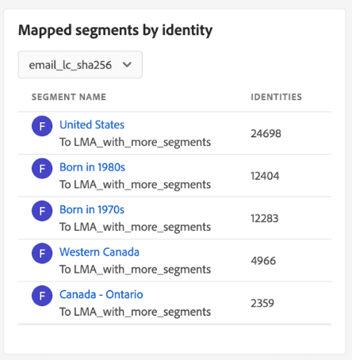

# [!UICONTROL 目标]仪表板

Adobe Experience Platform用户界面(UI)提供了一个功能板，通过该功能板，您可以查看有关贵组织的活动目标的重要信息，如在每日快照期间捕获的信息。 本指南概述如何在UI中访问和使用目标仪表板，并提供有关仪表板中显示的量度的更多信息。

有关目标的概述以及Experience Platform中所有可用目标的目录，请访问[目标文档](../../destinations/home.md)。

## [!UICONTROL 目标]仪表板数据 {#destinations-dashboard-data}

目标仪表板显示贵组织在Experience Platform中启用的目标快照。 快照中的数据显示的数据与拍摄快照的特定时间点完全相同。 换句话说，快照不是数据的近似值或样本，并且目标仪表板没有实时更新。

>[!NOTE]
>
>自拍摄快照以来对数据所做的任何更改或更新都不会反映在功能板中，直到拍摄下一个快照为止。

## 浏览[!UICONTROL 目标]仪表板 {#explore}

要导航到Experience Platform UI中的目标仪表板，请在左边栏中选择&#x200B;**[!UICONTROL 目标]**，然后选择&#x200B;**[!UICONTROL 概述]**&#x200B;选项卡以显示仪表板。

最新快照的日期和时间显示在[!UICONTROL 概述]顶部的目标下拉列表旁边。 截至该日期和时间，所有构件数据都是准确的。 快照的时间戳以UTC格式提供；它不在单个用户或组织的时区内。

>[!NOTE]
>
>如果您的组织是初次使用Experience Platform并且还没有有效的目标，则目标仪表板和[!UICONTROL 概述]选项卡将不可见。 相反，从左侧导航中选择[!UICONTROL 目标]将显示[!UICONTROL 目录]选项卡。 要了解有关[!UICONTROL 目录]选项卡的更多信息，请参阅[[!UICONTROL 目标]工作区指南](../../destinations/ui/destinations-workspace.md)。

### 修改[!UICONTROL 目标]仪表板 {#modify}

选择&#x200B;**[!UICONTROL 修改仪表板]**&#x200B;以更改目标仪表板的外观。 对功能板所做的更改针对每个用户，不适用于整个组织。 您可以从仪表板移动、添加、调整小组件大小和移除小组件，并访问小组件库以自定义仪表板。 从构件库中，您可以浏览可用的构件并为您的组织创建自定义构件。

请参阅[修改功能板](../customize/modify.md)和[构件库概述](../customize/widget-library.md)文档，了解更多信息。

### 添加构件 {#add-widget}

选择&#x200B;**[!UICONTROL 添加构件]**&#x200B;导航到构件库，并查看要添加到仪表板的可用构件列表。

从构件库中，您可以浏览选择的标准和自定义受众构件。 有关如何添加构件的信息，请参阅构件库文档，了解如何[添加构件](../customize/widget-library.md#add-widgets)。

### 查看 SQL {#view-sql}

通过打开[!UICONTROL 概述]工作区，您可以查看生成可在您的仪表板上可视化的分析的SQL。 您可以从现有见解的SQL中获得灵感，以创建新查询，这些查询可根据您的业务需求从Experience Platform数据获取独特的见解。 若要了解有关此功能的详细信息，请参阅[查看SQL UI指南](../view-sql.md)。

## 默认构件 {#default-widgets}

为Adobe Experience Platform的所有新实例提供了默认构件加载，该构件会突出显示数据中最新的可用见解。 从一开始就在区段视图中预配置了以下构件。 有关构件用途和功能的完整详细信息见下文。

* [[!UICONTROL 最常用的目标]](#most-used-destinations)
* [[!UICONTROL 最近创建的目标]](#recently-created-destinations)
* [[!UICONTROL 最近激活的区段]](#recently-activated-segments)

>[!NOTE]
>
>自2023年7月26日起，[!UICONTROL 用户档案]、[!UICONTROL 受众]和[!UICONTROL 目标]概述功能板已重置为过去六个月未修改其视图的所有用户的新默认构件加载。
>有关哪些构件包含在默认构件加载中的详细信息，请参阅[配置文件](./profiles.md#default-widgets)和[受众](./audiences.md#default-widgets)默认构件部分中的文档。 您可以像以前一样继续自定义仪表板小组件。

## 标准构件 {#standard-widgets}

Adobe提供了多个标准构件，可用于可视化与您的目标相关的各种量度，并评估可用于数据分析的受众的完整性。 您还可以使用[!UICONTROL 构件库]创建要与您的组织共享的自定义构件。 要了解有关创建自定义小组件的更多信息，请先阅读[小组件库概述](../customize/widget-library.md)。

### 先决条件 {#prerequisites}

在继续描述标准构件之前，请确保您熟悉本文档中使用的以下关键术语的定义：

* **区段定义：**&#x200B;区段定义是一组&#x200B;**规则**，用于描述目标受众的关键特征或行为。 这些规则包括属性和事件数据，可用于将用户档案视为受众的一部分。
* **受众：一组具有共同特征和行为的人员、帐户、家庭或其他实体。**
* **映射/映射**：数据映射是将源数据字段映射到目标中相关目标字段的过程。
* **标识**：标识是唯一代表单个客户的标识符，如Cookie ID、设备ID或电子邮件ID。
* **激活**：激活是用户为将受众或配置文件映射到目标(如Oracle Eloqua、Google或Salesforce Marketing Cloud)而采取的操作。

要了解有关每个可用标准构件的更多信息，请从以下列表中选择构件的名称：

* [[!UICONTROL 最常用的目标]](#most-used-destinations)
* [[!UICONTROL 最近创建的目标]](#recently-created-destinations)
* [[!UICONTROL 最近激活的受众]](#recently-activated-audiences)
* [[!UICONTROL 最近激活的受众（按目标）]](#recently-activated-audiences-by-destination)
* [[!UICONTROL 受众规模趋势]](#audience-size-trend)
* [[!UICONTROL 未映射的受众（按身份标识）]](#unmapped-audiences-by-identity)
* [[!UICONTROL 映射的受众（按身份标识）]](#mapped-audiences-by-identity)
* [[!UICONTROL 常用受众]](#common-audiences)
* [[!UICONTROL 映射的受众]](#mapped-audiences)
* [[!UICONTROL 映射的受众运行状况]](#mapped-audience-health)
* [[!UICONTROL 目标计数]](#destinations-count)
* [[!UICONTROL 目标状态]](#destination-status)
* [[!UICONTROL 按目标平台列出的活动目标]](#active-destinations-by-destination-platform)
* [[!UICONTROL 所有目标中的已激活受众]](#activated-audiences-across-all-destinations)
* [[!UICONTROL 激活的受众]](#activated-audiences)

### [!UICONTROL 最常用的目标] {#most-used-destinations}

>[!CONTEXTUALHELP]
>id="platform_dashboards_destinations_mostuseddestinations"
>title="最常用的目标"
>abstract="此构件按映射的受众数显示您组织的最活跃的目标。这些数字在上次拍摄快照时是准确的。此排名提供了对当前使用最多的目标的洞察，并突出显示了可能未被充分利用的目标。"

**[!UICONTROL 最常用的目标]**&#x200B;构件按映射的受众数显示您组织的最常用目标（截至最后一个快照）。 此排名可为insight提供目标用途信息，同时还可显示可能未充分利用的目标。

例如，如果您昨天配置了一个目标，但尚未将任何受众映射到该目标，则可以看到该目标当前未得到充分利用。

[!UICONTROL 受众计数]列中显示的映射受众数截至上次每日快照时是准确的。 将新受众映射到目标时，只有在拍摄下一个快照后才会更新计数。

从小部件上显示的列表中选择目标的名称，以导航到该特定目标的目标详细信息。 您还可以选择&#x200B;**[!UICONTROL 查看全部]**&#x200B;以导航到&#x200B;**[!UICONTROL 浏览]**&#x200B;选项卡，然后选择目标的名称以查看其详细信息。

### [!UICONTROL 最近创建的目标] {#recently-created-destinations}

>[!CONTEXTUALHELP]
>id="platform_dashboards_destinations_recentlycreateddestinations"
>title="最近创建的目标"
>abstract="此构件显示您组织内最近配置的目标的列表。"

通过&#x200B;**[!UICONTROL 最近创建的目标]**&#x200B;小组件，可查看贵组织最近配置的目标列表。

显示的创建日期与上一每日快照比较准确。 换言之，如果创建新目标，则在拍摄下一个快照之前，它不会出现在列表中。

从小组件上显示的列表中选择目标名称，您将会转到从&#x200B;**[!UICONTROL 浏览]**&#x200B;选项卡链接的目标详细信息。 您还可以选择&#x200B;**[!UICONTROL 查看全部]**&#x200B;以导航到&#x200B;**[!UICONTROL 浏览]**&#x200B;选项卡，然后选择目标的名称以查看其详细信息。

要详细了解如何配置特定类型的目标，请访问[目标文档](../../destinations/home.md)。

### [!UICONTROL 最近激活的受众] {#recently-activated-audiences}

>[!CONTEXTUALHELP]
>id="platform_dashboards_destinations_recentlyactivatedsegments"
>title="最近激活的受众"
>abstract="此构件提供最近映射到目标的受众的列表。此列表提供系统中正使用的受众和目标的快照，并且可以帮助纠正任何错误的映射。"

**[!UICONTROL 最近激活的受众]**&#x200B;构件提供最近映射到目标的受众列表。 此列表提供系统中正使用的受众和目标的快照，并且可以帮助纠正任何错误的映射。

所显示的[!UICONTROL 已更新]日期显示上次将受众激活到目标的时间，并且该日期准确到上次每日快照。 换言之，如果您将受众激活到目标，则更新的日期将在拍摄下一个快照之后才会更改。

从小部件上显示的列表中选择受众的名称可转到受众详细信息。 您还可以选择&#x200B;**[!UICONTROL 查看全部]**&#x200B;导航到[!UICONTROL 受众][!UICONTROL 浏览]选项卡，然后选择受众的名称以查看其详细信息。

有关在Experience Platform中使用受众的更多信息，请参阅[分段服务概述](../../segmentation/home.md)。

### [!UICONTROL 最近激活的受众（按目标）] {#recently-activated-audiences-by-destination}

>[!CONTEXTUALHELP]
>id="platform_dashboards_destinations_recentlyactivatedsegmentsbydestination"
>title="最近激活的受众（按目标）"
>abstract="此构件根据在概述下拉列表中选择的目标，以降序顺序显示最近激活的前五个受众。"

**[!UICONTROL 按目标]**&#x200B;列出的最近激活受众构件根据在概述下拉列表中选定的目标，按降序显示最近激活的前五个受众。 它类似于[!UICONTROL 最近激活的受众]小组件，但显示的数据&#x200B;**仅**&#x200B;适用于所选目标。

此构件包含两个量度：受众名称和上次将受众激活到目标的日期。 显示的数据截至上次每日快照时是正确的。

您可以从显示的列表中选择受众名称，以查看受众的详细信息。

请参阅此描述中所用术语的[定义](#prerequisites)的先决条件部分。

### [!UICONTROL 受众规模趋势] {#audience-size-trend}

>[!CONTEXTUALHELP]
>id="platform_dashboards_destinations_audiencesizetrend"
>title="受众规模趋势"
>abstract="此构件说明了每天发送到目标帐户的受众中包含的轮廓数量。可使用第一个下拉菜单调整受众趋势的时段。可使用第二个构件下拉菜单选择要分析的受众。从概述下拉列表中选择目标。"

**[!UICONTROL 受众规模趋势]**&#x200B;小组件描述已映射到目标帐户的受众在一段时间内的配置文件计数关系。 该构件使用线形图说明受众中包含的每天发送到目标帐户的用户档案数。

可以使用第一个下拉菜单调整过去30天、90天或12个月的受众趋势时段。

第二个下拉菜单列出了可发送到在仪表板顶部选择的目标帐户的每个可用受众。

**[!UICONTROL 受众规模趋势]**&#x200B;构件在构件的右上角提供了[!UICONTROL 字幕]按钮。 选择&#x200B;**[!UICONTROL 字幕]**&#x200B;以打开自动字幕对话框。 机器学习模型通过分析图表和受众数据自动生成描述关键趋势和重要事件的字幕。

### [!UICONTROL 未映射的受众（按身份标识）] {#unmapped-audiences-by-identity}

>[!CONTEXTUALHELP]
>id="platform_dashboards_destinations_unmappedsegmentsbyidentity"
>title="未映射的受众（按身份标识）"
>abstract="此构件列出了前五个&#x200B;**未映射的**&#x200B;受众，它们按给定目标和身份标识的身份标识计数以降序顺序排名。构件下拉列表中列出的筛选条件 ID 因概述页面顶部选择的目标帐户而异。"

**[!UICONTROL 按身份未映射的受众]**&#x200B;小组件列出了给定目标和身份前五个&#x200B;**未映射的受众**（按身份计数降序排列）。 它会突出显示对于根据所选ID映射到所选目标帐户最有帮助的受众。

目标ID下拉列表会过滤您的可用受众。 下拉列表中列出的过滤器ID会根据在概述页面顶部选择的目标帐户而发生更改。

身份列计算受众中可映射到在构件ID下拉列表中选择ID的源ID的数量。

请参阅此描述中所用术语的[定义](#prerequisites)的先决条件部分。

### [!UICONTROL 映射的受众（按身份标识）] {#mapped-audiences-by-identity}

>[!CONTEXTUALHELP]
>id="platform_dashboards_destinations_mappedsegmentsbyidentity"
>title="映射的受众（按身份标识）"
>abstract="此构件提供前五个&#x200B;**映射的**&#x200B;受众的列表。此列表根据受众中包含的源 ID 的数量按从高到低的顺序进行排序。从构件标题下方的下拉菜单中选择要计算的目标 ID。构件下拉列表中可用的目标 ID 取决于在概述仪表板顶部选择的目标。"

此构件提供前五个&#x200B;**映射的**&#x200B;受众的列表。此列表根据受众中包含的源 ID 的数量按从高到低的顺序进行排序。从构件标题下方的下拉菜单中选择要计算的目标 ID。从小组件中的下拉列表中可用的目标ID将根据在概述功能板顶部选择的目标帐户过滤器而发生更改。

**[!UICONTROL 按身份映射的受众]**&#x200B;构件突出显示所选目标内促销活动成功定位用户档案商机的可能性。 有效的定向营销活动并不取决于发送到目标的用户档案数，而是取决于与目标ID可能匹配以提供有用且可操作数据的源ID的数量。

### 普通受众 {#common-audiences}

>[!CONTEXTUALHELP]
>id="platform_dashboards_destinations_commonaudiences"
>title="普通受众"
>abstract="此构件提供跨页面顶部选择的目标帐户和构件下拉列表中选择的目标激活的前五个受众的列表。受众列表将根据受众的最近激活时间进行排序。最近激活的受众显示在顶部。"

**[!UICONTROL 常见受众]**&#x200B;小组件提供了在页面顶部选择的目标帐户中激活的前五个受众列表，以及在小组件下拉列表中选定的目标受众列表。 受众列表将根据受众的最近激活时间进行排序。最近激活的受众显示在顶部。

[!UICONTROL AUDIENCE SIZE]列提供每个列出受众的个人资料总数。

### 已映射受众 {#mapped-audiences}

[!UICONTROL 映射的受众]小组件显示可激活到页面顶部所选目标的映射受众总数。

选择&#x200B;**[!UICONTROL 受众]**&#x200B;以导航到“受众”仪表板[!UICONTROL 浏览]选项卡。 此工作区显示贵组织的所有区段定义的列表。

### 映射的受众健康 {#mapped-audience-health}

>[!CONTEXTUALHELP]
>id="platform_dashboards_destinations_mappedaudiencehealth"
>title="映射的受众健康"
>abstract="此构件提供一个包含最多 20 个映射的受众的列表，这些受众的轮廓总数与映射到该目标的 30 天平均受众规模之间至少有一个标准差。它为受众规模与过去 30 天平均值的离散度提供了计算量度。受众规模按从高到低的顺序进行排序。"

该小组件提供最多20个映射受众的列表，截至上次每日快照时，这些受众的总配置文件计数与映射到该目标的30天平均受众规模至少相差一个标准差系数。

简言之，它提供过去30天内平均受众规模离散度的计算量度。 它会比较今天的受众规模是否超出了过去30天数据中看到的历史标准差。

系统中的所有受众大小都按从大到小的顺序排序，如[!UICONTROL LATEST SIZE]列所示。

如果您的映射受众配置文件计数与过去30天的平均映射配置文件大小相差一个标准偏差之外，则这表示系统中存在异常，应该对其进行调查。

如果[!UICONTROL 映射的受众运行状况]小组件中的受众出现大幅偏差，您应该参考受众规模趋势图并找到异常受众。 这种趋势可以进一步提供insight来了解受众的健康状况。

>[!NOTE]
>
>映射的受众运行状况小组件的默认大小可能会妨碍表信息。 请修改小部件的大小，以提高映射的受众名称和列标题的清晰度。 请参阅修改功能板文档，以获取有关[如何调整构件](../customize/modify.md)大小的指导。

### [!UICONTROL 目标计数] {#destinations-count}

>[!CONTEXTUALHELP]
>id="platform_dashboards_destinations_destinationscount"
>title="目标计数"
>abstract="此构件提供了可在系统内激活和交付受众的可用端点总数。此数目包含活动目标数和非活动目标数。"

[!UICONTROL 目标计数]构件提供可在系统中激活和交付受众的可用端点总数。 此数目包含活动目标数和非活动目标数。

在总计数下，选择&#x200B;**[!UICONTROL 目标]**&#x200B;以导航到目标浏览选项卡。 本页列出了您迄今已建立连接的所有目标。

### [!UICONTROL 目标状态] {#destination-status}

[!UICONTROL 目标状态]构件将启用的目标总数显示为单个量度，并使用圆环图来说明启用和禁用的目标之间的比例差异。

当光标悬停在圆环图的相应部分上时，启用或禁用目标的各个计数都会显示在对话框中。

### [!UICONTROL 按目标平台列出的活动目标] {#active-destinations-by-destination-platform}

该构件提供了一张两列表格，用于显示活动目标平台的列表以及每个目标平台的活动目标总数。 目标平台的列表按从高到低的顺序排列。

### [!UICONTROL 所有目标中的已激活受众] {#activated-audiences-across-all-destinations}

所有目标中的[!UICONTROL 已激活受众]小组件在一个量度中提供了所有目标中已激活的受众总数。 此数字对最近的快照是准确的。

选择&#x200B;**[!UICONTROL 受众]**&#x200B;以导航到目标[!UICONTROL 浏览]选项卡。 本页列出了所有启用的目标和各种相关量度。 有关[[!UICONTROL 浏览]选项卡](../../destinations/ui/destinations-workspace.md#browse)的详细信息，请参阅文档。

请参阅此描述中所用术语的[定义](#prerequisites)的先决条件部分。

### [!UICONTROL 激活的受众] {#activated-audiences}

此构件可针对激活到目标的受众总数提供单个量度。

选择&#x200B;**[!UICONTROL 受众]**&#x200B;以导航到目标仪表板的详细信息页面。 [!UICONTROL 激活数据]选项卡显示已映射到目标的受众列表，包括其开始日期和结束日期（如果适用），以及数据导出的其他相关信息，如导出类型、计划和频率。 要查看特定受众的详细信息，请从[!UICONTROL 受众名称]列中选择其名称。

此构件可帮助您根据一览激活的受众数量了解目标的价值。 通过它，还可以轻松地访问更详细的信息，以便进一步分析。

请参阅此描述中所用术语的[定义](#prerequisites)的先决条件部分。

## 后续步骤

现在，通过阅读本文档，您应该能够找到目标仪表板，并了解可用构件中显示的量度。 要了解有关在Experience Platform中使用目标的更多信息，请参阅[目标文档](../../destinations/home.md)。
